# DDNS, Acme and HAProxy configuration in pfSense – Complete Walkthrough

I have newly successfully completed the setup of a Reverse Proxy with SSL on my pfSense router.  
Because there is a lack of complete guides for this on the internet I wrote down my steps here in this complete walk-through.  
Because of the massive amount of steps needed to achieve this I will mostly just write what to do, and not explain a lot of why.

This guide is based on the following software versions:

-   pfSense 2.4.5-RELEASE-p1
-   Acme 0.6.8_1
-   HAProxy 0.60_4

Enjoy!

## Content

#### Table of contents

-   [Content](https://flemmingss.com/duckdns-acme-and-haproxy-configuration-in-pfsense-complete-walkthrough/#Content)
    -   [Table of contents](https://flemmingss.com/duckdns-acme-and-haproxy-configuration-in-pfsense-complete-walkthrough/#Table-of-contents)
    -   [What and why](https://flemmingss.com/duckdns-acme-and-haproxy-configuration-in-pfsense-complete-walkthrough/#What-and-why)
-   [Domain](https://flemmingss.com/duckdns-acme-and-haproxy-configuration-in-pfsense-complete-walkthrough/#Domain)
    -   [DuckDNS](https://flemmingss.com/duckdns-acme-and-haproxy-configuration-in-pfsense-complete-walkthrough/#DuckDNS)
    -   [Get a Top-level domain at NameSilo](https://flemmingss.com/duckdns-acme-and-haproxy-configuration-in-pfsense-complete-walkthrough/#Get-a-Top-level-domain-at-NameSilo)
    -   [Generate a NameSilo API Key](https://flemmingss.com/duckdns-acme-and-haproxy-configuration-in-pfsense-complete-walkthrough/#Generate-a-NameSilo-API-Key)
    -   [Redirect domain to DuckDNS](https://flemmingss.com/duckdns-acme-and-haproxy-configuration-in-pfsense-complete-walkthrough/#Redirect-domain-to-DuckDNS)
-   [pfSense](https://flemmingss.com/duckdns-acme-and-haproxy-configuration-in-pfsense-complete-walkthrough/#pfSense)
    -   [Dynamic DNS](https://flemmingss.com/duckdns-acme-and-haproxy-configuration-in-pfsense-complete-walkthrough/#Dynamic-DNS)
        -   [Set up DuckDNS](https://flemmingss.com/duckdns-acme-and-haproxy-configuration-in-pfsense-complete-walkthrough/#Set-up-DuckDNS)
    -   [Acme](https://flemmingss.com/duckdns-acme-and-haproxy-configuration-in-pfsense-complete-walkthrough/#Acme)
        -   [Install the pfSense Acme Package](https://flemmingss.com/duckdns-acme-and-haproxy-configuration-in-pfsense-complete-walkthrough/#Install-the-pfSense-Acme-Package)
        -   [Account keys](https://flemmingss.com/duckdns-acme-and-haproxy-configuration-in-pfsense-complete-walkthrough/#Account-keys)
        -   [Certificates](https://flemmingss.com/duckdns-acme-and-haproxy-configuration-in-pfsense-complete-walkthrough/#Certificates)
        -   [General settings](https://flemmingss.com/duckdns-acme-and-haproxy-configuration-in-pfsense-complete-walkthrough/#General-settings)
    -   [Firewall](https://flemmingss.com/duckdns-acme-and-haproxy-configuration-in-pfsense-complete-walkthrough/#Firewall)
        -   [Virtual IP](https://flemmingss.com/duckdns-acme-and-haproxy-configuration-in-pfsense-complete-walkthrough/#Virtual-IP)
        -   [NAT](https://flemmingss.com/duckdns-acme-and-haproxy-configuration-in-pfsense-complete-walkthrough/#NAT)
    -   [HAProxy](https://flemmingss.com/duckdns-acme-and-haproxy-configuration-in-pfsense-complete-walkthrough/#HAProxy)
        -   [Install the pfSense HAProxy](https://flemmingss.com/duckdns-acme-and-haproxy-configuration-in-pfsense-complete-walkthrough/#Install-the-pfSense-HAProxy-Package) [Package](https://flemmingss.com/duckdns-acme-and-haproxy-configuration-in-pfsense-complete-walkthrough/#Install-the-pfSense-HAProxy-Package)
        -   [Settings](https://flemmingss.com/duckdns-acme-and-haproxy-configuration-in-pfsense-complete-walkthrough/#Settings)
        -   [Backend](https://flemmingss.com/duckdns-acme-and-haproxy-configuration-in-pfsense-complete-walkthrough/#Backend)
        -   [Frontend for HTTP](https://flemmingss.com/duckdns-acme-and-haproxy-configuration-in-pfsense-complete-walkthrough/#Frontend-for-HTTP)
        -   [Frontend for HTTPS](https://flemmingss.com/duckdns-acme-and-haproxy-configuration-in-pfsense-complete-walkthrough/#Frontend-for-HTTPS)
-   [Results / Extra notes](https://flemmingss.com/duckdns-acme-and-haproxy-configuration-in-pfsense-complete-walkthrough/#Results-Extra-notes)
-   [Sources](https://flemmingss.com/duckdns-acme-and-haproxy-configuration-in-pfsense-complete-walkthrough/#Sources)

#### What and why

The goal for me was to access multiple services behind my firewall from the internet with HTTPS.  
The goal is to access my services with domains like `https://home-assistant.mydomain.com/` and `https://mstream.mydomain.com/`.  
unlike before: `http//public_ip:1234`.  
And it should be done with a valid signed SSL certificate.

Home-Assistant  
http://10.0.24.4:8123/

Home-Assistant…

mStream  
http://10.0.24.10:3000/

mStream…

https://home-assistant.yourdomain.com

https://home-assistant.yourdomain.com

https://mstream.yourdomain.com

https://mstream.yourdomain.compfSenseViewer does not support full SVG 1.1

## Domain

#### DuckDNS

If your public IP is dynamic (as it is in most cases) you will benefit from using a dynamic DNS service such as DuckDNS.  
This is a free and easy service to use. Your TLD will later be configured to point to the dynamic DNS address.

-   Log in/sign up to [https://www.duckdns.org/](https://www.duckdns.org/)
-   Right to **domains** input a sub domain name and click **add domain**.
-   Write down your **token** and **domain** for later use.

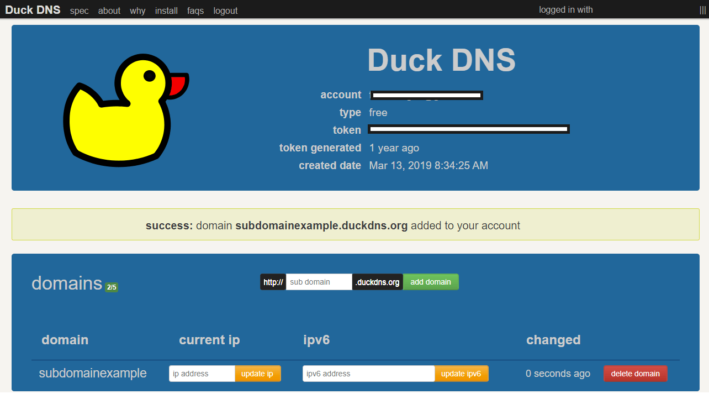

#### Get a Top-level domain at NameSilo

First you will need a top level domain to be used for this for this purpose.  
I Recommend to find and buy one at NameSilo.  
[https://www.namesilo.com/domain/search-domains](https://www.namesilo.com/domain/search-domains)  
**Get a $1.00 discount using my referral:** Link/Code: [https://www.namesilo.com/?rid=33eef66ry](https://www.namesilo.com/?rid=33eef66ry)  
(Use code “flemmingss.com”)

#### Generate a NameSilo API Key

This will be used in the process of Issuing a certificate later

-   Go to API Manager [https://www.namesilo.com/account/api-manager](https://www.namesilo.com/account/api-manager)
-   Under **API Key** check “_Submitting this form constitutes your acceptance of our API terms of use_” and click **Generate**
-   Copy your API key and save it for later.

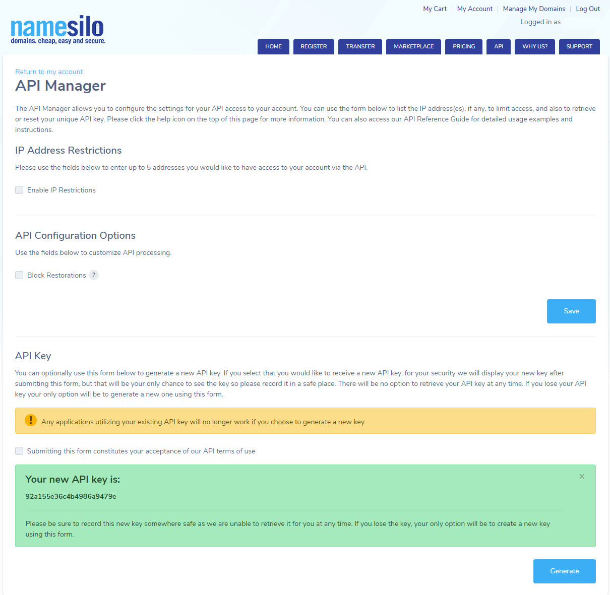

#### Redirect domain to DuckDNS

-   Go to [https://www.namesilo.com/account_domains.php](https://www.namesilo.com/account_domains.php) and click on your domain
-   Select **Update** Next to **NS Records:**
-   Remove all the existing resource records assigned to the domain.
-   Select **CNAME** to create two new CNAME records like this:  
    **HOSTNAME**: _`*`_ **TARGET HOSTNAME**: _`domain.duckdns.org`_  
    **HOSTNAME**: _`www`_ **TARGET HOSTNAME**: _`domain.duckdns.org`_

-   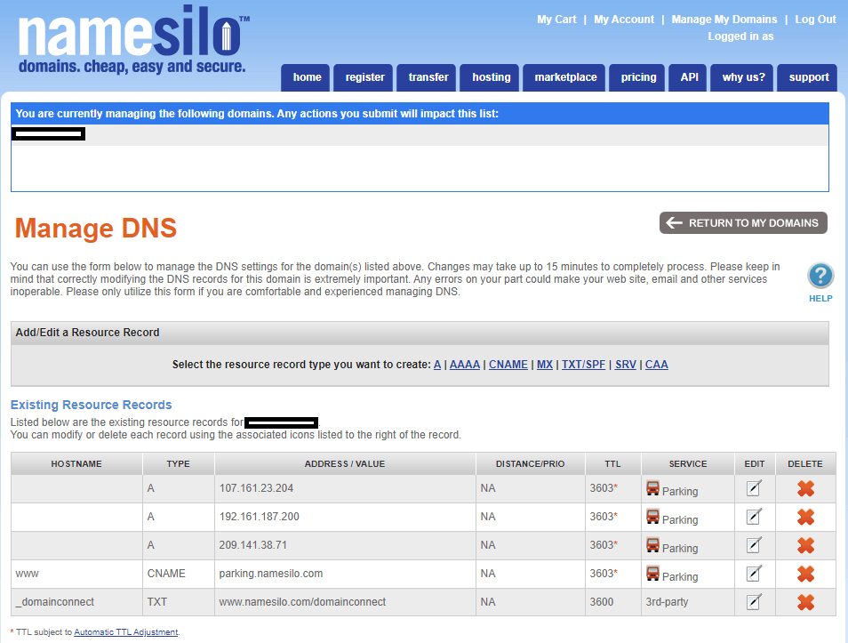
    
-   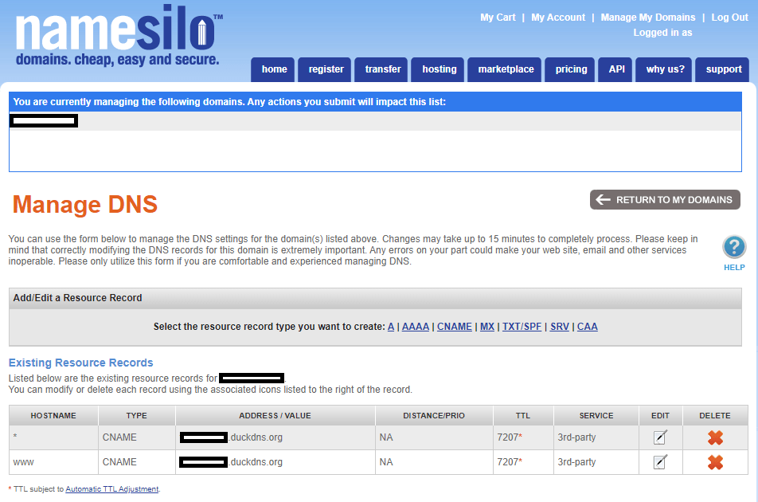
    

## pfSense

### Dynamic DNS

#### Set up DuckDNS

-   In pfSense Go to **Services** \-> **Dynamic DNS** -> **Dynamic DNS Clients** and click **Add**.
-   Fill out as follows:  
    **Service Type:** Custom  
    **Update URL**: `https://www.duckdns.org/update?domains=**XXX**&token=**YYY**&ip=%IP%` _(Replace **XXX** with your DuckDNS subdomain and **YYY** with your DuckDNS token)_  
    **Description**: DuckDNS: subdomainexample.duckdns.org __(Optional field, example)__
-   Click **Save**
-   Select **Edit** on tne same **Dynamic DNS Clients** record and select **Save & Force Update**.  
    “Cached IP” Should now be your public WAN IP.

-   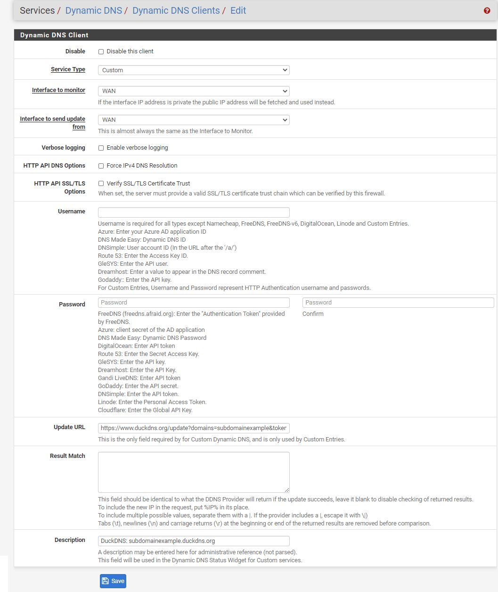
    
    Setup
    
-   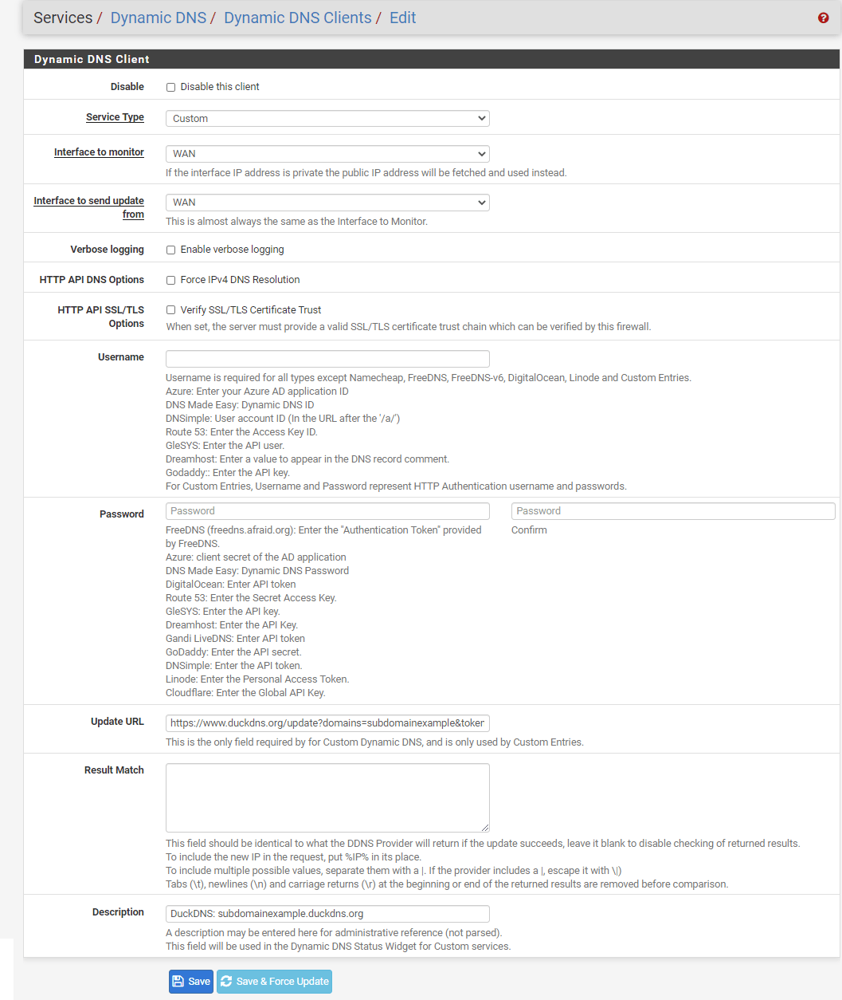
    
    Edit
    

### Acme

#### Install the pfSense Acme **Package**

-   Open pfSense and navigate to **System** \-> **Package Manager** -> **Available Packages**.
-   Select **Install** next to **acme** and then select **Confirm**.

#### Account keys

-   In pfSense go to **Services** \-> **Acme** \-> **Account keys** and click **Add**.
-   Fill out as follows:  
    **Name:** LE_Cert _(Example)_  
    **Description:** Let’s Encrypt Certificate _(Optional field, example)_  
    **ACME Server:** Let’s Encrypt Production ACME v2 (Applies rate limits to certificate requests)  
    **E-Mail Address:** youremail@gmail.com _(Example)_
-   Click on **Create new account key** and wait until the **Account key**\-filed are filled.
-   Click **Register ACME account key** and wait for the successful registration check-mark.
-   Click **Save**.

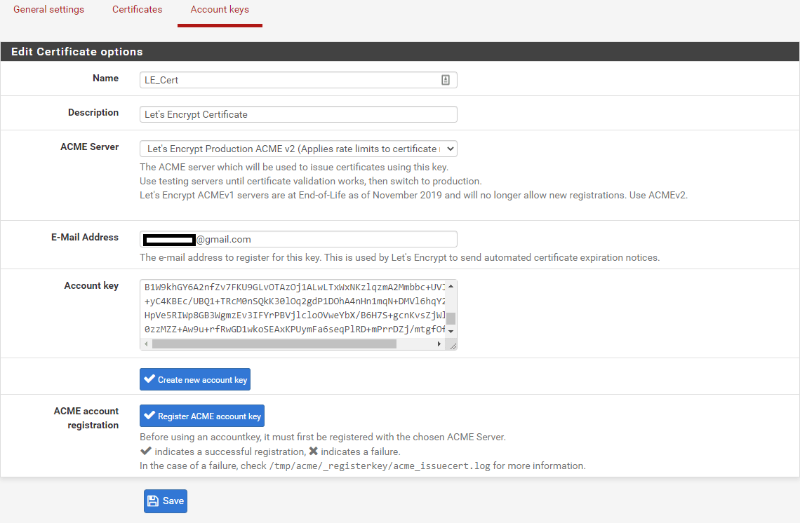

#### Certificates

-   In pfSense go to **Services** \-> **Acme** \-> **Certificates** and click **Add**.
-   Fill out as follows:  
    **Name:** LE_Root_Cert _(Example)_  
    **Description:** Let’s Encrypt Root Certificate _(Optional field, example)_  
    **Domain SAN list**:
    
    -   ****Mode****: Enabled
    
    -   **Domainname**: \*.yourdomain.com
    -   **Method**: DNS-Namesilo
    -   **API Token:** 12345678-1234-1234-1234-12345678912 (_Example)_
-   click **Save**.

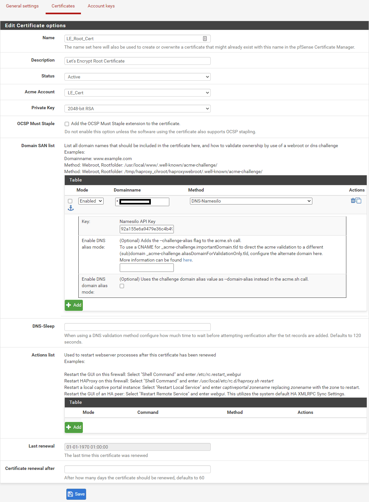

-   Back on **Services** \-> **Acme** \-> **Certificates** select **Issue/Renew** under **Renew** on the created certificate.  
    Wait for it to finnish and don’t click anything yet, this operation can take a little time.
-   If successful a green background with a lot of text will appear.

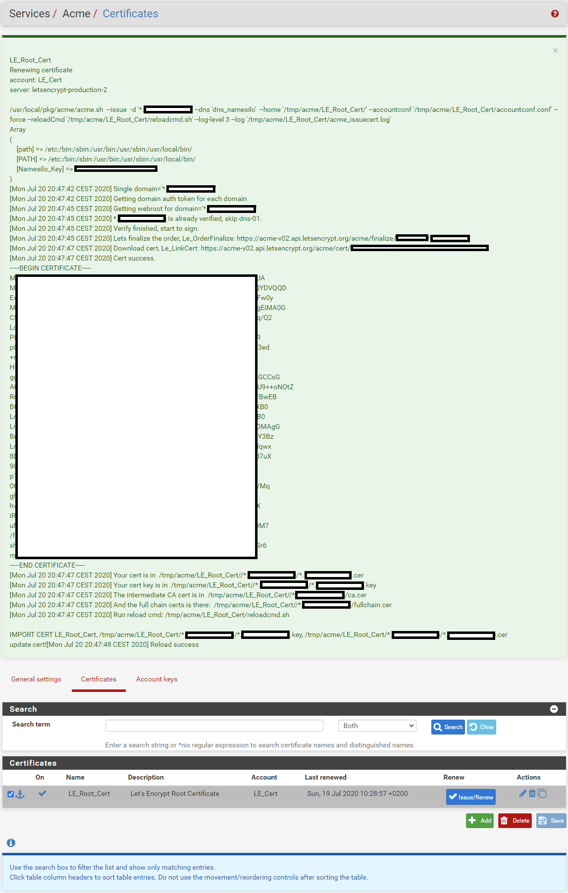

#### General settings

-   In pfSense go to **Services** \-> **Acme** \-> **General settings** and check ****Cron Entry****.  
    This will make the certificate renewal process automatic.
-   Click **Save**.

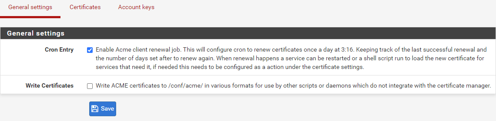

### Firewall

#### Virtual IP

-   In pfSense go to **Firewall** \-> **Virtual IP** and click ****Add****.
-   Fill out as follows:  
    **Type:** IP Alias  
    **Interface:** LAN _(Or a VLAN as in my example)_  
    **Address(es):** 10.0.24.99 (_Example_) / 32  
    _Make sure the above IP-address is not part of a DHCP server address range_. Also make sure **/32** is selected.  
    **Description:** Virtual IP for HAProxy _(Optional field, example)_
-   Click **Save**.
-   Click **Apply Changes.**

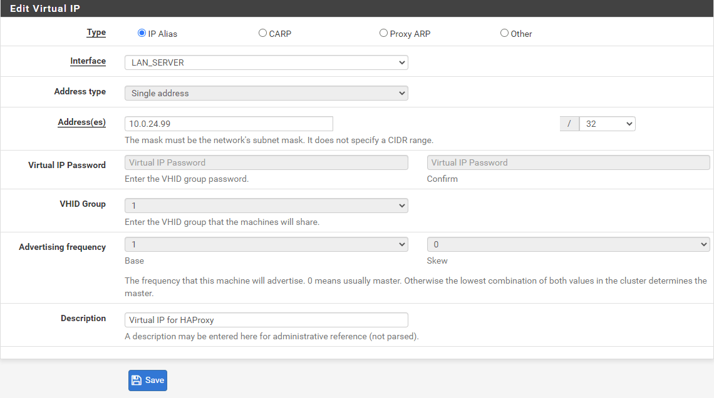

#### NAT

-   In pfSense go to **Firewall** \-> **NAT** and click **Add**.
-   Fill out as follows:  
    **Interface**: WAN  
    **Protocol**: TCP  
    **Destination port range**: HTTPS _(From port)_ HTTPS _(To port)_  
    **Redirect target IP:** 10.0.24.99 _(The Virtual IP)_  
    **Redirect target port:** HTTPS  
    **Description**: HTTPS for HAProxy _(Optional field, example)_
-   Click **Save**.
-   Click **Apply Changes.**

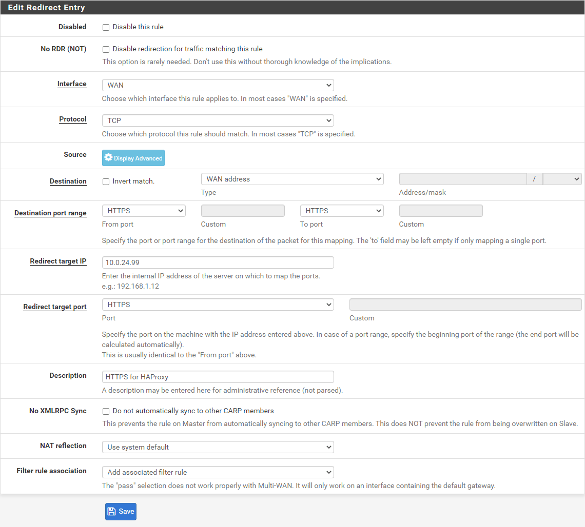

### HAProxy

#### Install the pfSense HAProxy **Package**

Now it is time to install another package, this one is named “haproxy”.

-   Open pfSense and navigate to **System** \-> **Package Manager** -> **Available Packages**.
-   Select **Install** next to ****haproxy**** and then select **Confirm**.

#### Settings

-   In pfSense go to **Services** \-> **HAProxy -> Settings**.
-   Check the **Enable HAProxy** checkbox
-   Fill out as follows:
    -   General settings:  
        **Maximum connections**: 1000 _(Example)_
    -   Tuning:  
        **Max SSL Diffie-Hellman size**: 2048 _(Example)_
-   Click **Save**.
-   Click **Apply Changes.**

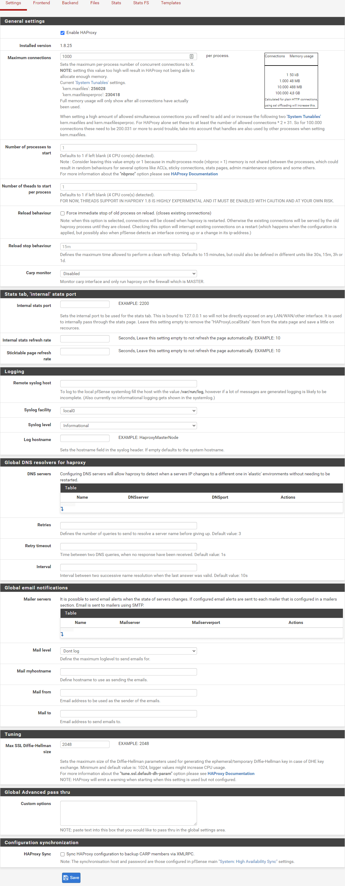

#### Backend

In the HAProxy Backend you will need a backend set up for each service you will connect to trough the reverse proxy.

-   In pfSense go to **Services** \-> **HAProxy -> Backend** and click **Add**.
-   Fill out as follows:
    -   **Edit HAProxy Backend server pool:**
        -   **Server list**  
            **Name**: _Service Name_  
            **Address**: _Service IP_  
            **Port:** _Service Port_
            
            Two Examples of server list settings:  
            **Name**: Home-Assistant  
            **Address**: 10.0.24.4  
            **Port:** 8123
            
            **Name**: mStream  
            **Address**: 10.0.24.10  
            **Port:** 3000
            
-   Click **Save**.
-   Click **Apply Changes.**

-   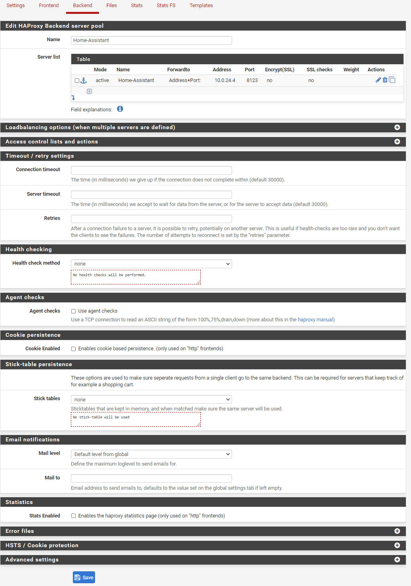
    
    Home-Assistant backend example
    
-   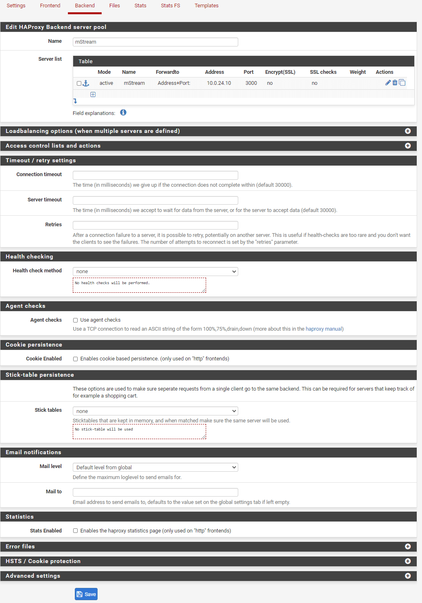
    
    mStream backend example
    

#### Frontend for HTTP

-   In pfSense go to **Services** \-> **HAProxy -> Frontend** and click **Add**.
-   Fill out as follows:
    
    -   **Edit HAProxy Frontend:**  
        **Name:** HTTP_80 _(Example)_  
        **Description:** HAProxy HTTP port 80 _(Optional field, example)_
        -   **External address**:  
            **Listen address**: 10.0.24.99 _(Virtual IP for HAProxy)_  
            **Port:** 80
    
    -   **Default backend, access control lists and actions:**
        -   **Actions**:  
            **Action:** http-request redirect  
            **rule:** scheme https
    -   Advanced settings:
    -   Check the **Use “forwardfor” option** checkbox.
-   Click **Save**.
-   Click **Apply Changes.**

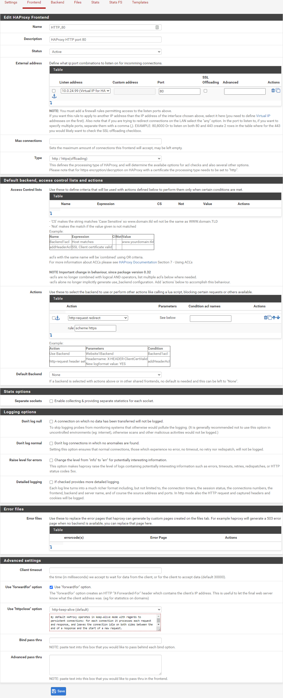

#### Frontend for HTTPS

-   Back in **Frontend** click **Add**.
-   Fill out as follows:
    
    -   **HAProxy Frontend:**  
        **Name:** HTTPS_443 _(Example)_  
        **Description:** HAProxy HTTPS port 443 _(Optional field, example)_
        -   **External address**:  
            **Listen address**: 10.0.24.99 _(Virtual IP for HAProxy)_  
            **Port:** 443  
            Check The **SSL Offloading** checkbox.
    -   **Default backend, access control lists and actions:**
        -   **Access Control lists:**  
            **Name:** Name of Service  
            **Expression:** Host starts with:  
            **Value:** service.yourdomain.com
        -   **Actions:**  
            **Action:** Use Backend  
            **backend:** Name of backend _(If you don’t find it, make sure it is created in backend first)_  
            **Condition acl names:** Name _(Must be the exact same as the Name-record under Name in “Access Control lists”)_
            
            Two Examples of “Access Control lists” and “Actions” table:  
            **Access Control lists:**
            
            **Name:** Home-Assistant  
            **Expression:** Host starts with:  
            **Value:** home-assistant.yourdomain.com
            
            **Name:** mStream  
            **Expression:** Host starts with:  
            **Value:** mstream.yourdomain.com
            
            **Actions:**
            
            **Action:** Use Backend  
            **backend:** Home-Assistant  
            **Condition acl names:** Home-Assistant
            
            **Action:** Use Backend  
            **backend:** mStream  
            **Condition acl names:** mStream
            
    
    -   **Advanced settings:**  
        Check the **Use “forwardfor” option** checkbox.
    -   **SSL Offloading:**
        -   **Certificate:** LE_Root_Cert _(Example, select your Let’s Encrypt certificate)_  
            
-   Click **Save**.
-   Click **Apply Changes.**

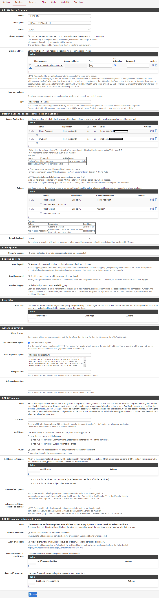

If all steps was completed successful it should now work like in the picture below

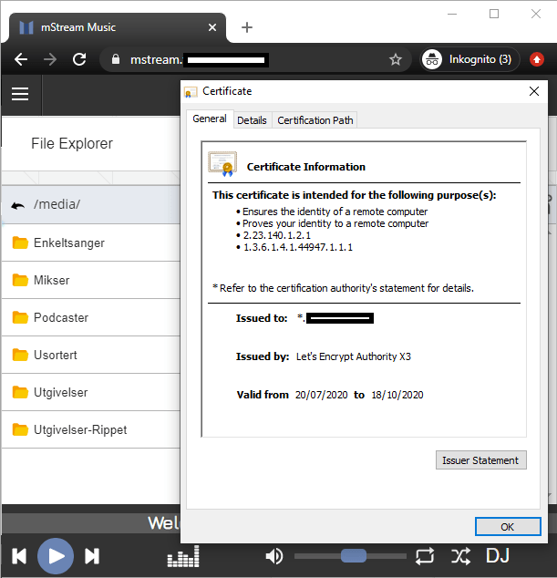

https://mstream.domain.com with valid certificate

There is also possible to make a Firewall NAT rule to forward HTTP traffic to HTTPS, but because the renewal process of Let’s Encrypt certificates require HTTP to work I chose to not include this rule in my setup, or in this guide.

## Sources

- https://flemmingss.com/duckdns-acme-and-haproxy-configuration-in-pfsense-complete-walkthrough/
- - https://jarrodstech.net/how-to-pfsense-haproxy-setup-with-acme-certificate-and-cloudflare-dns-api/
- [https://www.youtube.com/watch?v=FWodNSZXcXs](https://www.youtube.com/watch?v=FWodNSZXcXs)
- [https://serverfault.com/questions/559624/haproxy-503-service-unavailable-no-server-is-available-to-handle-this-request](https://serverfault.com/questions/559624/haproxy-503-service-unavailable-no-server-is-available-to-handle-this-request)
- [https://www.namesilo.com/Support/Point-Domain-to-an-IP-Address](https://www.namesilo.com/Support/Point-Domain-to-an-IP-Address)
- [https://www.duckdns.org/faqs.jsp](https://www.duckdns.org/faqs.jsp)
- [https://www.joe0.com/2019/11/11/how-to-implement-remote-management-in-pfsense-2-4-4-by-using-a-duckdns-dynamic-dns-domain/](https://www.joe0.com/2019/11/11/how-to-implement-remote-management-in-pfsense-2-4-4-by-using-a-duckdns-dynamic-dns-domain/)

