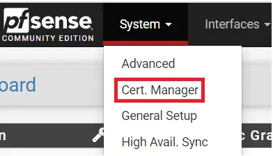

# How to configure OpenVPN in PFSense and export clients?

VPN is a private virtual network that allows you to create a secure connection network connect other networks over the internet or intranet using multi-layers encryption and certificates. This is a step by step guide to configure OpenVPN and export clients In PFSense.

OpenVPN is an Open Source VPN server and client that is supported on a variety of platforms, including pfSense software. It can be used for Site-to-Site or Remote Access VPN configurations. OpenVPN can work with shared keys or with a PKI setup for SSL/TLS. Remote Access VPNs may be authenticated locally or using an external authentication source such as RADIUS or LDAP.

In this step by step guide, I have divided into 7 parts of this configuration.

**1- Install Configure CA (Certificate Authority).**

**2- Create and Sign Server Certificate**

**3- Configuring OpenVPN on PFSense**

**4-  Creating OpenVPN Client on PFSense**

**5- Installing the OpenVPN Client Export Package (OpenVPN-client-export)**

**6- Adding the VPN User**

1- Install and configure CA (Certificate Authority).

The first step in the process, which is Install and Configure CA (Certificate Authority) is to navigate to the  **Cert. Manager** in the **System** section.

Then you will be presented with a dashboard. Click on **+Add** to create a new one certificate authority in **CAs** tab.

Give CA a useful common name, later on, you can use it to identify it. In this example I used AV-VPN\_CA.  
select the CA method from method dropdown. If you have existing CA, you need to select **Import an existing Certificate Authority** and fill the required information in **certificate data** and **certificate private key** section and click on **save**.

If you don’t have the existing CA, then select **Create an internal Certificate Authority** and fill out the details of your organization in **Internal Certificate Authority** section, which information’s are PFSense will use to create the Certificate Authority.  Once done, click on **Save** and your Internal Certificate Authority will be created.

Your CA will look like below after created by PFSense.

2- create and sign server certification

The second step is to create and sign The second step in the process, which is created and sign a server certificate for OpenVPN.

If you have already configured or purchased the server certificate. Select **Import an Existing Certificate** from the drop-down in the **Method** section.  
Give the useful common name for the certificate. later on, it will be useful to identify it.

Fill out the **Certificate data** and **Private key data** information in the **Import Certificate** section and click on **Save**.

If you don’t have the existing certificate, then select the **Create an internal Certificate** in **Method** dropdown. Give a friendly descriptive name, in this demo I used **AV\_VPN\_SERVER\_CERT**. Select your CA as a certificate authority in the **Internal Certificate** section, I have selected **AP\_VPN\_CA**, which I have created in this demo. **Certificate Type** is must be selected **Server Certificate** in **Certificate Attributes** section. And click on **Save**.

3- Configuring OpenVPN on PFSense

The third step in the process, which is to install and configure OpenVPN using the configuration wizard.

To start go to **VPN** in the main menu and then click on **OpenVPN**.

Go to the **wizard** tab. Select your authentication backend type. If you have configured **LDAP** or **RADIUS**, select the appropriate setting. In this demo, I am using **Local User Access**. And click on **Next**.

Next Select the Certificate Authority Which you have created. and click **Next**. If you have not created one, follow the steps above about create CA.

Next, you will need to complete the Server Setup form which consists of four sections: **General OpenVPN Server Information**, **Cryptographic Settings**, **Tunnel Settings,** and **Client Settings**. As each environment is different, you may need to adjust these to meet your specific requirements. The settings below are the default settings that ensure privacy and use PFSense as your DNS server etc.

First, let’s configure the **General OpenVPN Server Information**. In the **interface,** section selects your WAN or ISP connect interface, If you have multiple ISP or WAN select the appropriate WAN/ISP interface. In the **Protocol** section, you can select the TCP, UDP on IPv4, or IPv6 depending on your requirement of VPN connection. In this demo, I’m selecting **UDP on IPv4 only** option. In the **local port,** you can define your OpenVPN listening port. I will continue with the default port. And give some nice description for this section.

Under **Cryptographic Settings**, make sure **TLS Authentication** and **Generate TLS key** options are checked. **DH Parameters Length** should be at least 2048 bit. If you have the same values in **Encryption algorithm** and  **Auth Digest Algorithm** leave it to defaults. If not, change these values to the shown like picture below. My hardware doesn’t support the hardware crypto acceleration. If your hardware supports, then select it in the **Hardware Crypto** section.

Under **Tunnel Settings**, enter the IP address range in CIDR notation (in my case 192.168.2.0/24) for the Tunnel network (this will be the IP address range OpenVPN will use to assign IP’s to VPN clients). You also need to tick the checkbox labeled Redirect Gateway to ensure all clients only use the VPN for all their traffic. Next enter the local network IP address range in CIDR notation (this is usually LAN) and then set your maximum number of concurrent connections. If you want to allow the communication between a VPN connected client, check the **Inter-Client Communication**.

In my demo configuration, I have left all **Client Settings** in their default state. **Dynamic IP** will assign an automatic IP address to the client. Here you may want to specify a DNS server, NTP Server, etc. Once completed click on **Next**.

In the next wizard,  Select the **Firewall Rule** and the **OpenVPN** **Rule.** It will create both rules automatically. If you don’t, later on, you need to create manually. And click on **Next**.

Finally, the OpenVPN configuration is complete. Click on **Finish**.

Now go the **Firewall** section and select **Rules** to check the Firewall rule and OpenVPN rule.

Now you have configured the Firewall Rule for the OpenVPN connection through the WAN address.

And OpenVPN rules for the OpenVPN server and client.

4- Creating OpenVPN Client On PFSense

Now that the OpenVPN server is up and running, we need to configure VPN client access. Navigate to VPN – OpenVPN and click on the **Clients** tab and then click on **+Add**.

After clicking on **+Add** it will open the OpenVPN client edit form which has 6 sections, **General information**, **User Authentication Settings**, **Cryptographic Settings**, **Tunnel Settings**, **Ping Settings,** and **Advanced Configuration**. As with the server config, you will need to configure these settings to match your specific requirements. Below are the minimum changes you need to make.

I am leaving **Tunnel Settings** and **Ping settings** to its d default. I will use tunnel settings from the server configuration. If you have multiple WAN configured with multiple OpenVPN server, you should define tunnel settings in the client configuration.

Under General information fill-out and select the required values in respective fields. Make sure that corresponded values are not mixed up. for example:- Please select the  **Protocol** the same value which you define in server configuration and **Interface** should be the same. The server **host or address** should be the hostname or IP of WAN if you have multiple WAN interfaces.

Under **User Authentication Settings** provide a Username and Password.

Under **Cryptographic Settings** select your CA (Certificate Authority) for **Peer Certificate Authority** and SHA256 for the **Auth digest algorithm.**

Under **Advanced Configuration** select **IPv4 Only**, **IPv6 Only,** or **Both** respectively and then click **Save** (I have IPv4 Only).

Now you should have a fully configured client configuration of OpenVPN in PFSense.

5- Installing the OpenVPN Client Export Package (openvpn-client-export)

We now need to go and install the OpenVPN Client Export package so we can export the client configuration which we will need to provide to clients so that they can connect to our OpenVPN server.

First, go to **System** – **Package Manager**

Click on Available Packages and then search for **OpenVPN-client-export**. In the search results which are returned click on **Install** to install the OpenVPN-client-export package.

Now you should have an **OpenVPN-client-export** utility installed.

6- Adding the VPN User

We now need to create the VPN user which has 2 section **User Properties** and **Create Certificate for User**. To do this go to **System** – **User Manager** and click on **Add** to create a new user.

  

Fill in the username and password which needs to match the config you created under Client Settings during the OpenVPN client configuration. Ensure you tick **click to** **create a user certificate.**

And then give the certificate a name and select your Certificate Authority (Which is created/configured in the first step ). Once all is done click on **Save**.

OpenVPN setup is completed. Now you should have **Client Export** under the OpenVPN menu item.

If all the configuration is correctly configured, you should now able to download different client versions to connect the OpenVPN server.

Install OpenVPN client on your system. Provide the username and password. now it should be connected to the OpenVPN server. you can verify it by using **what’s my IP ?**  in google.

  

## References

* https://boredadmin.com/configure-opnevpnn-in-pfsense-and-export-client/
* 