# HOW-TO: PFSENSE & HAPROXY SETUP WITH ACME CERTIFICATE AND CLOUDFLARE DNS API

Being in IT, I have a lot of test servers and applications running in my LAN Network. Most of these have self-signed SSL certificates; these produce an error every time I access them internally. What I am going to do in this tutorial is setup a certificate and have HA Proxy provide this cert, then proxy me to the correct server based on the URI entered. You can set this up externally or in the cloud, but for **this demo I am going to do it for my LAN only**. This is a long tutorial but once you have done it once, you will see how easy it really is.

### \*Please note this Guide shows you how to set this up on your LAN, it is not for External access. External access will require more steps and changes; See Bottom of page\*

Things you will need:

-   Public domain name
-   [Cloudflare account](https://dash.cloudflare.com/sign-up) (Can easily be setup for free with no credit card)
-   Pfsense Router
-   \* Make sure https redirection is disabled on your target server. This can cause redirect errors.

## Install acme and HAProxy

1.  Log into pfsense and select System -> Package Manager.
2.  Select the “Available Packages” tab.
3.  Find “acme” and “haproxy” and install both. 
4.  Once installed they will appear on the Installed Packages tab.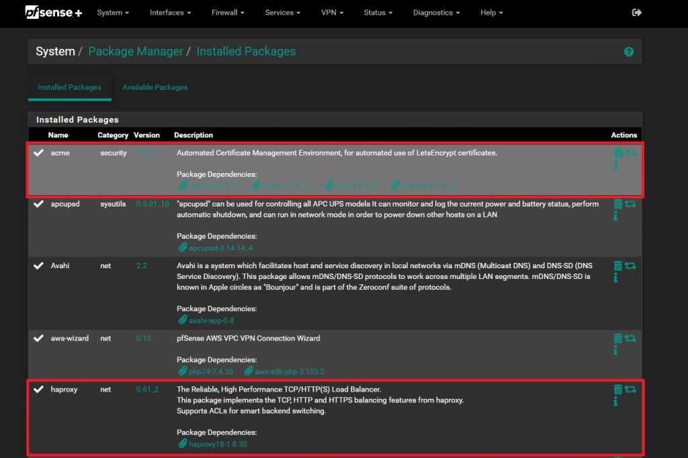

## Change PFSense web port

1.  Since we are going to use port 443 for our proxy, we need to change the default PFSense web port. 
2.  Go to System -> Advanced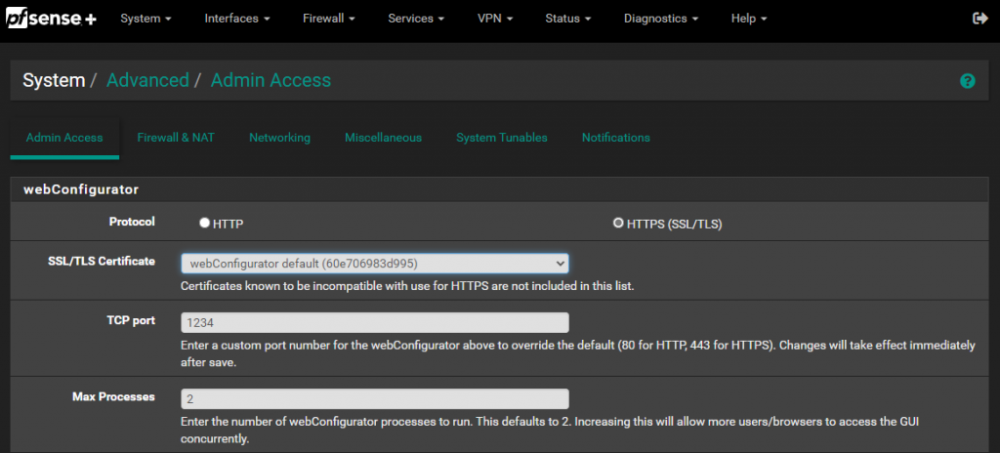
3.  Under “TCP Port” change this to another port, I use 1234. Remember once changed you need to use this port to login. So I will use https://10.0.0.1:1234

## Setup your domain on Cloudflare

1.  Log into your Cloudflare account, if you don’t already have one you can make an account for free [Cloudflare account](https://dash.cloudflare.com/sign-up)
2.  You will get to the step of adding your domain, if you already have an account select “Add Site” from the dashboard.
3.  Enter your public domain name.
4.  Select the free plan, it will work perfectly for this.
5.  Cloudflare will try to scan your current DNS records, if you already have other records add them here. 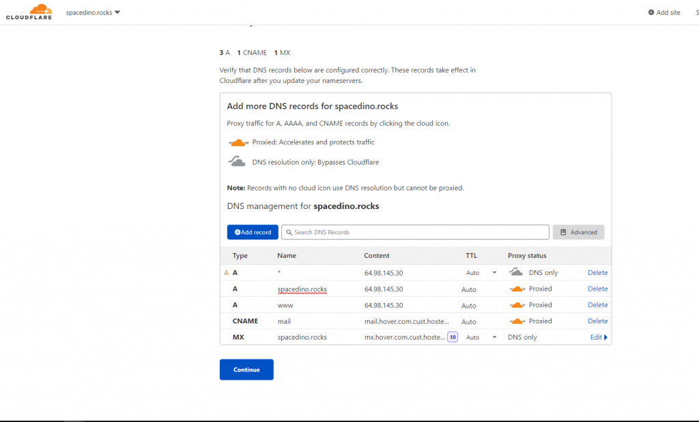
6.  Now you will need to change your Domain Name’s name servers. This will be different for everyone; I will show mine using hover.
7.  Select “Check Nameservers” in Cloudflare. It may take a few hours for your nameservers to change and Cloudflare to update.

1.  Still in Cloudflare select your domain and press “Overview” 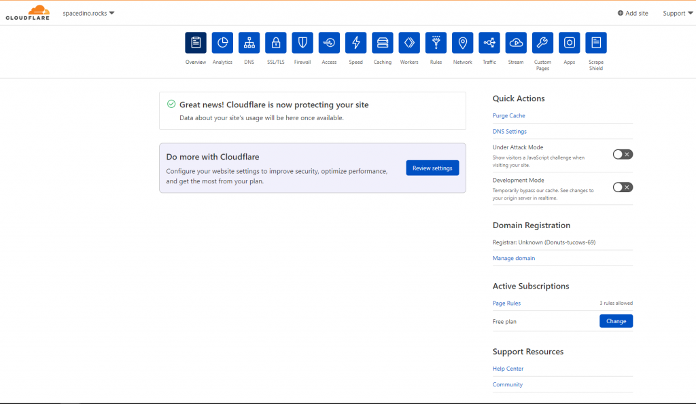
2.  Scroll down and copy your Zone ID and Account ID, just into a notepad for now.
3.  Next select the user icon in the top right and go to “My Profile”
4.  Select “API Tokens” and press View on your Global API Key, copy this into notepad too.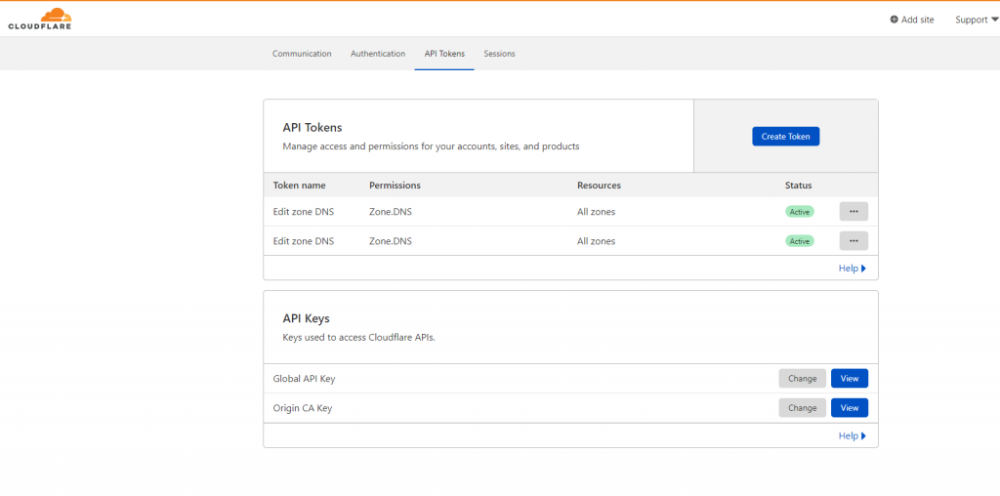
5.  Lastly, under API Tokens press “Create Token” 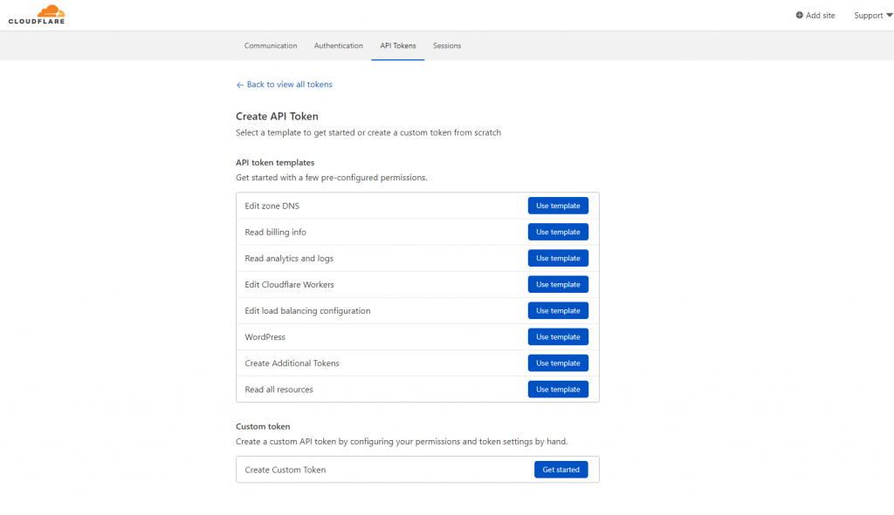
6.  Next to “Edit zone DNS” select “Use this Template”
7.  Under Zone Resources, select your domain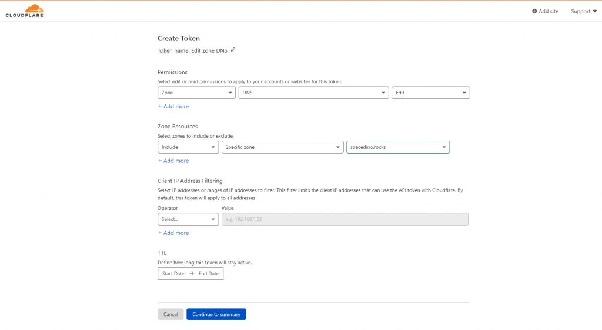
8.  Select Continue and Create Token. Copy this to notepad also.
9.  Now login to Pfsense and go to Services -> Acme Certificates
10.  Then select Account Key.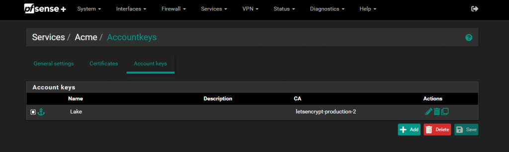
11.  Now we are going to register an account with Let’s Encrypt. This is really easy, select add. Enter a name, select ACME v2 Production and an email address.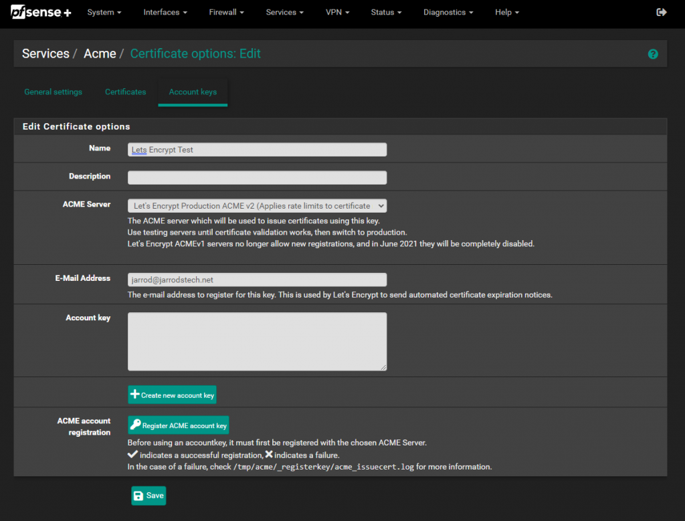
12.  Press “Create new account key” (You may have to wait for a minute), then “Register ACME account key”. Once done, select Save.
13.  Now go to the Certificates page and press “Add”
14.  Enter a name and description if you like. 
15.  Now under “Domain SAN list” select DNS-Cloudflare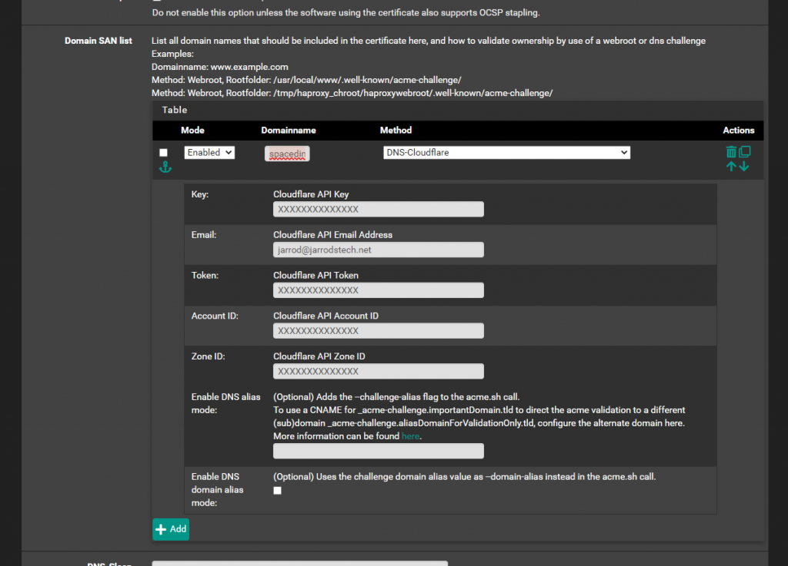
16.  Enter your Domain Name in the box Eg. spacedino.rocks. You can also use a subdomain Eg. I could use local.spacedino.rocks
17.  Enter your Cloudflare Account email and then the Zone ID, Account ID, API Key (Global Key) and the API token we created earlier. 
18.  We also need to restart the Proxy when the Cert is updated, under Actions List select “Add” and enter _/usr/local/etc/rc.d/haproxy.sh restart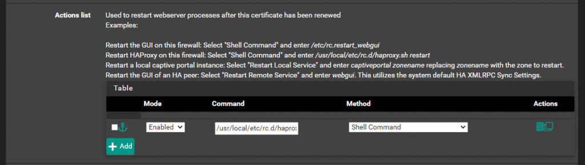_
19.  Now Select “Save”
20.  On the certificate page, select Issue/Renew to get a cert. You should see a success text block come up after a few seconds and the date will update. 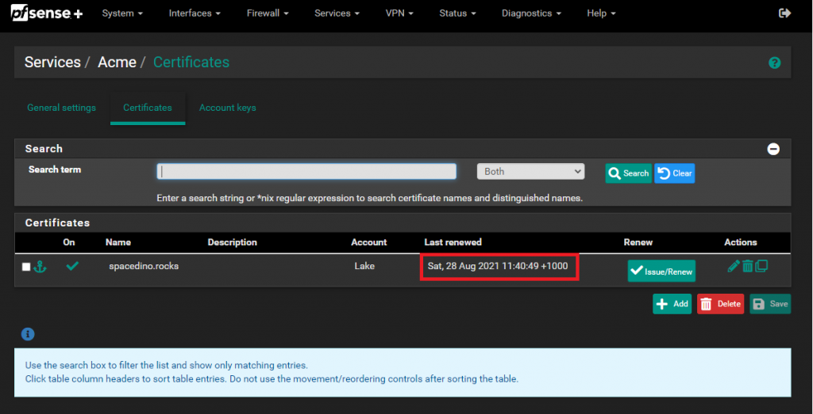
21.  Thats it for the Cert! You now have a certificate for your domain that will auto renew. 

## Setup HA Proxy

1.  Go to Services -> HAProxy. Select the “Backend” tab and press “Add”
2.  This is where we setup our internal web sever that we want to proxy to. My server is a web server on 10.0.0.7 port 80. Enter a name for the server, then press the down arrow under “server list”. Now enter your internal server IP and port. If it is secure enter 443 and tick “Encrypt(SSL)”, do not tick “SSL Check” as it would be a self-signed certificate on your server and cause an error.  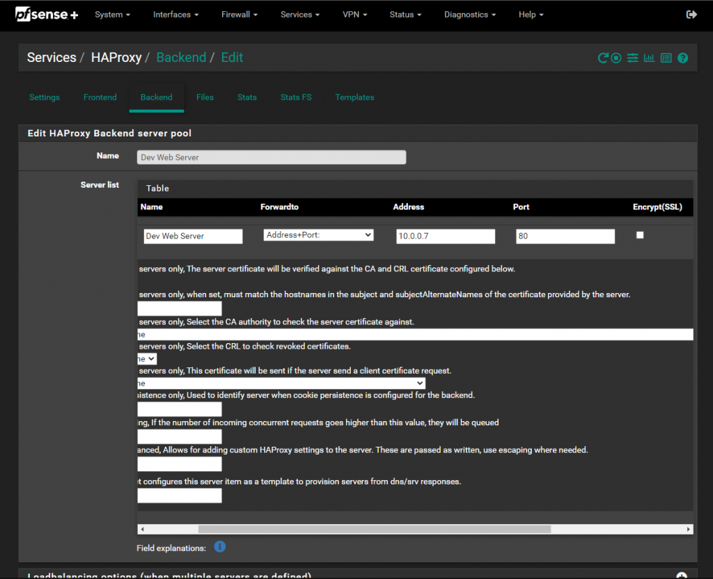
3.  Scroll down to Health Checking and select “None” 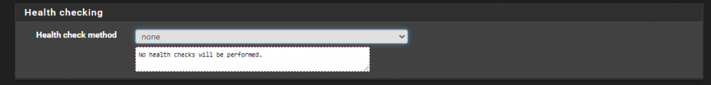
4.  Scroll to the bottom and press save. 
5.  Now select “Front End” from the top tabs. This is where we setup the front-end proxy and have it redirect with our certificate to the back-end server. 
6.  Select “Add” and enter a name. Now under listen address you can select where request will come from. I am only going to accept requests from my LAN so I will select LAN Address(IPv4) and enter port 443. Don’t forget to tick “SSL Offloading”. If you want this to be accessible from the internet you can also add WAN Address(IPv4). You will also need to open port 443 for external access. 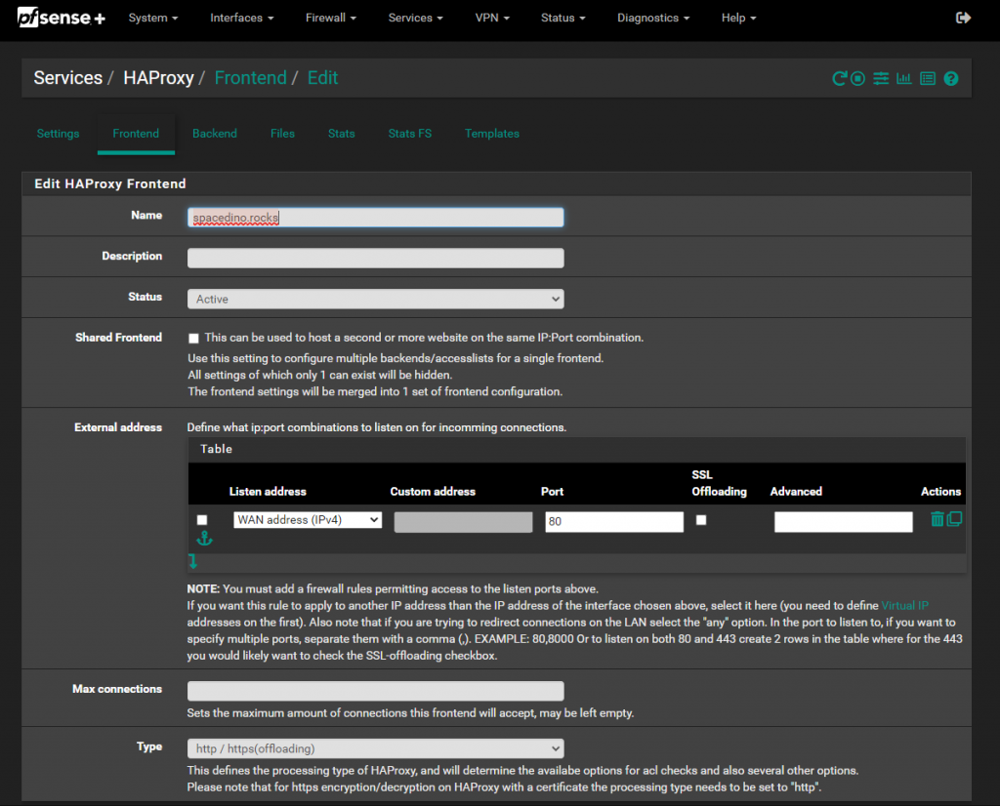
7.  Now scroll down to “Access Control list”. Press the little down arrow and enter a name, change expression to “Host Matches” and enter the domain name you want in the “Value field”. I will enter spacedino.rocks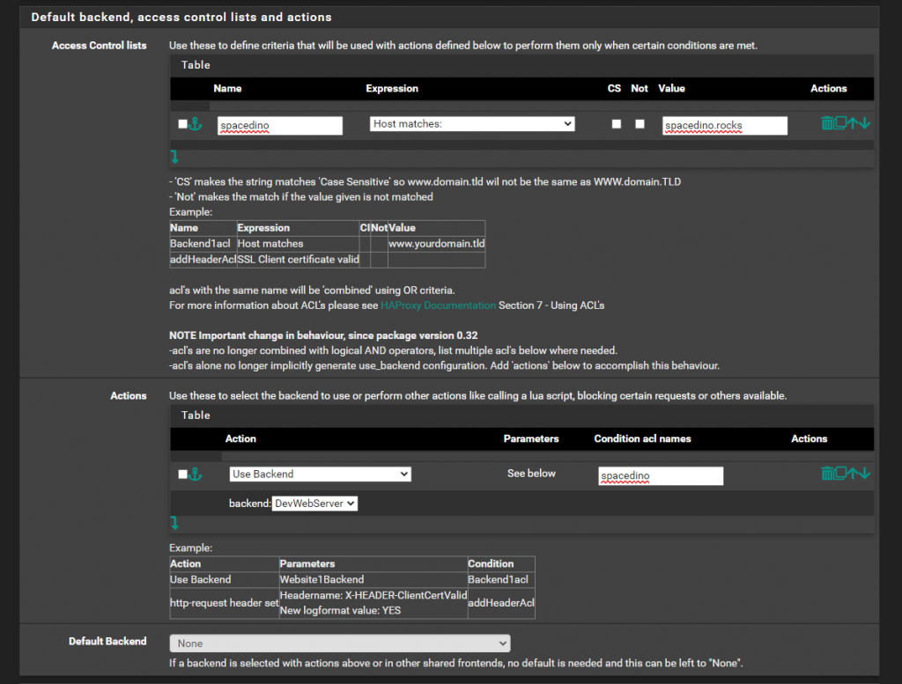
8.  Now under “Actions” press the little down arrow and select “Use backend”. Now enter the name of the rule you made in the previous step, make sure it is exactly the same. Select the Backend from the dropdown, you will likely only have one option from earlier. 
9.  Lastly Scroll to “SSL Offloading”. Here, change the certificate to the one we created earlier. 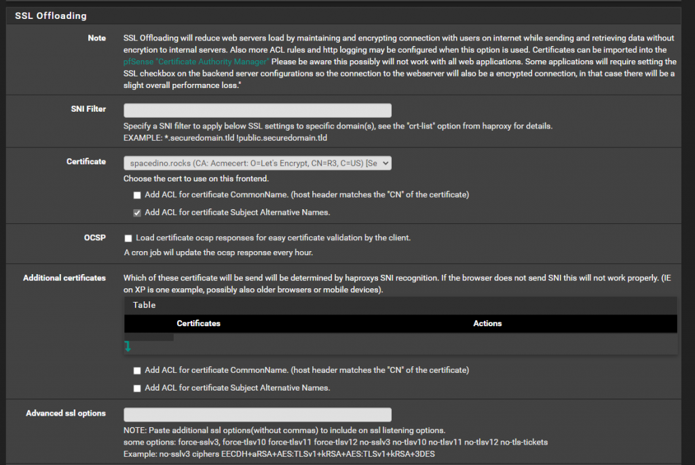
10.  Now press save. 

## Setup Local DNS

1.  For this to work, we need our domain spacedino.rocks to point to the IP of the Pfsense router 10.0.0.1 (The IP and domain will differ for you)
2.  Go to Services -> DNS Resolver. At the bottom we need to add a mapping under Domain Overrides. If you are not using Pfsense for your DNS you will need to add this override to that DNS Server (Eg windows server or PI-Hole)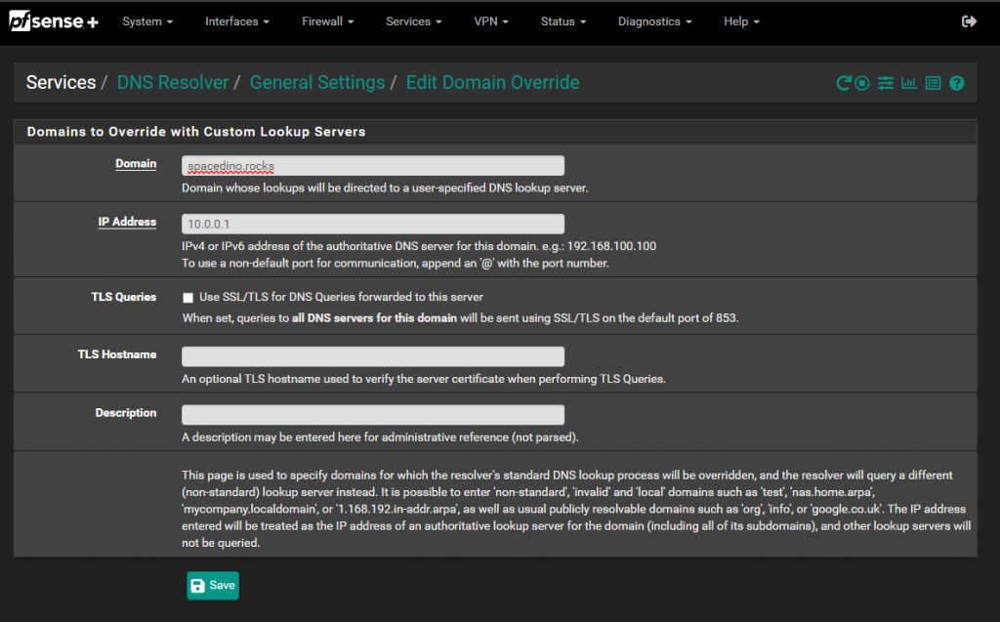
3.  Enter your domain and your Pfsense Router IP. Press Save.

## Finished!

1.  Thats it, all done! Now to test. If all is setup correctly you should be able to enter your domain and it should connect to your server with an SSL connection, using a valid certificate.
2.  I will enter https://spacedino.rocks to test. As you can see if I enter the domain, I get a secure connection with a valid certificate.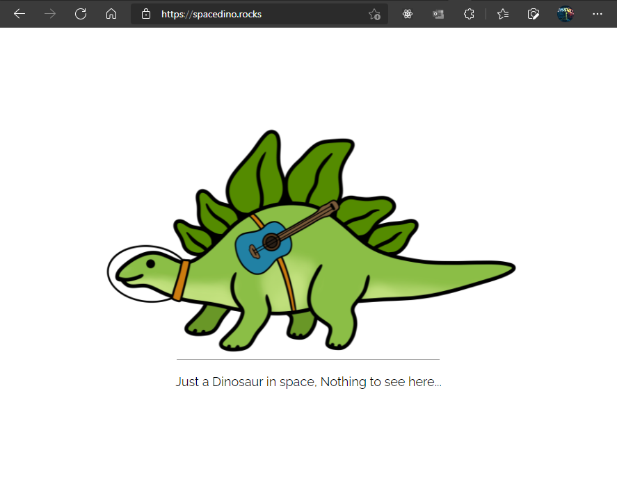
3.   If, however I enter the local IP of the server it is not secure. HAProxy is providing and keeping the cert updated for us. 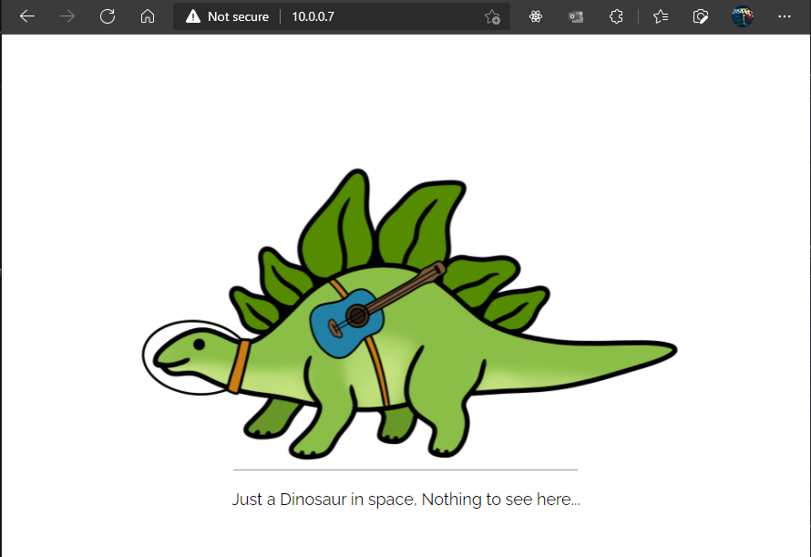

## External Access

For external access you will need to do things like:

1. Setup firewall rules to allow port 80 and 443 to pfsense from the wan.
2. Setup a separate front end for external access. On this front end you would select “WAN Address (IPv4)” as the listen address.
3. You will also need a static WAN IP address. You will need to set your public DNS record to point to that address.

## Reference

- https://jarrodstech.net/how-to-pfsense-haproxy-setup-with-acme-certificate-and-cloudflare-dns-api/
- 