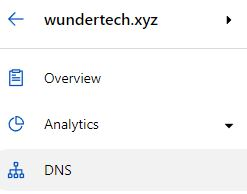
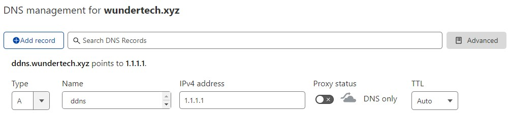
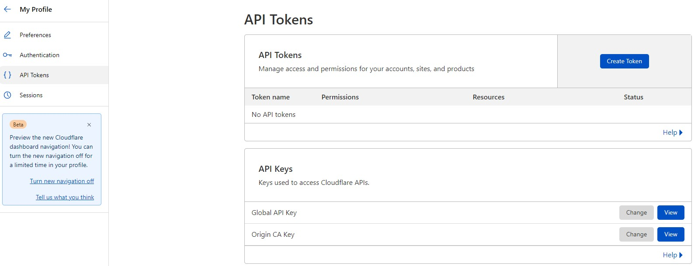
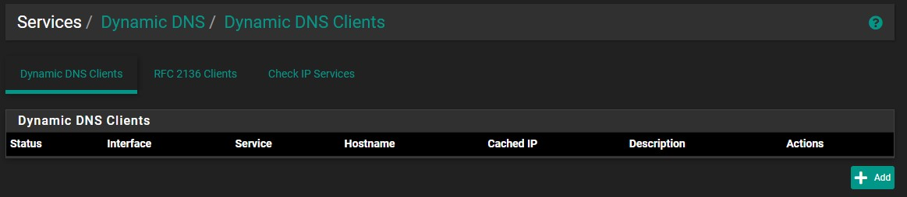
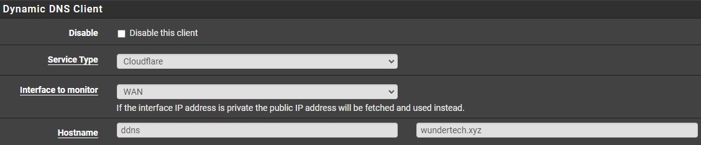
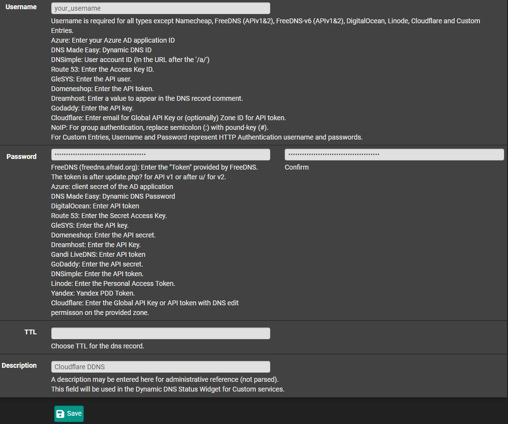
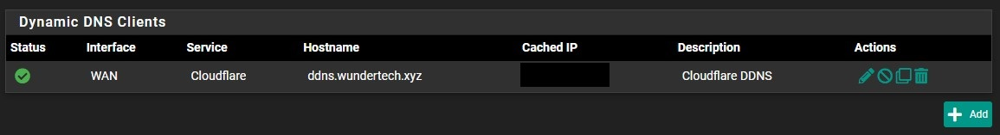

# How to Set Up DDNS on pfSense using Cloudflare

Today we are going to take a look at how to set up DDNS on [pfSense](https://www.pfsense.org/download/) using [Cloudflare](https://www.cloudflare.com/).

DDNS can be used for many home-lab services as it simply tracks the external IP address of your home network. If you’re fortunate enough to have a static external IP address, DDNS will do nothing other than allow you to connect a domain name to your external IP address. However, if you have a dynamic IP address (as most people do), DDNS will allow you to ensure you’re always connecting to your external IP address. This can all be accomplished relatively easily by following the instructions below on how to set up DDNS on pfSense using Cloudflare.

**You will have to own a domain that is connected to Cloudflare to follow the tutorial below. If you would like to learn more about Cloudflare, please watch the video below!**

## 1\. Instructions

1\. Log in to Cloudflare and select **DNS**.

2\. Select **Add** **Record** and leave the Type as **A**. In the **Name** section, enter how you’d like to access it. Keep in mind that this is the **subdomain** portion, which is the extension that comes before your domain name. You can use whatever you’d like (ddns is what I’ll be using) or you can use the **@** symbol which will point directly to your domain (no subdomain). In the **IPv4** field, enter **1.1.1.1** (Cloudflare’s DNS server which will be updated at a later time) and change the **Proxy** **status** to **DNS Only**, then **Save**.

3\. We now need our **Global** **API** **Key** to use as our password in pfSense, which can be accessed in the **API Tokens** section of Cloudflare (My Profile > API Tokens). 

**NOTE**: As of the creation of this tutorial, custom API tokens are not working properly, however, they’re a significantly better solution. Using a custom API token will allow you to grant DNS permissions ONLY, while the global API key gives permission to EVERYTHING. I am hoping that at some point, this is fixed.

4\. Select **View** next to your **Global API Key** then enter your password

5\. The API Token will now appear. **Copy** the Token, then head over to **pfSense**.

6\. Select **Dynamic DNS** under **Services**, then select Add to add a new service.

7\. Change the Service Type to **Cloudflare**, then populate the Hostname section with your subdomain and domain name.

8\. Set the **Username** field as your Cloudflare username, then paste in the **API** **Token** that you retrieved earlier. Finally, set a **Description** and **Save**.

**NOTE**: If you’d like to use Cloudflare’s proxy service, select **Enable** **Proxy**. This will mask your home IP address and will return Cloudflare’s IP address if requested.

9\. The **Cached** **IP** address in pfSense will now show your external IP address. As long as the status shows a green checkmark, everything will function as expected and the domain name you selected will ALWAYS point to your external IP address! If you check the IPv4 field in Cloudflare (initially set as 1.1.1.1), it will now be updated to your external IP address as well.

This tutorial showed how to set up DDNS on pfSense using Cloudflare. DDNS can be used for many services and running it in pfSense with Cloudflare is a great option! Not only does it work well, but your home IP address can be masked by using Cloudflare’s proxy which is a great feature! In a later tutorial, we will take a look at how you can utilize this DDNS hostname to connect to your local network utilizing a VPN.

## Reference

* https://www.wundertech.net/how-to-set-up-ddns-on-pfsense-using-cloudflare/
* 