# How to Set up a VLAN in pfSense

This tutorial will take a look at how to set up a VLAN in pfSense.

VLANs ([Virtual LANs](https://docs.netgate.com/pfsense/en/latest/vlan/index.html)) in pfSense are a way to easily separate traffic on your local network. In most traditional home networks, all devices can communicate with each other as there isn’t any network segregation. This means that your IoT devices, cell phones, PC’s, servers, and any other device connected to your network will be able to see and communicate with each other by default.

This helps because configuring a pfSense VLAN will allow you to separate the traffic and even entirely block communication if you’d like. This can help if you’re interested in setting up an IoT or Guest network, as you can be certain that those devices won’t be able to communicate with your personal devices.

To set up a VLAN in pfSense, follow the instructions below.

1. Select **Interfaces** then **Assignments.**


2. In the **Assignments** section, select **VLANs**, then **Add** to add a new pfSense VLAN.

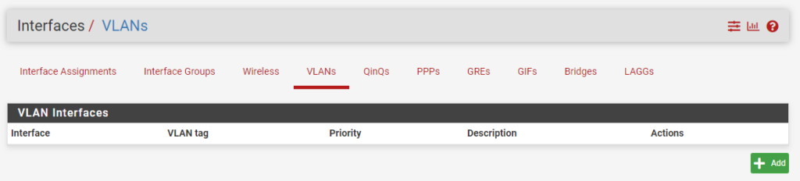

3. In the **Parent Interface**, select the **LAN** interface that you have configured. In the **VLAN Tag** section, specify an **ID** that’s not currently being used, create a **Description,** then **Save.**

**NOTE:** I normally number my VLANs in increments of 10 (example: IOT – 10, Guest – 20, etc). Just ensure that you’re using a unique ID.

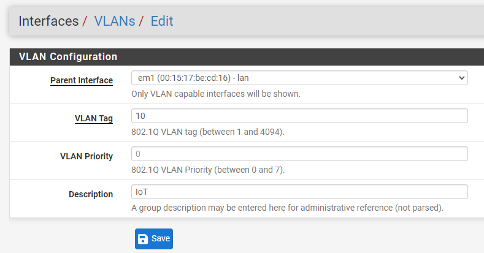

4. The VLAN network has now been created in pfSense! We now need to **add** and **enable** the interface so that we can create firewall rules (if desired). Select **Interfaces,** then **Interface Assignments.**

5. Under **Available Network Ports,** you’ll see the new VLAN we created. Select **Add.**

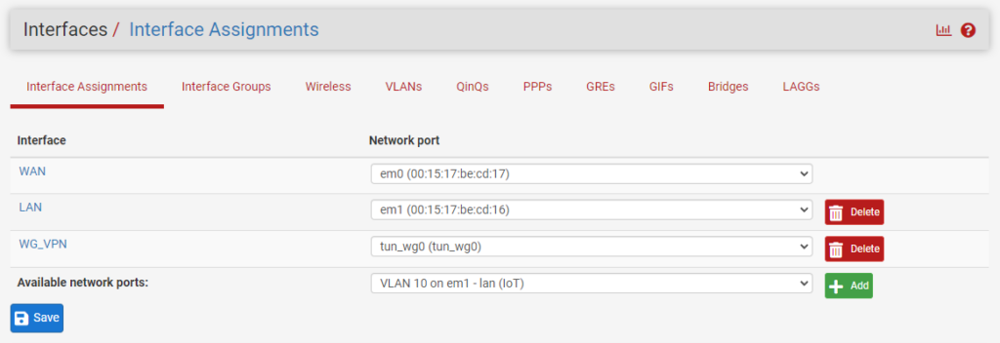

6. A **unique name** will automatically be assigned to the interface. Select the name so that we can configure it (**OPT2** in the screenshot below).

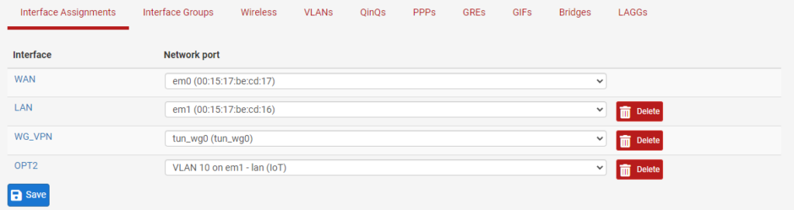

7. **Enable** the interface, give it a **Description**, then select **Static IPv4** under **IPv4 Configuration Type.**

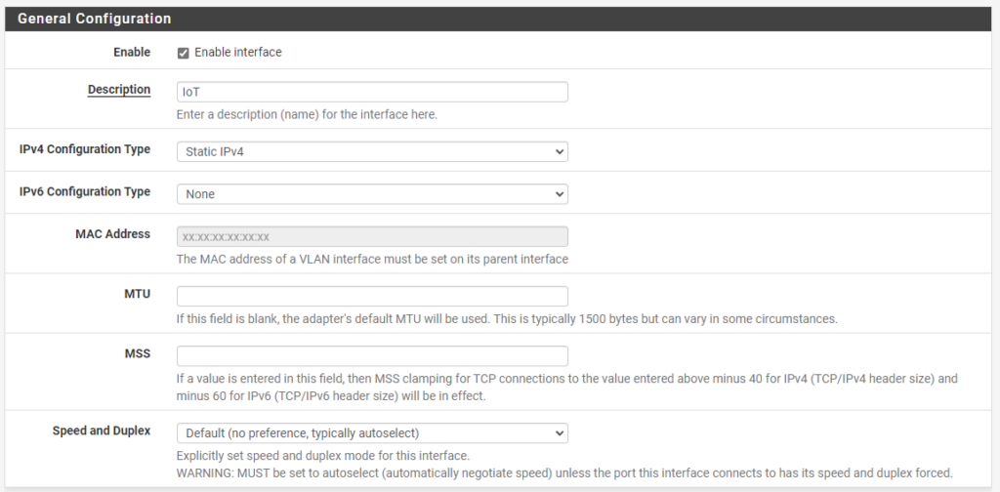

8. Under the **Static IPv4 Configuration** section, assign the local IP address subnet that you’d like this pfSense VLAN to use, then **/24**. When you **Save** and **Apply**, the interface will be enabled!

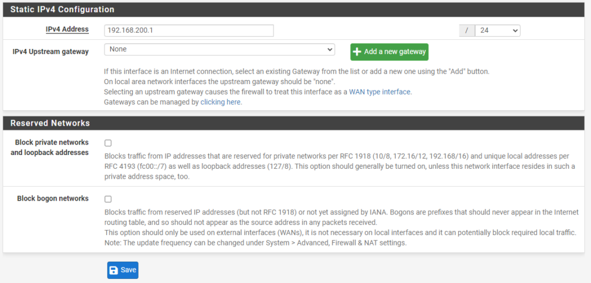

## 2. VLAN to VLAN Routing – How to Set up a VLAN in pfSense

By default, any VLAN’s that you create in pfSense will be able to communicate with each other. VLAN routing is automatically configured so if you _do_ want pfSense VLAN to VLAN routing, it will be enabled by default.

However, most users _do not_ want pfSense VLAN to VLAN routing, meaning that they don’t want their VLANs to communicate with each other. This allows your network to stay isolated and ensures that your VLAN network (IoT in this example) and local devices on your LAN network **will not be able to communicate.**

To block communication, follow the instructions below.

1. Select **Firewall** then **Rules.**

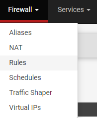

2. You’ll see that the IoT network that we created will now exist under our firewall rules. Select the **IoT** network (or your VLAN) then select **Add** to create a new rule.


3. Change the action to **Block**, the **Address** **Family** to **IPv4+IPv6,** and the **Protocol** to **Any.**

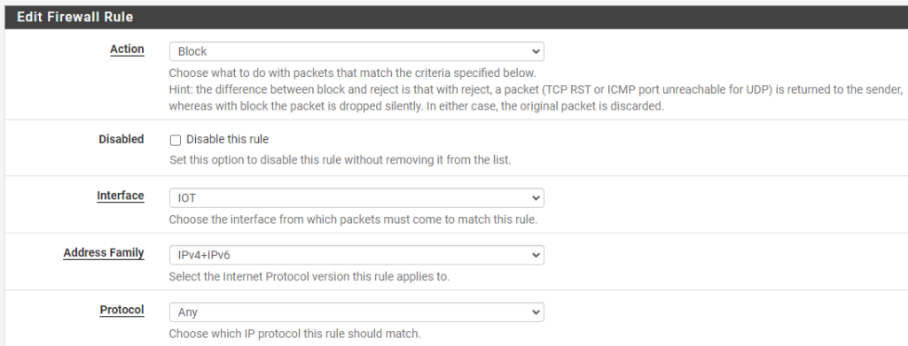

4. Set the **Destination** as **LAN net**, then give the rule a **Description.**

**NOTE**: You can change the destination to whatever network you want to block, so this can be utilized to block traffic to your LAN network and/or any other VLANs you might have.

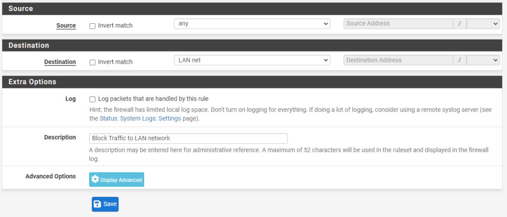

5. **Save and Apply** the new firewall rule and the VLAN will _not_ be able to communicate with the LAN network.

If you don’t want the LAN network to communicate with the VLAN network, create a firewall rule on the LAN interface that blocks traffic with the destination VLAN network.

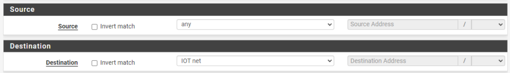

## 3. pfSense VLAN Access Point + Switch

Now that we configured a pfSense VLAN, you’ll have to actually utilize that VLAN with your switch or access point. I can’t really go over this as everyone will be utilizing different hardware, but it’s best to google the switch or access point you’re using with “VLAN setup”.

```
[switch/access point] vlan setup
```

Using Unifi switches/access points as an example, go into the [Unifi Controller](https://www.wundertech.net/self-host-the-unifi-controller-on-a-synology-nas/), select **Networks,** then create a new network. Give the network a **Name,** set it as **VLAN-only Network,** then select the same VLAN ID that we set in pfSense.

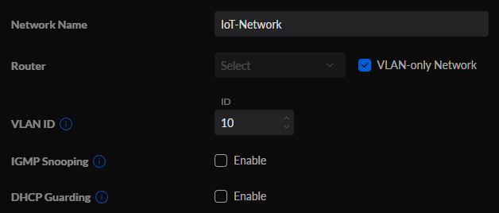

If you’re interested in creating a Wi-Fi network with your new VLAN, you can select **WiFi**, then **Create New WiFi Network**. You’ll then be able to give the WiFi network a name and password, then by simply selecting the IoT-Network that we created in the last step, we’ll be able to utilize this WiFi SSID for connections!

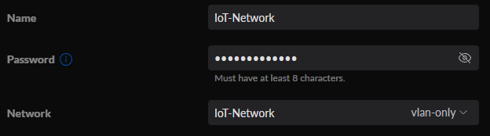

This will ensure that any devices that are connected to this WiFi network **will not** be able to communicate with any other devices on your LAN network. This is perfect for setting up a Guest WiFi network!

## 3. Conclusion – How to Set up a VLAN in pfSense

When looking at “how to set up a VLAN in pfSense”, the process isn’t too complex and there are many benefits. By simply setting up and configuring this, you’re ensuring that _any_ devices connected to your VLAN network will **not** be able to communicate with anything on your LAN network. An incredibly powerful way of separating traffic on your local network!
