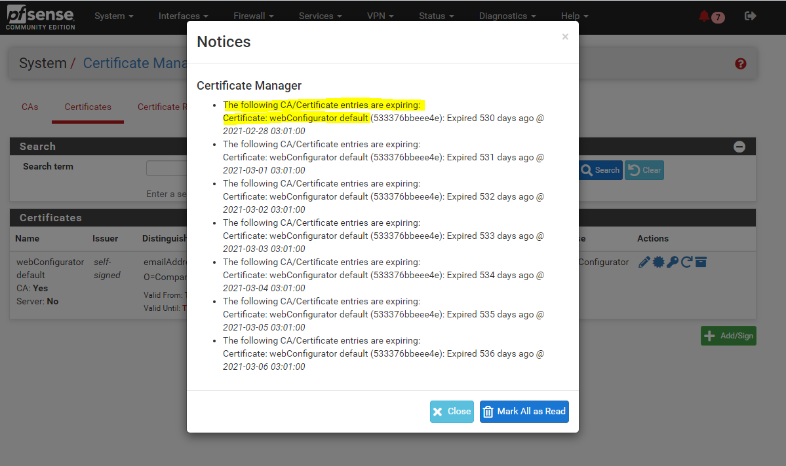
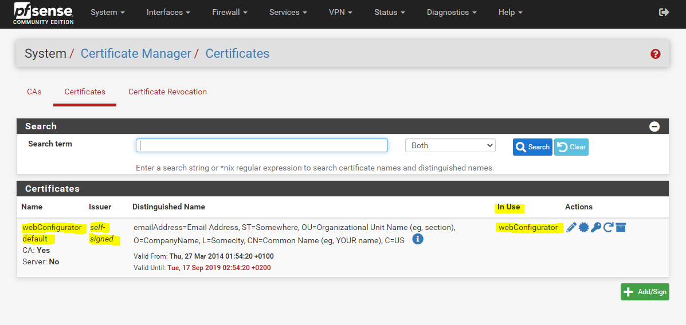
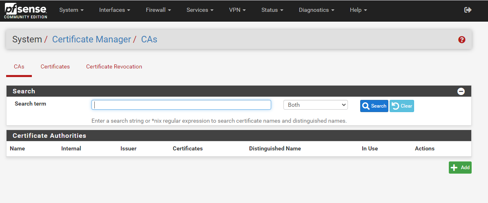
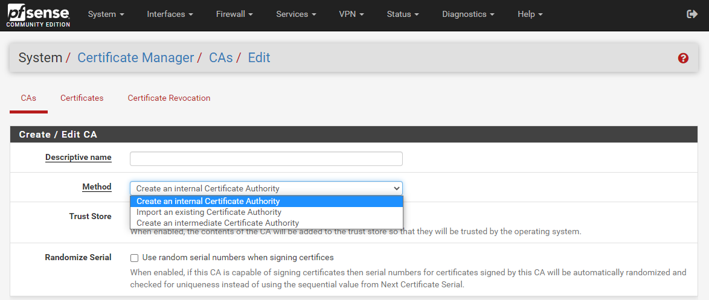
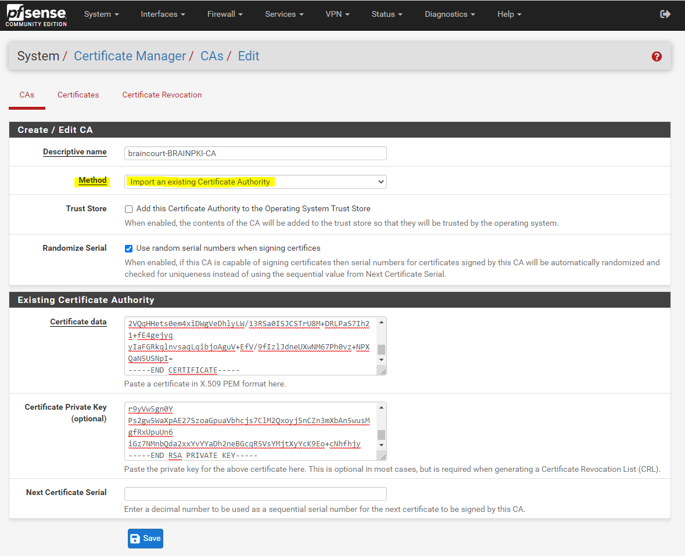
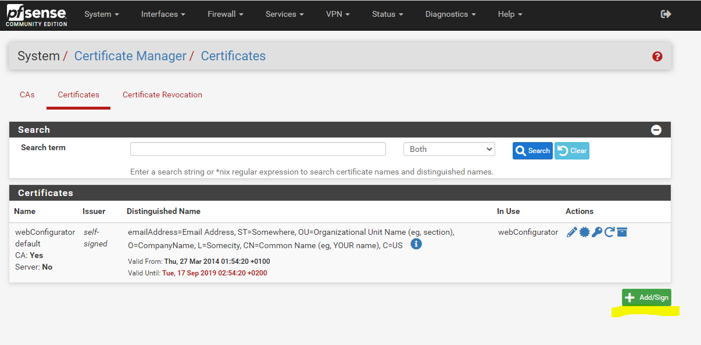
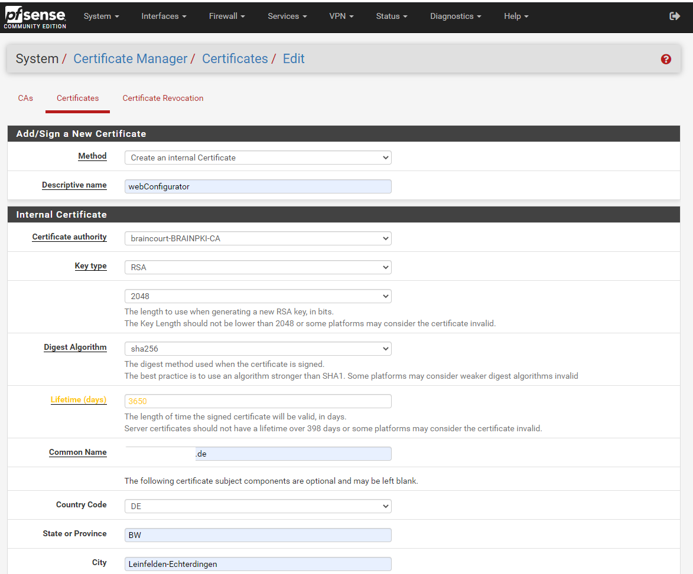
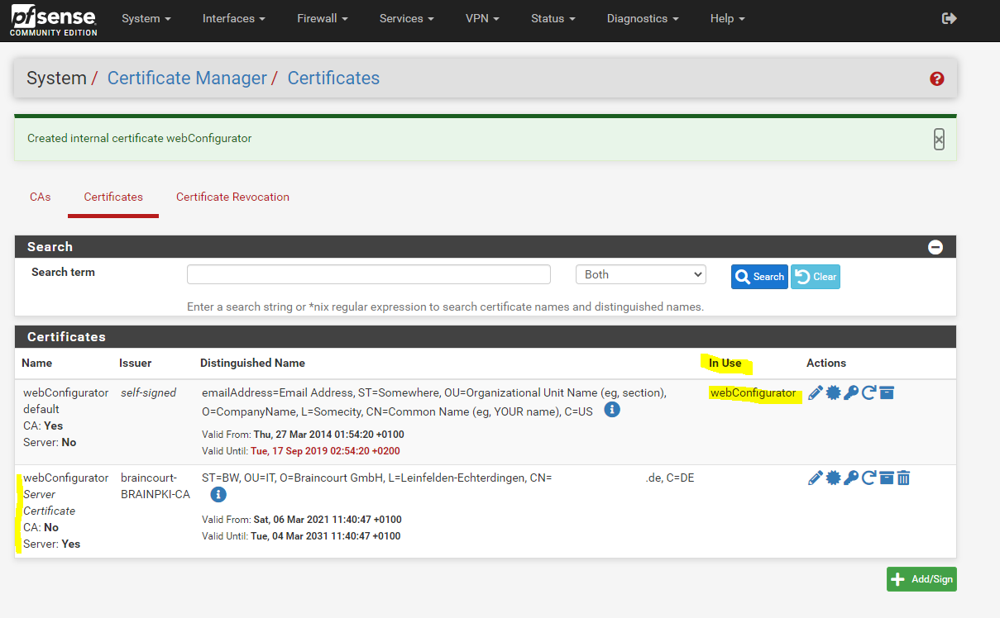
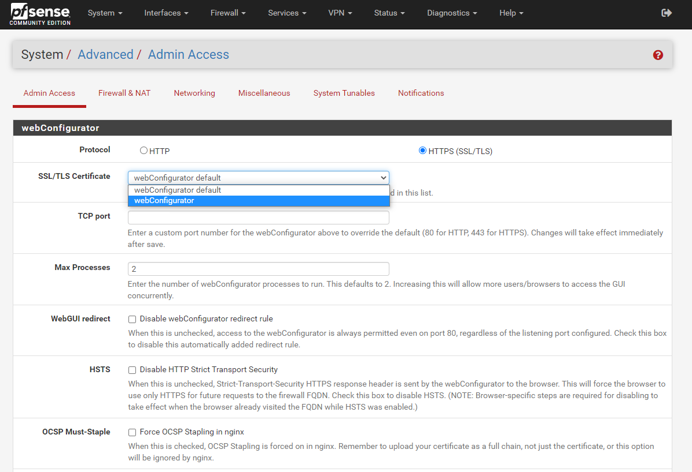
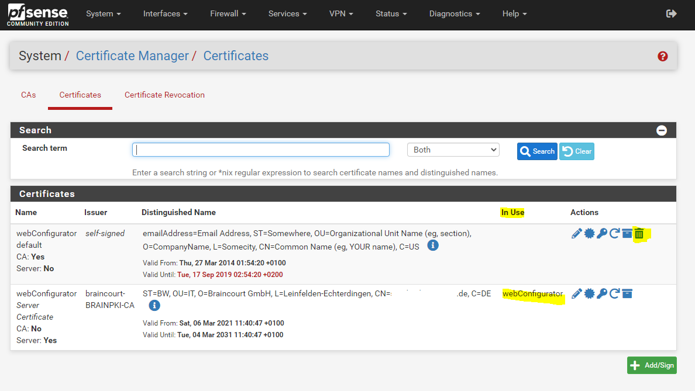

# pfSense – webConfigurator default Certificate expiring

In case your **default webConfigurator certificate** is expiring soon or as below still expired some time ago, this is not really an critical issue and will not affect pfSense from functioning as before.

This certificate is "only" used for accessing the **WebGUI** secure using TLS and is still secure if expired. The only downside is, that you will getting this warning messages and your browser no longer is able to verify if the certificate which pfSense is presented, will be valid.

In this case your browser marked the site as insecure and that’s all. Since we know better, we can ignore the warning or renew the certificate.

**System -> Cert. Manager -> Certificates**

In case you want to renew it, you first have to create a **Certificate Authority (CA)** on pfSense if not still happened.

Therefore you can choose between the three following options:

-   Create an **internal** Certificate Authority
-   **Import** an **existing** Certificate Authority
-   Create an **intermedidate** Certificate Authority

I will user here my existing **internal corporate CA** and therefore need to add the public and private key from.

> **How to export the public and private key from an internal Microsoft CA (ADCS)**, you will see under [https://blog.matrixpost.net/openvpn-point-to-site-p2s-connection-over-radius-active-directory-authentification/#CA](https://blog.matrixpost.net/openvpn-point-to-site-p2s-connection-over-radius-active-directory-authentification/#CA)

You can also create a new internal CA.

Now we can go to **Certificates** and create a new one.

  
Before we can delete the expired certificate and pfSense is using the new one for the WebGUI, we first have to change the certificate under **System -> Advanced** in the **webConfigurator section**.

From now on the new certificate is used and we can delete the expired old one.

## Reference

- https://blog.matrixpost.net/pfsense-webconfigurator-default-certificate-expiring/
