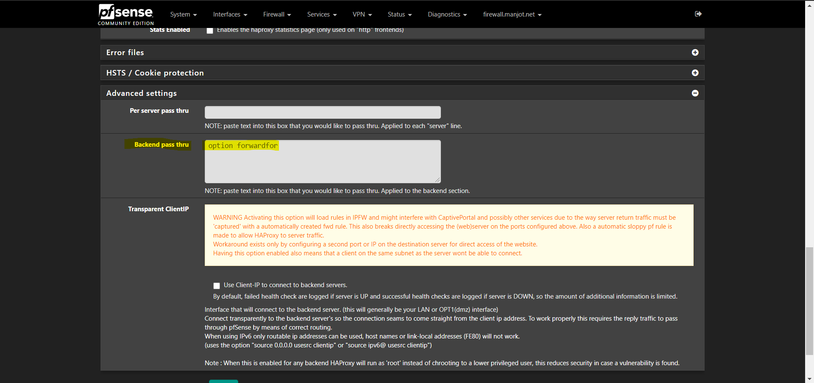
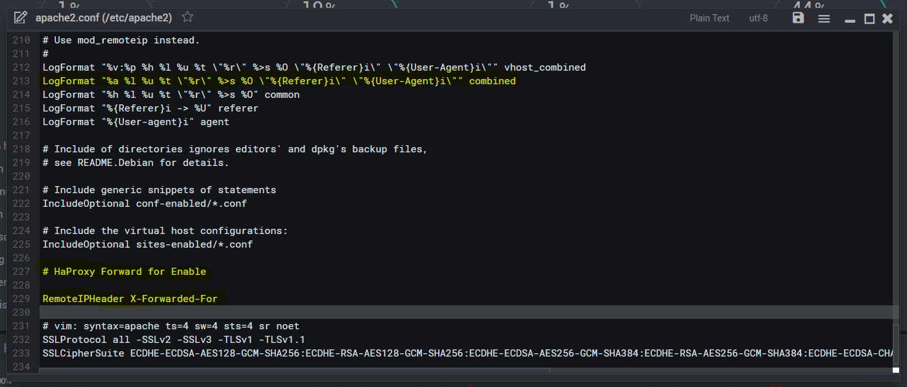
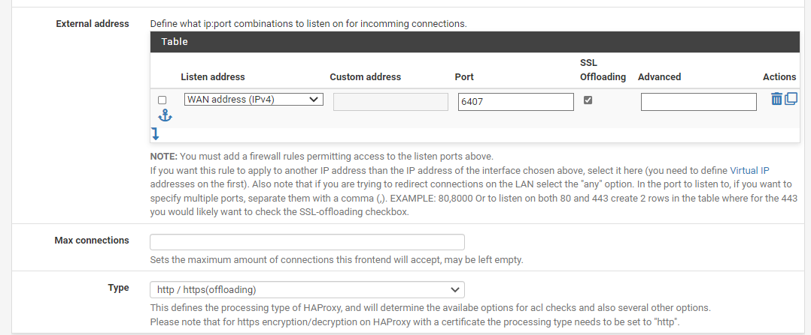

# ISSUE: haproxy forwards the 192.168.80.1 address, instead of the clients ip.

## Issue Details

-      
    
    Hi,
    
    I am running haproxy -> (192.168.80.90) on pfsense -> (192.168.80.1), In frontend I have checked the “Use “forwardfor” option.” But instead haproxy forwards the 192.168.80.1 address, instead of the clients ip.
    
    **Look for frontend FrontEndProxy**
    
    Thanks,
    
    ```
    # Automaticaly generated, dont edit manually.
    # Generated on: 2020-12-31 02:42
    global
    maxconn1000
    log/var/run/loglocal0info
    stats socket /tmp/haproxy.socket level admin  expose-fd listeners
    uid80
    gid80
    nbproc1
    nbthread1
    hard-stop-after15m
    chroot/tmp/haproxy_chroot
    daemon
    tune.ssl.default-dh-param2048
    server-state-file /tmp/haproxy_server_state
    
    listen HAProxyLocalStats
    bind 127.0.0.1:2200 name localstats
    mode http
    stats enable
    stats admin if TRUE
    stats show-legends
    stats uri /haproxy/haproxy_stats.php?haproxystats=1
    timeout client 5000
    timeout connect 5000
    timeout server 5000
    
    frontend FrontEndProxy
    bind192.168.80.90:443 name 192.168.80.90:443   ssl crt-list /var/etc/haproxy/FrontEndProxy.crt_list  
    modehttp
    logglobal
    optionsocket-stats
    optionhttp-keep-alive
    optionforwardfor
    acl https ssl_fc
    http-request set-headerX-Forwarded-Proto http if !https
    http-request set-headerX-Forwarded-Proto https if https
    timeout client30000
    aclspeedvar(txn.txnhost) -m str -i speed.manjot.net
    aclauthvar(txn.txnhost) -m str -i auth.manjot.net
    acljellyfinvar(txn.txnhost) -m str -i jellyfin.manjot.net
    aclaclcrt_FrontEndProxyvar(txn.txnhost) -m reg -i ^speed\.manjot\.net(:([0-9]){1,5})?$
    aclaclcrt_FrontEndProxyvar(txn.txnhost) -m reg -i ^auth\.manjot\.net(:([0-9]){1,5})?$
    aclaclcrt_FrontEndProxyvar(txn.txnhost) -m reg -i ^jellyfin\.manjot\.net(:([0-9]){1,5})?$
    http-request set-var(txn.txnhost) hdr(host)
    use_backend Speed_ipvANY  if  speed aclcrt_FrontEndProxy
    use_backend Auth_ipvANY  if  auth aclcrt_FrontEndProxy
    use_backend Jellyfin_ipvANY  if  jellyfin aclcrt_FrontEndProxy
    
    frontend HTTP-TO-HTTPS
    bind192.168.80.90:80 name 192.168.80.90:80   
    modehttp
    logglobal
    optionhttp-keep-alive
    optionforwardfor
    acl https ssl_fc
    http-request set-headerX-Forwarded-Proto http if !https
    http-request set-headerX-Forwarded-Proto https if https
    timeout client30000
    http-request redirect scheme https 
    
    frontend GMFrontEndProxy
    bind192.168.80.39:443 name 192.168.80.39:443   ssl crt-list /var/etc/haproxy/GMFrontEndProxy.crt_list  
    modehttp
    logglobal
    optionhttp-keep-alive
    timeout client30000
    aclgmvar(txn.txnhost) -m str -i gm.manjot.net
    aclaclcrt_GMFrontEndProxyvar(txn.txnhost) -m reg -i ^gm\.manjot\.net(:([0-9]){1,5})?$
    http-request set-var(txn.txnhost) hdr(host)
    use_backend GM_ipvANY  if  gm aclcrt_GMFrontEndProxy
    
    frontend GM-HTTP-TO-HTTPS
    bind192.168.80.39:80 name 192.168.80.39:80   
    modehttp
    logglobal
    optionhttp-keep-alive
    timeout client30000
    http-request redirect scheme https 
    
    backend Speed_ipvANY
    modehttp
    id100
    logglobal
    timeout connect30000
    timeout server30000
    retries3
    optionhttpchk OPTIONS / 
    serverspeed 192.168.80.74:443 id 101 ssl check-ssl check inter 1000  verify none crt /var/etc/haproxy/server_clientcert_5f5d1c960d78a.pem 
    
    backend Auth_ipvANY
    modehttp
    id104
    logglobal
    timeout connect30000
    timeout server30000
    retries3
    optionhttpchk OPTIONS / 
    serverAuth 192.168.80.73:443 id 105 ssl check-ssl check inter 1000  verify none crt /var/etc/haproxy/server_clientcert_5f5f10b443a8f.pem 
    
    backend Jellyfin_ipvANY
    modehttp
    id106
    logglobal
    timeout connect30000
    timeout server30000
    retries3
    serverjellyfin 192.168.80.18:8920 id 107 ssl check-ssl check inter 1000  verify none crt /var/etc/haproxy/server_clientcert_5f8a7e8154947.pem 
    
    backend GM_ipvANY
    modehttp
    id102
    logglobal
    timeout connect30000
    timeout server30000
    retries3
    optionhttpchk OPTIONS /si/home.do 
    serverGM 192.168.80.38:9001 id 103 check inter 1000
    ```
    
-      
    
## **Solved**
    
  Guide : https://www.digitalocean.com/community/questions/get-client-public-ip-on-apache-server-used-behind-load-balancer
    
  First you need to set **option forwardfor** in each backend to have in HaProxy, under **Advanced Settings** then in **Backend pass thru** box put **option forwardfor** and hit save, Don't set forwardfor in frontend, then you need to enable "**sudo a2enmod remoteip**" in your apache2 server and edit config **/etc/apache2/apache2.conf** and add the following line at bottom of config, **RemoteIPHeader X-Forwarded-For** and in that same config locate the log file line : **LogFormat "%h %l %u %t "%r" %>s %O "%{Referer}i" "%{User-Agent}i"" combined** and change **%h** to **%a** to see the ip in logs, like this **LogFormat "%a %l %u %t "%r" %>s %O "%{Referer}i" "%{User-Agent}i"" combined** and restart your apache2 server and you are done and check your apache access logs and you should see public ip of clients.
    

    
```shell
[root@cPanel ~]# a2enmod remoteip
Enabling module remoteip.
To activate the new configuration, you need to run:
  systemctl restart apache2
[root@cPanel ~]# systemctl restart apache2
[root@cPanel ~]#
[root@cPanel ~]# nano /etc/apache2/apache2.conf 

LogFormat "%a %l %u %t \"%r\" %>s %O \"%{Referer}i\" \"%{User-Agent}i\"" combined

# HaProxy Forward for Enable

RemoteIPHeader X-Forwarded-For

[root@cPanel ~]# systemctl restart apache2

```



```shell
------------Before--------------- 

192.168.80.1 - - [02/Jan/2021:11:10:00 -0500] "GET / HTTP/1.1" 200 623 "-" "Mozilla/5.0 (Linux; Android 10; SM-G975W) AppleWebKit/537.36 (KHTML, like Gecko) Chrome/87.0.4280.101 Mobile Safari/537.36"
192.168.80.1 - - [02/Jan/2021:11:10:00 -0500] "GET /style.css HTTP/1.1" 200 277 "https://speed.manjot.net/" "Mozilla/5.0 (Linux; Android 10; SM-G975W) AppleWebKit/537.36 (KHTML, like Gecko) Chrome/87.0.4280.101 Mobile Safari/537.36"
192.168.80.1 - - [02/Jan/2021:11:10:02 -0500] "GET /favicon.ico HTTP/1.1" 200 112448 "https://speed.manjot.net/" "Mozilla/5.0 (Linux; Android 10; SM-G975W) AppleWebKit/537.36 (KHTML, like Gecko) Chrome/87.0.4280.101 Mobile Safari/537.36"

---------- After --------------  

204.48.93.246 - - [02/Jan/2021:11:11:05 -0500] "GET / HTTP/1.1" 200 623 "-" "Mozilla/5.0 (Linux; Android 10; SM-G975W) AppleWebKit/537.36 (KHTML, like Gecko) Chrome/87.0.4280.101 Mobile Safari/537.36"
204.48.93.246 - - [02/Jan/2021:11:11:06 -0500] "GET /favicon.ico HTTP/1.1" 200 112448 "https://speed.manjot.net/" "Mozilla/5.0 (Linux; Android 10; SM-G975W) AppleWebKit/537.36 (KHTML, like Gecko) Chrome/87.0.4280.101 Mobile Safari/537.36"
```
    
- about a year later
-      
    
    [@manjotsc](https://forum.netgate.com/uid/301136)
    
    some further notes on this:
    
    -   the `forwardfor` option in the HAProxy front-end config works fine for forwarding the client address
    -   you can use the backend option but I don't think it's necessary.
    
    For users using `nginx`. A similar logging can be achieved by:
    
    add this to `/etc/nginx/nginx.conf` in the `http {` block:
    
    ```
        ##
        # Logging Settings
        ##
    
        access_log /var/log/nginx/access.log;
        error_log /var/log/nginx/error.log;
    
        log_format combined_realip '$http_x_forwarded_for - $remote_user [$time_local] '
                        '"$request" $status $body_bytes_sent '
                        '"$http_referer" "$http_user_agent"';
    
    ```
    
    then in your virtualhost config:
    
    ```
    access_log      /var/log/nginx/access.log combined;
    access_log      /var/log/nginx/access_realip.log combined_realip;
    ```
    
    the `access_realip.log` will then include the client address. You can then use that to verify the HAProxy is passing through the variable properly.
    
    see this guide for reference: https://djangocas.dev/blog/nginx/nginx-access-log-with-real-x-forwarded-for-ip-instead-of-proxy-ip/
    
-      
    
    [@greenant](https://forum.netgate.com/uid/333345)
    
    if you have the `http_realip_module` available in nginx, then the config is even simpler, just add to `nginx.conf`:
    
    ```
    real_ip_header X-Forwarded-For;
    real_ip_recursive on;
    set_real_ip_from <your proxy/CDN IP CIDR here>;
    ```
    
- about a month later
-      
    
    Hello,
    
    Didn't work for me (both ways \[frontend / backend\]).
    
    I have Synology NAS behind my pfSense/HaProxy, and the Synology shows the pfSense IP and not the real client IP.
    
    \-Roei
    
- 10 days later
-    
    
    for synology:  
    just configure "Trusted Proxies" - Control Panel> Security > Trusted Proxies
    
- 3 months later
-    
    
    [@braunerroei](https://forum.netgate.com/uid/354200) I curious, how did you get HAProxy in front of Synology to work? Is there an article somewhere that lays it out? Frontend-backend relation seems to be correct. It's working for our private Docker registries but when I set up https offload to http backend Synology, I just get 503s. "Use forwardfor" is checked and the front-end and backend are green in the stats.
    
-      
    
    [@bigtfromaz](https://forum.netgate.com/uid/156957)  
    Hi
    
    I am not pfSense / Haproxy expert, but it seems to be very easy.
    
    Why https offload to http backend?
    
    I configured backend with port 5001, and 2 frontends, one (shared) with 443 port and one with 5001 port, both use the same backend.
    
    \-Roei
    
-      
    
    [@braunerroei](https://forum.netgate.com/uid/354200)
    
    I assume you are storing your certificate on the Synology's box. If not, how are you securing your connection?
    
    I have the HAProxy frontend handling SSL negotiation using a certificate stored on the pfSense router. The certificate is acquired using the ACME package, configured to use Let's Encrypt DNS-01 protocol. This way we don't have to expose any ports when renewing our certificate. In this scenario, SSL offload is not from pfSense to Synology. It's the other way around. Our HAProxy frontend is listening on a custom port, negotiating the encrypted connection and forward traffic to the Synology backend which listening, unsecured, on a 5xxx port.
    
    I have the exact same configuration working (using different ports) for our Docker repository, without checking the forward for box. It works fine. In that case the frontend port is 443 and the backend port is in the 5xxx range.
    
    It appears I need to open a ticket with Synology to see if they can help me find logs. I'm also having trouble getting detailed logs from HAProxy on pfSense.
    
-      
    
    [@bigtfromaz](https://forum.netgate.com/uid/156957)
    
    In the matter af fact, I use the certificate stored on the pfSense, that was created by ACME.
    
    \-Roei
    
-      
    
    [@braunerroei](https://forum.netgate.com/uid/354200) Then your frontend config looks like this?
    
    
    
    That's the SSL Offloading I was talking about. If you don't check that box, then pfSense won't negotiate SSL. I was worried that you might be processing unencrypted.
    
    In any event, I resolved my 503 problems. I'm not using the default port 443 for this new connection. Therefore, the value of the "Host Matches" ACL entry needed to be _my.host.com:6407_. I had used _my.host.com_ with no port.
    
    I had assumed that HAProxy would tack the port number on to the value because the port number is specified in the external address table. I see now it can't do that. The External Address table may contain multiple entries. It follows that the ACL match routine has no way to know your intentions unless you specify the port number in the ACL.
    
    Thanks for the help. Your answers got me questioning my own configuration which turned out to be in error.
    
- L [louis2](https://forum.netgate.com/user/louis2) [referenced](https://forum.netgate.com/post/1099022) this topic on Apr 11, 2023, 1:04 PM

## Reference

- https://forum.netgate.com/topic/159562/solved-haproxy-forward-client-ip/2
- 