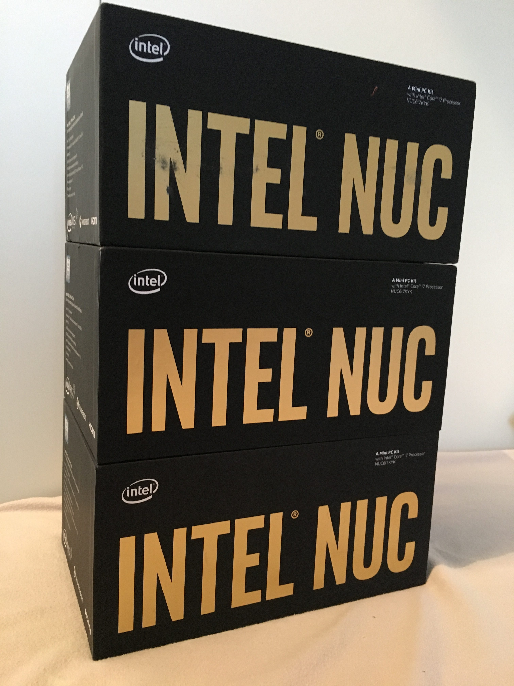

# PKS NSX-T Home Lab - Part 1 Shopping List

## Intro

The goal of this series of blog posts is to cover how to standup a VMware PKS (with NSX-T) home lab from the ground up. This will be a manual process, aka “the hard way”, not using any automation to stand it all up. I believe if you understand “the hard way” then its a lot easier to troubleshoot and then implement automation, “the easy way”, at a later date. Many will already have a home lab and/or nested environments so can skip sections when necessary. Something I need to say up front, which hurts me as I’m a perfectionist at heart, is that this series won’t be as well polished as I would like it with pretty diagrams, screenshots, and detailed step by step instructions etc as I unfortunately don’t have the time with current work and life commitments. My aim is to hopefully get enough detail down that will enable others to reach the end goal. Some self thinking and googling may be required! OK, so that’s out of the way, lets get started… so what is PKS….yes you got it, I’m not going to write reams about it, there are plenty of blogs and YouTube videos out there already covering that. Still with me? Good, so lets take out that credit card and start spending…

Complete list of blog post in this series…

### Servers

There is a whole host of servers out there for building home labs, but the most common tend to be Intel NUC’s and Supermicro E200 / E300’s. As always, pro’s and con’s to each which I will not cover in this series as I think it is well covered in other blogs. I personally went for Intel NUC’s due to their price and availability in the second hand market. The exact NUC model I went with was the 6th generation Skull Canyons ([NUC6i7KYK](https://www.intel.com/content/www/us/en/nuc/nuc-kit-nuc6i7kyk-features-configurations.html)) and three of them (**UPDATE**: Now four!). In short they have a quad-core i7-6770HQ, max of 32GB memory (**UPDATE**: [64GB unofficially](https://www.virtuallyghetto.com/2019/03/64gb-memory-on-the-intel-nucs.html)), 2x M.2 slots, and 1x 1GbE nic (more on this later). The i7-6770HQ in the Skull Canyon NUC’s have a high passmark of 9716 but in home labs, memory is more important over cpu so there is no real need for a high end NUC. I just happen to get them at a good price second hand. But, that said, you need to chose a model that has at least 8 logical processors as the NSX-T Edge(s) for PKS require 8 vCPUs each. I will explain this requirement in further detail in a later post in the series.

### Memory

The max memory NUC’s can support, unfortunately only, is 32GB each, in the form of 2x 16GB modules. (**UPDATE:** 64GB unofficially supported, in the form of 2x 32GB modules). Again, in an effort to build on a budget, I bought some second hand modules which I tested on receiving them as you can never be too sure with second hand memory. Pay attention to memory specifications when purchasing memory. How many servers you require heavily depends on memory. A nested PKS and NSX-T env, with some modifications made, consumes approx 80GB of memory, hence with NUC’s, at least three of them are required for a total of 96GB.

### Storage

The Skull Canyon NUC’s have two M.2 slots which provide again a lot of options for NVMe and AHCI SSD’s. Again for a cost perspective I went with 1x M.2 500GB AHCI SSD in each, new ones this time! They are fine for running vSAN if so wished but note, ESXi consumes more memory when vSAN is enabled. Enabling vSAN in my env consumes approx 20GB which is OK when I’m exploring vSAN features but for the nested PKS env where I need every bit of memory, I used my existing QNAP NAS for storage served over NFS. If you don’t already have a NAS, rather than buying one, you could use a NAS virtual appliance such as [FreeNAS](https://www.freenas.org/). Or you could just create a local datastore on each NUC though ideally you want shared storage. Oh, nearly forgot, you will need USB flash drives to install ESXi on for each NUC. SanDisk do nice small 16GB ones called [Ultra Fit](https://www.amazon.co.uk/SanDisk-Ultra-Flash-Drive-Read/dp/B077Y149DL/) for a good price.

### Networking

As mentioned above, the NUC only has a single 1GbE nic which is not ideal. This is where Supermicro’s shine with multiple 1GbE and 10GbE nics. Therefore as the NUC only has 1GbE, we will need to use VLAN’s and VLAN trunking etc. Like many others starting off in the world of home labs, most will typically only have their ISP’s router which tend to be locked down such as unable to bridge it to another router or have very few features such as able to use VLANs. Firstly to address VLAN tagging; use a switch that supports VLAN tagging. As you can imagine there is a world of choice out there. I used my existing [Netgear GS116Ev2](https://www.amazon.com/NETGEAR-16-Port-Gigabit-Ethernet-Managed/dp/B00GG1AC7I). If I was to buy again I would certainly contemplate [Ubiquiti](https://www.ui.com/) kit. Thats switching sorted, routing is next. To keep costs at a min, rather than a physical router, I went with a virtual appliance such as the [pfSense](https://www.pfsense.org/). Many other virtual appliances out there such as [OPNsense](https://opnsense.org/), [Sophos](https://www.sophos.com/) and [Vyos](https://vyos.io/). As previously said, NUC’s only have a single 1GbE nic, so what can also be done is to use some USB to 1GbE adapters. If you go down this route you may have to add drivers to your ESXi image so they are supported. That said, in a home lab env, a single 1GbE nic is sufficient.

### Licenses

I’m not going to go into the area of where to get licenses and software. There are many means and programs to get them such as VMUG or vExpert.

That’s the shopping list done, next, lets install ESXi on the NUC’s and configure the base networking…
