# PKS NSX-T Home Lab - Part 2 NUC setup

## Intro

In the [previous blog post](./pks-lab-part-1-shopping-list.md) we went through the kit required to setup a home lab. In this post we will cover setting up the NUCs which includes installing ESXi and configuring the base network. As previously mentioned, this series will not be detailed step by step but more so pointers as I believe those installing PKS with NSX-T in a home lab would have general systems and VMware competencies.

Complete list of blog post in this series…

## Installing ESXi

Not all NUC’s have remote management functionality such as AMT found on Dawson Canyon NUCs, therefore for the install of ESXi you will need a monitor, keyboard and mouse physically connected. Yes, its a bit of a pain, but once ESXi is installed and configured you can ssh to the DCUI if/when needed.

.Prior to installing ESXi, I reset the BIOS as these were second hand so the config state is unknown followed by upgrading the firmware to the latest. Note, there are many discussions online, such as [here](https://www.bussink.ch/?p=1729) and [here](https://www.virtuallyghetto.com/2016/05/heads-up-esxi-not-working-on-the-new-intel-nuc-skull-canyon.html) regards what bios settings need to be enabled/disabled to successfully install ESXi on a Skull Canyon NUC, but my experience is that ESXi 6.7 build 9214924 installs without issue on firmware 0057 with all bios defaults.

To install ESXi, in my case vSphere 6.7 as 6.7 U1 was not released at time of install, we need to put the ESXi installer on a USB flash drive so the NUC will boot from it. To create a bootable USB flash drive I used a tool which is an old favorite of mine called [Rufus](https://rufus.ie/). In short, point Rufus to the ESXi ISO and the USB flash drive, and within a minute you have a bootable USB flash drive. Remember to create one for each NUC!

With a keyboard, monitor and mouse attached to the NUC, insert the USB flash drive into the NUC and power it on. After a few moments the NUC will boot from the USB flash drive and present the ESXi install procedure. For my setup, I chose the USB flash drive as the install location, not the internal storage, a 500GB SSD in my case. After a few minutes, ESXi will be installed and will reboot. Remember, don’t remove the USB flash drive as that’s where ESXi is now installed!

## Configuring the Network

With ESXi installed, next we need to configure the networking on the ESXi hosts, specifically the management networking. Typically the default VLAN on switches is VLAN 1 and typically the default network on ISP provided routers is 192.168.0.0/24 or 192.168.1.0/24 where the IPs are dynamically allocated. So without re-configuring the networking on your ISP’s router we will configure the ESXi hosts to use static IP’s from 192.168.0.0/24 (or whatever subnet your router uses) and to use VLAN 1 as later we are going to trunk this connection. As we are statically assigning IP’s from the ISP router, its best to change the range from which it dynamically allocates from on the router.

With the keyboard, mouse and monitor connected to the NUC, hit F2, enter the password set during the install, go to “Configure Management Network” to configure “VLAN”, “IPV4 Configuration”, and finally “DNS Configuration”. With all configurations entered, hit ESC and you will be prompted to apply changes and restart the management network of which you reply yes. Repeat for each NUC. Hopefully, that is the last time you need to connect a keyboard, mouse and monitor to your NUC’s. Connect your NUC’s to your switch, taking note of which ports you have connected to. Oh, don’t forget to connect your switch to your router!

Now we have ESXi installed and the management network configured on each of our NUCs, lets test if we have connectivity to them. The benefit, or laziness, of using VLAN 1 and IP’s from your ISP’s router is that you can easily perform the rest of the setup from the comfort of your couch using your laptop connected to your home wifi. With your feet up and a tea/coffee/wine/beer beside you, ping the IP of the management interfaces of the ESXi hosts which we just configured, or if feeling confident, open a browser to them and be greeted with the login screen to the ESXi host of which you take a good swig of that beer beside you…and then login!

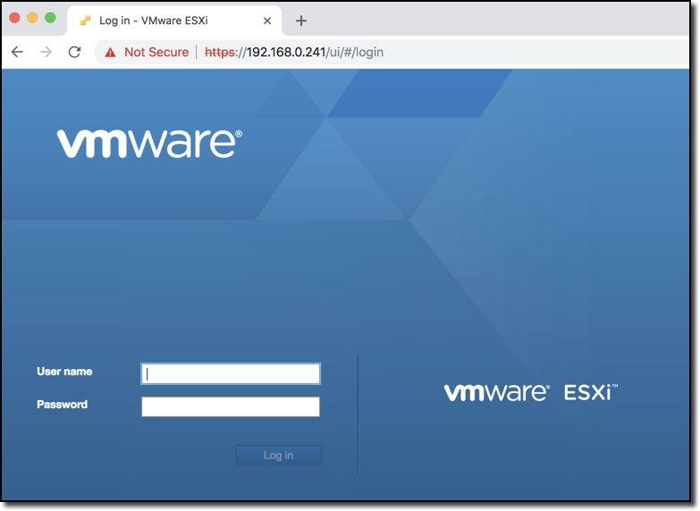

What we have now, by default, is that each host has a vSwitch, vSwitch0…

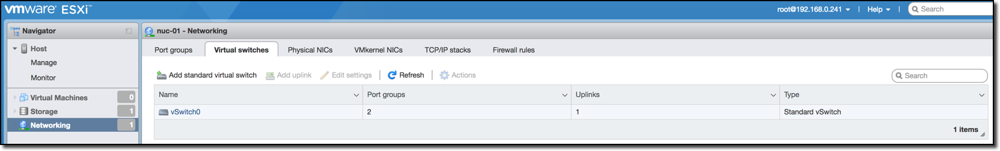

Which has two port groups, “Management Network” and “VM Network”, take note of the VLAN ID’s…

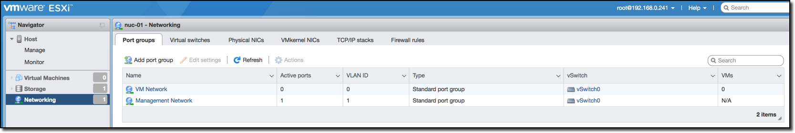

And a management VMkernel adapter, vmk0…

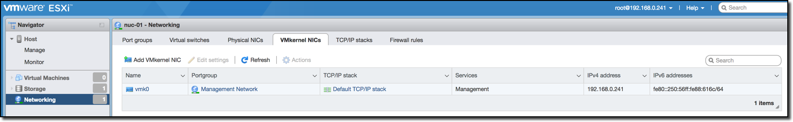

## Promiscuous Mode and Forged Transmits

So whats next? As these ESXi hosts will be running nested ESXi hosts we need to enable promiscuous mode and forged transmits on the switches so the nested ESXi hosts can provide connectivity. Or do we need to enable promiscuous mode? That depends as vSphere 6.7 now has native MAC learning, but only on distributed switches, read more [here](https://www.virtuallyghetto.com/2018/04/native-mac-learning-in-vsphere-6-7-removes-the-need-for-promiscuous-mode-for-nested-esxi.html). Prior to this the [Learnswitch](https://labs.vmware.com/flings/learnswitch) VMkernel module (VMware Fling) could be used but again only for distributed switches, read more [here](https://www.virtuallyghetto.com/2017/04/esxi-learnswitch-enhancement-to-the-esxi-mac-learn-dvfilter.html). Prior to Learnswitch there was [dvFilter](https://labs.vmware.com/flings/esxi-mac-learning-dvfilter) (VMware Fling) that could be used on both standard and distributed switches, read more [here](https://www.virtuallyghetto.com/2014/08/new-vmware-fling-to-improve-networkcpu-performance-when-using-promiscuous-mode-for-nested-esxi.html). OK, history lesson over, why don’t we just use a distributed switch and get the performance gains of native MAC learning in vSphere 6.7? Here we come to another fork in the road, standard or distributed switch;

-   For distributed switches we need a vCenter, vCenter consumes our precious and limited memory, currently 10GB for a “tiny environement” VCSA 6.7.
-   The Skull Canyon NUCs only have a single physical NIC, alas a single uplink, we can only use a standard switch or a distributed switch, not both unless you add an USB to Ethernet adapter but that requires a driver which brings its own issues currently with ESXi 6.7. See more [here](https://www.virtuallyghetto.com/2016/11/usb-3-0-ethernet-adapter-nic-driver-for-esxi-6-5.html).
-   Having the management network vmkernel on a distributed switch can make troubleshooting and recovery after implementing an incorrect network change some what difficult, but certainly not impossible.

I chose to go with a standard switch but also deploy a vCenter. Resource impact aside, vCenter brings other advantages such as we can easily migrate VMs between hosts and its also easier to manage various nested environments. To limit the resource impact, I reduced the memory for VCSA 6.7 down to 5GB without issues so far, and even may try 4GB soon. As going with a standard switch, promiscuous mode and forged transmits (default for Forged transmits is now enabled) were enabled on the standard switch, vSwitch0, as seen below. These can also be set at port group level.

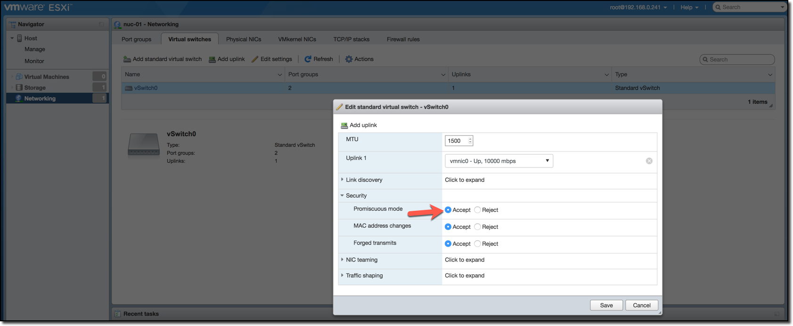

## More Network Configuration

Other network changes we need to implement are…

Enable vMotion service on vmkernel vmk0

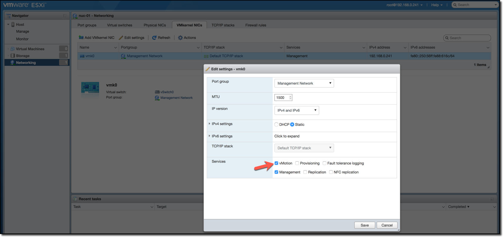

Increase MTU to “1600” for the standard switch, vSwitch0. This is required for the NSX-T geneve overlay. More on that later.

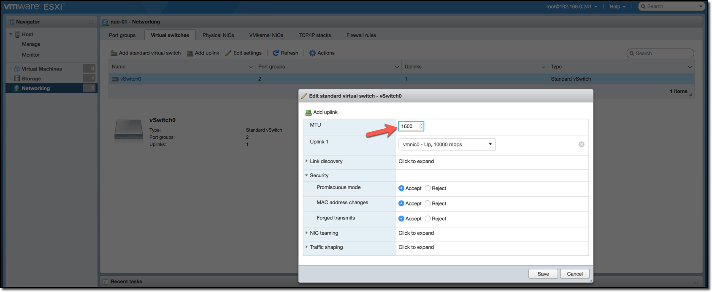

Change “VM Network” portgroup VLAN ID to “1”.

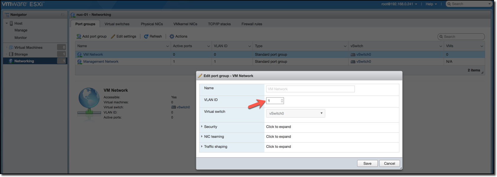

Create a new port group called “nested-trunk” with a VLAN ID of “4095”. VLAN 4095 indicates that it is a VLAN trunk. Our nested ESXi hosts nics will connect to this port group. Will explain this further later.

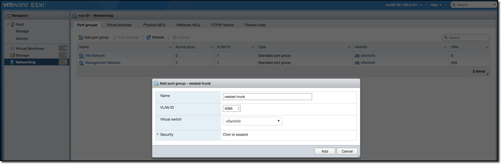

Create a new port group called “nested-management” with a VLAN ID of “10”. This port group will be used by jumps to have access into the nested environments.

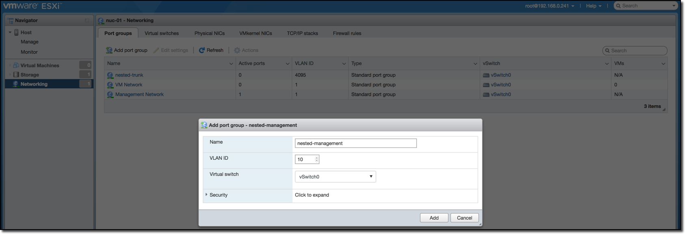

Port groups view for vSwitch0 should now look like the following…

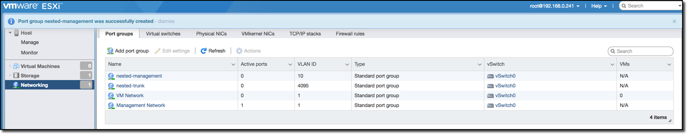

Repeat same for each NUC ESXi host.

## Configuring Storage

As always there are options…

First option is vSAN. While vSAN can run with 3 nodes (or 2 with a witness), 4 is highly recommended. At present I only have 3 NUCs. Plus, there is a substantial memory overhead of running vSAN. Read more [here](https://kb.vmware.com/s/article/2113954) on the memory overhead. On top of that, my NUC’s only have a single 1GbE nic each so running vSAN would not only have a memory impact but also on available network bandwidth. Alas I didn’t opt for vSAN for my physical environment.

Second option is to use external storage such as a NAS serving NFS. While I do have an external NAS, my NUC’s only have a single 1GbE and didn’t want to have the overhead of NFS on the network for the physical hosts.

Third option is to use local storage and create a vmfs datastore on it. I have 500GB M.2 SSDs in each of my NUCs on which created vmfs datastores. The limitation to this is that it is not shared storage and alas can’t do DRS. I don’t see this as a huge negative as I have very few VM’s on the physical ESXi hosts and have no issue balancing them manually as vMotion and storage vMotions are still possible.

## (Re)-Enabling TPS

Transparent page sharing, TPS, in short is a memory management enhancement / reclaiming technique that was disabled in 2014 due to security concerns raised in a paper. Read more [here](https://kb.vmware.com/s/article/2080735). For home lab environments due to the typical lack of memory, majority of homelabers (is that a word?!) re-enable TPS on each host by setting Mem.AllocGuestLargePage=0 and Mem.ShareForceSalting = 0 in Advanced System Settings. When our nested ESXi hosts are up we will do same there.
