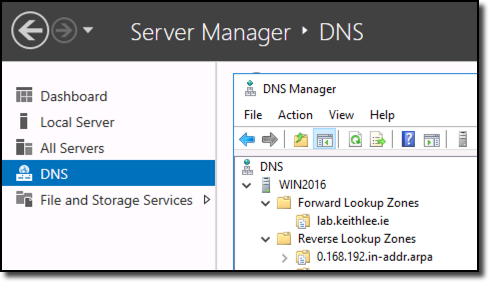
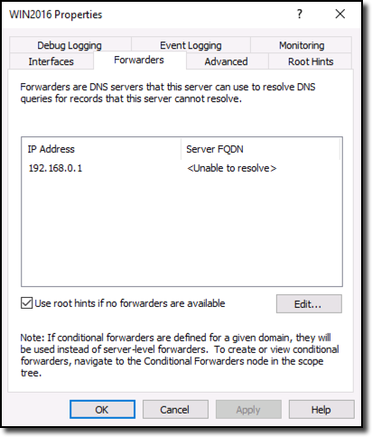
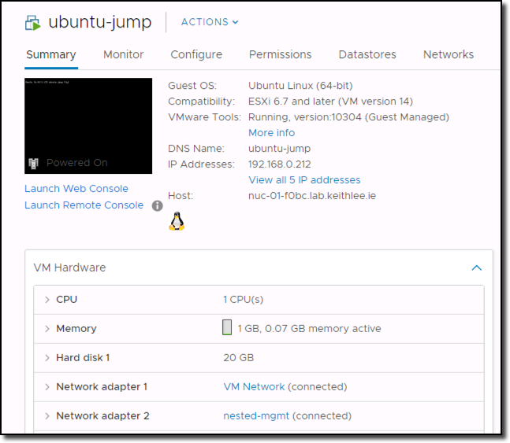
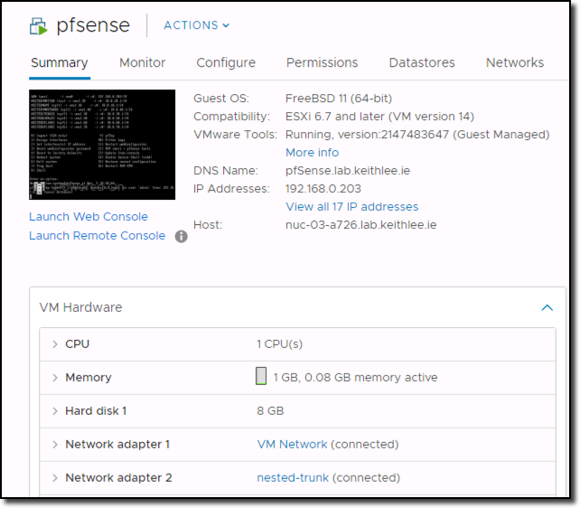

# PKS NSX-T Home Lab – Part 3 Core VMs

## Intro

In the [previous post](./pks-lab-part-2-nuc-setup.md) in this series we installed ESXi 6.7 on the NUC’s, performed some networking and storage configuration. In this post we are going to deploy some VMs, or core VMs as I call them, on the NUCs such as VCSA, a domain controller, jumps, and a virtual router appliance. Again, like I have said previously, this is one way to do it, there are many permutations. Goal here is to get up and running asap. Nothing stopping you implementing a different way now or later.

Complete list of blog post in this series…

## Domain Controller

For a home lab you need DNS because not only as humans we are not great at remembering strings of numbers, we need DNS for VCSA and other services later on. There are many was of implementing DNS that are not resource heavy such as a light Linux VM with BIND. I personally have gone with a Windows 2016 server just so I can keep my Windows skills up to date around AD and DNS etc as I use MACs daily. I’ve sized my Windows 2016 VM with 1 vCPU and 1GB memory. Create the VM on any esxi host of choosing with a nic on the “VM Network” portgroup. Add the Windows ISO, boot the VM, and install the OS.

Once the OS is up, console into it and configure the network adapter with an IP from your ISP’s router network that is outside the DHCP range. Next, using Server Manager, enable remote desktop. With Remote Desktop enabled, RDP in to continue the rest of the configuration rather than doing it over the console.

Using Server Manager again, add the DNS server role. With the DNS server role installed, use DNS Manager to create a new forward lookup zone eg “myhomelab.local” or what ever name of your choosing. You will need to also create a reverse lookup zone as vCenter requires this.

Next we are going to create a forwarder. Forwarders are DNS servers that the DNS server you have just installed can use to resolve DNS queries for records that this server cannot resolve. Using DNS Manager, right click your DNS server and select properties then forwarders. Add the DNS/Gateway of your ISP router, typically a .1

With your DNS server now up and running, create an A record for vCenter eg “vcsa.myhomelab.local”. There are many more A records to be created, but we can add them later. Likewise, AD role can be added at a later date when required.

## vCenter

As discussed in the previous post, I’m deploying vCenter for easy of management purposes, not to use distributed switches. Download the VCSA ISO and extract or mount it on your laptop. Use either the CLI or UI tool in the ISO to deploy VCSA. For step by step instructions see [here](https://docs.vmware.com/en/VMware-vSphere/6.7/com.vmware.vcenter.install.doc/GUID-F06BA415-66D8-42CD-9151-701BBBCE8D65.html). When prompted, deploy a VCSA for a “tiny environment”. This will size the VCSA to have 2 vCPUs and 10GB memory. As mentioned previously we are tight for memory so this can be manually modified if so wished to a lower figure. Currently I have mine at 5GB without issues.

After VCSA is deployed, log into vCenter with credentials created during the install process. Add necessary vSphere and vCenter licenses or continue with the 60 trial licenses. And then add the NUC ESXi hosts to vCenter.

## Jump Hosts

Number and type of jump hosts is completely a personal preference. You may have one Windows and one Linux. If you chose Windows for DNS you may even dual purpose that as a jump, again to save resources. Typically for jumps I have two nics on them, one leg on “external” network, in our case the ISP router network 192.168.0.x which port group “VM Network” with VLAN ID 1 is connected to, and another leg in the nested environment, such as the “nested-mgmt” portgroup we created earlier with VLAN ID 10. Give this nic an IP from 10.0.10.0/24 network. We will actually create this network later when configuring the router.

## Router

As previously discussed, we are quite limited on what we can do with a typical ISP provided router, essentially we have only a single flat network. To build, more so mimic, real world like environments, we need a means of creating networks and to be able to route between them. Therefore we want a router where we have full control in creating new networks, VLAN interfaces, firewalls, NAT, routing, DHCP etc etc. A physical router is an option, but there are plenty of free virtual router appliances available such as [pfSense](https://www.pfsense.org/), [OPNsense](https://opnsense.org/), [Sophos](https://www.sophos.com/) and [Vyos](https://vyos.io/) to name just a few. I went with pfSense as it’s quite commonly used in home labs and there is a lot of content out there on it if ever stuck in configuring a feature etc. It’s also quite light only requiring 1 vCPU and 1GB of memory. Many argue that OPNsense is better; I don’t have an opinion as haven’t tried OPNsense yet!

So what does a real world vSphere environment look like; typically there are many networks such as Management, vMotion, Storage/vSAN, VM Network, each with their own VLAN. On top of that for NSX-T, we need a few more such as uplink/routing and overlay/tunnel networks. We are going to use the pfSense virutal router appliance to create these networks to mimc a real world environment in our nested environment.

pfSense ISO can be downloaded from [here](https://www.pfsense.org/download/) and instructions to install pfSense can be found [here](https://www.netgate.com/docs/pfsense/virtualization/virtualizing-pfsense-with-vmware-vsphere-esxi.html). Note, some of the screen shots in the install instructions may be slightly different but you get the jist. pfSense requires two networks/interfaces which its refers to WAN and LAN. WAN is our external network, eg our ISP router network 192.168.0.x, which is the “VM Network” portgroup with VLAN ID 1 is connected to and LAN will be the “nested-trunk” port group with VLAN ID 4095 our nested esxi hosts will be connected to. Configuration of pfSense will be covered in the next post.

That completes today’s installment in the series. Next we will configure the pfSense router.
