# PKS NSX-T Lab – Part 4 Configuring pfSense Router

## Intro

In the [previous post](./pks-lab-part-3-core-vms.md) in this series we deployed vCenter, DNS, jump hosts and the pfSense virtual router appliance. In this post we are going to configure the pfSense virtual router. Again, like I have said previously, this is one way to do it, there are many permutations. Goal here is to get up and running asap. Nothing stopping you implementing a different way now or later.

Complete list of blog post in this series…

## Configure Interfaces

In the previous lesson we installed pfSense from an ISO. Next we must console in so we can configure the interfaces. On opening a console, there may be a prompt to set up VLANs now, choose no. Next there will be a prompt to enter names for the interfaces, enter vmx0 for the WAN interface and vmx1 for the LAN interface. After a few moments you will be presented with a menu

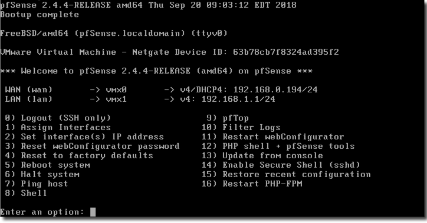

As can be seen above, pfSense has used DHCP on the WAN interface and got allocated an IP from my ISP provided router. We will change this to a static IP of our choosing by using menu option 2 and answering the prompts. Now we have a static IP configured on the WAN interface. We will configure the LAN interface later.

## Access pfSense Web Interface

Opening a browser to the WAN interface IP will fail as by default only access is granted via the LAN interface; firewall rules block access via the WAN interface. To overcome this, enter menu option 8 for shell access and run “pfctl -d” to temporarily disable the firewall. Now you should be able to access it via a browser. Default credentials are admin / pfsense.

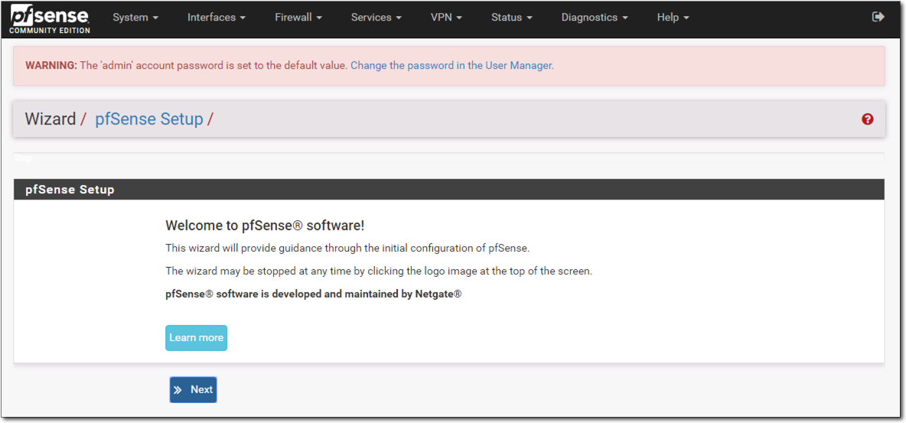

Hit **Next** and step through the wizard to configure such parameters as hostname, domain, DNS, NTP, timezone. Note, on step 4 in the wizard, at the very bottom of the page, uncheck “Block private networks from entering via WAN”.

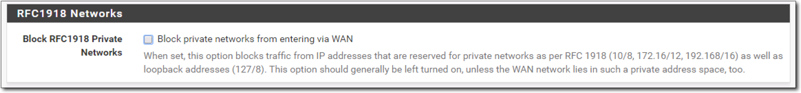

When the wizard is finished it will reload the config and we loose access as its has enabled the firewall again! As before, using the shell in the console, run “pfctl -d” to regain access to the web interface. So we don’t loose access again we need to add a firewall rule. Navigate to **Firewall** -> **Rules** -> **WAN**. Add a rule with the following…

<table id="tablepress-2"><tbody><tr><td><strong>Action:</strong></td><td>Pass</td></tr><tr><td><strong>Interface:</strong></td><td>WAN</td></tr><tr><td><strong>Address Family:</strong></td><td>IPV4</td></tr><tr><td><strong>Protocol:</strong></td><td>TCP</td></tr><tr><td><strong>Source:</strong></td><td>WAN net</td></tr><tr><td><strong>Destination:</strong></td><td>Any</td></tr></tbody></table>

Save and apply the rule. You now have access to the web interface over the WAN interface from the WAN network which in our case is the 192.168.0.0/24 network.

## Install Open VM Tools

Navigate to **System** -> **Package Manager** -> **Available Packages**. Scroll down to, or search for, Open-VM-Tools and install them.

## Configure VLAN Interfaces

In the [previous post](./pks-lab-part-3-core-vms.md) we discussed how for our nested environment we wanted to mimic a production like environment with such networks as Management, vMotion, Storage, VM Network, Overlay, Uplinks etc. Using a router, such as the pfSense virtual router appliance, we can easy create all these networks and give them VLANs. In the proceeding steps we will create the following VLAN interfaces on the vmx1 (LAN) interface which is connected to our nested-trunk port group on the physical ESXi hosts…

Navigate to **Interfaces** -> **VLANs** and click Add. Select **vmx1** in the drop down for **parent interface**, and using the table above, enter **10** for **VLAN Tag** and **Management** for **Description** as seen below. Click **Save**.

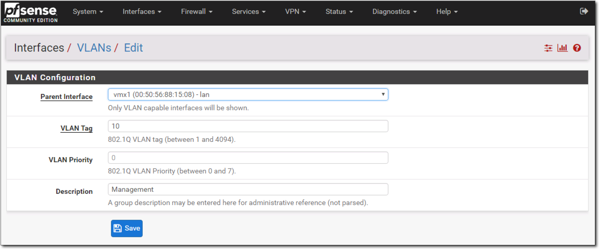

Repeat for remainder of networks in the above table. When done, you should have something looking like this…

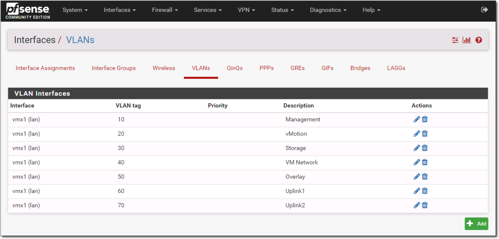

Navigate to **Interfaces -> Interface Assignments.** In the **Available network ports** drop down, select the Management VLAN we just created and click **Add**.

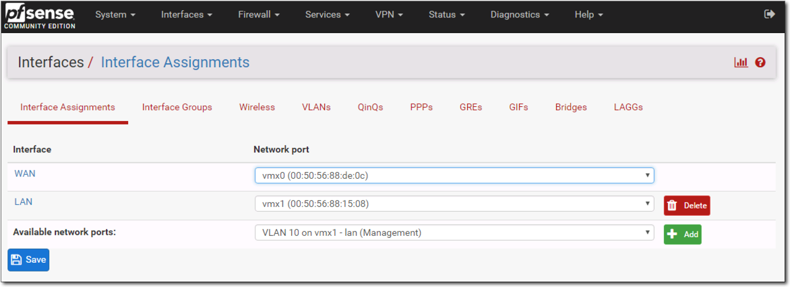

The Management VLAN is now added as an interface called **OPT1**.

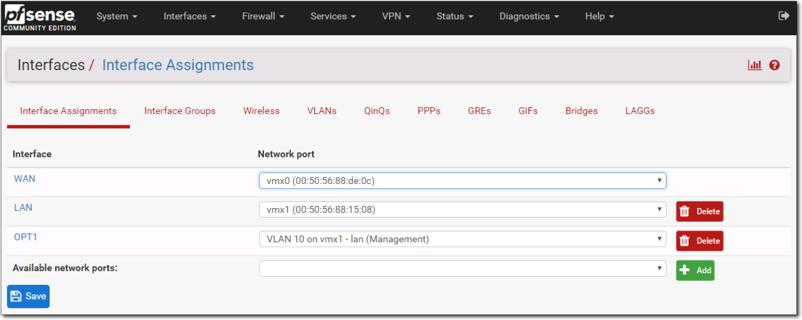

Click **OPT1** to configure the interface. Check **Enable Interface**, change the description to **Management**, change **IPv4 Configuration Type** to **Static IPv4, IPv4 Address** to **10.0.10.1** and **mask** to **/24.** Leave all other fields at default. Click **Save** and then **Apply Changes**

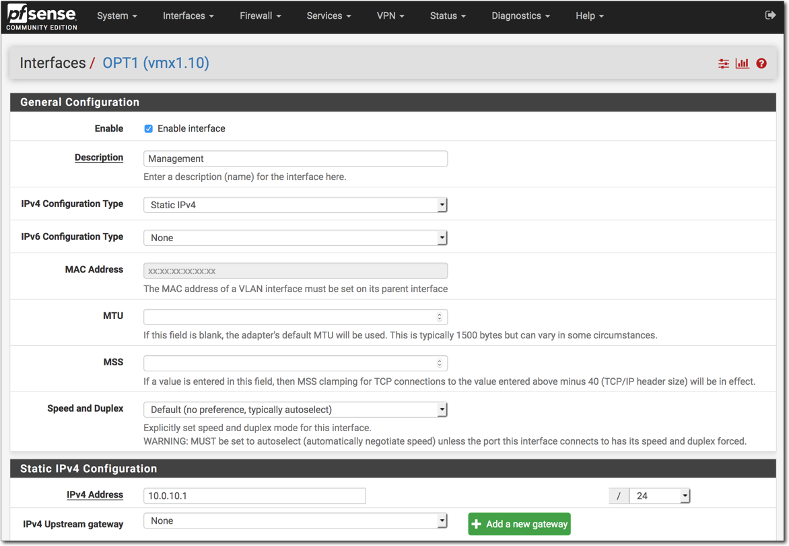

Repeat for remainder of networks in the above table. When done, you should have something looking like this…

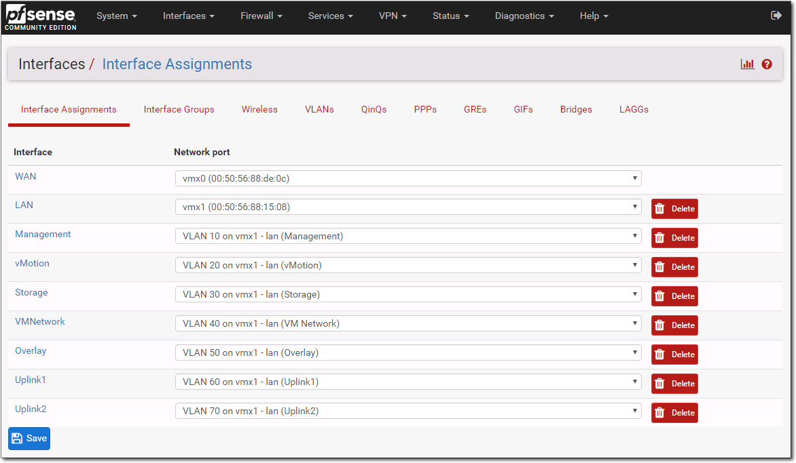

Next we need to create firewall rules for each so to allow traffic as by default all traffic is blocked. Navigate to **Firewall** -> **Rules** -> **Management** and click **Add**. Change **Protocol** to **Any** and then click **Save** followed by **Apply Changes.**This will result with a rule added like below. Repeat same for each network.

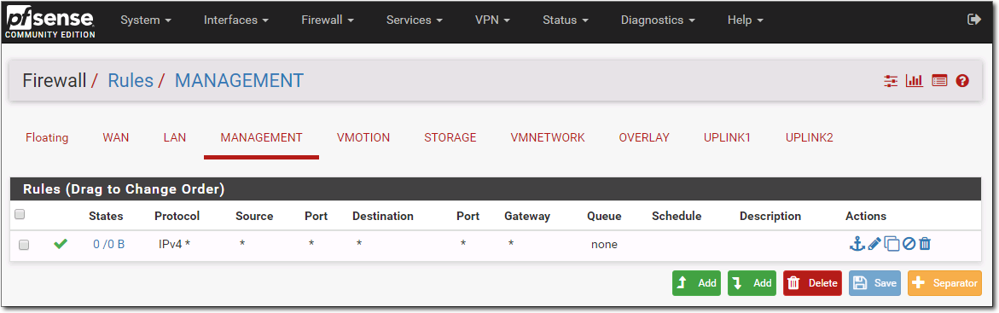

## Configure Physical Switch

We now have several new VLAN Networks (10, 20, 30, 40, 50, 60 and 70) that we will be using between our physical ESXi hosts. So that VMs can communicate between the physical hosts we need to set the ports the physical ESXi hosts, which are our NUCs, are connected to to trunk and allow the above VLANs on it. Every switch has its own way for doing this. For my Netgear GS116Ev2, I had to enable advanced 802.1Q mode, and set the NUC connected ports (13,14,15) to TRUNK for each VLAN ID as seen below…

All VLANs added…

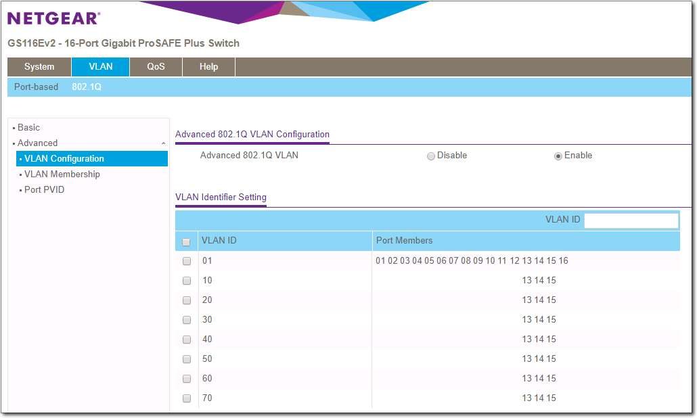

That completes today’s post. I appreciate this may be hard to piece all together without a diagram. I will draw up something in the coming days and add it to this or even a previous post. Next post we will deploy the nested ESXi hosts.

