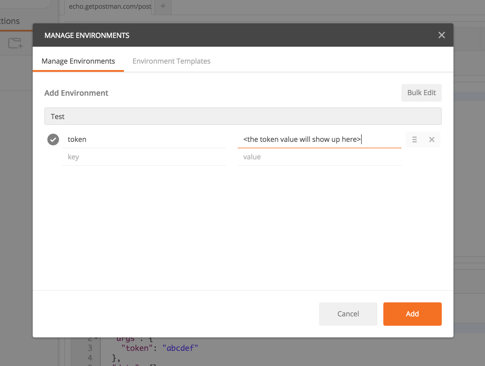
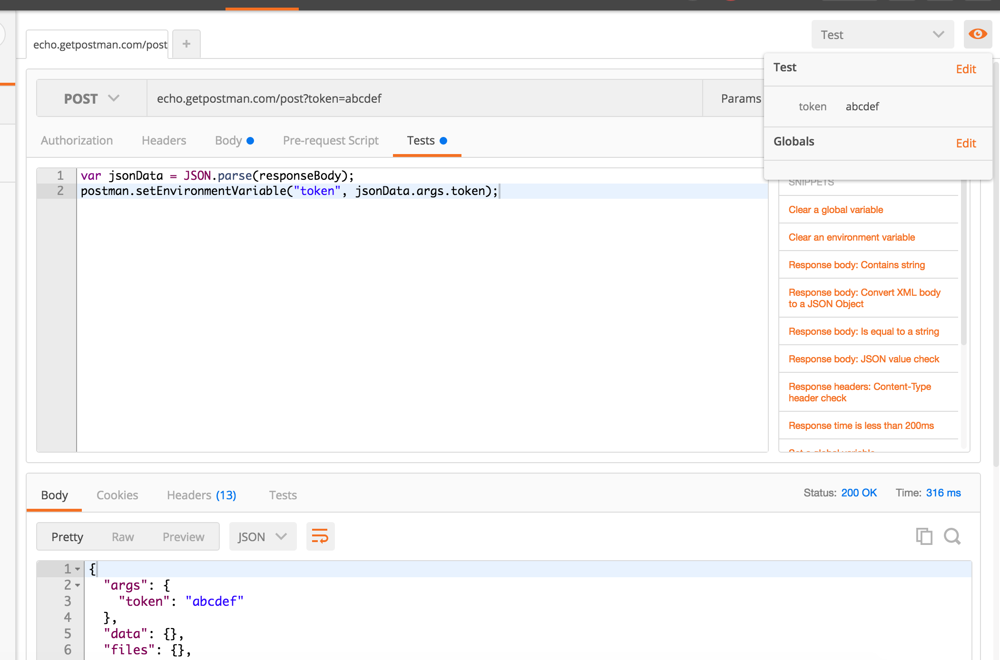
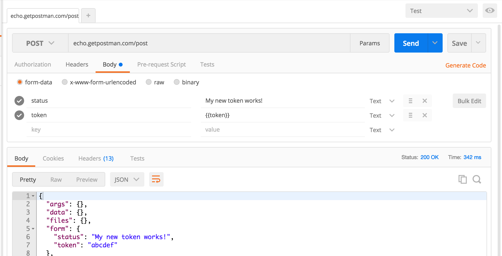

# Extracting Data from Responses and Chaining Requests
___

[Postman](https://www.postman.com/) lets you [write scripts](https://learning.postman.com/docs/writing-scripts/intro-to-scripts/) that run before/after you receive a [response](https://learning.postman.com/docs/sending-requests/responses/) from the server. You can do practically anything in these scripts. The pre-request and test scripts run inside a sandbox and Postman enable the Postman object to interact with the main Postman context.

This opens up a number of new possibilities. One of them is extracting values from the response and saving it inside an [environment](https://learning.postman.com/docs/sending-requests/managing-environments/) or a global variable. Environment and global [variables](https://blog.postman.com/using-variables-inside-postman-and-collection-runner/) let you keep track of everything that affects the [APIs](https://blog.postman.com/intro-to-apis-what-is-an-api/) state. Some examples of common variables you would use with an API are session tokens and user IDs.

The flow while [working with variables](https://blog.postman.com/10-tips-for-working-with-postman-variables/) currently goes like this:

1.  Send a request from Postman
2.  Receive the response and select and copy a value from the response body or the header
3.  Go to the environment manager
4.  Set the variable value
5.  Hit submit

This works, but is a lot of work if you have more than a few variables. [Test scripts](https://blog.postman.com/writing-tests-in-postman/) dramatically simplify this flow. All you have to do is call **postman.setEnvironmentVariable(key, value)** or **postman.setGlobalVariable(key, value)** to set a variable with values you have extracted from the response. You can even add something dynamically generated through Javascript.

Lets go through an example which will illustrate this in more detail:

**1\. Create and select an environment**

For this example, we’ll create and set a blank test environment.

[](./img/Screen-Shot-2016-06-25-at-05.10.53.png)

**2\. GET request to get response body**

This request returns a JSON body with a session token. For this dummy API, the token is needed for a successful POST request on the ‘/status’ endpoint. To extract the token, we need the following code.

```
var jsonData = JSON.parse(responseBody);
postman.setEnvironmentVariable("token", jsonData.token);
```

Add this to the test editor and hit send. Hover over the quick look window (q) to check that the variable “token” has the value extracted from the response

[](./img/Screen-Shot-2016-06-25-at-05.11.20.png)

**3\. POST request with the previous session token**

To send the token, we need to set it as part of the POST request. Let’s add a form-data variable to the ‘/status’ request.

[](./img/Screen-Shot-2016-06-25-at-05.12.01.png)

On hitting send, Postman sends the token along with the request.

Test scripts let you extract variables and chain together requests in any way you like. As request variables work everywhere, you can build a sequence of API calls which exactly mirror your use case.

You can download the [sample collection](https://www.postman.com/collections/f85c7dedaabe1492648f) and import it inside Postman. Check out the [docs](https://learning.postman.com/docs/) for more Postman features. There are more tutorials planned in this series. Keep a tab on this blog as well as the [Twitter](https://twitter.com/getpostman) account for more tips and tricks.

___

## Reference

* https://blog.postman.com/extracting-data-from-responses-and-chaining-requests/
