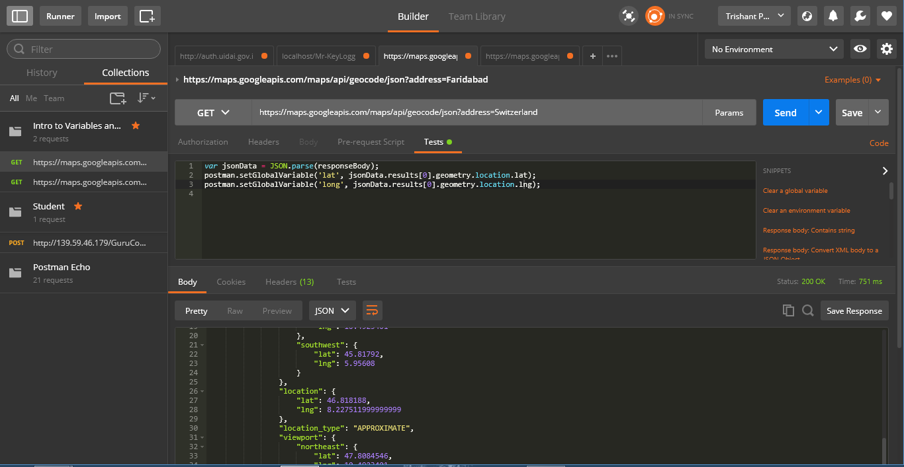
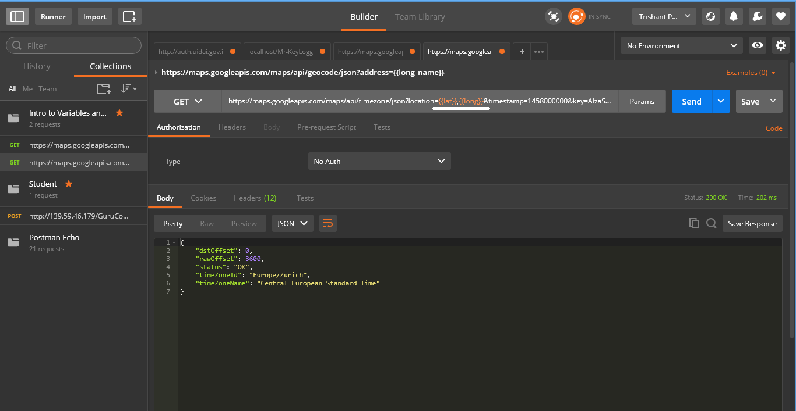

# Use authentication token in follow-up requests in Postman

My app API requires authentication via an authentication token. In short, we send a request to a `/authentication` endpoint and it responds with a JSON object containing a token, like:

```
 {"token": "xxxxxxxxxxxxxxxxxxxxxx"}
```

Every other API endpoint in our application requires an `authentication` header containing this token. Now, in Postman it's possible to do the authentication request, copy the token, open the next endpoint and paste the `authentication` header in manually. But this becomes tedious and time-consuming when testing lots of endpoints.

Use the following method to have Postman save and automatically add the `authentication` token from the initial login request to the follow-up requests.

## Method

Postman allows you a wide variety of options when crafting API requests.

In your case, You can create a global variable for your token when you receive it by:

```
var jsonData = JSON.parse(responseBody);
postman.setGlobalVariable('token', jsonData.token);
```

This would go in your [`Tests`](https://www.getpostman.com/docs/postman/scripts/test_scripts) tab, in order to execute this script after your request has been completed.

Now, a global variable `token` is set and can be accessed using `{{token}}` syntax in the following API requests you make.

I'll demonstrate it to you regarding the same, with a similar example:

 1. Save the data of latitude and longitude into the global variables `lat` and `long`.  2. Reuse the data by referring to the name of the variable, i.e. `lat` and `long` by enclosing them within curly braces like `{{lat}}` and `{{long}}`.

> 1.  You can also manage these global variables, by clicking on the gear icon in the top right corner, and selecting manage environments then opening the Globals tab.
> 2.  Tip: You can also, save the request to obtain the token into your collections, so that each time, you don't have to craft the URL to obtain the token.

## Reference

* https://stackoverflow.com/questions/45362308/use-authentication-token-in-follow-up-requests-in-postman
