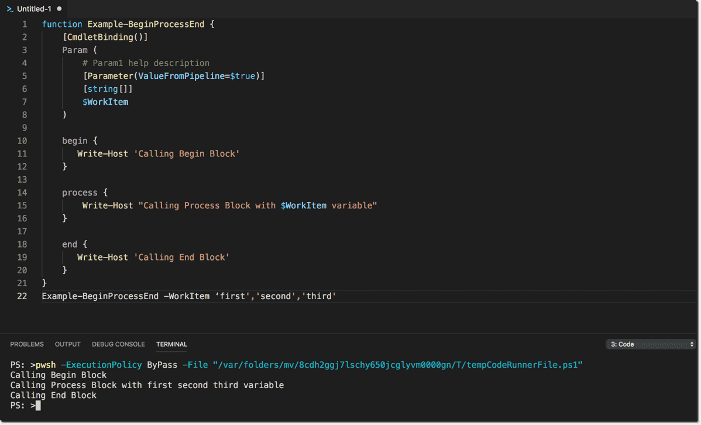

# Understanding PowerShell Begin, Process, and End blocks

Windows [PowerShell advanced functions](https://4sysops.com/archives/powershell-advanced-functions-the-cmdletbinding-and-parameter-attribute/) have built-in control flow that helps both experienced and novice PowerShell developers maintain their code workflows.  If you have worked with PowerShell Advanced Functions then you probably have worked with Begin, Process and End blocks in your code.

Each Begin, Process, and End block has a specific purpose that helps guide and control your code workflows.  In this blog post, we will dive into each of these controls and show common uses cases for each.

As both [Don Jones](https://donjones.com/) and [Jeffrey Hicks](https://jdhitsolutions.com/blog/) have [said](https://blogs.technet.microsoft.com/heyscriptingguy/2013/04/07/do-one-thing-and-do-it-well/) in their [Learn PowerShell Toolmaking in a Month of Lunches](https://www.manning.com/books/learn-powershell-toolmaking-in-a-month-of-lunches) book; PowerShell functions should do one thing, and do it well.  PowerShell’s Begin, Process, and End blocks emphasize this statement of doing one thing and doing it well.

I would like to start with a simple analogy that may help understand the reason’s and uses case’s of the Begin, Process, and End blocks.  _I BEGIN my day by getting ready for work.  Once I have begun work, then I start to PROCESS my tasks for the day.  I END my day by clearing my desk and heading home._

It’s a bit cheesy, but I think it gets my point across. Let’s use this fake PowerShell function as an example.  Please note, that this function does NOT work in any way and it’s just as an example.

```powershell
function New-WorkDay {
    [CmdletBinding(DefaultParameterSetName='Parameter Set 1',
                   PositionalBinding=$false,
                   ConfirmImpact='Medium')]
    Param (
        # Param1 help description
        [Parameter(Mandatory=$true,
                   Position=0,
                   ValueFromPipelineByPropertyName=$true,
                   ParameterSetName='Parameter Set 1')]
        [ValidateNotNullOrEmpty()]
        [string[]]
        $WorkItem
    )
    
    begin {
        Start-Alarm -ErrorAction SilentlyContinue | Exit-Sleep -Force
        Enter-Bathroom
        Open-ShowerDoor | Invoke-Shower | Select-Soap
        Start-BrushingTeeth | Wait-Time -Minutes 2 | Stop-BrushingTeeth
        Set-Clothes
        Build-Coffee
        Invoke-Driving -From Home -To Work -ErrorAction Stop
        Start-WorkDay -Hours 8
    }
    
    process {
        foreach($item in $WorkItem){
            switch ($item) {
                meeting { Start-Meeting $item }
                ticket  { Start-Ticket $item  }
                support { Start-Support $item }
            }
        }
    }
    
    end {
        Stop-WorkDay
        Invoke-Driving -From Work -To Home
    }
}
```

## BEGIN

In a PowerShell function, you may want to setup your function by specifying variables and arrays to be used throughout your function.  The BEGIN block in a PowerShell function is the appropriate place to set these types of items.

The BEGIN block is _optional_ and is **NOT** needed if you are just wanting to use either the PROCESS or END blocks

Everything in the BEGIN block will only run once per call of your function.  Just like a typical work day you will only prepare to go to work once.  This may include taking a shower, brushing your teeth, and driving to work.  In code, this is where you are setting up all requirements or dependencies before actually doing the work.  You can also consider this as “pre-processing” or “setup” for your PowerShell function.

In the provided example, this is seen in our BEGIN block:

```powershell
begin {
        Start-Alarm -ErrorAction SilentlyContinue | Exit-Sleep -Force
        Enter-Bathroom
        Open-ShowerDoor | Invoke-Shower | Select-Soap
        Start-BrushingTeeth | Wait-Time -Minutes 2 | Stop-BrushingTeeth
        Set-Clothes
        Build-Coffee
        Invoke-Driving -From Home -To Work -ErrorAction Stop
        Start-WorkDay -Hours 8
    }
```

## PROCESS

The process block is where the work is done in a PowerShell advanced function.  There are two different approaches we need to keep in mind and account for.  The first is how you handle parameters and the second is pipeline input into your function.

The PROCESS block **can be used** without the BEGIN or END blocks

Some questions you should ask yourself:

Does my function take a single value for a parameter or an array of values?

Does my function accept pipeline input (it should)?

If your function takes a single value for a parameter (not an array of values) then the PROCESS block will only process that single value.  If you also accept pipeline input on your single parameter then the PROCESS block will process each of the values in our PROCESS block.  Let’s take a look at an example:

```powershell
function Example-BeginProcessEnd {
    [CmdletBinding()]
    Param (
        # Param1 help description
        [Parameter(ValueFromPipeline=$true)]
        [string]
        $WorkItem
    )
    begin {
       Write-Host 'Calling Begin Block'
    }
    
    process {
        Write-Host "Calling Process Block with $WorkItem variable"
    }
    
    end {
       Write-Host 'Calling End Block'
    }
}
```

If we call our _Example-BeginProcessEnd_ function with a single value for _WorkItem_ using the parameter value then you will see that it only processes the one passed in _WorkItem_ value.

```powershell
PS C:\> Example-BeginProcessEnd -WorkItem 'First'
Calling Begin Block
Calling Process Block with First variable
Calling End Block

```

If we were to pass in an array of values into the pipeline of this function then we will see a different result.  We will see that the PROCESS block is running multiple times based on the array list we passed into our function:

```powershell
PS C:\> 'first','second','third' | Example-BeginProcessEnd
Calling Begin Block
Calling Process Block with first variable
Calling Process Block with second variable
Calling Process Block with third variable
Calling End Block
```

If we want our function to accept an array of values not only via pipeline but also through a parameter then we will need to modify our function to support this logic.  We first need to modify our parameter to accept an array of values by adding [] to our parameter:

```powershell
Param (
        # Param1 help description
        [Parameter(ValueFromPipeline=$true)]
        [string[]]
        $WorkItem
    )
```



We also need to add a foreach statement in our PROCESS block then we can account for both situations.

```powershell
process {
        foreach ($item in $WorkItem){
            Write-Host "Calling Process Block with $WorkItem variable"
        }
    }

```

By adding this to our PROCESS block then we pass an array of values via both our parameter and pipeline.

```powershell
PS C:\> Example-BeginProcessEnd -WorkItem ‘first','second','third'
Calling Begin Block
Calling Process Block with first second third variable
Calling Process Block with first second third variable
Calling Process Block with first second third variable
Calling End Block
```

We can also pass in multiple values via the pipeline, like we were able to do previously:

```powershell
PS C:\> 'first','second','third' | Example-BeginProcessEnd
Calling Begin Block
Calling Process Block with first variable
Calling Process Block with second variable
Calling Process Block with third variable
Calling End Block
```

We should always aim to provide enough flexibility for users to use our function in a way that supports them but not enough to cause them issues when using our function.

The PROCESS block is powerful and adds clear logic separation when writing PowerShell functions.  Continuing with my analogy, the PROCESS block is the actual work we do when we go to work.  If you work in IT, this can be seen as requests for support or projects (or daily routines) that we process or work on.  We get to work and then begin to process our day or tasks.  This can be seen in our original example:

```powershell
process {
        foreach($item in $WorkItem){
            switch ($item) {
                meeting { Start-Meeting $item }
                ticket  { Start-Ticket $item  }
                support { Start-Support $item }
            }
        }
    }
```

We receive tickets or _WorkItems_ and either call another function to do some action or process them as they come in.  Whether it is a meeting, a ticket, or a support request, we process them as they are given to us (sometimes using multiple threads - multi-tasking, am I right).

## END

Finally, we get to the END block.  The END block is where we dispose or cleanup if needed.  If we created objects, variables, files, etc in our BEGIN or PROCESS blocks then we will use the END block to either clean these objects up or return any complex data structures.

The END block is _optional_ and is **NOT** needed if you are just wanting to use either the PROCESS or BEGIN blocks

The main difference between the PROCESS block and the END block is that PowerShell executes code in the latter only once even if you pass an array through the pipeline. Thus, you can use the END block to finalize your function after all members of the array that you passed to your function have been processed. Likewise, the BEGIN block allows you to initialize your function with code that you want to run only once before PowerShell iterates through your input array.

The most common example I have found is that if you created a database connection in your BEGIN block, processed or updated a database in the PROCESS block then you would use the END block to disconnect/destroy our database connection.

## Another example

Another example is that you may have created an PSObject in the BEGIN block, added data to the object in the PROCESS block and then use the END block to return the final object.
