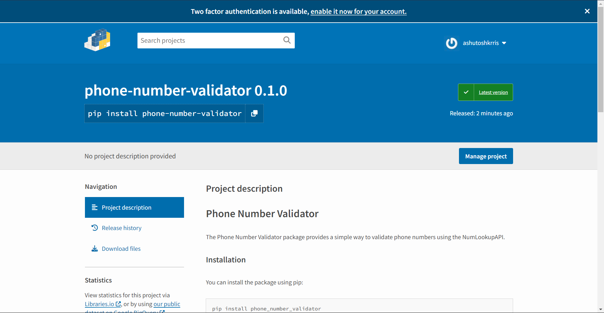

# How to Build and Publish Python Packages With Poetry

A Python package is a collection of Python modules that can be easily distributed and installed. It allows developers to reuse code across multiple projects and share it with others.

Python packages typically include a set of functions, classes, or other components that serve a specific purpose, such as data analysis, web development, or machine learning.

You might have used built-in Python packages such as `os`, `sys`, or `math`, or external dependencies such as `requests`, `pandas`, or `numpy` in your Python projects.

The tutorial will guide you through the process of creating and publishing a Python package with [Poetry](https://python-poetry.org/). You will build a phone number validation package to check if a given phone number is valid. Along the way, you will learn how to use Poetry to manage dependencies, define package configurations, and write tests for the package.

By the end of this tutorial, you should have a good understanding of how to use Poetry to create and publish your own Python packages.

## What is Poetry?

Poetry is a modern tool for package management in Python that simplifies the process of creating, managing, and publishing Python packages.

It provides an easy-to-use command-line interface for managing dependencies, building packages, and publishing them to [PyPI](https://pypi.org/) (Python Package Index), the official repository of Python packages.

There are several benefits of using Poetry for package management in Python:

-   **Dependency resolution**: It automatically manages dependencies and ensures that your package is compatible with other packages in your project.
-   **Virtual environments**: It creates a virtual environment for your project, which allows you to isolate your package and its dependencies from the rest of your system.
-   **Project scaffolding**: It provides a simple command-line interface for creating new Python projects and setting up their basic structure.
-   **Built-in building and packaging**: It provides tools for creating distributable packages in a variety of formats, including source distributions, wheel distributions, and binary distributions.
-   **Publishing to PyPI**: It makes it easy to publish your package to PyPI, allowing other developers to easily install and use your package.

Overall, Poetry provides a simple and intuitive interface for managing dependencies, building packages, and publishing them to PyPI. If you're working on a Python project that requires package management, Poetry is definitely worth checking out.

## Prerequisites

To follow this tutorial, it is recommended that you have the following:

-   Python 3.7+ installed
-   Basic understanding of [virtual environments, modules, and packages](https://docs.python.org/3/tutorial/venv.html)
-   Basic knowledge of [Requests](https://blog.ashutoshkrris.in/how-to-interact-with-web-services-using-python) and [PyTest](https://pytest.org/)

You can find the code samples used in this tutorial in [this repository](https://github.com/ashutoshkrris/phone-number-validator).

## How to Set Up the Project

Before you can start building your Python package, you need to set up your development environment. This involves installing Poetry, creating a new project, and configuring the project dependencies.

### How to Install Poetry

Poetry is a cross-platform package manager and build tool that can be installed on various operating systems, including Linux, macOS, and Windows.

It has a custom installer that creates a dedicated virtual environment for Poetry, which ensures that it operates independently from the rest of the system. This isolated environment prevents unintentional upgrades or removals of dependencies, allowing Poetry to manage its dependencies more efficiently.

To install Poetry, the first step is to open the terminal or command prompt, depending on the operating system you're using.

For Windows users, open Windows Powershell and execute the following command:

```
(Invoke-WebRequest -Uri https://install.python-poetry.org -UseBasicParsing).Content | py -
```

For Linux, macOS, and Windows Subsystem for Linux (WSL) users, open the terminal and run the following command:

```
curl -sSL https://install.python-poetry.org | python3 -
```

Note that on some systems, the `python` command may refer to Python 2 instead of Python 3. To avoid any ambiguity, it is recommended to use the `python3` binary instead.

Once the installation process is complete, you can verify if Poetry is installed correctly by executing the following command:

```
poetry --version
```

If you see output similar to `Poetry (version 1.4.1)`, your installation is complete and ready to use.

### How to Create a New Project

To create a new Poetry project, you can use the `new` command followed by the name of the project. For example, if you want to create a package for validating phone numbers, you can use the following command:

```
poetry new phone-number-validator
```

This will create a new folder called `phone-number-validator` with the following structure:

```
phone-number-validator
├── pyproject.toml
├── README.md
├── phone_number_validator
│   └── __init__.py
└── tests
     └── __init__.py
```

The `phone-number-validator` folder contains two files: `pyproject.toml` and `README.md`, as well as two packages: `phone_number_validator` to store the source code files and `tests` to store the test files.

#### Understanding the `pyproject.toml` File

The `pyproject.toml` file serves as the configuration file for a Poetry project, containing information about the project and its dependencies. The file has three tables by default – `tool.poetry`, `tool.poetry.dependencies`, and `build-system`.

```
[tool.poetry]
name = "phone-number-validator"
version = "0.1.0"
description = ""
authors = ["Ashutosh Krishna <ashutoshbritish@gmail.com>"]
readme = "README.md"
packages = [{include = "phone_number_validator"}]
```

The `tool.poetry` table in the `pyproject.toml` file has multiple key/value pairs, with `name`, `version`, `description`, and `authors` being required while others are optional.

Poetry assumes that a package with the same name as the `tool.poetry.name` specified in the `pyproject.toml` file is located at the root of the project. But if the package location is different, the packages and their locations can be specified in the `tool.poetry.packages` key.

```
[tool.poetry.dependencies]
python = "^3.11"
```

In the `tool.poetry.dependencies` table, it is mandatory to declare the Python version for which the package is compatible.

```
[build-system]
requires = ["poetry-core"]
build-backend = "poetry.core.masonry.api"
```

The last table, `build-system`, has two keys – `requires` and `build-backend`. The `requires` key is a list of dependencies required to build the package, while the `build-backend` key is the Python object used to perform the build process.

TOML is Poetry's preferred configuration format, and starting from version 3.11, Python provides the `tomllib` module for parsing TOML files.

As of now, the `pyproject.toml` file looks like [this](https://github.com/ashutoshkrris/phone-number-validator/blob/c1b69d414437f857742a2009743d8a0d8dbf90b8/pyproject.toml).

### How to Create a New Virtual Environment

Poetry simplifies the creation of virtual environments for your projects. To create a virtual environment for your `phone-number-validator` library, navigate to your project directory and run the `env use` command:

```
poetry env use /full/path/to/python
```

The `/full/path/to/python` specifies the full path to the Python executable.

For example, in MacOS:

```
poetry env use /usr/local/bin/python3.11
```

In Windows:

```
poetry env use "C:\Users\ashut\AppData\Local\Programs\Python\Python311\python.exe"
```

### How to Configure Project Dependencies

After setting up your Poetry project, the next step is to install the necessary dependencies.

Since you're going to [interact with an external web service](https://blog.ashutoshkrris.in/how-to-interact-with-web-services-using-python), the first dependency you'll need is `requests`. To install this dependency, Poetry provides an `add` command that takes care of installing the package correctly, defining version constraints, and updating the `pyproject.toml` file with the appropriate information.

```
poetry add requests
```

Once the dependency is installed, you'll see the dependency added in the `tool.poetry.dependencies` table in your `pyproject.toml` file.

```
[tool.poetry.dependencies]
python = "^3.11"
requests = "^2.28.2"
```

#### The `poetry.lock` file

The file `poetry.lock` serves as a record of all the exact versions of the dependencies used in a project during installation, removal, or updating of any dependency. It ensures that your project uses the correct versions of dependencies by listing all the packages, their exact versions, and the hashes of their source files.

Once you have installed the `requests` library, the `[poetry.lock](https://github.com/ashutoshkrris/phone-number-validator/blob/main/poetry.lock)` file will be updated to record the exact version and hash of the installed dependency. As you add more dependencies in your project, this file will track all the changes.

It's important to commit the `poetry.lock` file to your version control when sharing your project, as it ensures that others will be using the same versions of dependencies that you used to build and test your project.

To create a `requirements.txt` file from the `poetry.lock` file, you can use the following command:

```
poetry export --output requirements.txt
```

## How to Develop the Package

At this point, you've installed the requests library but your application doesn't do anything yet. In this section, you'll start building the functionality of your application.

To begin, create a new file called `validator.py` inside the `phone_number_validator` package and follow along.

In this tutorial, you'll be using [Object-Oriented Programming](https://blog.ashutoshkrris.in/object-oriented-programming-in-python) principles to build your application. To get started, create a class called `PhoneNumberValidator`:

```
class PhoneNumberValidator:
    pass
```

Next, you need to create a constructor for the class. By default, we want the user to provide their own API key. So the constructor should take an `api_key` argument. Additionally, the constructor should initialize the `api_url` attribute to _https://api.numlookupapi.com/v1/validate/_:

```
class PhoneNumberValidator:
    def __init__(self, api_key: str) -> None:
        self.api_key = api_key
        self.api_url = "https://api.numlookupapi.com/v1/validate/"
```

With this, you have a basic class structure in place. You can now start adding more functionality to the `PhoneNumberValidator` class.

Next, you need to define a method that the user can use to validate a phone number. This method will be called `validate()`.

```
def validate(self, phone_number: str, country_code: str = None) -> bool:
    if not phone_number:
        raise ValueError("Phone Number cannot be empty!")
    response = self._make_api_call(phone_number, country_code)
    if response.ok:
       return response.json()["valid"]
   else:
       response.raise_for_status()
```

The method takes two parameters: `phone_number`, which is a required string parameter, and `country_code`, which is an optional string parameter with a default value of `None`. The method returns a boolean value indicating whether or not the phone number is valid.

The method first checks if the `phone_number` parameter is not empty. If it is empty, a `ValueError` is raised. Next, the method calls a `_make_api_call()` method (defined later) with the `phone_number` and `country_code` parameters to make an API call to validate the phone number.

If the API call is successful, meaning it returns a 200 status code, the method returns the boolean value of the `valid` key in the JSON response. If the API call fails, a `HTTPError` is raised with the status code and message provided by the API response.

Since the above method uses a `_make_api_call()` to make the API call, let's define this method:

```
import requests

def _make_api_call(self, phone_number: str, country_code: str = None)
    params = {"apikey": self.api_key}
    if country_code:
        params["country_code"] = country_code
    response = requests.get(self.api_url + phone_number, params=params)
    return response
```

The `_make_api_call()` method is a private method of the `PhoneNumberValidator` class, which makes an API call to the [NumLookupAPI](https://numlookupapi.com/) to validate a phone number.

The method takes two arguments, `phone_number` (a string representing the phone number to be validated) and `country_code` (an optional string representing the ISO Alpha 2 Country Code for the phone number).

The method returns a `requests.Response` object, which contains the response returned by the API call. The `params` variable is a dictionary containing the API key and, if provided, the country code. The `requests.get()` method is used to send a GET request to the API with the phone number and parameters.

If the API call is successful, the method returns the response object, which will be further processed by the `validate()` method. If the API call fails, an exception will be raised with the error message.

Your `PhoneNumberValidator` class will look like [this](https://github.com/ashutoshkrris/phone-number-validator/blob/main/phone_number_validator/validator.py) at this point.

Note: you can learn more about the NumLookupAPI in its [official documentation](https://numlookupapi.com/docs/validate) here.

### Example Usage of `PhoneNumberValidator` Class (Optional)

You have now completed the implementation of the phone number validation functionality. To test your application, you can create a file named `main.py` in the root directory of your project. Note that this step is optional.

In `main.py`, you can use the `PhoneNumberValidator` class by importing it from the `phone_number_validator.validator` module. Then, you can create an instance of the class by passing your API key as an argument to the constructor.

To get the API Key, sign up for a free account on [NumLookupAPI](https://app.numlookupapi.com/register) and copy the key from the dashboard:


After that, you can call the `validate` method on the instance with phone numbers that you want to validate. The `validate` method returns a Boolean value indicating whether the phone number is valid or not.

Here is an example code snippet for `main.py`:

```
from phone_number_validator.validator import PhoneNumberValidator

validator = PhoneNumberValidator(api_key="your-api-key-here")
is_valid1 = validator.validate("+15551234")
is_valid2= validator.validate("+12069220880")
is_valid3= validator.validate("2069220880", country_code="US")
print(is_valid1)
print(is_valid2)
print(is_valid3)
```

Output:

```
False
True
True
```

## How to Test the Package

In this section, you will test the `phone_number_validator` package using [Pytest](https://docs.pytest.org/en/7.2.x/). Testing is an essential part of software development, as it ensures that our code works as expected and helps catch any potential bugs or issues before they are deployed to production. You will be writing test cases to check the functionality of the `PhoneNumberValidator` class and its methods.

### How to Install Test Dependencies

In Poetry, a dependency group is a way to group dependencies together. The most common use of dependency groups is to separate development and production dependencies. When installing dependencies, you can choose which dependency group to install.

To install the `pytest` and `requests-mock` packages in a group called `test`, run the following command:

```
poetry add pytest requests-mock --group test
```

In the above command, you used the `--group` option to specify the group name, `test` in this case. After you install the dependencies, your `pyproject.toml` file looks like below:

```
[tool.poetry]
name = "phone-number-validator"
version = "0.1.0"
description = ""
authors = ["Ashutosh Krishna <ashutoshbritish@gmail.com>"]
readme = "README.md"
packages = [{include = "phone_number_validator"}]

[tool.poetry.dependencies]
python = "^3.11"
requests = "^2.28.2"


[tool.poetry.group.test.dependencies]
pytest = "^7.2.2"
requests-mock = "^1.10.0"

[build-system]
requires = ["poetry-core"]
build-backend = "poetry.core.masonry.api"
```

### How to Write the Tests

To recall, you previously created a `validate` method to validate phone numbers. Now that you have installed the necessary testing environment dependencies, it's time to write the code to test the functionality of your application.

Create a `test_validator.py` file inside your `tests` package and add the following code:

```
import pytest
from phone_number_validator.validator import PhoneNumberValidator


VALID_PHONE_NUMBER="+12069220880"
INVALID_PHONE_NUMBER="+15551234"
PHONE_NUMBER_WITHOUT_COUNTRY_CODE="2069220880"


@pytest.fixture
def validator():
    return PhoneNumberValidator(api_key="test_api_key")
```

The code imports the necessary modules for writing the test cases. The `@pytest.fixture` decorator is used to define a [fixture](https://docs.pytest.org/en/6.2.x/fixture.html#) `validator()` which creates a new instance of the `PhoneNumberValidator` class with the `test_api_key` parameter. This fixture can be used in multiple tests to create a new instance of `PhoneNumberValidator`.

Next, add the following test cases after the fixture:

```
def test_valid_phone_number(validator, requests_mock):
    requests_mock.get(validator.api_url + VALID_PHONE_NUMBER, json={"valid": True})
    assert validator.validate(VALID_PHONE_NUMBER) == True


def test_invalid_phone_number(validator, requests_mock):
    requests_mock.get(validator.api_url + INVALID_PHONE_NUMBER, json={"valid": False})
    assert validator.validate(INVALID_PHONE_NUMBER) == False


def test_api_call_failure(validator, requests_mock):
    requests_mock.get(validator.api_url, status_code=500)
    with pytest.raises(Exception):
        validator.validate(INVALID_PHONE_NUMBER)


def test_phone_number_without_country_code(validator, requests_mock):
    requests_mock.get(
        validator.api_url + PHONE_NUMBER_WITHOUT_COUNTRY_CODE, json={"valid": True, "country_code": "US"}
    )
    assert validator.validate(PHONE_NUMBER_WITHOUT_COUNTRY_CODE, country_code="US") == True


def test_phone_number_with_unsupported_country_code(validator, requests_mock):
    requests_mock.get(validator.api_url, status_code=400)
    with pytest.raises(Exception):
        validator.validate(VALID_PHONE_NUMBER, country_code="ZZ")


def test_invalid_api_key(validator, requests_mock):
    requests_mock.get(validator.api_url, status_code=401)
    with pytest.raises(Exception):
        validator.validate(VALID_PHONE_NUMBER)


def test_invalid_phone_number_type(validator):
    with pytest.raises(TypeError):
        validator.validate(5551234)


def test_empty_phone_number(validator):
    with pytest.raises(ValueError):
        validator.validate("")
```

Each test function defines a scenario that tests whether the `validate()` method works correctly for a given input. The test cases cover the following scenarios:

1.  `test_valid_phone_number`: This test case checks if the `validate` method returns `True` for a valid phone number. The phone number used for this test is `+12069220880`, and the response from the API is mocked to return `{"valid": True}`.
2.  `test_invalid_phone_number`: This test case checks if the `validate` method returns `False` for an invalid phone number. The phone number used for this test is `+15551234`, and the response from the API is mocked to return `{"valid": False}`.
3.  `test_api_call_failure`: This test case checks if an exception is raised when there is a failure in making an API call. The phone number used for this test is an invalid phone number (`+15551234`), and the API call is mocked to return a status code of `500`.
4.  `test_phone_number_without_country_code`: This test case checks if the `validate` method can validate a phone number without a country code, by specifying the country code as an argument. The phone number used for this test is `2069220880`, and the response from the API is mocked to return `{"valid": True, "country_code": "US"}`.
5.  `test_phone_number_with_unsupported_country_code`: This test case checks if an exception is raised when an unsupported country code is specified. The phone number used for this test is a valid phone number (`+12069220880`), and the API call is mocked to return a status code of `400`.
6.  `test_invalid_api_key`: This test case checks if an exception is raised when an invalid API key is used. The phone number used for this test is a valid phone number (`+12069220880`), and the API call is mocked to return a status code of `401`.
7.  `test_invalid_phone_number_type`: This test case checks if an exception is raised when the phone number passed to the `validate` method is not a string.
8.  `test_empty_phone_number`: This test case checks if an exception is raised when an empty string is passed as the phone number to the `validate` method.

Your `test_validator.py` file should look like [this](https://github.com/ashutoshkrris/phone-number-validator/blob/main/tests/test_validator.py) at this point.

To run the tests, it is important to execute the `pytest` command inside the virtual environment. Poetry provides a `run` command to execute the given command inside the project’s virtual environment. So execute the following command to run the tests:

```
poetry run pytest -v
```

Output:

```
poetry run pytest -v
============================================== test session starts ===============================================
platform win32 -- Python 3.11.0, pytest-7.2.2, pluggy-1.0.0 -- C:\Users\ashut\AppData\Local\pypoetry\Cache\virtualenvs\phone-number-validator-j1Sa98gs-py3.11\Scripts\python.exe
cachedir: .pytest_cache
rootdir: D:\Blog-Codes\phone-number-validator
plugins: requests-mock-1.10.0
collected 8 items

tests/test_validator.py::test_valid_phone_number PASSED                                                     [ 12%] 
tests/test_validator.py::test_invalid_phone_number PASSED                                                   [ 25%] 
tests/test_validator.py::test_api_call_failure PASSED                                                       [ 37%] 
tests/test_validator.py::test_phone_number_without_country_code PASSED                                      [ 50%]
tests/test_validator.py::test_phone_number_with_unsupported_country_code PASSED                             [ 62%] 
tests/test_validator.py::test_invalid_api_key PASSED                                                        [ 75%] 
tests/test_validator.py::test_invalid_phone_number_type PASSED                                              [ 87%] 
tests/test_validator.py::test_empty_phone_number PASSED                                                     [100%] 

=============================================== 8 passed in 0.05s ================================================ 
```

## How to Publish the Package

At this point in your project, you have created a library that can validate phone numbers and you've written test cases to ensure its functionality.

If you want to make this library available to others, you can publish it online. Poetry provides a straightforward way to publish a package using the publish command.

But before you can publish your library, you need to package it with the build command:

```
poetry build
```

Output:

```
Building phone-number-validator (0.1.0)
  - Building sdist
  - Built phone_number_validator-0.1.0.tar.gz
  - Building wheel
  - Built phone_number_validator-0.1.0-py3-none-any.whl
```

Packaging a project before publishing is a crucial step, as it simplifies the process of distribution, installation, and usage for others.

Poetry uses the information specified in the `pyproject.toml` file such as project name, version, and dependencies to package the project in two different formats – sdist and wheel. The wheel distributions are pre-compiled packages that can be installed quickly, whereas source distributions contain the raw source code and require compilation.

To publish your library, you will need to [properly configure your PyPI credentials](https://python-poetry.org/docs/repositories/#configuring-credentials), as Poetry will publish the library to PyPI by default.

Once the library is packaged, you can use the `publish` command to publish it.

```
poetry publish
```

After executing the `poetry publish` command, your package will be published on the Python Package Index (PyPI), which makes it available for installation through Poetry.

Output:

```
Publishing phone-number-validator (0.1.0) to PyPI
 - Uploading phone_number_validator-0.1.0-py3-none-any.whl 0%
 - Uploading phone_number_validator-0.1.0-py3-none-any.whl 100%
 - Uploading phone_number_validator-0.1.0.tar.gz 0%
 - Uploading phone_number_validator-0.1.0.tar.gz 100%
```

Once the package is published, it can be searched on PyPI. For instance, you can search for the `[phone-number-validator](https://pypi.org/project/phone-number-validator/)` library on PyPI. After finding it, you can install it on your system and try using it.



## Conclusion

In this tutorial, I explained how Poetry works and how to use its features. You have learned how to create a new Poetry project, manage dependencies, and handle versioning. You have also learned how to write and run tests using Pytest, and package and publish your Python library on PyPI using Poetry.

By following this tutorial, you now have the skills needed to create, manage, and distribute your own Python packages with ease. With further exploration and practice, you can expand your knowledge of Poetry and use it to develop and share your own Python libraries for others to use.


### Additional Resources

-   [Github repository](https://github.com/ashutoshkrris/phone-number-validator) for the tutorial
-   [How to interact with web services in Python](https://blog.ashutoshkrris.in/how-to-interact-with-web-services-using-python)
-   [NumLookupAPI Documentation](https://numlookupapi.com/docs/)

___

## Reference

- https://www.freecodecamp.org/news/how-to-build-and-publish-python-packages-with-poetry/
- 