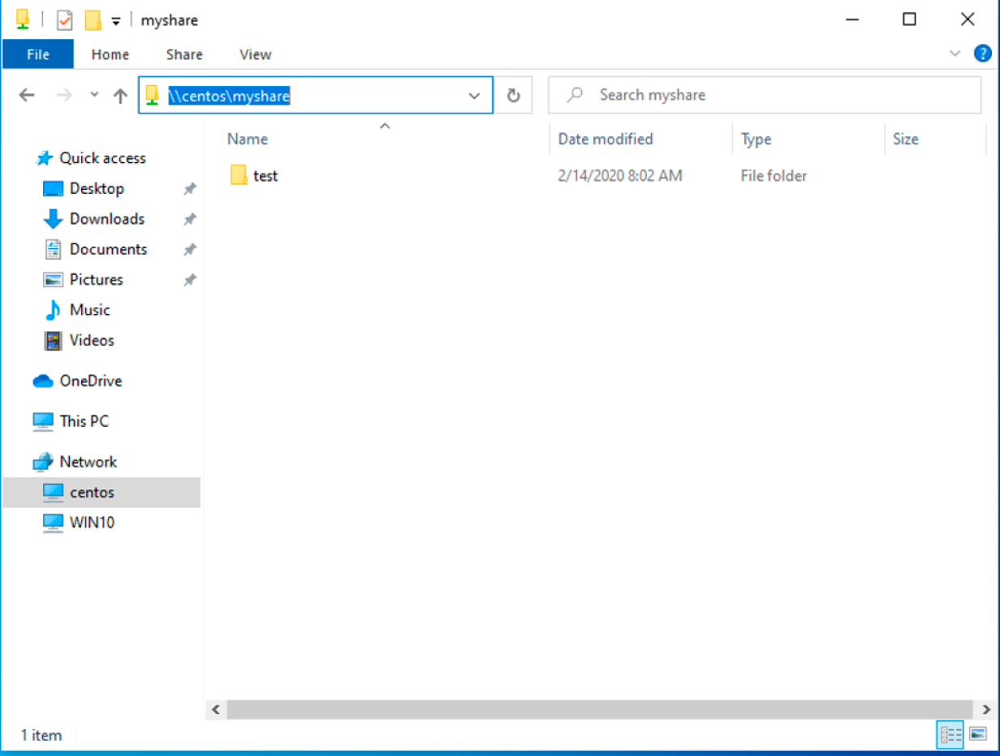
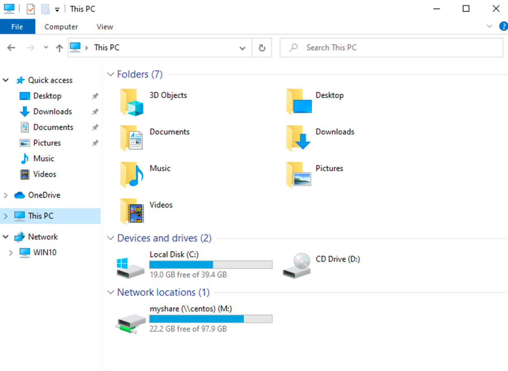

# Mounting and mapping shares between Windows and Linux with Samba

In my previous article, [Interoperability: Getting started with Samba](https://redhat.com/sysadmin/getting-started-samba), I covered installing and configuring Samba shares on a Linux server. The real power of Samba comes when Windows clients can communicate with Linux file servers. In this article, I will cover how you can access Samba shares from both Linux and Windows clients.

Install the Samba client packages

To access Samba share from Linux clients we need to install a few Samba client packages.

On the client machine, install the `samba-common` and `samba-client` packages.

```shell
# yum install samba-client samba-common  -y
```

Check for available shares

Let's check if we can access our shares from the server. We can use either the `hostname` or `ip address` of the server. If you use the `hostname`, make sure DNS is working.

```shell
# smbclient -U user -L 192.168.1.122

Enter SAMBA\user's password:

        Sharename       Type      Comment
        ---------       ----      -------
        print$          Disk      Printer Drivers
        myshare         Disk      my share
        IPC$            IPC       IPC Service (Samba 4.9.1)
        user      Disk      Home Directories

Reconnecting with SMB1 for workgroup listing.

        Server               Comment
        ---------            -------

        Workgroup            Master
        ---------            -------
        SAMBA                SAMBA-SERVER
```

Create a directory that we can use as our mount point. I'm going to create a directory under `/mnt`, but you can use any directory you would like to. You may need to configure `SELinux` on that directory.

```shell
# mkdir /mnt/myshare
```

Now, mount the share.

```shell
# mount -t cifs -o username=user //192.168.1.122/myshare /mnt/share

Password for user@//192.168.1.122/myshare:  ********
```

Now that we’ve mounted our share, we can check the mounts with the following command:

```shell
# df -h
```

Persistent mount

Let's make that directory mount persistently so it can withstand a reboot. Using the text editor of your choice, edit the `/etc/fstab` file. You can do this in multiple ways, but I'm going to demonstrate two ways to mount the Samba share at boot in `/etc/fstab`.

```shell
# vim /etc/fstab
```

The first option provides a username and password for the Samba user in the `fstab`.

```
//192.168.1.122/myshare /mnt/share cifs username=user,password=password,_netdev 0  0
```

The other option is to create a credential file. You can call this file anything, but I would like to call it `cred`. I would like to place credentials files in the home directory of the user. In our demonstration it will be `/home/user/.cred`.

```
//192.168.1.122/myshare /mnt/share cifs credentials=/home/user/.cred,_netdev 0 0
```

The `_netdev` option is important since we are mounting a network device. Clients may hang during the boot process if the system encounters any difficulties with the network.

Now create that `.cred` file inside the user's home directory.

```shell
# vim /home/user/.cred
```

Next, add the Samba user's username and password.

```ini
username=user
password=password
```

Finally, mount all filesystems.

```shell
# mount -a
```

Access a share from a Windows client

I will be using Windows 10 as my client machine with a workgroup called `SAMBA`. We need to create a local user account on the Windows machine that matches the username and password of the Samba user account we created in my previous article. Although account creation is not necessary, this will make things simpler when accessing the share.

Like I mentioned above, this step is optional and you can skip it completely. Although there are multiple approaches to adding a new local user on a Windows machine, for the simplicity of this article I will be using PowerShell. Launch PowerShell as an administrator and issue following commands:

```powershell
PS > $password = Read-Host -AsSecureString
PS > New-LocalUser -Name “user” -Password $password
```

Now that we have created a new local user account matching the Samba user account, we can log in to Windows with our newly created user account.

Access a share from Windows Explorer

To access the Samba share from Windows Explorer, start typing the IP address to our share in the search area. I am using the `hostname` of the Samba server. In my case, it is `centos`. You can also access the share by using the IP address of the Samba server.



You might be prompted to enter the username and password to access the share if you skipped the local user creation process. If you get prompted for credentials, enter the Samba username and password we created in the previous article.

You will need to enter the Samba share path every time you want to access the share. There is a better way to access the share by mapping a drive to Samba share in Windows.

Mapping a drive to a Samba share

To map a drive to the Samba share, open PowerShell and issue following command:

```powershell
PS > NET USE M: \\centos\myshare
```



Wrap up

Accessing a Samba share on Linux and Windows is easy. With this basic setup, you will be able to access file shares from client machines in your network. With somewhat more configuration, you can deploy Samba shares in a domain environment. Samba can do more than file share. If you would like to learn more about Samba, read this article about [Windows and Linux interoperability](https://www.redhat.com/sysadmin/windows-linux-interoperability). This is a basic set up, but you can do so much more with Samba.

## Reference

* https://www.redhat.com/sysadmin/samba-windows-linux
* https://askubuntu.com/questions/1102165/change-ownership-of-a-file-transfered-using-samba
* https://serverfault.com/questions/885324/background-on-sambasid-calculation
* https://aput.net/~jheiss/samba/ldap.shtml
* https://github.com/mrlesmithjr/ansible-openldap
* https://www.digitalocean.com/community/tutorials/how-to-manage-and-use-ldap-servers-with-openldap-utilities
* https://cwiki.apache.org/confluence/display/DIRxINTEROP/Configuring+LDAP-backed+Winbind+IDMAP
* 
