# Setup Samba Domain Controller with LDAP Backend in Ubuntu

This post will show you how to install and configure a Samba domain controller with LDAP backend.  E.g., The users created in LDAP server can log into your domain controller.

In this tutorial, my test box scenario is as follows:

### MY LATEST VIDEOS

```output
Samba Hostname : server
Samba FQDN : server.unixmen.com
Ip Address : 192.168.1.200
The password i used wherever need is : ubuntu
Client : Windows 7 Professinal
IP Address : 192.168.1.50
```

**Prerequisites**

In order to continue, please make sure that you have installed and configured LDAP server properly. 

Make sure that you have added the hostname in the **/etc/hosts file** as shown below:

```shell
user@server:~$ sudo vi /etc/hosts
127.0.0.1       localhost
192.168.1.200   server.unixmen.com      server

# The following lines are desirable for IPv6 capable hosts
::1     ip6-localhost ip6-loopback
fe00::0 ip6-localnet
ff00::0 ip6-mcastprefix
ff02::1 ip6-allnodes
ff02::2 ip6-allrouters
```

For the testing purpose, I did a fresh installation of both Ubuntu 22.04 Server and Windows 10 Professional.  Using an already installed OS might not be worked as you expected. Though tested under Ubuntu, it should work on Debian too. This post is not a full-fledged how-to, but should meet minimal ldap+samba configuration requirements. 

**LDAP Authentication**

Install **libnss-ldap** package to enable LDAP authentication:

```shell
user@server:~$ sudo apt-get install libnss-ldap
```

Enter your LDAP server FQDN as shown below and click OK.

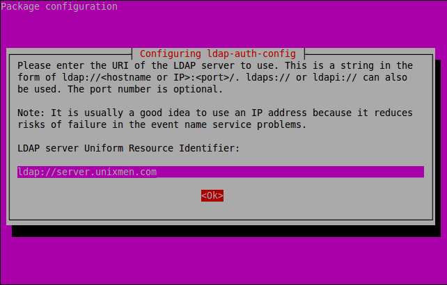

Enter the name of the LDAP search base.

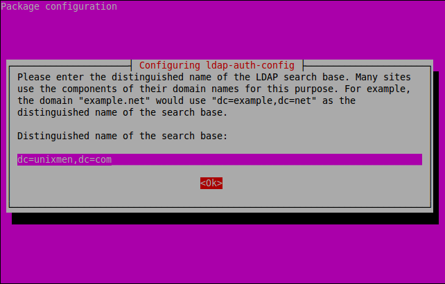

Select the LDAP version and Click OK.

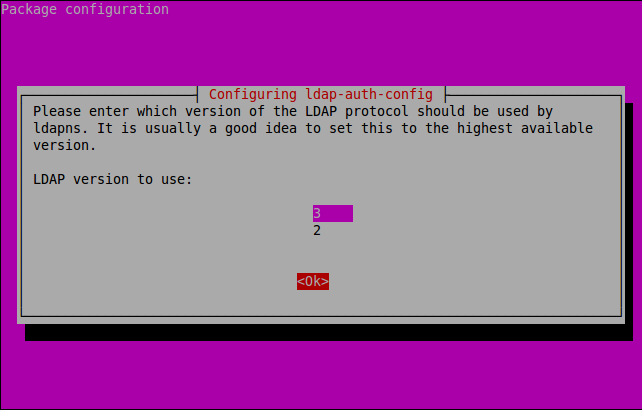

Select Yes.

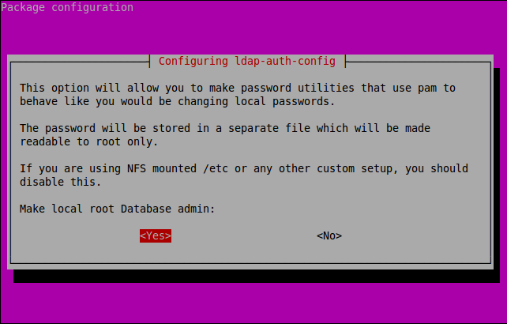

Disable LDAP database login by clicking No.

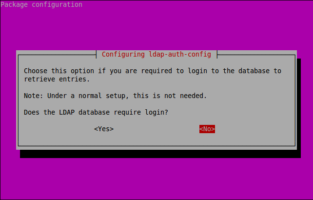

Enter the LDAP root privileged account name and LDAP suffix as shown below.

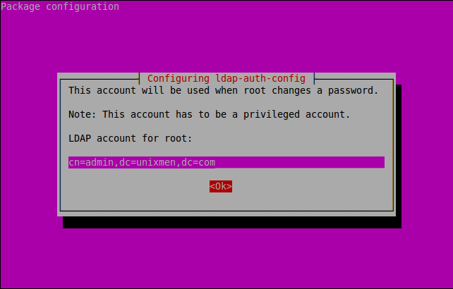

Enter LDAP admin account password which you have created early while installing OpenLDAP.

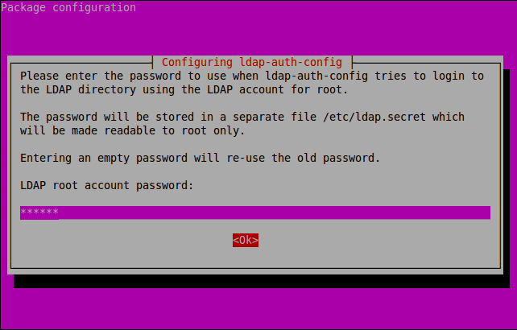

Then run the following commands to setup the LDAP profile for NSS and inform your system to use it for authentication:

```shell
user@server:~$ sudo auth-client-config -t nss -p lac_ldap
user@server:~$ sudo pam-auth-update
```


**Samba Installation**

Now install Samba packages using the following command:

```
user@server:~$ sudo apt-get install samba samba-doc smbldap-tools
```

Import samba schema into LDAP.

```shell
user@server:~$ sudo cp /usr/share/doc/samba-doc/examples/LDAP/samba.ldif.gz /etc/ldap/schema/
user@server:~$ sudo gzip -d /etc/ldap/schema/samba.ldif.gz
user@server:~$ sudo ldapadd -Q -Y EXTERNAL -H ldapi:/// -f /etc/ldap/schema/samba.ldif
adding new entry "cn=samba,cn=schema,cn=config"
```

Create a file called **samba\_indices.ldif** and add the contents as shown below:

```shell
user@server:~$ sudo vi /etc/ldap/schema/samba_indices.ldif
dn: olcDatabase={1}hdb,cn=config
changetype: modify
add: olcDbIndex
olcDbIndex: uidNumber eq
olcDbIndex: gidNumber eq
olcDbIndex: loginShell eq
olcDbIndex: uid eq,pres,sub
olcDbIndex: memberUid eq,pres,sub
olcDbIndex: uniqueMember eq,pres
olcDbIndex: sambaSID eq
olcDbIndex: sambaPrimaryGroupSID eq
olcDbIndex: sambaGroupType eq
olcDbIndex: sambaSIDList eq
olcDbIndex: sambaDomainName eq
olcDbIndex: default sub
```

Now import it using the following command:

```shell
user@server:~$ sudo ldapmodify -Q -Y EXTERNAL -H ldapi:/// -f /etc/ldap/schema/samba_indices.ldif
modifying entry "olcDatabase={1}hdb,cn=config"
```

Open the **smbldap.conf** and **smbldap\_bind.conf** files and edit them with your LDAP settings as shown below:

```shell
user@server:~$ sudo cp /usr/share/doc/smbldap-tools/examples/smbldap.conf.gz /etc/smbldap-tools/
user@server:~$ sudo cp /usr/share/doc/smbldap-tools/examples/smbldap_bind.conf /etc/smbldap-tools/
user@server:~$ sudo gzip -d /etc/smbldap-tools/smbldap.conf.gz
```

Find the following lines and make the changes as shown below. Before doing this, get your Samba domain SID using the following command:

```shell
user@server:~$ sudo net getlocalsid
SID for domain SERVER is: S-1-5-21-3102374607-2088646784-3588851380
```

Note down the SID. We have to enter it in the smbldap.conf file:

```shell
user@server:~$ sudo vi /etc/smbldap-tools/smbldap.conf
[...]
SID="S-1-5-21-3102374607-2088646784-3588851380" ## Replace with your Domain SID ##
sambaDomain="UNIXMEN"  ## Enter your Domain name ##
#slaveLDAP="ldap://ldap.example.com/"  ## Make it comment, we don't have slave LDAP ##
masterLDAP="ldap://server.unixmen.com/"  ## Enter your LDAP Domain name ##
ldapTLS="0" ## We don't use TLS, so set it to "0" ##
verify="none"  ## Set it to "none"
clientcert="/etc/smbldap-tools/smbldap-tools.unixmen.com.pem"
clientkey="/etc/smbldap-tools/smbldap-tools.unixmen.com.key"
suffix="dc=unixmen,dc=com"
userSmbHome="\\SERVER\%U"   ## Set your host name here ##
userProfile="\\SERVER\profiles\%U"  ## Set your host name here ##
userHomeDrive="H:"  ## Set your Home drive ##
mailDomain="unixmen.com"
[...]
```

Open **smbldap\_bind.conf** file and make the changes as shown below:

```shell
user@server:~$ sudo vi /etc/smbldap-tools/smbldap_bind.conf
[...]
#slaveDN="cn=Manager,dc=example,dc=com"  ## make it comment. we don't have a slave LDAP ##
#slavePw="secret"  ## Make it comment ##
masterDN="cn=admin,dc=unixmen,dc=com"  ## Enter LDAP admin username and LDAP suffixes ##
masterPw="ubuntu"  ## Enter LDAP root administrative account password ##
```

Now enter the command to populate LDAP database:

```shell
user@server:~$ sudo smbldap-populate
 Populating LDAP directory for domain UNIXMEN (S-1-5-21-3102374607-2088646784-3588851380)
(using builtin directory structure)
entry dc=unixmen,dc=com already exist.
adding new entry: ou=Users,dc=unixmen,dc=com
adding new entry: ou=Groups,dc=unixmen,dc=com
adding new entry: ou=Computers,dc=unixmen,dc=com
adding new entry: ou=Idmap,dc=unixmen,dc=com
adding new entry: sambaDomainName=UNIXMEN,dc=unixmen,dc=com
adding new entry: uid=root,ou=Users,dc=unixmen,dc=com
adding new entry: uid=nobody,ou=Users,dc=unixmen,dc=com
adding new entry: cn=Domain Admins,ou=Groups,dc=unixmen,dc=com
adding new entry: cn=Domain Users,ou=Groups,dc=unixmen,dc=com
adding new entry: cn=Domain Guests,ou=Groups,dc=unixmen,dc=com
adding new entry: cn=Domain Computers,ou=Groups,dc=unixmen,dc=com
adding new entry: cn=Administrators,ou=Groups,dc=unixmen,dc=com
adding new entry: cn=Account Operators,ou=Groups,dc=unixmen,dc=com
adding new entry: cn=Print Operators,ou=Groups,dc=unixmen,dc=com
adding new entry: cn=Backup Operators,ou=Groups,dc=unixmen,dc=com
adding new entry: cn=Replicators,ou=Groups,dc=unixmen,dc=com
Please provide a password for the domain root:
Changing UNIX and samba passwords for root
New password:   ## Enter Password ##
Retype new password:   ## Re-enter password ##
```

Now check the LDAP database for Samba groups:

```shell
user@server:~$ sudo getent group
[...]
Domain Admins:*:512:root
Domain Users:*:513:
Domain Guests:*:514:
Domain Computers:*:515:
Administrators:*:544:
Account Operators:*:548:
Print Operators:*:550:
Backup Operators:*:551:
Replicators:*:552:
```

**Configuring Samba**

Open Samba main configuration file **smb.conf** and make the changes as shown below:

```shell
user@server:~$ sudo cp /usr/share/doc/smbldap-tools/examples/smb.conf.example /etc/samba/smb.conf
user@server:~$ sudo vi /etc/samba/smb.conf
[global]
workgroup = UNIXMEN  ## Your domain Name ##
netbios name = SERVER  ## Samba server Host name ##

deadtime = 10
log level = 1
log file = /var/log/samba/log.%m
max log size = 5000
debug pid = yes
debug uid = yes
syslog = 0
utmp = yes

security = user
domain logons = yes
os level = 64
logon path =
logon home =
logon drive = H:  ## Logon drive ##
logon script =

passdb backend = ldapsam:"ldap://server.unixmen.com/"  ## Samba server FQDN ##
ldap ssl = off  ## Set to off to disable SSL
ldap admin dn = cn=admin,dc=unixmen,dc=com  ## LDAP admin account and LDAP suffixes ##
ldap delete dn = no

# Sync UNIX password with Samba password
## Method 1:
ldap password sync = yes
## Method 2:
;ldap password sync = no
;unix password sync = yes
;passwd program = /usr/sbin/smbldap-passwd -u '%u'
;passwd chat = "Changing *\nNew password*" %n\n "*Retype new password*" %n\n"

ldap suffix = dc=unixmen,dc=com  ## LDAP suffix ##
ldap user suffix = ou=Users
ldap group suffix = ou=Groups
ldap machine suffix = ou=Computers
ldap idmap suffix = ou=Idmap

add user script = /usr/sbin/smbldap-useradd -m '%u' -t 1
rename user script = /usr/sbin/smbldap-usermod -r '%unew' '%uold'
delete user script = /usr/sbin/smbldap-userdel '%u'
set primary group script = /usr/sbin/smbldap-usermod -g '%g' '%u'
add group script = /usr/sbin/smbldap-groupadd -p '%g'
delete group script = /usr/sbin/smbldap-groupdel '%g'
add user to group script = /usr/sbin/smbldap-groupmod -m '%u' '%g'
delete user from group script = /usr/sbin/smbldap-groupmod -x '%u' '%g'
add machine script = /usr/sbin/smbldap-useradd -w '%u' -t 1

[NETLOGON]
path = /var/lib/samba/netlogon
browseable = no
share modes = no

[PROFILES]
path = /var/lib/samba/profiles
browseable = no
writeable = yes
create mask = 0611
directory mask = 0700
profile acls = yes
csc policy = disable
map system = yes
map hidden = yes
```

Finally restart the Samba services:

```shell
user@server:~$ sudo /etc/init.d/smbd restart
user@server:~$ sudo /etc/init.d/nmbd restart
user@server:~$ sudo smbpasswd -w ubuntu
Setting stored password for "cn=admin,dc=unixmen,dc=com" in secrets.tdb
```

**Configuring LAM**

It is possible to create LDAP users from command-line and it is a bit of difficult. So here I am using LAM(LDAP Account Manager) to get things done much easier and simpler.

LAM, LDAP Account Manager is a GUI tool is used to manage LDAP server. For more about LAM visit the offcial [website](https://www.ldap-account-manager.org/lamcms/ "LDAP Account Manager").

To install LAM, enter the following command in terminal:

```shell
user@server:~$ sudo apt-get install ldap-account-manager
```

Now you can access the LAM from the browser using **“[http://ip\-address/lam](http://ip-address/lam)**. The default password for lam administrative account is **“lam”**. You can change it if you wish.

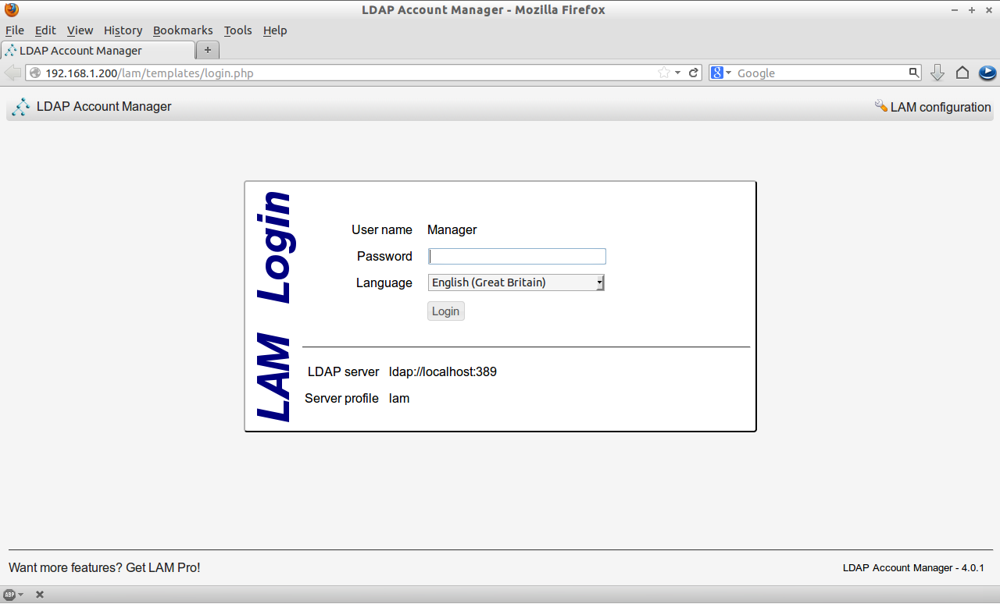

Before login to lam, we must enter our LDAP admin user name and LDAP suffix in lam configuration file. To do so click on the **LAM configuration** on the right cornet of lam main console.

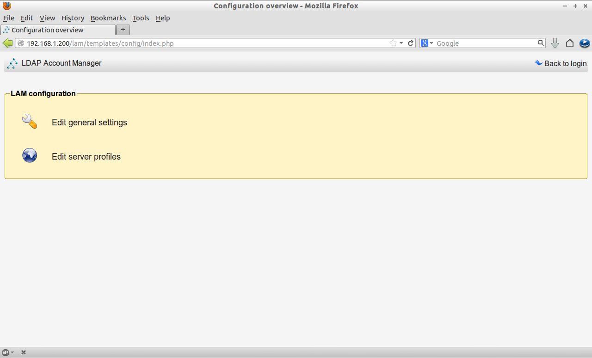

Click on **Edit Server Profiles** and enter the default password. ie. **lam**.

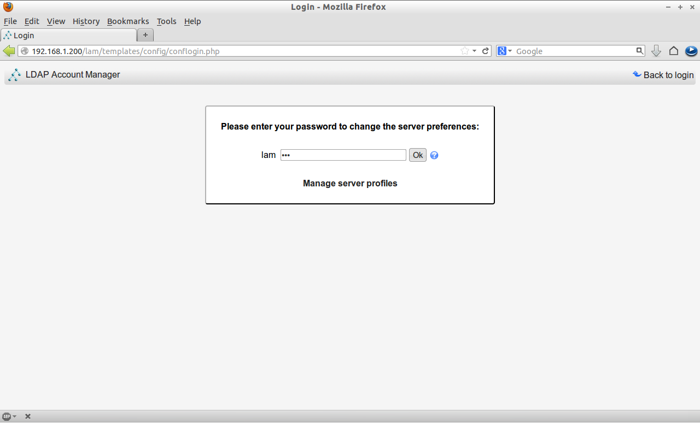

Enter the LDAP suffix and admin account details **“cn=admin,dc=unixmen,dc=com”** in the **General Settings** page.

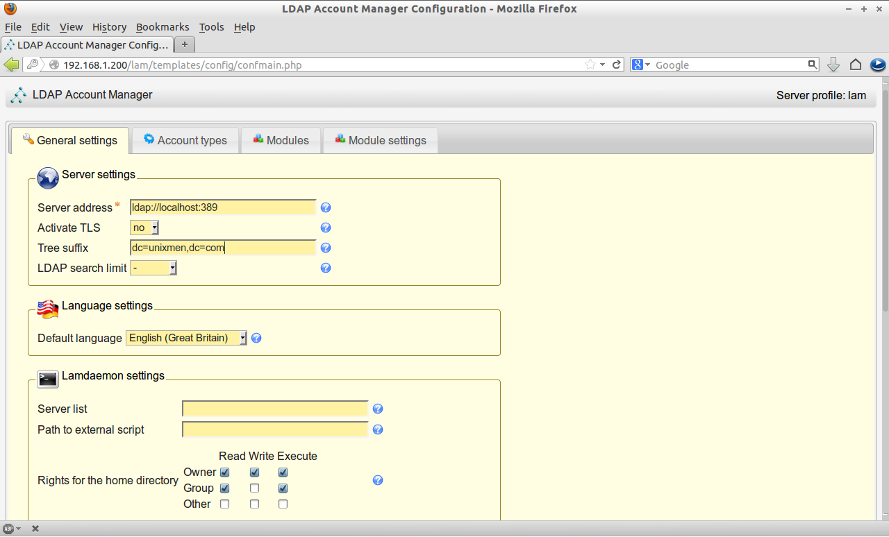

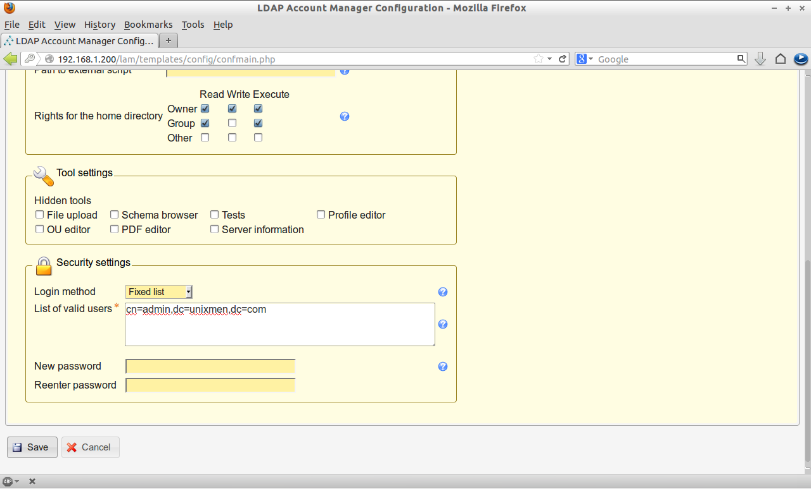

Navigate to **Account Types** page and enter the LDAP suffix details as mentioned above and click Save.

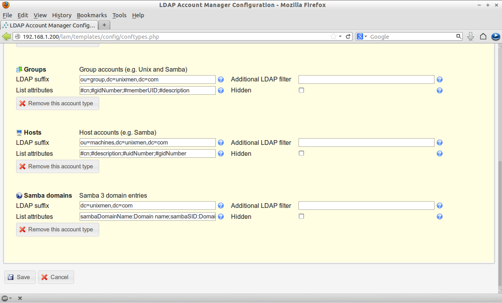

Now you can login to lam using the LDAP root account password.

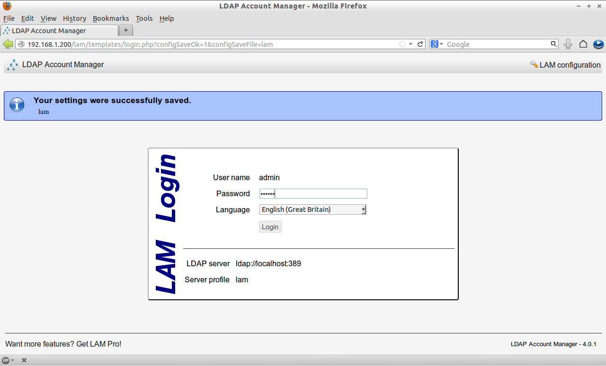

Click on Create button to create new suffixes.

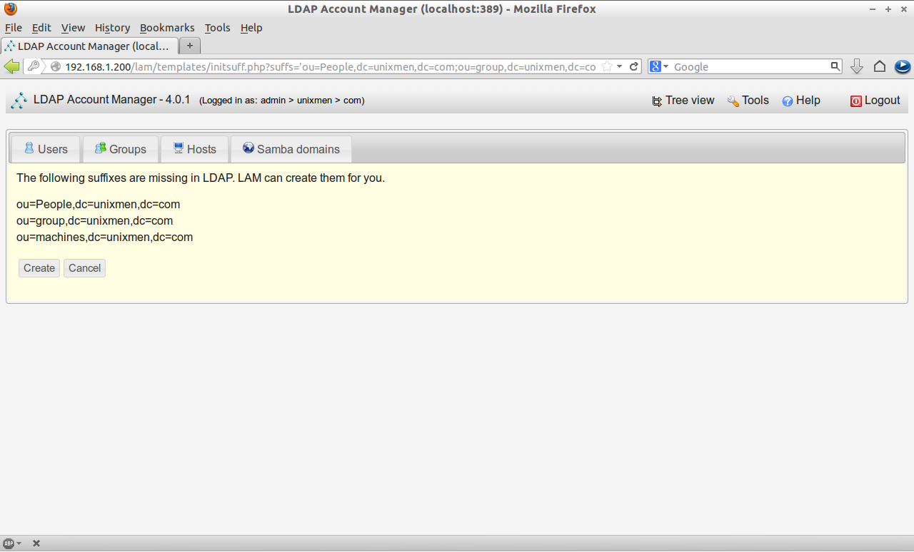

**Creating Users and Groups**

Now let us create a sample group called **“test”** and a sample user called **“senthil”**.

Click on the **New Group** in the group section. Enter the group name and click save.

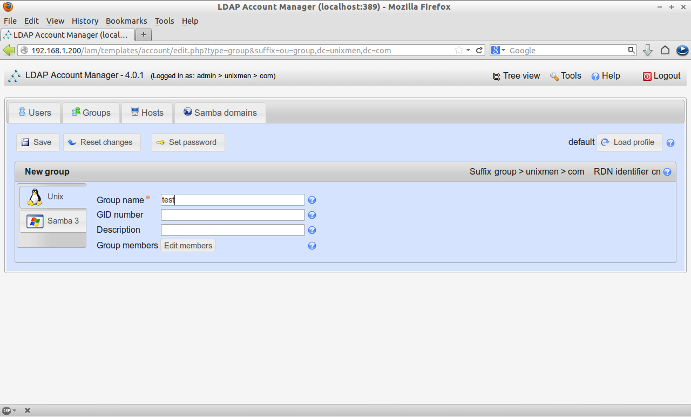

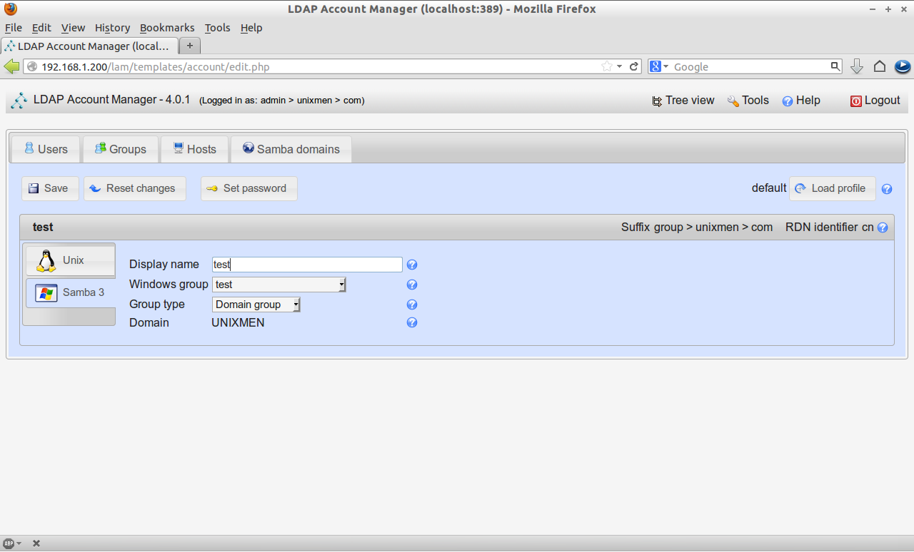

Click on the **New User** button in the Users section. In the personal tab, enter first name, last name and address details etc.

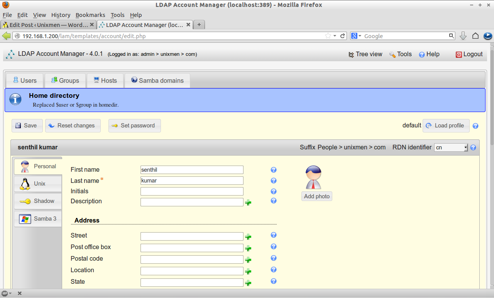

In the Unix tab, enter the user name, home directory etc.

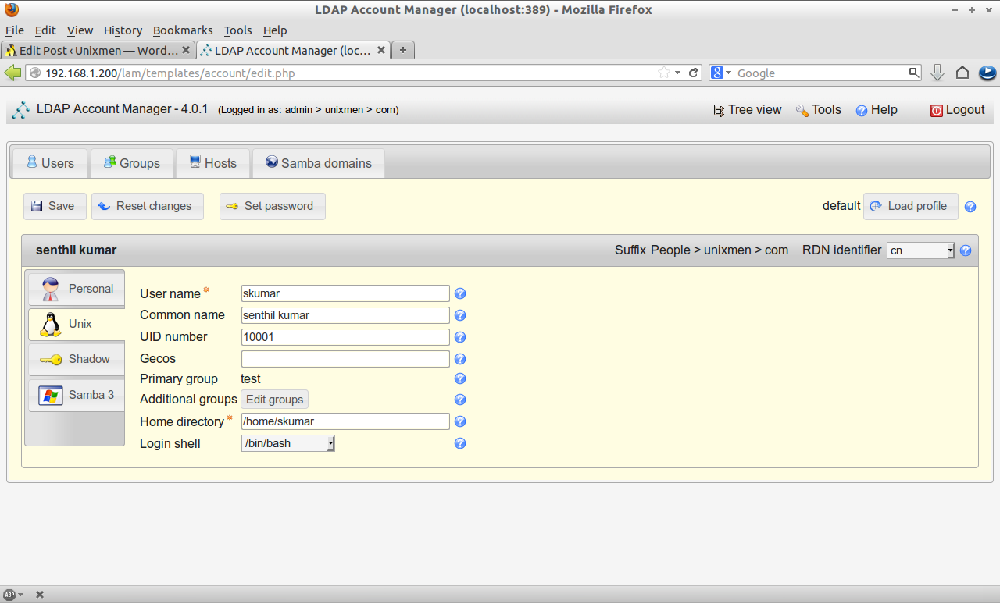

Now Navigate to **Samba 3** tab and click **Add Samba 3 extension**. Here you can set password expiration details, account deactivation and disabled details, home drive details and so on.

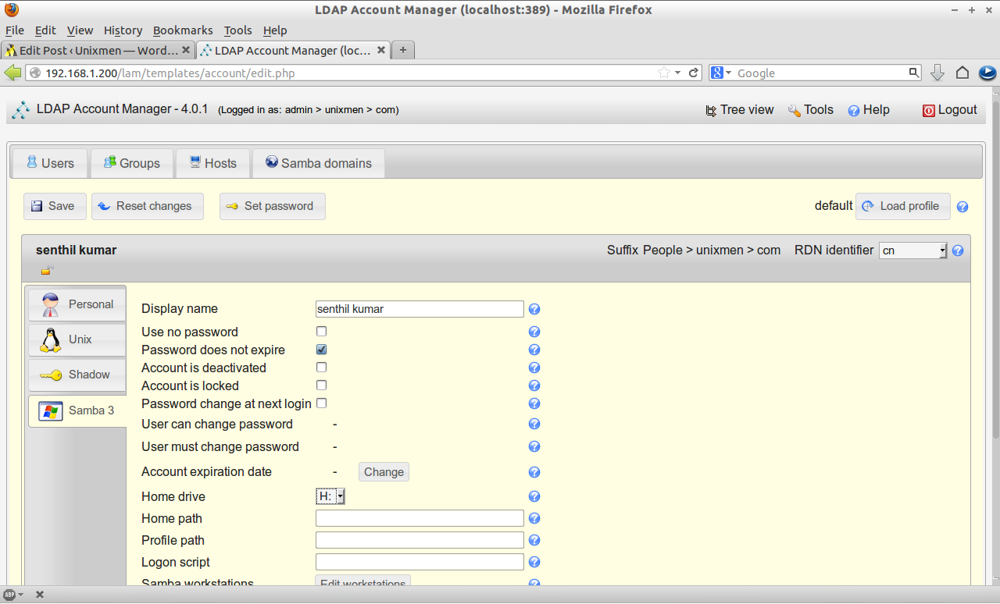

And finally click on the **Set Password** tab on the upper side and set the password for the new user and click Save.

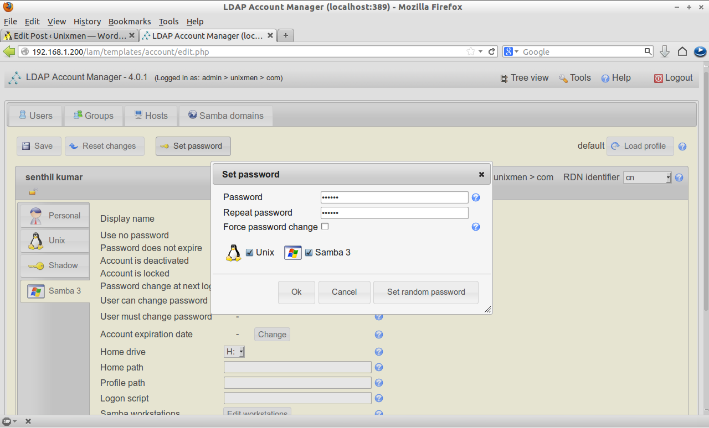

That’s it. We have created Users and Groups now.

**Testing Samba Domain Controller**

Now try to join the samba domain from Windows OS client using the newly created user.

Enter your Samba domain name in the Domain field and Click OK.

![Windows 7 [Running] - Oracle VM VirtualBox_011](./img/Windows-7-Running-Oracle-VM-VirtualBox_011.png)

Enter your Samba username and password which you have created in the earlier steps.

![Windows 7 [Running] - Oracle VM VirtualBox_038](./img/Windows-7-Running-Oracle-VM-VirtualBox_038.png)

Oops!! Error!! You may get an error like as shown below if you have Windows 7 OS client.

```output
"The specified domain either does not exist or could not be contacted" 
```

![Windows 7 [Running] - Oracle VM VirtualBox_013](./img/Windows-7-Running-Oracle-VM-VirtualBox_013.png)

**Resolution 1**

To get rid of this error, open the windows registry. Go to **HKEY\_LOCAL\_MACHINE  -> SYSTEM -> CurrentControlSet -> Services -> LanmanWorkstation -> Parameters**.

![Windows 7 [Running] - Oracle VM VirtualBox_015](./img/Windows-7-Running-Oracle-VM-VirtualBox_015.png)

Create a new two DWORD values called **“DomainCompatibilityMode”** and **“DNSNameResolutionRequired”**. And set values for **“DomainCompatibilityMode”** as **1(one)** and **“DNSNameResolutionRequired”** as **0(zero)**.

![Windows 7 [Running] - Oracle VM VirtualBox_016](./img/Windows-7-Running-Oracle-VM-VirtualBox_016.png)

Now try again to join to Samba domain.

Again you may get an error like as shown below.

```output
"Logon failure: Unknown user name or bad password"
```

![Windows 7 [Running] - Oracle VM VirtualBox_017](./img/Windows-7-Running-Oracle-VM-VirtualBox_017.png)

This means that we didn’t add and enable the Samba users yet. Here is the tip what I did to get rid of this error using the following command:

**Resolution 2**

```shell
user@server:~$ sudo smbpasswd -a senthil
New SMB password:
Retype new SMB password:
Added user senthil.
user@server:~$ sudo smbpasswd -e senthil
Enabled user senthil.
```

Note: The command **“smbpasswd -a username”** is used to add a Samba user and **“smbpasswd -e username”** is used to enable the Samba user. Both are different commands, don’t get confused.

Now let us try again. Now also I got an error like as shown below.

```
"The join operation was not successful.This could be because an existing computer account having name "admin-PC" was previously created using a different set of credentials. Use a different computer name or contact your system administrator to remove any stale conflicting account. The error was: Access denied."
```

![Windows 7 [Running] - Oracle VM VirtualBox_039](./img/Windows-7-Running-Oracle-VM-VirtualBox_039.png)

**Resolution 3**

Here it is what I did to solve the above error. Open the terminal and enter the following command:

```shell
user@server:~$ sudo net sam rights grant senthil SeMachineAccountPrivilege
[sudo] password for sk:
Granted SeMachineAccountPrivilege to UNIXMEN\senthil
```

Here **senthil** is my Samba username.

Let us try again to join to the Samba domain. Boom!! Yes it worked.

![Windows 7 [Running] - Oracle VM VirtualBox_040](./img/Windows-7-Running-Oracle-VM-VirtualBox_040.png)

Restart the Windows OS machine and you will able to login to Samba domain now.

## Reference

* https://www.unixmen.com/setup-samba-domain-controller-with-openldap-backend-in-ubuntu-13-04/
* 
