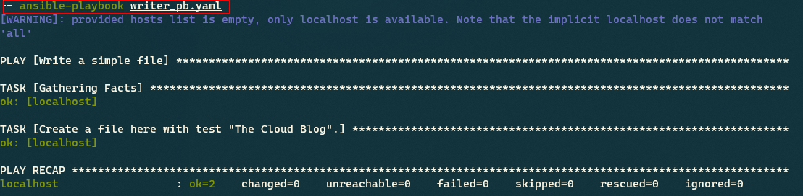
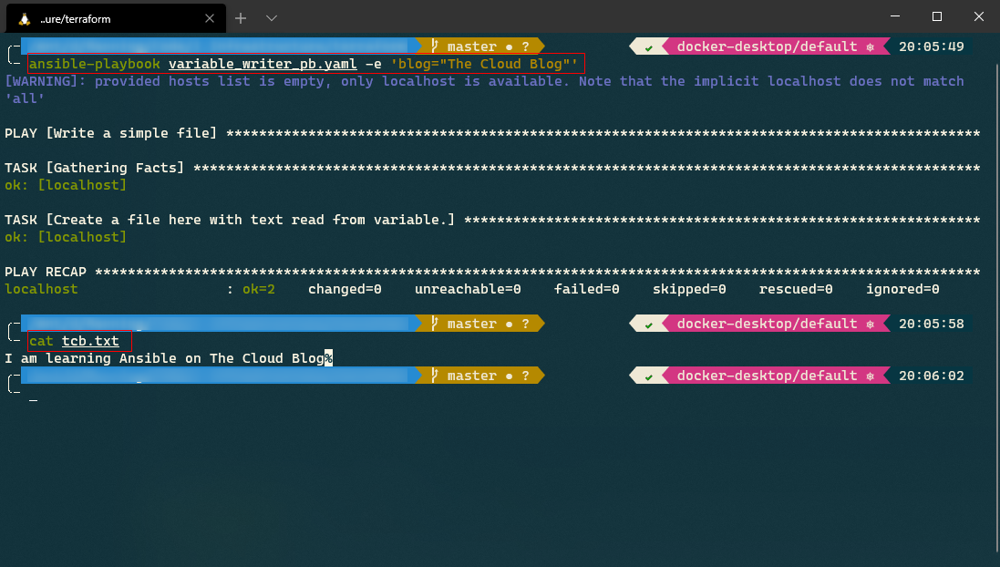

Terraform Deployments with Ansible - Part 1
===

> In this series
> 
> 1.  Motivation & Ansible 101
> 2.  [Terraform & Ansible](./terraform-deployments-with-ansible-part-2.md "Terraform & Ansible")

Enterprise developers are responsible for deploying infrastructure to multiple environments, such as development, staging, and production. One core problem with configurations in [Terraform](https://www.terraform.io/) is that with the number of environments and variables, the number of [“.tfvars” files](https://www.terraform.io/docs/configuration/variables.html) used to manage configurations will increase. Several tools, such as [Puppet](https://puppet.com/), [Chef](https://www.chef.io/), and [Ansible](https://www.ansible.com/), help simplify the management of configurations.

Ansible is an open-source configuration management and deployment tool. It has a unique declarative language for describing system and application configurations.

You can install Ansible on one of the VMs (called [Control Node](https://docs.ansible.com/ansible/latest/network/getting_started/basic_concepts.html)) in your datacenter from where it can work against other VMs in your datacenter. Ansible stores the collection of systems that it can act on in its [inventory file](https://docs.ansible.com/ansible/latest/user_guide/intro_inventory.html). Ansible can act on portions of its inventory and also on different inventories.

Ansible does not require agents/daemons executing on remote systems. It uses [SSH](https://www.ssh.com/ssh/command/) to manage the remote systems, which leads to clean environments that have no Ansible components installed on them.

## Installation

Ansible requires Python 2 or Python 3 as a prerequisite. You can install Ansible using the [instructions on its documentation](https://docs.ansible.com/ansible/latest/installation_guide/intro_installation.html).

I am running [Ubuntu on my Windows machine with WSL2](https://docs.microsoft.com/en-us/windows/wsl/install-win10). Ubuntu users can execute the following commands to install Ansible.

```
sudo apt update
sudo apt install software-properties-common
sudo apt-add-repository --yes --update ppa:ansible/ansible
sudo apt install ansible
```

To verify your installation, execute the command `ansible --version`, which will produce a bunch of information about your installation. Let’s now discuss a few concepts that we will use to build our Ansible playbook.

## Inventory

The default Ansible inventory is located at “_/etc/ansible/hosts_”. You can specify a different location of the inventory with the following command.

```
ansible -i <inventory_path>
```

Execute the command `cat /etc/ansible/hosts` to view the default inventory specified in the [INI format](https://en.wikipedia.org/wiki/INI_file). The default inventory contains several examples of how you can set individual hosts, host groups, and patterns to select a group of hosts. You can use YAML to write the inventory file as well.

Suppose you want to specify several VMs as part of your inventory ([SSH](https://www.ssh.com/ssh/command/)’able from the control node) that have a sequential hostname, e.g., frontend-1.example.com and frontend-2.example.com. You can specify them as part of the group `frontend` with the following configuration.

```
[frontend]
frontend-[1:2].example.com
```

## Playbooks

Ansible playbooks are files that contain configurations and definition of steps that should be executed in a defined manner. You can store this file in source control and manage configurations and your deployment workflow as code. Playbooks are expressed in YAML format.

Let’s create a basic playbook to understand it in detail. Create a file named **writer\_pb.yaml** and add the following task to it.

```
- name: Write a simple file
  hosts: localhost
  tasks:
    - name: Create a file here with text "Dettonville Blog".
      copy:
        content: "Dettonville Blog"
        dest: "tcb.txt"
```

The definition of the playbook is self-explanatory. We defined the name of the playbook and then a list of tasks. The tasks are executed against one or more hosts, which you specify in the inventory. We defined one task in the playbook and the name of the built-in module used by the task. The `copy` module takes the content of the file and target location as input. You can use the module to copy a file, or in this case, create a new file and add contents to it. You can view the plugins packaged in the Ansible binary in the [Ansible documentation](https://docs.ansible.com/ansible/latest/collections/ansible/builtin/).

You might be wondering where the details of the host `localhost` are coming from, even though it is not defined in the inventory. If `localhost` is not defined in the inventory, Ansible creates an [implicit `localhost`](https://docs.ansible.com/ansible/latest/inventory/implicit_localhost.html) for you. If you define a `localhost` in your inventory, the implicit definition will be ignored.

To run the playbook, execute the following command.

```
ansible-playbook writer_pb.yaml
```

Following is the output generated by executing the command.



Playbook output

Execute the following command to view the contents of the file created by the playbook.

```
$ cat tcb.txt

Dettonville Blog
```

Congratulations! You successfully wrote and executed your first playbook. Ansible playbooks support parameters and environment variables as well, which make them very flexible.

## Roles

A large number of playbooks and Ansible files can make your project unwieldy. [Ansible Roles](https://docs.ansible.com/ansible/latest/user_guide/playbooks_reuse_roles.html) help you load related vars\_files and tasks based on a known file structure.

Following is the standard Role directory structure recommended by Ansible. You can omit unused folders from the actual implementation.

```
dev.yml
test.yml
prod.yml
roles/
    [role-name]/
        tasks/
        handlers/
        library/
        files/
        templates/
        vars/
        defaults/
        meta/
```

Here is what each folder contains.

-   **tasks**: List of tasks to be executed by the role.
-   **handlers**: Contains handlers that can be used within this role or outside this role.
-   **defaults**: Default variables for the role.
-   **vars**: Variables for the role.
-   **files**: Files that can be deployed by the role.
-   **templates**: Templates that can be deployed by the role.
-   **meta**: Files containing metadata for this role.
-   **library**: Modules used within the role.

We will soon build a role for deploying our infrastructure, so we will not address this feature in detail just yet.

## Templating with Jinja2

Remember the `copy` module? Ansible has a built-in module named [`template`](https://docs.ansible.com/ansible/latest/collections/ansible/builtin/template_lookup.html#ansible-collections-ansible-builtin-template-lookup) that is used to generate configuration files. Ansible uses the [Jinja2 templating language](https://palletsprojects.com/p/jinja/) to enable dynamic expressions and access to variables.

Let’s create a simple playbook to gain familiarity with templating. Create a file named **variable\_writer\_pb.yaml** with the following content.

```
- name: Write a simple file
  hosts: localhost
  tasks:
    - name: Create a file here with text read from variable.
      template:
        src: template.j2
        dest: tcb.txt
```

Let’s define a template file named **template.j2** at the same location as the previous file.

```
I am learning Ansible on {{ blog }}
```

Execute the following command to execute the playbook and pass the value of the parameter `blog`.

```
ansible-playbook variable_writer_pb.yaml -e 'blog="Dettonville Blog"'
```

Inspect the contents of the file **tcb.txt** after executing the command, which should contain the complete message with the parameter substituted with the actual value.



Template playbook output

We have covered all the information that we require for simplifying our Terraform configurations. In the [next part of this article](https://thecloudblog.net/post/simplifying-terraform-deployments-with-ansible-part-2.md "Terraform & Ansible"), we will use the concepts discussed here and build a Terraform plan that we can execute to provision infrastructure for different environments.
