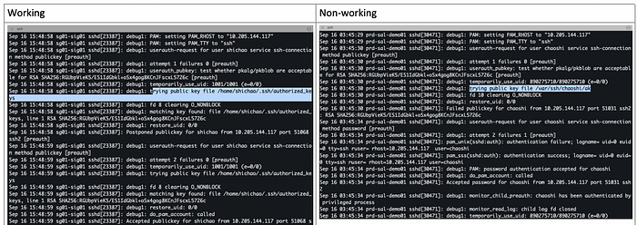
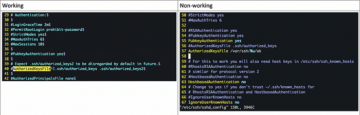

# ssh receive packet: type 51

## troubleshooting SSH remote login failure with public key

The background: I received a new Mac from the company and tried to setup my usual work environment. Newer Mac with shining covers and faster CPU and I could reinstall all the usual tools from scratch, and not worry about disk space for a while(at least for few months). Quite a enjoyable process …

I run a lot of heavy program analysis workload on few remote Linux boxes, so my next step is to enable SSH login to those without password; I have root access to those remote servers, so this **SHOULD** be smooth. I re-generated RSA public/private key pair on my Mac, and inserted the public key to ~/.ssh/authorized_keys on remote server. PHEW! all great, … except one of the Linux box still stubornly insists for password entries.

**episode1**: comparing my ~/.ssh/authorized_keys on the working and non-working systems, and trying to spot the difference; no, there is really no difference.

**episode2**: my random guess is that my old RSA key pairs are interfering mysteriously. so I tried to remove those obsolete entries from ~/.ssh/authorized_keys on both systems; no, this does not help.

**episode3**: check the file attributes of .ssh folder and ~/.ssh/authorized_keys; they are not same?? yes, that maybe the reason, so I googled a bit and applied the recommended below and, it does not help.

-   `.ssh/` should have perms `0700/rwx------`
-   `.ssh/*.pub` files should be `644/rw-r--r--`
-   `.ssh/*` (other files in .ssh) `0600/rw-------`

**episode4**: errrr, I think I have randomly tried a few things and looked few stackoverflow posts and it is not going anywhere with hope, so I need to troubleshoot it step by step; of course, the 1st step is to summon our best friend, debug logs (a.k.a verbose); adding -vvv to ssh give me the titled error:

> debug1: Offering public key: debug3: send packet: type 50
> 
> debug2: we sent a publickey packet, wait for reply
> 
> debug3: receive packet: type 51

okay, that is something, so I did send out my public key and the server did reject it; that is informative, but, but not so useful…:(

I googled and found a long discussion here: [https://superuser.com/questions/1137438/ssh-key-authentication-fails](https://superuser.com/questions/1137438/ssh-key-authentication-fails)

**episode5:** one user at the above post did shared some great tips to get more debugging info from the server side, which is great. why did the server reject me? this dumb server has no manners!

changing the steps a bit to suit Ubuntu instead of Centos:

1.  Enable logging for the sshd daemon: sudo vi /etc/ssh/sshd_config
2.  Under logging uncomment:

SyslogFacility AUTH  
LogLevel INFO

1.  Change LogLevel from INFO to DEBUG
2.  Save and exit
3.  Restart the SSH daemon with sudo systemctl restart sshd
4.  Watch the messages file tail -l /var/log/auth.log

And, now I could spot the difference here:



so, on the non-working system, the SSHD is simply not reading my dear ~/.ssh/authorized_keys !!!

If you get this error in your logs when trying to set up public key authenticated automatic logins, or while trying to SSH into your account, after setting up the public key the issue is related to permissions.

Tailing the system log (CentOS/RedHat: _/var/log/secure_, Debian/Ubuntu: _/var/log/auth.log_) on the target machine will be useful:

```
tail -f /var/log/secure
Dec 26 12:30:38 server sshd[3503454]: Authentication refused: bad ownership or modes for directory /home/user/.ssh
```

As you can see – _bad ownership or modes for directory /home/user/.ssh_.

SSH does not like it if your home or _~/.ssh_ directories have group write permissions. Your home directory should be writable only by you, ~/.ssh should be 700, and authorized_keys should be 600 :

```shell
chmod go-w /home/user
chmod 700 /home/user/.ssh
chmod 600 /home/user/.ssh/authorized_keys
```

So fixing permissions resolved this error.

**episode6:** so what dictates where SSHD to compare public keys? googling again, and I realized that it is just another settings in /etc/ssh/sshd_config; okay, myth busted!!!



uncommenting ln 56, reboot sshd, and try SSH again, it works!

**episode7:** cover your trail as as an ethical hacker, correct? :) remove all those debugging settings and restore SSHD config.

Still, what has triggered the changes there regarding ln 56? anyone?


## Reference

- https://medium.com/ci-cd-devops/ssh-receive-packet-type-51-154288e46609
- https://chemicloud.com/kb/article/ssh-authentication-refused-bad-ownership-or-modes-for-directory/

