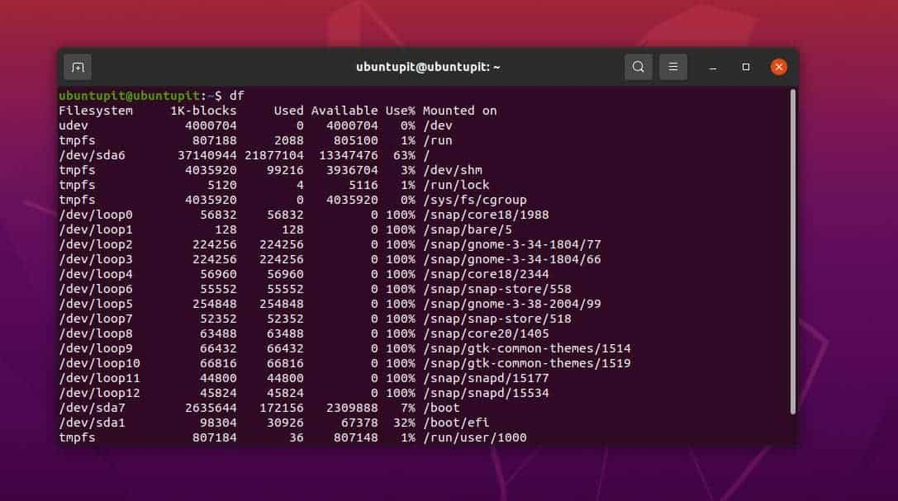
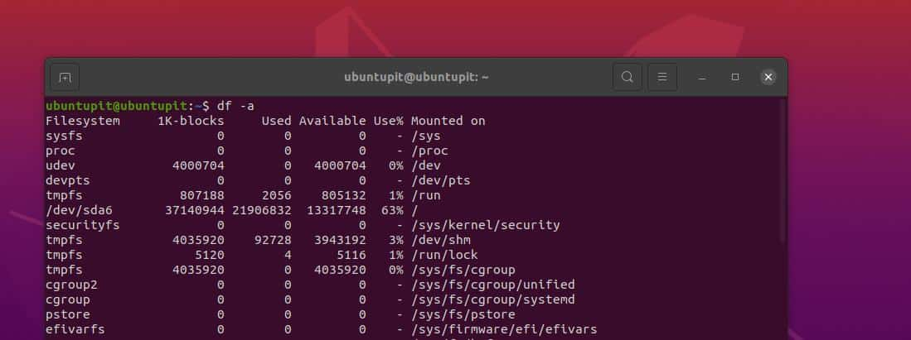
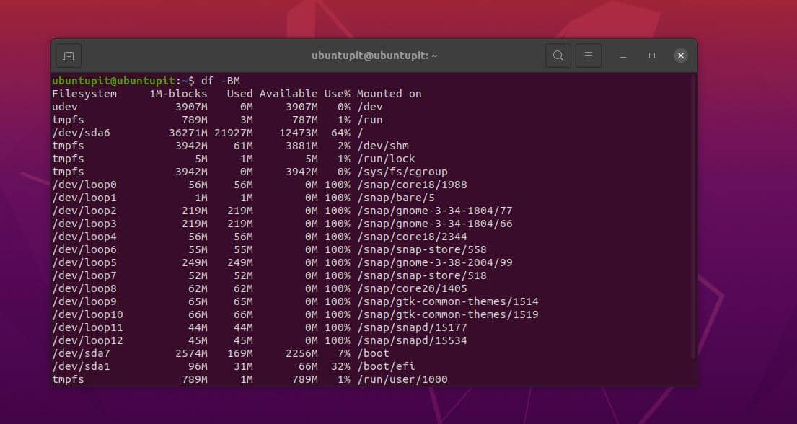
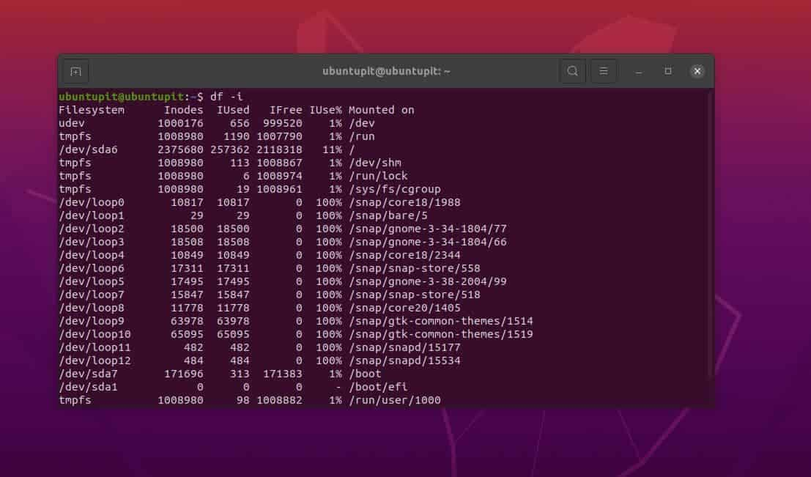
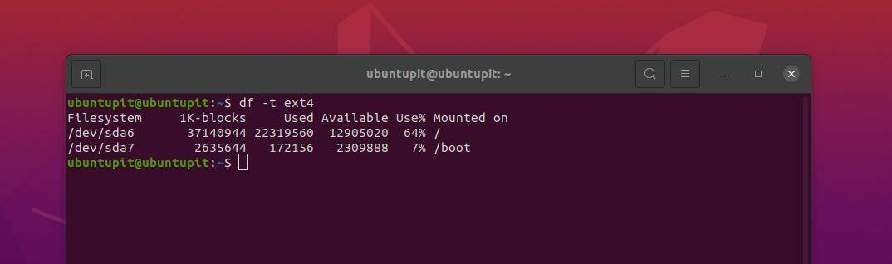
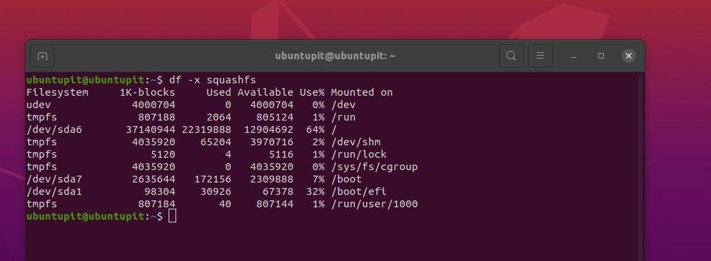
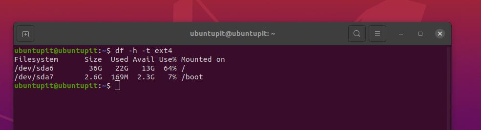
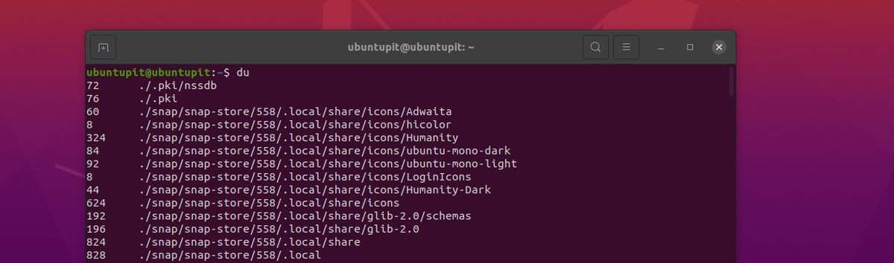
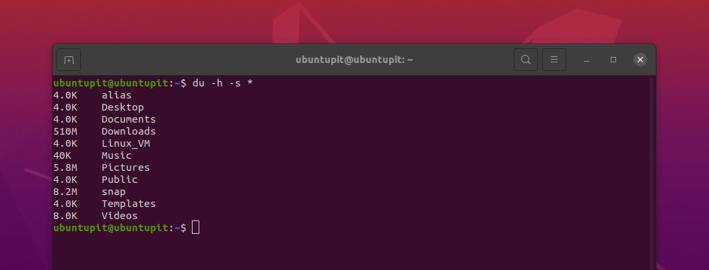
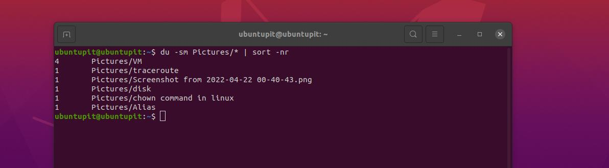

# How To Check Total Hard Disk Size

## **Hard Disk Size in Ubuntu Terminal**

___

In Linux, the file system reports are usually generated into block size. There are two syntaxes/commands to show the disk sizes on Linux; they are the du and df.

-   **df command –** The [df command](https://www.ubuntupit.com/practical-and-productive-example-of-linux-df-commands/ "40 Practical and Productive Example of Linux df Commands") shows the total used and free size of the disk. If you do not assign any filename, the system will mount the file into the primary disk. It shows the values in 1kB block size.
-   **du command –** The du shows the amount of disk space used by specified files and their subdirectory.

In this post, we’ll see how to check the hard disk size in Ubuntu through the du, and df commands on the terminal shell.

## **df Output Analysis on Ubuntu**

___

In the below command, we can see some specific values. Here we will see what they mean.

```shell
$ df
```



-   Filesystem: This shows the name of the filesystem.
-   1K-Blocks: See the total amount of available blocks on the file system measured on 1kB block.
-   Used: With the used parameter, you can monitor your used disk in 1kB block size.
-   Available: See the available disk on your Linux system in 1kB block size.
-   Use%: Use% allows you to see the used disk on Linux as a percentage value.
-   File: In the CLI, you can see the file name on your system.
-   Mounted on: Monitor the location where your filesystem or a single folder is mounted.

## **Check Hard Disk Size in Ubuntu Terminal With df Command**

___

Here, we will see a few most used df commands to check the hard disk size in Ubuntu through the terminal. You can execute the commands in any other Debian-based system as well.

### **1. df Terminal Command To Check Hard Disk Size in GB**

___

The below-mentioned df command will let you see the total size of the hard disk on your Ubuntu system.

```shell
$ df -a
```



### **2. Print Readable Data To Check Hard Disk Size in Ubuntu** 

___

Sometimes, through the command line, we might get some output data that is hard to understand or not readable for a human. To make the output simple and human-readable, please use the -h flag with the df command on the Ubuntu shell.

```shell
$ df -h
```

### **3. Print Disk Usage in Megabytes In Ubuntu Terminal**

___

You can use the -BM syntax on the command line to see the disk space in megabytes format on your Ubuntu system.

```shell
$ df -BM
```



### **4. Disk Info in Numbers of inodes**

___

In Ubuntu, you can also see the hard disk size and used amount through the terminal shell with their index node value. Knowing the index node value or the inodes will help you to set and organize the soft links on Linux.

```shell
$ df -i
```



Here is the explanation of the index nodes:

-   source: This shows the name of the files on the system.
-   fstype: It shows the type of the file on Ubuntu/Linux.
-   itotal: Display the size of the file through the terminal shell.
-   iused: This shows the total amount of used size on the disk.
-   iavail: See the free amount of the disk via the index node.
-   ipcent: View the used percentage of the hard disk in index node value.
-   size: Displays the hard disk size on Ubuntu in 1kB block size.

### **5. Include or Exclude File Types To Check Hard Disk Size in Ubuntu Terminal**

___

You can also exclude or include any type of file through the df command on Ubuntu. The below-mentioned command will tell us how we can assign a specific print type that will instruct the DF command to add the file to the output.

```shell
$ df -T
$ df -t ext4
```



### **6. See SquashFS Files**

___

The SquashFS files are special compressed files on Ubuntu and other Linux systems. It supports the block-size method to view the files. Execute the below-mentioned commands to see the used size of SquashFS files on your Ubuntu through the terminal.

```shell
$ df -x squashfs
$ df -x squashfs --total
```



### **7. See the Size of the Directory or Filesystem**

___

If you need to see the hard disk size or the block size of any specific directory or folder on Ubuntu Linux through the terminal shell, you can use the following df commands given below.

```shell
$ df /dev/sda1
$ df /dev/sda*
```

### **8. Alias with df To Check Hard Disk Size in Ubuntu Terminal**

___

If you have a bigger syntax with the DH command, you can use an alias for the DH syntax to make your command easier on the Ubuntu terminal shell.

```shell
$ alias dfc="df -h /dev/sda1 --output=source,fstype,size,used,avail,pcent"
```

### **9. Use -a Flag to Include All Filesystems**

___

You can add the -a flag to add all the filesystems on the terminal command for showing the hard disk size on Ubuntu.

```shell
$ df -a --output
$ df -a --output | less
```

### **10. Finding Out What’s Taking Up the Used Disk Space**

___

Through the below-mentioned DF command. You can monitor which particular directory is keeping your disk busy on your Ubuntu machine.

```shell
$ df -h -t ext4
```




### **11. Human readable output**

___


If you want to display free disk space in human readable output with sizes in M/G then use this command to check free file space on file system. For that you have to type command like this: 

Code:
```shell
$ df -h
## OR
$ df -k
```

The command shows the following output:  

> Filesystem Size Used Avail Use% Mounted on  
> /dev/md3 1.8T 205G 1.5T 13% 
> /tmpfs 16G 100K 16G 1% /dev/shm  
> /dev/md1 496M 73M 398M 16% /boot  
> /dev/md2 5.0G 1.1G 4.0G 22% /tmp
> 

In this command –h option is for “human readable” output. From this command you can check the free disk space with suffixes : Byte, Kilobyte, Megabyte, Gigabyte, Terabyte and Petabyte.


## **du Command on Ubuntu To Check Hard Disk Size in Terminal**

___

Through the DU command on Ubuntu, you can see the used and free size of the hard disk on the terminal shell. If you do not use any logical arguments with the DU command, it will conventionally show the disk space in 1024 bytes. Here we will see a few practical and most used examples of the DU command on Ubuntu to see the disk size in the Ubuntu terminal.

### **1. Get Started with du Command**

___

The below-mentioned du command on the Ubuntu terminal shell will give us the output of used and free hard disk sizes on the machine.

```shell
$ du
```



### **2. Human-Readable Output**

___

Earlier, we have seen how to print human-readable data for the DH command; the below-mentioned DU command also shows the human-readable block size or the disk size data in the Ubuntu terminal.

```shell
$ du -h
```

### **3. Summarize The Output**

___

You can execute the below-mentioned du command on your Ubuntu terminal shell to summarize the hard disk results on your system.

```shell
$ du -h -s *
```



### **4. Sort Hard Disk Results**

___

You can assign the DU command to sort the directory or folders that are using more disks on your Ubuntu system. The below-mentioned du command will give you the sorted results from largest to smallest disk used in the _Picture_ directory.

```shell
$ du -sm Pictures/* | sort -nr
```



## Reference

* https://www.ubuntupit.com/how-to-check-total-hard-disk-size-in-ubuntu-terminal/
* https://hoststud.com/resources/how-to-check-free-disk-space-on-centos-7.255/
* 