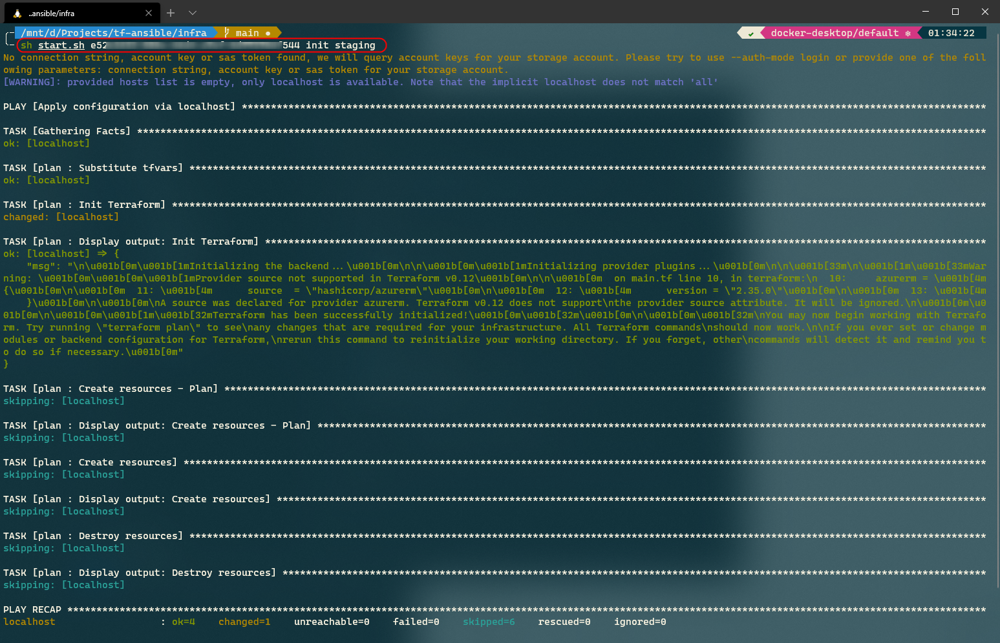
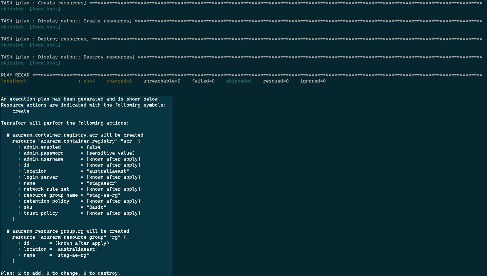
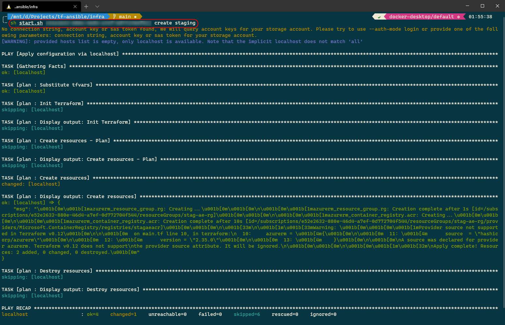
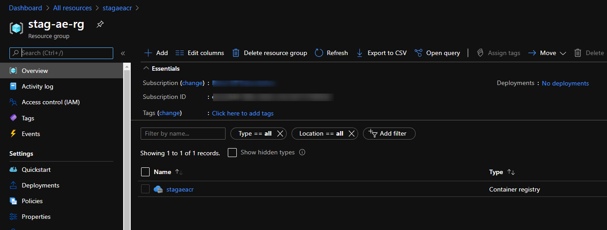
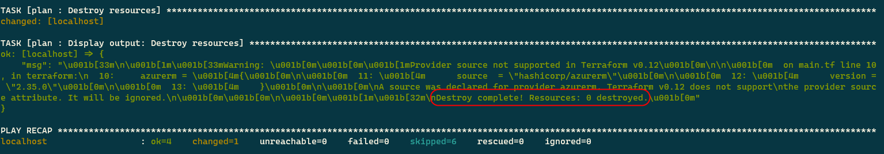
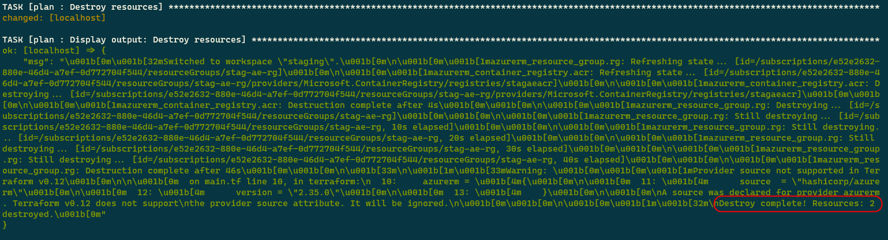

Terraform Deployments with Ansible - Part 2
===

> In this series
> 
> 1.  [Motivation & Ansible 101](./terraform-deployments-with-ansible-part-1.md "Terraform & Ansible")
> 2.  Terraform & Ansible

I am happy to see that many people are enthusiastic about this series and wish to make their IaC applications better with Ansible. What I intend to do is very simple. I will write an Ansible playbook that uses the template module (see [Templating with Jinja2](https://thecloudblog.net/post/simplifying-terraform-deployments-with-ansible-part-1/#templating-with-jinja2 "Templating with Jinja2")) and a little magic of Jinja2 templates to load appropriate variables and configurations for each Terraform environment. Finally, I will use the Terraform CLI to deploy and delete the infrastructure.

I am assuming that you understand the various components of Terraform well. Please refer to the [official Terraform documentation](https://www.terraform.io/docs/index.html) if the terms or concepts sound unfamiliar to you. Please install [Terraform CLI](https://learn.hashicorp.com/tutorials/terraform/install-cli) and [Azure CLI](https://docs.microsoft.com/en-us/cli/azure/install-azure-cli-apt) on your Linux system. If you are using Windows, install the dependencies on [WSL2](https://docs.microsoft.com/en-us/windows/wsl/install-win10).

## Source Code

Although I am going to walk you through the steps of setting up your playbook, here is the source code for quick reference.

## Directory Structure

To keep the example short and simple, let’s assume that we want to create an Azure Container Registry within an Azure Resource Group in two environments, viz. **staging** and **production**. Execute the following script to set up the relevant directories for the project. Refer to the [Ansible Roles](https://thecloudblog.net/post/simplifying-terraform-deployments-with-ansible-part-1/#roles "Ansible Roles") section of the previous post to understand the layout of the **roles** folder created by the command. The folder named **tf** will contain the Terraform configuration files, and the folder named **host\_vars** will contain the host-specific variables. There are multiple ways of setting the values of the variables used in an Ansible playbook. You can set them through the command line using the flag `-e` with the highest precedence or set them through files in the **host\_vars** or **group\_vars** folder. Each file in the **host\_vars** folder is named after the host that it represents. You can read more about [adding variables to an Ansible inventory](https://docs.ansible.com/ansible/latest/user_guide/intro_inventory.html#adding-variables-to-inventory) on the Ansible documentation website.

```
$ mkdir -p infra/{tf,roles/plan/{tasks,templates},host_vars}
$ tree

└── infra
    ├── roles
    │   └── plan
    │       ├── tasks
    │       └── templates
    ├── tf
    └── host_vars
```

The folders are now ready to be populated with relevant files. Let’s start adding them now.

## Terraform Configurations

Create a file named **main.tf** inside the folder **tf**. Add the following configuration code to the file to create an Azure Resource Group and an Azure Container Registry within the resource group.

```
terraform {
  backend "azurerm" {
    resource_group_name  = "tfstate-rg"
    storage_account_name = "mytfstatestore"
    container_name       = "tfstate"
    key                  = "terraform.tfstate"
  }

  required_providers {
    azurerm = {
      source  = "hashicorp/azurerm"
      version = "2.35.0"
    }
  }
}

provider "azurerm" {
  features {}
}

resource "azurerm_resource_group" "rg" {
  name     = var.rg_name
  location = var.region
}

resource "azurerm_container_registry" "acr" {
  name                = var.acr_name
  resource_group_name = azurerm_resource_group.rg.name
  location            = var.region
  sku                 = "Basic"
  admin_enabled       = false
}
```

You can see that we require some parameters in our configuration. Create a file named **variables.tf** in the same folder and specify the configuration parameters as follows.

```
variable "rg_name" {
  type = string
}

variable "region" {
  type = string
}

variable "acr_name" {
  type = string
}

variable "environment" {
  type = string
}
```

Let’s now create tasks in the `plan` [Playbook Role](https://docs.ansible.com/ansible/latest/user_guide/playbooks_reuse_roles.html).

## Playbook Role

As we discussed earlier, Ansible’s roles organization feature allows you to organize your Ansible files better. This organization helps in automatically loading the vars files and tasks based on the structure of the folders. Create a file named **main.yaml** in the tasks folder and define the tasks that constitute the plan.

```
- name: TF tasks
  import_tasks: tf-tasks.yaml
```

The task `TF tasks` will import the tasks present in the file **tf-tasks.yaml**. Create a file named **tf-tasks.yaml** and define the tasks as follows.

```
- name: Substitute tfvars
  template:
    src: templates/tfvars.j2
    dest: "{{ playbook_dir }}/tf/env.tfvars"

- name: Init Terraform
  shell: |
    cd {{ playbook_dir }}/tf;
    terraform init    
  when: (operation == "init")
  register: init

- name: "Display output: Init Terraform"
  debug:
    msg: "{{ init.stdout }}"
  when: (operation == "init")

- name: Create resources - Plan
  shell: |
    cd {{ playbook_dir }}/tf;
    terraform workspace new {{ env }}
    terraform workspace select {{ env }}
    terraform plan -var-file=env.tfvars -out=plan.tfplan;    
  when: (operation == "create-plan")
  register: create_plan

- name: "Display output: Create resources - Plan"
  debug:
    msg: "{{ create_plan.stdout }}"
  when: (operation == "create-plan")

- name: Create resources
  shell: |
    cd {{ playbook_dir }}/tf;
    terraform workspace select {{ env }}
    terraform apply plan.tfplan    
  when: (operation == "create")
  register: create

- name: "Display output: Create resources"
  debug:
    msg: "{{ create.stdout }}"
  when: (operation == "create")

- name: Destroy resources
  shell: |
    cd {{ playbook_dir }}/tf;
    terraform workspace new {{ env }}
    terraform workspace select {{ env }}
    terraform destroy -var-file=env.tfvars -auto-approve    
  when: (operation == "destroy")
  register: destroy

- name: "Display output: Destroy resources"
  debug:
    msg: "{{ destroy.stdout }}"
  when: (operation == "destroy")
```

An interesting aspect of the script is that it supports [conditional execution](https://docs.ansible.com/ansible/latest/user_guide/playbooks_conditionals.html). Without the `when` statement, all the playbook tasks would execute sequentially, which will lead to the creation and subsequent deletion of the resources whenever you run the playbook. We have added conditions on the execution of the tasks based on the value of the `operation` variable.

Here is what each task in the playbook does:

1.  **Substitute tfvars**: This task copies the Jinja2 template **templates/tfvars.j2** to **{{ playbook\_dir }}/tf/env.tfvars** after transforming the values of the variables. `{{ playbook_dir }}` is an inbuilt variable whose value is the path to the playbook file’s directory. In our case, it will be the path to the folder containing the playbook file **cluster.yaml**.
    
2.  **Init Terraform**: When the value of the parameter `operation` is set to **init**, this task will initialize Terraform, and the subsequent task will display the output of initialization on the console.
    
3.  **Create resources - Plan**: This task will compute the required changes to the infrastructure, and the next task will display the computed changes on the console. You might have noticed that we have used Terraform workspaces in this task. Since we have one state file configured for the Terraform backend, it will be overwritten whenever you reuse the state for a different environment (**production** and **staging**). [Terraform workspaces](https://www.terraform.io/docs/state/workspaces.html) create a separation between states based on a key, which, in our case, is the name of the environment.
    
4.  **Create resources**: This task will create the resources based on the plan file generated in the previous step. The subsequent task will print the status of the operation to the console.
    
5.  **Destroy resources**: This task will destroy the infrastructure. Please note that we have configured this step to execute without approval, and hence you should not use it in its current form on production.
    

Let’s now define the Jinja template, tfvars.j2, that we used in the playbook’s first task. Create a file named tfvars.j2 in the templates folder and add the following code to it.

```
rg_name = "{{ terraform['%s' | format(env)].rg_name }}"
region = "{{ terraform['%s' | format(env)].region }}"
acr_name = "{{ terraform['%s' | format(env)].acr_name }}"
environment = "{{ terraform['%s' | format(env)].environment }}"
```

The `terraform['%s' | format(env)]` will read the appropriate variable based on the value of the `env` variable. We will supply the value of the `env` variable when we run the playbook.

The value of `terraform['%s' | format(env)]` will be:

1.  terraform\[‘production’\] when the value of `env` is “production”.
2.  terraform\[‘staging’\] when the value of `env` is “staging”.

The variables such as `terraform['production'].rg_name` will be read from host variables file **host\_vars/localhost.yaml**. The template step of the playbook will place the [variable definition](https://www.terraform.io/docs/configuration/variables.html) (.tfvars) file next to the terraform configuration file **main.tf** after which you can execute the Terraform plan as follows.

```
terraform plan -var-file=env.tfvars
terraform apply -var-file=env.tfvars
terraform destroy -var-file=env.tfvars
```

Create a file named **localhost.yaml** in the **host\_vars** folder. The file **localhost.yaml** will be read by Ansible when we execute the playbook against the host localhost. The files in the **host\_vars** folder contain the variables that Ansible should use when targeting a particular host. You can also define variables that are common for all hosts in the same group here.

```
terraform:
  production:
    rg_name: "prod-ae-rg"
    region: "australiaeast"
    acr_name: "prodaeacr"
    environment: "production"
  staging:
    rg_name: "stag-ae-rg"
    region: "australiaeast"
    acr_name: "stagaeacr"
    environment: "staging"
```

With the nested configuration, the Jinja template will set the following values of the variables.

1.  **rg\_name** (= terraform\[‘production’\].rg\_name) will be set to **prod-ae-rg**
2.  **acr\_name** (= terraform\[‘staging’\].acr\_name) will be set to **stageacr**

Finally, you require the playbook file that will drive this workflow. Create a file named **deploy.yaml** in the **infra** folder. The following configuration will run the **plan** role tasks against the localhost.

```
- name: Apply configuration via localhost
  hosts: localhost
  connection: local
  roles:
    - plan
```

Let’s execute the playbook on both the environments to test our implementation.

## Execution Script

I have created a script that you can use to execute the playbook. Create a file named **start.sh** in the **infra** directory and populate it with the following code.

```
 1tfstate='mytfstatestore'
 2tfstaterg='tfstate-rg'
 3location='australiaeast'
 4
 5# Install AZ CLI
 6if ! command -v az >/dev/null; then
 7    curl -sL https://aka.ms/InstallAzureCLIDeb | sudo bash
 8fi
 9
10# Authenticate using service principal on CI
11az login
12az account set --subscription $1
13
14# Create TF state store resource group
15if [ $(az group exists --name $tfstaterg) = false ]; then
16    az group create --name $tfstaterg --location $location >/dev/null
17fi
18
19# Create TF state store
20if [ $(az storage account list --query '[].name' -o json | jq 'index( "$tfstate" )') ]; then
21    az storage account create -n $tfstate -g $tfstaterg -l $location --sku Standard_LRS >/dev/null
22    az storage container create -n tfstate --account-name $tfstate >/dev/null
23fi
24
25# For TF backend store
26export ARM_ACCESS_KEY=$(az storage account keys list -n $tfstate --query [0].value -o tsv)
27
28case $2 in
29"init")
30    ansible-playbook deploy.yaml -e env=$3 -e operation=init
31    ;;
32"destroy")
33    ansible-playbook deploy.yaml -e env=$3 -e operation=destroy
34    ;;
35"create")
36    ansible-playbook deploy.yaml -e env=$3 -e operation=create
37    ;;
38"create-plan" | *)
39    ansible-playbook deploy.yaml -e env=$3 -e operation=create-plan
40    if [ ! -f "/tf/plan.tfplan" ]; then
41        (
42            cd tf
43            terraform show plan.tfplan
44        )
45    fi
46    ;;
47esac
```

Terraform requires a state file to record the state of the infrastructure and configuration. Line 1 to 26 of the script creates a resource group, a storage account, and a container within the storage account to store the state. It will also install the Azure CLI if it is not already installed on your system. The connection key of the storage account is exposed to Terraform via the **ARM\_ACCESS\_KEY** environment variable. There are other approaches to configuring the azurerm backend you can read about on the [Terraform documentation website](https://www.terraform.io/docs/backends/types/azurerm.html).

Based on the positional parameter value passed to the script, you can perform the various Terraform operations viz. initialize, create the plan, create, and destroy. You can read more about Terraform commands on [its docs website](https://www.terraform.io/docs/commands/index.html).

## Showtime

Launch the terminal and change to the **infra** directory. Let’s begin by initializing the working directory containing the Terraform configuration files.

```
sh start.sh <subscription_id> init staging
```

The command leads to the execution of the following playbook command.

```
ansible-playbook deploy.yaml -e env=staging -e operation=init
```



Terraform Init

Let’s now try to create a Terraform execution plan by executing the following plan.

```
sh start.sh <subscription_id> create-plan staging
```

The ansible command executed is the following.

```
ansible-playbook deploy.yaml -e env=staging -e operation=create-plan
```



Terraform Plan

Let’s now instruct Terraform to create the resources by executing the following command.

```
sh start.sh <subscription_id> create staging
```

The Ansible playbook command executed this time is the following.

```
ansible-playbook deploy.yaml -e env=staging -e operation=create
```



Terraform Apply

Let’s check our Azure subscription to verify the status of the operation.



Azure subscription snapshot

Let’s try to delete the resources in the production environment that should not affect the resources we just created.

```
sh start.sh <subscription_id> destroy production
```

You will find out that none of the resources are destroyed.



Terraform destroy - production

Finally, let’s delete the resources we created by removing the infrastructure defined in the **staging** workspace.

```
sh start.sh <subscription_id> destroy staging
```

The following screenshot shows the output of the command.



Terraform destroy - staging

## Conclusion

We discussed how we could combine Ansible and Terraform and use a little bit of magic of Jinja templates to generate .tfvar files for Terraform dynamically. You must have noticed that this approach is quite flexible and not dependent on Terraform. You can use the same approach to simplify your [Azure ARM templates](https://docs.microsoft.com/en-us/azure/azure-resource-manager/templates/overview) as well.

