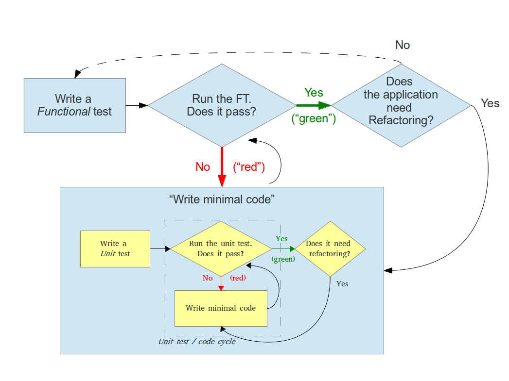

# Test Driven Development

To summarize, the Test-driven-development (TDD) process is to 

1) divide the problem into parts, 
2) write a functional test for each part, 
3) write code for each part, 
4) see if functional tests passes/fails and 
5) refactor code accordingly until success.

Here is a workflow suggested in the book [Test-Driven Development with Python](http://chimera.labs.oreilly.com/books/1234000000754) by Harry Percival (available online for free).

## Importance of Functional Test Environment

The functional test workflow uses a "production-like" functional test environment to run validation tests for all specified functions / features.

The key motivation is to front-center the need to have an actual dedicated fixed QA/Functional test environment with separate credentials - not touching production assets (to the extent possible) - setup to fully enable this workflow - which is essential to infrastructure code development.

### Mitigates risk of "code in development"

NO developer writes "perfect" code "All the time" and as such, you would never let developers develop code against your production environment.  This is even more critical/true for infrastructure automation development since if code is not written to work correctly it can (and will) screw up your production environment.

### Mitigates risk of "lack of initial feature clarity/understanding"

Another factor to consider is that the feature under development is not necessarily entirely clear or well-understood at the time of the initial request.  Often times, especially for more complex/highly integrated features, the feature set gets elaborated as the development iterates towards a clearer solution/implementation.

## Code development is highly iterative in nature

By adopting "test-driven-development" you readily admit code development requires many iterations of "developing functional test cases", "develop functional code", "Test the function", "refactor the code until FT success", repeat cycle for each requested feature set throughout time and include already developed feature tests in next iteration. 

This is the realistic code development paradigm and using a TDD process/approach achieves high level of QA by adopting repeatable and automatable validation test validation criteria and processes used.

## Reference

* https://d-heinrich.medium.com/test-driven-development-with-ansible-using-molecule-3386cef987ac
* https://testdriven.io/blog/modern-tdd/
* https://code.tutsplus.com/tutorials/beginning-test-driven-development-in-python--net-30137
* https://www.freecodecamp.org/news/learning-to-test-with-python-997ace2d8abe/
* https://www.ideamotive.co/blog/test-driven-development-with-python
* https://www.guru99.com/test-driven-development.html
* https://stackoverflow.com/questions/4658382/test-driven-development-tdd-for-user-interface-ui-with-functional-tests
* https://www.oreilly.com/library/view/test-driven-development-with/9781491958698/app08.html
* https://xenonstack.wordpress.com/2018/03/13/test-driven-development-behavior-driven-development-in-golang/
* https://www.tmap.net/wiki/test-driven-development
* Agarwal, R., & Umphress, D. (2008). Extreme programming for a single person team. Proceedings of the 46th Annual Southeast Regional Conference (ACM-SE 46), 82–87. New York, NY, USA: ACM. DOI: 10.1145/1593105.1593127 
* Bhat, T., & Nagappan, N. (2006). Evaluating the efficacy of test-driven development: industrial case studies. 2006 ACM/IEEE international symposium on Empirical software engineering (ISESE), 356–363. New York, NY, USA: ACM. DOI: 10.1145/1159733.1159787 
* Gupta, A., & Jalote, P. (2007). An Experimental Evaluation of the Effectiveness and Efficiency of the Test Driven Development. First International Symposium on Empirical Software Engineering and Measurement (ESEM), 285–294. DOI: 110.1109/ESEM.2007.41 
* Olan, M. (2003). Unit testing: test early, test often. Journal of Computing Sciences in Colleges, 19(2), 319–328. Retrieved from ACM Digital Library 
* Vu, J. H., Frojd, N., Shenkel-Therolf, C., & Janzen, D. S. (2009). Evaluating Test-Driven Development in an Industry-Sponsored Capstone Project. Sixth International Conference on Information Technology: New Generations (ITNG), 229–234. DOI: 10.1109/ITNG.2009.11 
* Williams, L., Maximilien, E. M., & Vouk, M. (2003). Test-driven development as a defect-reduction practice. 14th International Symposium on Software Reliability Engineering (ISSRE), 34–45. DOI: 10.1109/ISSRE.2003.1251029
