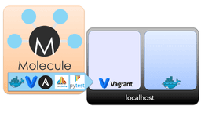
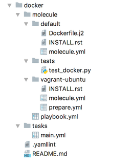
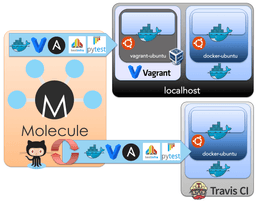
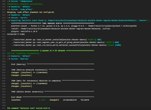
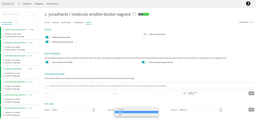
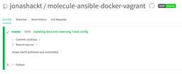

# Continuous Infrastructure with Ansible, Molecule & TravisCI

The benefits of Test-driven development (TDD) for infrastructure code are undeniable. But we shouldn't settle there! What about executing these tests automatically and based on a regular schedule? Applying Continuous Integration to infrastructure code should be the next step.

## Ansible & Molecule – blog series

Part 1: [Test-driven infrastructure development with Ansible & Molecule](./test-driven-infrastructure-ansible-molecule-and-testinfra.md)  
Part 2: Continuous Infrastructure with Ansible, Molecule & TravisCI  
Part 3: [Continuous cloud infrastructure with Ansible, Molecule & TravisCI on AWS](./tdd-ansible-molecule-travisci-aws.md)

## What about Continuous Integration in Infrastructure-as-Code?

The [first blog post of this series](./test-driven-infrastructure-ansible-molecule-and-testinfra.md) outlined the many benefits of Test-driven infrastructure development and showed how to implement it with Ansible and Molecule. Now we're able to write tests for our infrastructure first – just as we are used to from software development. The ability to refactor our code with greater confidence is now equally available in Infrastructure-as-Code projects.


But what about the dreaded updates of components or libraries we use? It's a great advantage to be able to write tests – but shouldn't we execute them regularly using some sort of Continuous Integration platform? We practice the same for “normal” code achieving much more reliability. If we don't build and execute our code regularly, it will eventually begin to rot. Having test-driven development ready for our infrastructure code, we should also leverage the power of [Continuous Integration](https://en.wikipedia.org/wiki/Continuous_integration) ! Otherwise our infrastructure code will become more and more useless – with or without tests in place.

## Cloud CI platforms don't support Vagrant

[In the last blog post](https://blog.codecentric.de/en/2018/12/test-driven-infrastructure-ansible-molecule/) we chose [Vagrant](https://www.vagrantup.com/) as the infrastructure provider for the `create` phase of our Molecule setup, which is a perfect fit for local test-driven development. Vagrant provides us with full-blown virtual machines, without the need to manage them ourselves. This enables us to develop solid Ansible roles for our staging and production systems.

But if we want to bring Continuous Integration into the game, we need to be able to **execute our Molecule tests on a common Continuous Integration platforms**. Using Vagrant there is also no problem if you're running your own Continuous Integration server. But there are plenty of cloud solutions out there that are free to use in Open Source projects. Just to mention [TravisCI](https://travis-ci.org/) , [CircleCI](https://circleci.com/) or [AppVeyor](https://www.appveyor.com/) . It would be great to be able to use them!

Though running Vagrant inside TravisCI or CircleCI [is definitely not possible](https://stackoverflow.com/a/32191959/4964553) . I was really surprised about AppVeyor! Compared to its contenders, a full installation of _VirtualBox_ and _Vagrant_ is possible there. Also the `vagrant up` command looks like it's working at first. If you want to have a look into the details, I prepared an example project for you: [jonashackt/vagrant-ansible-on-appveyor](https://github.com/jonashackt/vagrant-ansible-on-appveyor) . But the working solution [described here](https://help.appveyor.com/discussions/problems/1247-vagrant-not-working-inside-appveyor) doesn't seem to work anymore. Even AppVeyor support [was at a loss about that](https://help.appveyor.com/discussions/problems/18217-vagrant-on-appveyor-not-working-both-on-windows-ubuntu) .

But using Vagrant also has its downsides. Although we get the best experience in terms of replication of our staging and production environments, the preparation step takes relatively long to complete since a whole virtual machine has to be downloaded and booted. And that's nothing new. **[Docker](https://www.docker.com/) has been here for a long time now to overcome this downside.** And it is supported on all major cloud Continuous Integration platforms. So it would be ideal if we were able to use Docker with Molecule.

## Multiple infrastructure providers in Molecule

This blog series' first article already outlined that [Molecule supports a wide range of infrastructure providers & platforms](https://molecule.readthedocs.io/en/latest/configuration.html#driver) . **If Ansible can manage it, Molecule can use it too.** So there should be no problem switching to Docker. But we also don't want to abandon Vagrant completely since there are maybe situations where we want to test our Ansible roles against full-blown virtual machines. Luckily Molecule can help us. 🙂 We simply need to leverage [Molecule's multi-scenario support](https://molecule.readthedocs.io/en/latest/configuration.html#scenario) .

> **Molecule treats scenarios as first-class citizens**, with a top-level configuration syntax.

As the docs state, multi-scenario isn't an optional feature of Molecule. If you followed the first blog post of this article series, you may already have initialized a new Ansible role with Molecule support build in using the `molecule init role` command. Besides the standard Ansible role directories, this places a `molecule` folder inside the role skeleton. This in turn contains the directory `default` **which already defines a scenario name!** If you ran a Molecule test, already this scenario name could be also found inside the output. So it should be easy to extend our Molecule setup to support both Vagrant and Docker at the same time:



logo sources: [Molecule logo](https://molecule.readthedocs.io/en/latest/) , [Vagrant logo](https://www.vagrantup.com/) , [Ansible logo](https://www.ansible.com/) , [Docker logo](https://www.docker.com/) , [Testinfra logo](https://testinfra.readthedocs.io/en/latest/) , [pytest logo](https://docs.pytest.org/en/latest/)

## Molecule's project setup with multiple scenarios

The support for scenarios that allow Molecule to test an Ansible role in different ways is **the biggest change from Molecule version 1 to Molecule 2.x**. And it is quite powerful. Molecule scenarios enable us to split the parts of our test suites into _two kinds_. The first one is _scenario-specific_ and is therefore placed into separate directories, which also defines the individual scenario name. This could contain infrastructure provider specific configuration for example. The second kind are files that should _stay the same across all scenarios_. Our **test cases** are good candidates for this, they **should remain the same all over our scenarios**.

> The default scenario is named default, and every role should contain a default scenario.

As already mentioned, I strive to enable the reader to be able to comprehend everything I write about. And therefore this post is accompanied by an example project on GitHub: [jonashackt/molecule-ansible-docker-aws](https://github.com/jonashackt/molecule-ansible-docker-aws) , which was already used for the first article of this blog series. Vagrant was the only infrastructure provider there. I chose to integrate the Docker provider into this repository since I think **multi-scenario configuration will soon become the norm when using Molecule in your own projects**.

As Docker is the default infrastructure provider in Molecule, I simply renamed `default` into `vagrant-ubuntu`. Then I created a new directory with the name `default` to contain all the Docker configuration for Molecule. This results in the following project structure which resembles [Molecule's best practice](https://molecule.readthedocs.io/en/latest/examples.html#sharing-across-scenarios) on _how to use multiple scenarios inside the same Ansible role_:



As you may note, all the files which belong only to a certain scenario are **placed inside the scenario’s directory**. For example only the `default` Docker scenario contains a `Dockerfile.js`. On the contrary the `vagrant-ubuntu` scenario contains a `prepare.yml`. This file is generated as a default in case you use the Vagrant infrastructure provider in Molecule and is automatically picked up by `molecule test` runs. The file `prepare-docker-in-docker.yml` is a manually crafted playbook. We'll cover that next.

## Configure molecule.yml to support multiple scenarios

Furthermore, both `molecule.yml` files have to be changed in order to be able to execute the `playbook.yml`. This file is used to execute the Ansible role under test. But using multiple scenarios, we have to configure the `provisioner` in order to enable Molecule to find it. The same applies to the test cases which are now in a **different directory compared to** the default one generated in **single scenario use cases**. So let's look at the molecule.yml inside our example project to see how both can be configured:

```yaml
...
provisioner:
  name: ansible
...
  playbooks:
    converge: ../playbook.yml
...
verifier:
  name: testinfra
  directory: ../tests/
...

```

The configuration items `playbooks.converge` and `verifier.directory` can be used to configure our multi-scenario setup. There are endless options to change the project structure that way. One could also centralize all tests and playbooks in a `resources` directory [as the docs state](https://molecule.readthedocs.io/en/latest/examples.html#sharing-across-scenarios) . The crucial point is just to **divide things that are scenario-specific and others that are not**.

To execute Molecule, using a certain scenario can be done with the help of the `--scenario-name` flag. As we now renamed our Vagrant scenario into `vagrant-ubuntu`, we need to change our `molecule test` command slightly:

```shell
molecule test --scenario-name vagrant-ubuntu

```

There should always be a default scenario. As we placed our Docker configuration in the `default` directory, all we need to do in order to run this scenario is the following:

Just be sure to have the [pip package](https://pypi.org/) `docker-py` installed, as it is the prerequisite to be able to execute Molecule tests with the Docker infrastructure provider. You can install it via:

## Installing Docker in Docker

In the last blog post of these series I outlined to have two reasons for having chosen the [installation of Docker on Ubuntu](https://docs.docker.com/install/linux/docker-ce/ubuntu/) as the goal for which we develop this article's Ansible role. I promised to explain the second reason as we leave our hello-world example. **And here we are!** As we want to use cloud Continuous Integration platforms we are determined to use Docker as our Molecule tests' infrastructure provider. At the same time we choose the use case **installation of Docker on Ubuntu** for our role. This means we don't install Docker into a Vagrant Box only, but we also need to install Docker inside a Docker container. 🙂


logo sources: [Molecule logo](https://molecule.readthedocs.io/en/latest/) , [Vagrant logo](https://www.vagrantup.com/) , [VirtualBox logo](https://www.virtualbox.org/) , [Ansible logo](https://www.ansible.com/) , [Docker logo](https://www.docker.com/) , [Testinfra logo](https://testinfra.readthedocs.io/en/latest/) , [pytest logo](https://docs.pytest.org/en/latest/) , [Ubuntu logo](https://design.ubuntu.com/brand/ubuntu-logo/)

You may say that [this is a problem already solved](https://stackoverflow.com/questions/44451859/how-to-install-docker-in-docker-container) . And you're absolutely right. There's an [official Docker-in-Docker image](https://hub.docker.com/_/docker/) provided by Docker Inc itself. So we can use that and we're off the hook! **Well, not really.** These images are based on Alpine Linux. But we want our role to be designed to run on Ubuntu. This means we use `apt` package manager instead of Alpine’s standard `apk`. Thus we can’t use the standard Docker-in-Docker image.

And there we are at the point where I wanted us to be: leaving the hello-world example and entering the realm of real world problems! Now we have a Ansible role designed for Ubuntu. And **we don't want to change our use case only because our test framework isn't able to run on cloud CI providers.**

## Ubuntu-based Docker-in-Docker builds

And there should be a way to do a Docker-in-Docker installation with an Ubuntu-based image like `ubuntu:bionic`! [And there is.](https://stackoverflow.com/questions/43085429/run-docker-build-in-ubuntu16-04-docker/43088716#comment93824772_43088716) 🙂 Let's assume the [standard Ubuntu Docker installation](https://docs.docker.com/install/linux/docker-ce/ubuntu/#install-docker-ce-1) is our starting point. Everything described there is done inside our Ansible role under test called `docker` as described inside the playbook docker/tasks/main.yml.

As there are some additional steps needed to achieve a working Docker installation inside a Docker container, we need to use Molecule's `prepare` step inside our `default` Docker scenario.

> The prepared playbook executes actions that bring the system to a given state prior to converge. It is executed after create, and only once for the duration of the instance’s life. This can be used to bring instances into a particular state, prior to testing.

[As the docs state,](https://molecule.readthedocs.io/en/latest/configuration.html#id12) the keyword `provisioner.playbooks.prepare` can be used to configure a custom prepare playbook inside our molecule.yml:

```yaml
...
  playbooks:
    prepare: prepare-docker-in-docker.yml
    converge: ../playbook.yml
...

```

Now the prepare-docker-in-docker.yml will be called right before Molecule's `converge` phase every time we run `molecule test` or `molecule converge`. It contains all the steps necessary to run a successful Docker-in-Docker installation:

```yaml
# Prepare things only necessary in Ubuntu Docker-in-Docker scenario
- name: Prepare
  hosts: all
  tasks:
  - name: install gpg package
    apt:
      pkg: gpg
      state: latest
      update_cache: true
    become: true
 
    # We need to anticipate the installation of Docker before the role execution...
  - name: use our role to install Docker
    include_tasks: ../../tasks/main.yml
 
  - name: create /etc/docker
    file:
      state: directory
      path: /etc/docker
 
  - name: set storage-driver to vfs via daemon.json
    copy:
      content: |
        {
          "storage-driver": "vfs"
        }
      dest: /etc/docker/daemon.json
 
  # ...since we need to start Docker in a completely different way
  - name: start Docker daemon inside container see https://stackoverflow.com/a/43088716/4964553
    shell: "/usr/bin/dockerd -H unix:///var/run/docker.sock > dockerd.log 2>&1 &"

```

As the `ubuntu:bionic` Docker image is sligthly stripped down compared to a “real” Ubuntu virtual machine, we need to install the `gpg` package at first.

Molecule offers us no phase between `converge` and `verify` where we can execute additional steps that are only needed inside a specific scenario. So we need to anticipate the installation of Docker inside Molecule's `prepare` step already. To avoid code duplication, we leverage the `include_tasks` keyword to use our Ansible role itself, since that one is designed to just install Docker on Ubuntu.

Now to successfully run Docker-in-Docker [we need to do three things](https://stackoverflow.com/questions/43085429/run-docker-build-in-ubuntu16-04-docker/43088716#comment93824772_43088716) :

**1\. Run Docker using the `--priviledged` flag** (which should really only be used inside CI environments, [because it grants full access to the host environment](https://hub.docker.com/_/docker/) )  
2\. **Use the [storage-driver `vfs`](https://docs.docker.com/storage/storagedriver/vfs-driver/#configure-docker-with-the-vfs-storage-driver)** , which is slow & inefficient but it is the only one guaranteed to work regardless of underlying filesystems  
3\. **Start the Docker daemon with** `/usr/bin/dockerd -H unix:///var/run/docker.sock > dockerd.log 2>&1 &` (otherwise we'll [run into errors like](https://stackoverflow.com/a/43088716/4964553) `Cannot connect to the Docker daemon at unix:///var/run/docker.sock. Is the Docker daemon running?`)

Step **2.** & **3.** are already handled by our prepare-docker-in-docker.yml. To enable the `--priviledged` mode, we need to configure Molecule’s Docker driver inside our molecule.yml:

```yaml
...
driver:
  name: docker
platforms:
  - name: docker-ubuntu
    image: ubuntu:bionic
    privileged: true
...

```

## Verifying the Docker-in-Docker installation

In the first article of this blog series we already implemented a suitable test case to verify if a Docker installation was fully successful. Because remember: **Only a valid test exection should be able to convince us that something is really working.** So let's have a look at the last test case inside the example project's test suite docker/molecule/tests/test\_docker.py:

```python
 
def test_run_hello_world_container_successfully(host):
    hello_world_ran = host.run("docker run hello-world")
 
    assert 'Hello from Docker!' in hello_world_ran.stdout

```

As mentioned, this test case executes a container based on [the hello-world Docker image](https://hub.docker.com/_/hello-world/) which testifies to a successful Docker installation if the string `Hello from Docker!` outputs on the commandline. So let's verify if our Ansible role is fully functional, although we install Docker into Docker. Therefore we simply need to execute:

This should result in a full Molecule test execution like shown in the following asciinema cast:

[](https://asciinema.org/a/214914)

Finally we're where we wanted to be in the first place! Now that we are able to **run our Molecule test solely relying on Docker** as the infrastructure provider, we can use one of those shiny cloud Continuous Integration platforms.



logo sources: [Molecule logo](https://molecule.readthedocs.io/en/latest/) , [Vagrant logo](https://www.vagrantup.com/) , [VirtualBox logo](https://www.virtualbox.org/) , [Ansible logo](https://www.ansible.com/) , [Docker logo](https://www.docker.com/) , [Testinfra logo](https://testinfra.readthedocs.io/en/latest/) , [pytest logo](https://docs.pytest.org/en/latest/) , [Ubuntu logo](https://design.ubuntu.com/brand/ubuntu-logo/) , [TravisCI logo](https://travis-ci.com/logo)

**As I really use it a lot for Open Source projects**, I choose [TravisCI](https://travis-ci.org/) as an example Continuous Integration platform here. But the setup is quite similar to other CI systems and should be easily adaptable to them. Let's take a look at the example project's [.travis.yml](https://github.com/jonashackt/molecule-ansible-docker-aws/blob/travis/.travis.yml) :

```yaml
---
sudo: required
language: python
 
services:
- docker
 
install:
- pip install molecule
- pip install docker-py
 
script:
- cd docker
- molecule test

```

In order to configure Travis to use a worker with Docker pre-installed, we need to configure `docker` in the `services` section. Then we should install [Molecule's pip package](https://pypi.org/project/molecule/) , which will install all the needed tools (including Ansible) to execute our tests. Same as we're used to locally, we need to add the `docker-py` pip package as we want to use Docker as Molecule's infrastructure provider.

As molecule tests are executed from within the role's directory, we `cd` into it and then run Molecule via `molecule test`. And that's it! **Now every code commit pushed** [into our GitHub repository](https://github.com/jonashackt/molecule-ansible-docker-aws) issues a new TravisCI build that runs our full Testinfra test suite with the help of Molecule:



## Running our Molecule test with TravisCI cron jobs

We can extend the safety net even more using [TravisCI Cron Jobs](https://docs.travis-ci.com/user/cron-jobs/) . Because they…

> …work similarly to the cron utilty, they run builds at regularly scheduled intervals independently of whether any commits were pushed to the repository.

That means **our code is not only tested when new commits** are pushed into our Git repository, **but also on a regular basis** like once every week. And they also use the same notification settings like normal builds that were triggered through a push – so we will be notified via Mail if some of our projects stopped working as expected.

To configure a cron job, head over to the settings tab of your TravisCI project. Scroll down a bit to find the **Cron Jobs** section [where you can add them](https://docs.travis-ci.com/user/cron-jobs/#adding-cron-jobs) . You can choose from different intervals like `daily`, `weekly` or `monthly`:



Having a cron job configured, TravisCI now automatically runs our Molecule test suite every week! You can see a **small cron logo** at your TravisCI job log like this:



## Test-driven development meets Continuous Infrastructure

**Adding Continuous Integration to Test-driven development for infrastructure code makes for a really great combination!** The article showed how to really set up Continuous Integration for Ansible playbooks using Molecule and TravisCI. And there's more! With Molecule's multi-scenario support we can **test our Ansible roles against many different infrastructure providers**. Right here we used Vagrant and Docker. But this can be extended by any other infrastructure, be it bare-metal, virtual or cloud. The only precondition is that Ansible has to support it.

We also saw how we can test **real-world scenarios using Docker as the only infrastructure**. Cloud Continuous Integration platforms like TravisCI or CircleCI support Docker exclusively. So we found a way to do everything solely using Containers. Certainly it cannot be guaranteed that each and every use case can be handled with Docker only. But there's also a common practice in projects to set up their own CI platform – e.g. with GitLab CI (I've written about [how to setup GitLab CI with Ansible](https://blog.codecentric.de/en/2018/05/gitlab-ci-pipeline/) some time ago). Having such a full-blown platform available, you can simply pick and choose the infrastructure provider you'd like to use with Molecule.

But whatever CI platform you select, **Using Continuous Integration practices will help you gain a lot more confidence in your infrastructure code!** Every change of the code base will trigger a full Molecule test run. Assuming that [there are tests in place](https://blog.codecentric.de/en/2018/12/test-driven-infrastructure-ansible-molecule/) that leverage a reasonable coverage, **the dreaded updates of components and libraries we use should lose their terror**. And with automatic CI runs based on a regular schedule, we bring this safety net to infrastructure code that's not touched that often. It will notify us automatically via Mail if some long forgotten code fragment stopped working. And remember: We tend to forget really quick.

What a great journey. 🙂 But there are some topics left. Using a cloud infrastructure provider together with Molecule would be great for more complicated cases [like a Kubernetes installation](https://github.com/jonashackt/kubernetes-the-ansible-way) . We should also take a look at how to test multiple Ansible roles with Molecule and how we could test really big Ansible projects containing endless playbooks. There are also [alternatives to the verifier](https://molecule.readthedocs.io/en/latest/configuration.html#verifier) Testinfra, like [Goss](https://github.com/aelsabbahy/goss) and [Inspec](https://www.chef.io/inspec/) which might also be worth a look! So stay tuned.


## Links:

- [Molecule](https://molecule.readthedocs.io/en/2.20/configuration.html)
- [Molecule on github.com](https://github.com/ansible/molecule)
- [Ansible](https://www.ansible.com/)
- [Inspec](https://www.inspec.io/)
- [Goss](https://goss.rocks/)
- [Testinfra](https://testinfra.readthedocs.io/en/latest/)
- [test-driven-infrastructure with ansible molecule and testinfra](https://blog.codecentric.de/test-driven-infrastructure-ansible-molecule)
- [TDD with ansible](https://d-heinrich.medium.com/test-driven-development-with-ansible-using-molecule-3386cef987ac)
