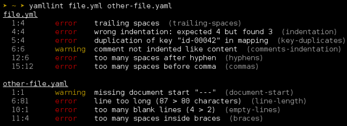

# Test driven Development with Ansible

How can we test Ansible code properly...molecule. I hope this post helps you to improve your automation processes, speeds up your ansible role development and increases their reliability.

First of an introduction to Molecule:

Molecule is a Python written tool which works similiar to Chef’s kitchen.

Molecule consists of three major components:

-   [Driver](https://molecule.readthedocs.io/en/2.20/configuration.html#driver)
-   [Linter](https://molecule.readthedocs.io/en/2.20/configuration.html#lint) and
-   [Verifier](https://molecule.readthedocs.io/en/2.20/configuration.html#verifier)

## **Overview**

**Drivers** are the environment in which I choose to run my playbooks. So it could be (as of now 2019–04–08) one of:

-   Azure
-   Vagrant
-   Docker
-   Delegated
-   EC2
-   GCE
-   Linode
-   LXC
-   LXD
-   Openstack

[**Linter**](https://en.wikipedia.org/wiki/Lint_%28software%29) is a tool that analyzes source code to flag programming errors, [bugs](https://en.wikipedia.org/wiki/Software_bug), stylistic errors, and suspicious constructs ([Wikipedia](https://en.wikipedia.org/wiki/Lint_%28software%29))

For now its just [**Yamlint**](https://github.com/adrienverge/yamllint) since ansible tasks and playbooks are written in yaml.



[Verifier](https://molecule.readthedocs.io/en/2.20/configuration.html#verifier)

-   [Goss](https://molecule.readthedocs.io/en/2.20/configuration.html#goss)
-   [Inspec](https://molecule.readthedocs.io/en/2.20/configuration.html#inspec)
-   [Testinfra](https://molecule.readthedocs.io/en/2.20/configuration.html#testinfra)

Stages molecule runs:

1.  Lint
2.  SyntaxCreate
3.  Prepare Tests
4.  Converge Tests
5.  Idempotence Tests
6.  Side effects Tests
7.  Verify Tests
8.  Cleanup

## **Working with Molecule**

We will use **Docker** as the driver. It was our choice because it is lightweight and easy to use/setup/install. 

Whenever we develop a new role, we can just run it locally and `exec` into the container if something does not go well. Then we can quickly test multiple operating systems like Debian, CentOS, RedHat or Ubuntu.  

We also will use **inspec** as our verifier and yamlint as the linter of choice.

## Preparation

1. Create a **virtualenv**

```
$ virtualenv /tmp/.env
Running virtualenv with interpreter /home/linuxbrew/.linuxbrew/bin/python2  
New python executable in /tmp/.env/bin/python2  
Also creating executable in /tmp/.env/bin/python  
Installing setuptools, pkg_resources, pip, wheel...done.
```

2. Source the **virtualenv**

```shell
$ source /tmp/.env/bin/active
(.env) $
```

3. Install Molecule

```shell
(.env) $ pip install molecule==2.20  
DEPRECATION: Python 2.7 will reach the end of its life on January 1st, 2020. Please upgrade your Python as Python 2.7 won't be maintained after that date. A future version of pip will drop support for Python 2.7.  
Collecting molecule==2.20  
Downloading
[..omitted..]
Successfully installed ansible-lint-4.1.0 entrypoints-0.3 flake8-3.7.7 functools32-3.2.3.post2 idna-2.7 molecule-2.20.0 pbr-5.1.1 pycodestyle-2.5.0 pyflakes-2.1.1 testinfra-1.19.0 typing-3.6.6
```

4. Verify installation

```shell
(.env) $ pip list | grep -e molecule -e ansible
ansible                       2.7.9      
ansible-lint                  4.1.0      
molecule                      2.20.0     
testinfra                     1.19.0
```

After the preparation is done we could initialize our first role with molecule  
Find all possible options with help:

```shell
(.env) $ $ molecule init role --help
Usage: molecule init role [OPTIONS]
Initialize a new role for use with Molecule.
Options:
  --dependency-name [galaxy]      Name of dependency to initialize. (galaxy)
  -d, --driver-name [azure|delegated|docker|ec2|gce|linode|lxc|lxd|openstack|vagrant]
                                  Name of driver to initialize. (docker)
  --lint-name [yamllint]          Name of lint to initialize. (yamllint)
  --provisioner-name [ansible]    Name of provisioner to initialize. (ansible)
  -r, --role-name TEXT            Name of the role to create.  [required]
  --verifier-name [goss|inspec|testinfra]
                                  Name of verifier to initialize. (testinfra)
  --help                          Show this message and exit.
```

So we choose to use a docker driver with the yamlinter and the inspec verifier.  
(Please **replace role-name** in your case)

```shell
(.env) $ molecule init role --role-name role-name --verifier-name inspec --driver-name docker --lint-name yamllint
--> Initializing new role role-name...
Initialized role in /tmp/role-name successfully.
```

After doing this we have a fresh ansible role waiting to get some tasks:

```shell
(.env) $ tree role-name/
role-name/
├── defaults
│   └── main.yml
├── handlers
│   └── main.yml
├── meta
│   └── main.yml
├── molecule
│   └── default
│       ├── Dockerfile.j2
│       ├── INSTALL.rst
│       ├── molecule.yml
│       ├── playbook.yml
│       ├── tests
│       │   └── test_default.rb
│       └── verify.yml
├── README.md
├── tasks
│   └── main.yml
└── vars
    └── main.yml
8 directories, 12 files
```

## Test driven development approach with ansible

Now we are writing our tests first. So think about what you are trying to achive using this role.

Every change you do later should be first written into your `sshd.rb` file.

Let's say our task is to make sure that the `openssh-server` is installed and configured properly.

What do we need to look at?

1.  make sure it is installed and has a certain version regarding to lately published CVs
2.  ensure that the service is enabled (starts on boot),running and the service is present
3.  Lastly we have to check for certain configurations also regarding to some CVs

The tests could look like this: `molecule/default/tests/sshd.rb`

```chef
describe package('openssh-server') do
  it { should be_installed }
  its('version') { should cmp  >= '1:7.4p1-10+deb9u4' }
end
describe service('ssh.service') do
  it { should be_enabled }
  it { should be_installed }
  it { should be_running }
end
describe sshd_config do
  its('content') { should match(%r{^Port}) }
  its('Port') { should_not cmp  ['22','1022','10022'] }
  its('Protocol') { should cmp ['2', '3']}
  its('content') { should match(%r{^UseDNS}) }
  its('UseDNS') { should cmp('no') }
  its('LogLevel') { should cmp('VERBOSE') }
end
```

## Writing the ansible-role

Now that we have our tests in place, we can start to create our ansible-role itself.

We write the following role:

`$ cat role-name/tasks/main.yml`

```yaml
---
- name: SSHD | Check if everything is installed
  include_tasks: Debian_install.yml
  when: ansible_os_family == "Debian" or ansible_os_family == "Ubuntu"
- name: SSHD | Configure and run SSH-Server
  import_tasks: sshd.yml
```

This will make sure if the openssh-server is installed and also that it is started or start it if its not running.

`$ cat role-name/tasks/Debian_install.yml`

```yaml
---
- name: SSHD | Install openssh
  apt:
    name:
      - openssh-server
    state: present
- name: SSHD | Start and enable
  service:
    name: sshd
    state: started
    enabled: yes
```

We will deploy our configuration file and test it against the ssh-daemon.

`$ cat role-name/tasks/sshd.yml`

```yaml
---
- name: SSHD | Configure sshd
  template:
    src: sshd/sshd_config.j2
    dest: /etc/ssh/sshd_config
    owner: root
    group: root
    mode: '0600'
    validate: /usr/sbin/sshd -t -f %s
  notify: SSHD | restart - config changed
```

We will just do a simple restart if the config has changed

`$ cat role-name/handlers/main.yml`

```yaml
---
- name: SSHD | restart - config changed
  service:
    name: sshd.service
    state: restarted
```

Molecule forces us to write something into the Meta instead of the default text.

`$ cat role-name/meta/main.yml`

```yaml
galaxy_info:
  author: ljohnson
  description: role-name
# If the issue tracker for your role is not on github, uncomment the
  # next line and provide a value
  # issue_tracker_url: http://example.com/issue/tracker
# Some suggested licenses:
  # - BSD (default)
  # - MIT
  # - GPLv2
  # - GPLv3
  # - Apache
  # - CC-BY
  license: GPLv2
min_ansible_version: 1.2
# Optionally specify the branch Galaxy will use when accessing the GitHub
  # repo for this role. During role install, if no tags are available,
  # Galaxy will use this branch. During import Galaxy will access files on
  # this branch. If travis integration is cofigured, only notification for this
  # branch will be accepted. Otherwise, in all cases, the repo's default branch
  # (usually master) will be used.
  #github_branch:
#
  # Below are all platforms currently available. Just uncomment
  # the ones that apply to your role. If you don't see your
  # platform on this list, let us know and we'll get it added!
  #
  platforms:
 [...]

```

Molecule will lint all `.yaml` and `.yml` files. If there is a lint issue within the molecule code, we dont need to check it (but you can). So we edit the `.yamlint` in our root role directory.

`$ cat role-name/.yamlint`

```yaml
extends: default
ignore: |
  molecule/
  meta/
rules:
  braces:
    max-spaces-inside: 1
    level: error
  brackets:
    max-spaces-inside: 1
    level: error
  line-length: disable
  truthy: disable

```

The heart of the molecule test suite is the `molecule.yml` file which holds informations about what it should use.

Here you can define different OS’es in my case I use Debian + Centos because this is what my infrastructure look like.

On 'platform', you will find the following:

This enabled you to have services restarted within the Container.

Make sure to set the docker 'privileged' flag since it is required to run the ansible code to install services requiring privileged port access such ports 22 (sshd), 80(http), and/or 443(https).

```yaml
[...]
    privileged: True
    volumes:
      - /sys/fs/cgroup:/sys/fs/cgroup:ro
    capabilities:
      - SYS_ADMIN
      - NET_ADMIN
[...]
```

We are now able to lint the inspec test code, which requires ruby.

```yaml
[...]
  lint:
    name: rubocop
    enabled: false
```

`$ cat role-test/molecule/default/molecule.yml`

```yaml
---
dependency:
  name: galaxy
driver:
  name: docker
lint:
  name: yamllint
  enabled: True
  options:
    config-file: .yamllint
    format: parsable
platforms:
  - name: centos7-${BUILD_ID}
    image: molecule/centos7:latest
    registry:
      url: <myRegistry>
    command: /lib/systemd/systemd
    privileged: True
    volumes:
      - /sys/fs/cgroup:/sys/fs/cgroup:ro
    capabilities:
      - SYS_ADMIN
      - NET_ADMIN
  - name: debian9-${BUILD_ID}
    image: molecule/debian9:latest
    registry:
      url: <myRegistry>
    command: /lib/systemd/systemd
    privileged: True
    security_opts:
      - seccomp=unconfined
    volumes:
      - /sys/fs/cgroup:/sys/fs/cgroup:ro
      - /sys/fs/cgroup:/sys/fs/cgroup:ro
    tmpfs:
      - /tmp
      - /run
    capabilities:
      - SYS_ADMIN
      - NET_ADMIN
provisioner:
  name: ansible
  lint:
    name: ansible-lint
    enabled: True
    options:
      exclude:
      - molecule/*
      - .molecule/*
      - meta/*
scenario:
  name: default
verifier:
  name: inspec
  lint:
    name: rubocop
    enabled: false
```

The first run of molecule can start now:

The lint found some issues:

```shell
$ molecule test
--> Validating schema [...]/role-name/molecule/default/molecule.yml.
Validation completed successfully.
--> Test matrix
    
└── default
    ├── lint
    ├── cleanup
    ├── destroy
    ├── dependency
    ├── syntax
    ├── create
    ├── prepare
    ├── converge
    ├── idempotence
    ├── side_effect
    ├── verify
    ├── cleanup
    └── destroy
    
--> Scenario: 'default'
--> Action: 'lint'
--> Executing Yamllint on files found in [...]/role-name/...
    [...]/role-name/molecule/default/molecule.yml:48:7: [error] wrong indentation: expected 8 but found 6 (indentation)
    [...]/role-name/tasks/sshd.yml:1:1: [warning] missing document start "---" (document-start)
    [...]/role-name/tasks/main.yml:6:1: [error] trailing spaces (trailing-spaces)
An error occurred during the test sequence action: 'lint'. Cleaning up.
--> Scenario: 'default'
--> Action: 'destroy'
```

We now 

1) fix the issue and 
2) run again 
3) develop more code and 
4) repeat prior 3 steps until feature is complete (so on and so forth...)

## Sum-up

-   Overview what Molecule does and have
-   How you can quickly develop on your local machine
-   How to write basic lines of inspec for simple testings
-   How the ansible/molecule flow looks like

## Closing

This is how you develop your ansible code by using Molecule, Docker and Inspec.

You can combine and use other tools as you like. I just wanted to focus on those we currently use.

Cheers and thanks for reading

## Links:

- [Molecule](https://molecule.readthedocs.io/en/2.20/configuration.html)
- [Molecule on github.com](https://github.com/ansible/molecule)
- [Ansible](https://www.ansible.com/)
- [Inspec](https://www.inspec.io/)
- [Goss](https://goss.rocks/)
- [Testinfra](https://testinfra.readthedocs.io/en/latest/)
- [TDD with ansible](https://d-heinrich.medium.com/test-driven-development-with-ansible-using-molecule-3386cef987ac)

