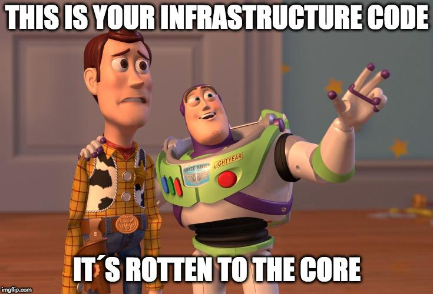
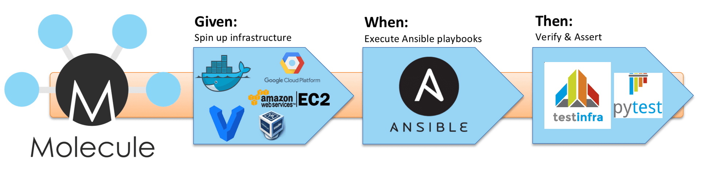
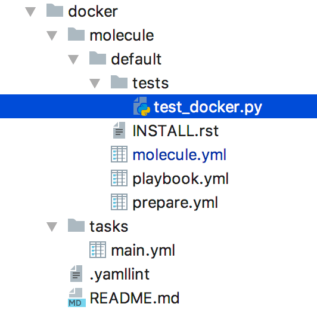
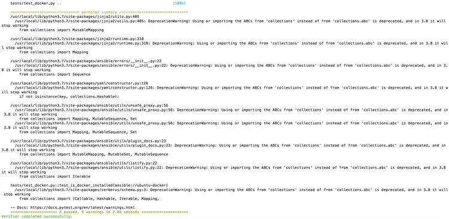
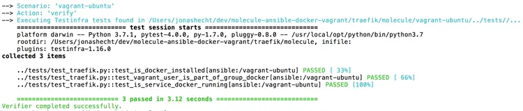
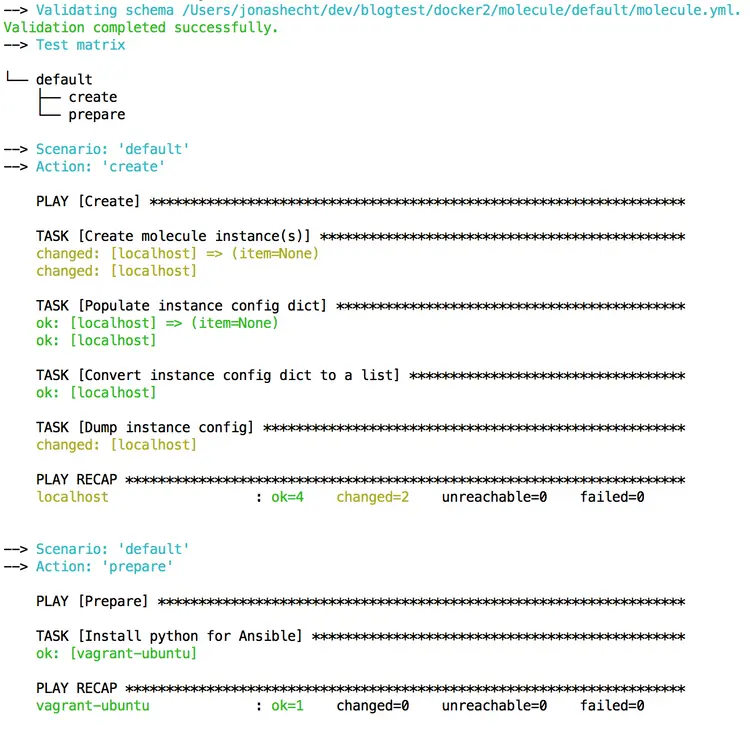
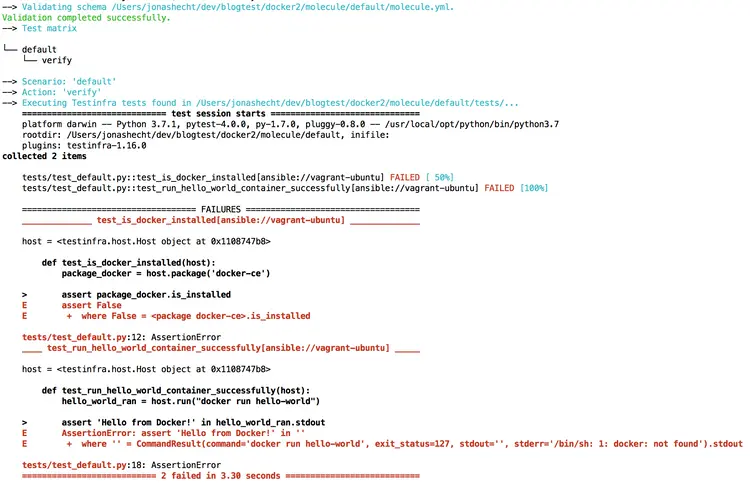
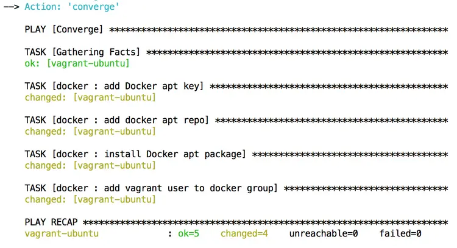
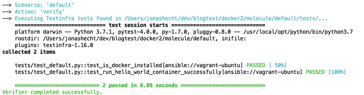

So you´re doing Infrastructure-as-Code? Sure. But have you ever heard of test-driven development (TDD)? It´s that dev team thing, right? Hell no! It should be equally important to infrastructure coding.

## Ansible & Molecule – blog series

Part 1: Test-driven infrastructure development with Ansible & Molecule  
Part 2: [Continuous Infrastructure with Ansible, Molecule & TravisCI](https://blog.codecentric.de/en/2018/12/continuous-infrastructure-ansible-molecule-travisci/)  
Part 3: [Continuous cloud infrastructure with Ansible, Molecule & TravisCI on AWS](https://blog.codecentric.de/en/2019/01/ansible-molecule-travisci-aws/)

## What about TDD in Infrastructure-as-Code?

[Infrastructure-as-Code (IaC)](https://en.wikipedia.org/wiki/Infrastructure_as_code) has really become one of those buzzwords lately. And the reason is: **it´s just really cool to describe your whole infrastructure with code.** Versioned by Git. Abstracted from the gory details by Ansible & Co. And last but most importantly: extracted from those head monopolies! There are so many reasons to do IaC. But if you´re a software engineer by heart like me, there´s maybe a gut instinct telling you: there´s something missing in this game. **What about the principles of modern software engineering?**



We all learned hard lessons until most of us agreed on the undeniable benefits of [Test-driven development (TDD)](https://en.wikipedia.org/wiki/Test-driven_development) and Continuous Integration & Delivery (CI/CD). But didn´t we somehow forget about them? Moving over to those new shiny DevOps tools, we keep saying: “Let´s do infrastructure as code!” leaving methodologies like TDD & CI/CD to the “software development” teams. We´re now ops right?! **No way!** That should be the whole point of Infrastructure-as-Code. We´re software developers although the job posting says “DevOps”. We just develop infrastructure. 🙂

If you’ve already developed some infrastructure and left this code untouched for a month or two… and then got your hands on it again trying to execute it and just see it failing on things you never saw before – just a thousand libraries, APIs and version upgrades since the last code execution – and everything just stopped working (note:**code that is not automatically and constantly executed and tested will eventually rot sooner or later!**), this should be enough reason to bring Test-driven development and Continuous Integration into the world of infrastructure coding.

## Testing frameworks for Ansible

Maybe you´re already describing your infrastrucure with [Ansible](https://www.ansible.com/) like me. **I really love this tool.** The learning curve isn´t steep and once you´re in it, you´re as fast writing Ansible playbooks as if you would type the bash commands directly. Sometimes even faster because of the higher abstraction. Additionally you have automated your infrastructure setup right from the start without any big expense. Everything is just transparent for the whole team and versioned inside your Git repository. No matter which OS you use or have to use, it works both for Linux or Windows.

Now choosing a testing framework for Ansible hasn´t been that easy in the past. There is [a custom Ansible provisioner](https://github.com/neillturner/kitchen-ansible) available for [Test Kitchen respectively KitchenCI](https://github.com/test-kitchen/test-kitchen) and there are quite some good blog posts about these around. But I always kept in mind that KitchenCI focusses on [Chef](https://www.chef.io/chef/) and Ansible is somehow a tolerated rival.

But for me [Molecule](https://molecule.readthedocs.io/en/latest/) seems to be the **perfect fit for Ansible** – since it´s focussed on Ansible directly and generated some buzz already inside the community over the last years. But then this year’s September 26th came and now there are even more reasons to choose Molecule: **From that day forward, Ansible has treated** [Molecule as a first class citizen](https://groups.google.com/d/msg/ansible-project/ehrb6AEptzA/owFP1SCKDAAJ) . The GitHub repository was therefore also moved into the Ansible organization ([github.com/ansible/molecule](https://github.com/ansible-community/molecule) ) and the whole process is backed by Red Hat (IBM). It seems to be a great time to look into Molecule for testing infrastructure code written with Ansible.

Molecule is kind of an umbrella framework aiding in the development and testing of Ansible roles. To quote [the docs](https://molecule.readthedocs.io/en/latest/index.html) ,

> \[using Molecule\] results in consistently developed roles that are well-written, easily understood and maintained.

Therefore Molecule introduces [a consecutive list of steps](https://molecule.readthedocs.io/en/latest/configuration.html#scenario) that run one by one. Three of these steps stand out from the rest: `create`, `converge` and `verify`. Why is that? **Because a best practice in writing tests also implies three steps** (originally lent from [Behavior-driven Development (BDD)](https://en.wikipedia.org/wiki/Behavior-driven_development) ). Just give them other names and you should be quite familiar with them: **Given**, **When** and **Then**.

Molecule will spin up one or more infrastructure providers in its `create` phase. When the testing infrastructure is ready, it will execute your Ansible playbooks onto it in the `converge` phase. And finally Molecule will verify that the desired state was achieved with assertions in the `verify` phase:



logo sources: [Molecule logo](https://molecule.readthedocs.io/en/latest/) , [Vagrant logo](https://www.vagrantup.com/),[VirtualBox logo](https://www.virtualbox.org/),[Ansible logo](https://www.ansible.com/),[Docker logo](https://www.docker.com/),[AWS EC2 logo](https://www.jeffreykusters.nl/2017/06/27/spinning-first-aws-ec2-instance/),[GCP logo](https://www.logolynx.com/topic/google+cloud+platform),[Testinfra logo](https://testinfra.readthedocs.io/en/latest/),[pytest logo](https://docs.pytest.org/en/latest/)

Molecule supports a **wide range of infrastructure providers & platforms** – be it bare-metal, virtual, cloud or containers. Because it leverages the power of Ansible to connect and maintain testing infrastructure, Molecule can test everything that Ansible is able to use. Test-driven infrastructure development with Molecule is therefore absolutely cloud-ready, since the supported plattforms contain [Azure](https://molecule.readthedocs.io/en/latest/configuration.html#azure) , [Amazon EC2 (AWS EC2)](https://molecule.readthedocs.io/en/latest/configuration.html#ec2) and [Google Compute Engine (GCE)](https://molecule.readthedocs.io/en/latest/configuration.html#gce) .

Molecule also [supports different verifiers](https://molecule.readthedocs.io/en/latest/configuration.html#verifier) : right now these are [Goss](https://github.com/aelsabbahy/goss),[InSpec](https://www.chef.io/inspec/) and[Test infrastructure](https://testinfra.readthedocs.io/en/latest/) . The latter is the default verifier where you can write Unittest with a Python DSL. It is built on top of the Python test framework [pytest](https://docs.pytest.org/en/latest/).

Enough talk. Let´s get our hands dirty! As I always strive to get you successfully up and running in topics I write about, every piece of code or configuration will be available inside this article’s corresponding GitHub repository: [molecule-ansible-docker-aws](https://github.com/jonashackt/molecule-ansible-docker-aws) .

## Install the tools: Ansible, Vagrant, Molecule & Testinfra

> If you use google, **be aware of links to the deprecated Molecule version 1.x.** Many posts about Molecule bump you into old 1.x links of the documentation! So always keep an eye onto the URL. There should be a `latest` somewhere in it – like in this one here: [molecule.readthedocs.io/en/latest/](https://molecule.readthedocs.io/en/latest/)

As we start our Molecule journey, we should be sure to have a tool installed for each important phase of Molecule. That being said, we start with [Vagrant](https://www.vagrantup.com/) as infrastructure provider together with [VirtualBox](https://www.virtualbox.org/) in the `create` respectively **Given** phase. The Ansible installation for the **When** step is also a must. Assuming we use MacOS and the [homebrew](https://brew.sh/) package manager, we need to do the following:

```
brew install ansible
brew cask install virtualbox
brew cask install vagrant

```

The third step `verify` or **Then** is backed by [Test infrastructure](https://testinfra.readthedocs.io/en/latest/) , which will be automatically installed with the Molecule installation. **This time please don´t use homebrew on your Mac** because this will provide you with the 1.x version of Molecule and also misses many dependend packages like `ansible-lint`, `testinfra`, `flake8` and others. We´d better use the [python package manager pip](https://pypi.org/project/pip/) to install Molecule:

```
brew install python
pip install molecule
pip install python-vagrant

```

As we use Vagrant as infrastructure provider for Molecule, we also need to install the `python-vagrant` pip package which is done after the `molecule` installation. All these steps should be comprehensible on other operating systems – just use the package manager of your choice.

## A suitable use case

There are possibly billions of potential use cases for developing Ansible playbooks and roles. For this article I chose the [installation of Docker on Ubuntu](https://docs.docker.com/install/linux/docker-ce/ubuntu/) . You may say that this is a bad choice. But I picked it for several reasons.

First I more or less accidentally stumbled upon Molecule. This summer I wanted to learn how to set up a [Kubernetes](https://kubernetes.io/) cluster. And according to many colleagues and blog posts, the best way to dive really deep into this topic is to go through [Kubernetes – the hard way](https://github.com/kelseyhightower/kubernetes-the-hard-way) by Kelsey Hightower. With some codecentric colleagues, we started out to re-implement the whole project using the principles of Infrastructure-as-Code and Ansible. You can observe the current status of our efforts here: [kubernetes-the-ansible-way](https://github.com/jonashackt/kubernetes-the-ansible-way) . But as I already outlined – what I was missing all the time was Test-driven development. And I don´t want to write about this project before it isn´t covered by at least some test cases. One of the building blocks of [kubernetes-the-hard-way](https://github.com/kelseyhightower/kubernetes-the-hard-way) as well as of [kubernetes-the-ansible-way](https://github.com/jonashackt/kubernetes-the-ansible-way) is the installation of Docker on Ubuntu.

The second advantage of this use case will become visible soon, as when we leave our simple hello world example. We´ll cover this soon, I promise. 🙂

## Ansible role project structure with Molecule

For now we simply start with the initialization of a new Ansible role powered by Molecule. Therefore we simply need to fire up a command like this inside our console:

```
molecule init role --driver-name vagrant --role-name docker --verifier-name testinfra

```

It will result in the following project structure – ready to write our new Ansible role for installing Docker. The screenshot hides some directories that are also generated like `defaults`, `handlers`, `meta` & `vars`. But we don´t really need them for this simple example here. Keep them ready for more complex use cases:



The crucial directories inside our role named _docker_ are `tasks` and `molecule/default/tests`. The first will contain our Ansible role we want to develop – the “implementation” in TDD speech. The latter directory will be our starting point inside the TDD cycle where we will write our infrastructure test cases with the help of Testinfra. As you may notice, I also renamed the test case according to our use case into `test_docker.py`.

## Configure Molecule with the molecule.yml

Before we can actually start writing our test cases, we should enable Molecule to play nicely with our infrastructure setup – in this case Vagrant. Therefore we need to configure Molecule with the help of its `molecule.yml`. Let´s take a look at the molecule.yml of the example projects repository:

```
scenario:
  name: default
 
driver:
  name: vagrant
  provider:
    name: virtualbox
platforms:
  - name: vagrant-ubuntu
    box: ubuntu/bionic64
    memory: 512
    cpus: 1
    provider_raw_config_args:
    - "customize [ 'modifyvm', :id, '--uartmode1', 'disconnected' ]"
 
provisioner:
  name: ansible
  lint:
    enabled: false
 
lint:
  enabled: false
verifier:
  name: testinfra
  env:
    PYTHONWARNINGS: "ignore:.*U.*mode is deprecated:DeprecationWarning"
  lint:
    name: flake8
  options:
    v: 1

```

You may notice that there are some changes compared to the generated file. First we want to **use a more up-to-date Ubuntu Vagrant Box** `ubuntu/bionic64`. Therefore we also need to add the special `provider_raw_config_args` configuration to the `platforms` key. Without this configuration, Molecule isn´t able to spin up “standard” Vagrant Ubuntu boxes like `ubuntu/bionic64` or `ubuntu/xenial64`. This is a workaround until [molecule/issues/1556](https://github.com/ansible-community/molecule/issues/1556) gets fixed ([PR already submitted](https://github.com/ansible-community/molecule/pull/1600) ).

> If you ever need to debug the infrastructure provider configuration in Molecule and you´re using a localhost provider like Vagrant or Docker, you should take a look at directories like `/var/folders/5p/l1cc1kqd69n_qxrftgln7xdm0000gn/T/molecule/docker/default/`. Molecule generates all the necessary files into these folders – like the `Vagrantfile` including logs and error files. Leaving out the `provider_raw_config_args` configuration we could see the following error in `vagrant-ubuntu-docker.err`: `Stderr: VBoxManage: error: RawFile#0 failed to create the raw output file ...`.

**The next change compared to the generated** `molecule.yml` could be found in the `testinfra` configuration block.

```
verifier:
  name: testinfra
  env:
    PYTHONWARNINGS: "ignore:.*U.*mode is deprecated:DeprecationWarning"

```

If we didn´t configure the `PYTHONWARNINGS` environment variable, we would end up with a bloated test output like this:



Since these deprecation warnings are based on reports of third-party libraries we use, they are completely out of our control. Luckily, pytest has a configuration property for us, which we could also express as environment variable. Environment variables that should be passed to _pytest_ can be added under the `env:` keyword in the `verifier` section. Now with these deprecation warnings ignored, the test output will look much better.

## Fine-tuning the Molecule configuration

**But we can fine-tune this even more.** If the test case runs green, you may notice that there´s no hint what tests were executed. That´s rather a pity since we want to see our whole test suite executed! That was the whole point why we even started to use a testing framework like Molecule with Testinfra.

Fortunately, there´s a way to get those tests shown inside the test output. [pytest](https://docs.pytest.org/en/latest/) could be invoked with additional properties by Testinfra. And pytest has many options we can experiment with. To configure a more verbose output for our tests in Molecule, we need to add the following to the `verifier` section of our `molecule.yml`:

```
  options:
    # show which tests where executed in test output
    v: 1

```

Running tests with Testinfra and Molecule will now result in a much more informative test execution output:



**Now we should have everything in place** to fire up our first `create` phase with Molecule! To check whether our infrastructure configuration works, we need to execute `molecule create`. If everything went fine, the log output should look something like this:



We now successfully created this articles Molecule setup which is outlined in the following diagram:


logo sources: [Molecule logo](https://molecule.readthedocs.io/en/latest/) , [Vagrant logo](https://www.vagrantup.com/) , [VirtualBox logo](https://www.virtualbox.org/),[Ansible logo](https://www.ansible.com/),[Docker logo](https://www.docker.com/),[Testinfra logo](https://testinfra.readthedocs.io/en/latest/),[pytest logo](https://docs.pytest.org/en/latest/),[Free logo](https://design.ubuntu.com/brand/ubuntu-logo/).

You can also double check inside the VirtualBox GUI – a machine should be running now. We could destroy the machine with `molecule destroy`, but we want to write and execute a test case in the next section. So we leave it in the created state.

## Writing infrastructure tests with Testinfra

So what´s this [Test infrastructure](https://testinfra.readthedocs.io/en/latest/) thingy? The docs know:

> With Testinfra you can write unit tests in Python to test actual state of your servers configured by management tools like Salt, Ansible, Puppet, Chef and so on.

_Testinfra_ happens to be the **Python-style equivalent to** [Serverspec](https://serverspec.org/) which again is based on the [Ruby BDD framework RSpec](http://rspec.info/) . If you´re curious what´s possible, check out some Testinfra code examples: [testinfra quick-start](https://github.com/philpep/testinfra#quick-start),[ansible-role-prometheus](https://github.com/openmicroscopy/ansible-role-prometheus/blob/0.2.0/tests/test_default.py) and [ansible-role-docker](https://github.com/mongrelion/ansible-role-docker/blob/master/molecule/default/tests/test_default.py) .

Nice! **So we should start to write our test first, right?!** If we go [through our use case](https://docs.docker.com/install/linux/docker-ce/ubuntu/) , we can identify at least three steps necessary to achieve the goal of installing Docker on Ubuntu:

1.  The Docker package should be successfully installed
2.  The Docker daemon should be able to pull images from the Docker Hub
3.  Docker should be able to successfully run containers

We should assert on these necessary steps inside our testcase. Now let´s take a look at the example project´s testcase docker/molecule/tests/test\_docker.py to see how this can be implemented with Testinfra:

```
import os
 
import testinfra.utils.ansible_runner
 
testinfra_hosts = testinfra.utils.ansible_runner.AnsibleRunner(
    os.environ['MOLECULE_INVENTORY_FILE']).get_hosts('all')
 
 
def test_is_docker_installed(host):
    package_docker = host.package('docker-ce')
 
    assert package_docker.is_installed
 
 
def test_run_hello_world_container_successfully(host):
    hello_world_ran = host.run("docker run hello-world")
 
    assert 'Hello from Docker!' in hello_world_ran.stdout

```

Testinfra is a plugin to the pytest test engine. It provides a pytest fixture named host. In order to be able to use the `host` fixture **we only need to declare it as an argument of our test functions**. The host fixture provides the [Testinfra Modules](https://testinfra.readthedocs.io/en/latest/modules.html) that are quite powerful in terms of testing infrastructure state. For example, we can assert if [files are in a certain state](https://testinfra.readthedocs.io/en/latest/modules.html#file) , whether a [service is running](https://testinfra.readthedocs.io/en/latest/modules.html#service) or if certain [sockets are in use](https://testinfra.readthedocs.io/en/latest/modules.html#socket) . In our example, we want to know whether the package `docker-ce` was installed successfully. Therefore we use the [Package module](https://testinfra.readthedocs.io/en/latest/modules.html#package) with `host.package('docker-ce')` and assert on its `is_installed` function.

Verifying if Docker is able to successfully run containers and thus pull images is slightly more complicated. But luckily there is the [hello-world](https://hub.docker.com/_/hello-world/) Docker image. If we were able to execute it successfully, we can verify the following according to the image documentation: the Docker daemon pulled the image `hello-world` from the Docker Hub, created a new container from that image and ran the executable inside. This comes in really handy **because this would completely validate the final two verification steps (2. & 3.)!**

To run the Docker _hello-world_ container, we leverage the host fixtures `run` function (you have to scroll down in the [host fixtures documentation](https://testinfra.readthedocs.io/en/latest/modules.html#host) – it´s a bit hidden). With `host.run("docker run hello-world")` we are able to run the [hello-world](https://hub.docker.com/_/hello-world/) Docker container. A successful execution should print `Hello from Docker!` into the console – at least as a part of the output. The `run` function will provide the console output inside the `stdout` variable. To assert if the output string contains our desired message, all we have to do is implement in the last part of our test case:

```
assert 'Hello from Docker!' in hello_world_ran.stdout

```

If you want to comprehend the whole process, simply add the Testinfra code to your generated `molecule/default/tests/test_default.py`. Now we should have everything put together to run our test case with `molecule verify`. It should fail:



**This is huge!** Now the next part is to implement our Ansible role and to turn the test green!

## Implementing our Ansible role

Following the well-known cycle in Test-driven development, we now may implement our Ansible role. The easiest way to do this is to check the [documentation about the Ubuntu Docker installation](https://docs.docker.com/install/linux/docker-ce/ubuntu/) . Our role should implement all the necessary steps inside `tasks/main.yml`, which is the default location for Ansible role implementations. This article´s example project gives an answer on how to do that inside the docker/tasks/main.yml:

```
- name: add Docker apt key
  apt_key:
    url: https://download.docker.com/linux/ubuntu/gpg
    id: 9DC858229FC7DD38854AE2D88D81803C0EBFCD88
    state: present
  ignore_errors: true
  become: true
 
- name: add docker apt repo
  apt_repository:
    repo: "deb [arch=amd64] https://download.docker.com/linux/ubuntu {{ ansible_lsb.codename }} stable"
    update_cache: yes
  become: true
 
- name: install Docker apt package
  apt:
    pkg: docker-ce
    state: latest
    update_cache: yes
  become: true
 
- name: add vagrant user to docker group.
  user:
    name: vagrant
    groups: docker
    append: yes
  become: true

```

According to the docs, these steps should contain everything needed to run Docker successfully because after the installation of the `docker-ce` package [the Docker daemon starts automatically](https://docs.docker.com/install/linux/docker-ce/ubuntu/#install-docker-ce-1) .

**But we don´t need to trust any paperwork any more.** We´ve got our test case. 🙂 Now it´s time to remember the three main phases of Molecule. We already successfully created our infrastructure within the **Given** step with the help of `molecule create`. Right after implementing the above playbook into `tasks/main.yml`, we need to execute the **When** phase. This can be achieved by running `molecule converge` which should look like this:



## Run our test again!

Now that our Ansible role was successfully executed onto our test infrastructure, we can move on to Molecule´s third main phase: the **Then** or `verify` step. Therefore, just run `molecule verify`:



As mentioned earlier, Molecule executes [a consecutive list of steps](https://molecule.readthedocs.io/en/latest/configuration.html#scenario) . There´s also a way to run all those steps one by one. The command `molecule test` will run everything from `(pre-)destroy` to `create` to `converge` to `verify`. I prepared an asciinema cast to show the full execution in action:

[](https://asciinema.org/a/213352)

## You´ll love test-driven infrastructure development!

Throughout the writing of this article, it became clear to me that Test-driven development should definitely not be treated as something that is exclusively reserved to the development teams. I´ve already written lots of Ansible playbooks and always strived to insert small verify or smoke test steps. But that wasn´t what I was looking for. It was also something I thought I had put down a long time ago thinking about software development. **The advantages of writing tests for your software or infrastructure apply equally to both.** Using Molecule for the development of your Ansible roles brings in a lot more safety in terms of third-party libary or component updates. And as in software tests, maybe you´ll find implementations that you´ve never got to know without a test case! Furthermore, **real refactoring** is only possible if you have a reasonable test coverage.

We certainly have not gone into a few aspects of test-driven infrastructure development with Molecule and Ansible yet. A follow-up blog post should for sure discuss how we can automatically run Molecule tests after a commit/push into our GitHub repository with cloud CI tools like [TravisCI](https://travis-ci.org/) . Therefore, we need to change our infrastructure provider and start using Docker(-in-Docker) with Molecule. And there are lots of other topics. Maybe we´ll see a Kubernetes cluster set up by Ansible that is tested by Molecule some day… Stay tuned!

## Links:

- [Molecule](https://molecule.readthedocs.io/en/2.20/configuration.html)
- [Molecule on github.com](https://github.com/ansible/molecule)
- [Ansible](https://www.ansible.com/)
- [Inspec](https://www.inspec.io/)
- [Goss](https://goss.rocks/)
- [Testinfra](https://testinfra.readthedocs.io/en/latest/)
- [test-driven-infrastructure with ansible molecule and testinfra](https://blog.codecentric.de/test-driven-infrastructure-ansible-molecule)
- [TDD with ansible](https://d-heinrich.medium.com/test-driven-development-with-ansible-using-molecule-3386cef987ac)
