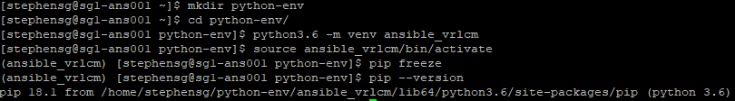
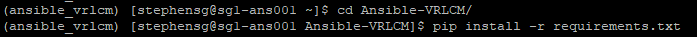
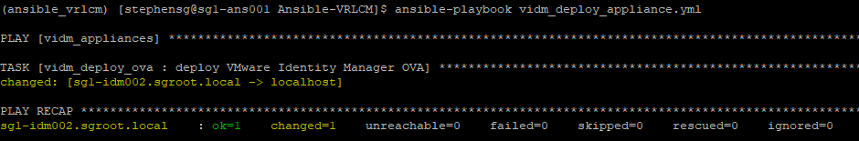
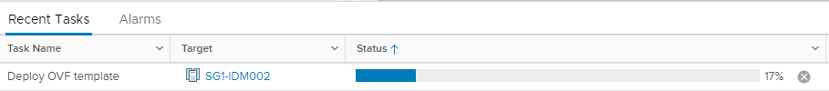
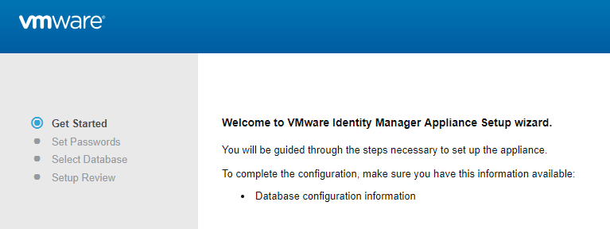
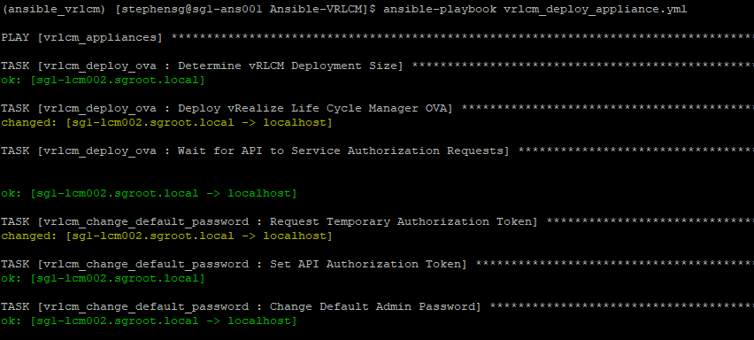
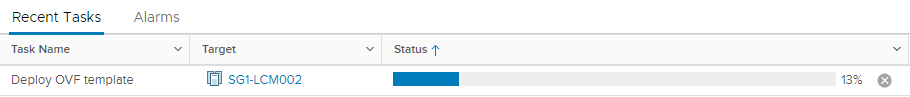

# Automating vRealize Suite Lifecycle Manager with Ansible

For many years I have been tasked with building vRealize Automation environments, and one of the biggest pain points has been the deployment and preparation of the IaaS machines. This has usually required special preparation of a Windows template and several scripts to get everything configured so that vRA plays nice. This is usually an error-prone process, especially for the larger enterprise deployments. To tackle this problem, VMware released vRealize Suite Lifecycle Manager, which is on version 2.1, as of this writing.

I decided it was time to try this product and see if it lives up to the claims. I was also more interested in the API functionality, and as with all things automation, I typically turn to Ansible. I wasn’t too surprised to discover, that although the deployment is ‘automated’, depending on your interpretation, there is a number of manual steps that are still required. These include ensuring that the IaaS machines and database are already deployed and properly configured. The vRLCM **Create Environment** process also provides validation and pre-checks, along with scripts that can be used to prepare the machines.

With the preparation of these playbooks, I set out to automate the following:

-   Deployment of a single VMware vIDM appliance;
-   Deployment and initial configuration of a single vRealize Suite Lifecycle Manager appliance;
-   Deployment of vRealize Automation IaaS Servers (Windows VMs), in multiple deployment scenarios.
-   Creation of vRealize Automation environment through LCM.

This post will focus on deploying vRSLCM and vIDM with a follow-up post on the vRA deployments.

However, in my attempts to make this a set of one-click processes, I wasn’t able to quite get that far (got pretty close). This was mainly due to some limitations with the vRSLCM API (can’t automate certificates, for example). I will discuss these limitations throughout this post, and if I find workarounds, then I’ll provide an update.

I should also point out that this is quite experimental and although I have done all that I can to make these workflows as idempotent as I can, unfortunately, with the limitations of the LCM API, this has proven to be quite difficult. These playbooks are best used as a one-time-only deployment, at least for LCM itself.

-   [Environment Preparation](#Environment_Preparation "Environment Preparation")
    -   [Environment Overview](#Environment_Overview "Environment Overview")
    -   [Prerequisites](#Prerequisites "Prerequisites")
    -   [Prepare Environment](#Prepare_Environment "Prepare Environment")
        -   [Install Python 3](#Install_Python_3 "Install Python 3")
        -   [Install GIT](#Install_GIT "Install GIT")
        -   [Create a Python Environment](#Create_a_Python_Environment "Create a Python Environment")
    -   [Download Ansible vRSLCM Deployment Playbooks](#Download_Ansible_vRSLCM_Deployment_Playbooks "Download Ansible vRSLCM Deployment Playbooks")
    -   [Install Required Packages](#Install_Required_Packages "Install Required Packages")
-   [Configure Ansible Playbooks](#Configure_Ansible_Playbooks "Configure Ansible Playbooks")
    -   [Configure Inventory](#Configure_Inventory "Configure Inventory")
    -   [Configure Variables](#Configure_Variables "Configure Variables")
        -   [Configure Global Variables](#Configure_Global_Variables "Configure Global Variables")
        -   [Configure Site Variables](#Configure_Site_Variables "Configure Site Variables")
        -   [Configure vIDM Variables](#Configure_vIDM_Variables "Configure vIDM Variables")
        -   [Configure vRLCM Variables](#Configure_vRLCM_Variables "Configure vRLCM Variables")
-   [Deploy VMware Identity Manager](#Deploy_VMware_Identity_Manager "Deploy VMware Identity Manager")
-   [Deploy vRealize Suite Lifecycle Manager](#Deploy_vRealize_Suite_Lifecycle_Manager "Deploy vRealize Suite Lifecycle Manager")
    -   [vRLCM Limitations](#vRLCM_Limitations "vRLCM Limitations")

## Environment Preparation

In my environment, I have a dedicated virtual machine that I develop and run my playbooks on (you may call this the Ansible control machine) running on CentOS 7.x.

## Environment Overview

<table><tbody><tr><td><strong>CentOS</strong></td><td>CentOS 7.x</td></tr><tr><td><strong>Ansible</strong></td><td>2.8.1 (2.8 is a minimum requirement)</td></tr><tr><td><strong>Python</strong></td><td>3.6 (installed from EPEL Repository)</td></tr></tbody></table>

## Prerequisites

The following pre-requisites are required:

-   DNS A/PTR records created for vRSLCM and vIDM appliances.

## Prepare Environment

Ensure that the system is up-to-date by running:

```shell
sudo yum -y update
```

Install yum-utils

```shell
sudo yum -y install yum-utils
```

### Install Python 3

You will need to ensure that Python 3.6 is installed on your Ansible host. I am using the EPEL repository, but you may decide to use IUS or SCL to install these packages, so the package names may differ. Refer to the relevant documentation for installing Python 3 using these repositories, if required.

```shell
sudo yum -y install python36 python36-pip python36-devel
```

### Install GIT

Git will be used to clone my Ansible vRSLCM playbooks repository.

```shell
sudo yum -y install git
```

### Create a Python Environment

It’s always the best approach to create a python virtual environment so that packages do not conflict with the base system. I have a directory in the root of my home dir called ‘**python-env**‘ where I maintain several different environments. Once you have a virtual environment set up, you just need to install the required packages from the ‘**requirements.txt**‘ file (provided later in the git repository).

You can follow these steps below to create a virtual environment:

python3.6 -m venv ansible_vrlcm

source ansible_vrlcm/bin/activate

mkdir ~/python-env cd ~/python-dev python3.6 -m venv ansible_vrlcm source ansible_vrlcm/bin/activate

```shell
mkdir ~/python-env
cd ~/python-dev
python3.6 -m venv ansible_vrlcm
source ansible_vrlcm/bin/activate
```

You will notice that the shell will now display the virtual environment that you are using:



It’s also a good idea to ensure the latest version of **pip** and **setuptools** is installed.

```shell
pip install --upgrade pip setuptools
```

## Download Ansible vRSLCM Deployment Playbooks

Now that the environment is ready, you can go ahead and clone my Ansible-VRLCM git repository.

```shell
git clone https://github.com/simplygeekuk/Ansible-VRLCM.git
```

The directory tree looks as follows:

```output
├── ansible.cfg
├── group_vars
│   ├── all
│   │   ├── 01-dns_vars.yml
│   │   ├── 02-ntp.yml
│   │   ├── 03-httprestapi_vars.yml
│   │   └── 04-deploy_ova_vars.yml
│   ├── site_a
│   │   ├── 01-site_a_dns_servers.yml
│   │   ├── 02-site_a_cmp_vcenter_vars.yml
│   │   └── 03-site_a_cmp_vcenter_creds.yml
│   ├── site_a_vra_iaas_servers
│   │   ├── 01-vcenter_deployment_vars.yaml
│   │   └── 02-vcenter_deployment_creds.yaml
│   ├── vidm_appliances
│   │   └── 01-vidm_appliances_vars.yml
│   ├── vra_iaas_servers
│   │   ├── 01-vra_iaas_servers_vars.yaml
│   │   └── 02-vra_iaas_server_spec.yaml
│   └── vrlcm_appliances
│       ├── 01-vrlcm_appliances_vars.yml
│       └── 02-vrlcm_credentials.yml
├── inventory
│   └── hosts
├── README.md
├── requirements.txt
├── roles
│   ├── vidm_deploy_ova
│   ├── vrlcm_add_active_directory
│   ├── vrlcm_add_myvmware
│   ├── vrlcm_add_vcenter_server
│   ├── vrlcm_add_vidm
│   ├── vrlcm_change_default_password
│   ├── vrlcm_configure_ssh
│   ├── vrlcm_configure_telemetry
│   ├── vrlcm_create_datacenter
│   ├── vrlcm_deploy_ova
│   ├── vrlcm_deploy_vra_iaas_servers
│   ├── vrlcm_disable_welcome_tour
│   ├── vrlcm_get_auth_token
│   └── vrlcm_wait_for_request
├── ssh_config
├── vidm_deploy_appliance.yml
└── vrlcm_deploy_appliance.yml
```

## Install Required Packages

There is a pip ‘**requirements.txt**‘ file located in the root of the Ansible-VRLCM folder that was created when the repository was cloned. Move into this directory and issue the following command to install these packages using pip.

```shell
pip install -r requirements.txt
```



This will also install Ansible.

## Configure Ansible Playbooks

I always like to create playbooks that are easy to scale and allow me to perform deployments across multiple data centres. Therefore, I place heavy emphasis on variable inheritance and host groups. Below I provide details on how these can be configured to deploy and scale your environment.

## Configure Inventory

The inventory is configured in the ‘**inventory/hosts**‘ file. I have used a single file for the inventory to try and keep things simple. You are not limited to using this approach and can do whatever fits best for your environment. As long as the hosts are defined and in their respective groups, is all that matters.

So let’s take a look at my ‘**inventory/hosts**‘ file, which is slimmed down to demonstrate a single site (the host file provided in the git repo will include 2 sites).

```ini
[local]
localhost    ansible_python_interpreter=~/python-env/ansible_vrlcm/bin/python

####################
# Host Definitions #
####################

# Site A
[site_a_vrlcm_appliances]
sg1-lcm001.sgroot.local    ansible_user=root

[site_a_vra_appliances]
[site_a_vra_iaas_servers]
[site_a_vidm_appliances]
sg1-idm001.sgroot.local

##########################
# Host Group Definitions #
##########################
[site_a:children]
site_a_vrlcm_appliances
site_a_vra_appliances
site_a_vra_iaas_servers
site_a_vidm_appliances

[vrlcm_appliances:children]
site_a_vrlcm_appliances

[vra_appliances:children]
site_a_vra_appliances

[vra_iaas_servers:children]
site_a_vra_iaas_servers

[vidm_appliances:children]
site_a_vidm_appliances
```


If you are using a Python virtual environment then you will need to set the ‘**ansible_python_interpreter**‘ for localhost to your path, otherwise, comment or remove this from the file.

You will see that I have 2 hosts defined in this example (I have purposely limited to the hosts in scope for the moment).

-   sg1-lcm001.sgroot.local – This is the hostname of the vRSLCM appliance that I want to deploy
-   sg1-idm001.sgroot.local – This is the hostname of the vIDM appliance that I want to deploy

Each of these hosts is placed into their respective groups. The table below details the groups that have been configured:

| Group                   | Description           | Members                                                                                      |
|-------------------------|-----------------------|----------------------------------------------------------------------------------------------|
| site_a                  | All hosts in Site A   | site_a_vrlcm_appliances site_a_vra_appliances site_a_vra_iaas_servers site_a_vidm_appliances |
| vrlcm_appliances        | All vRSLCM Appliances | site_a_vrlcm_appliances                                                                      |
| vidm_appliances         | All vIDM Appliances   | site_a_vidm_appliances                                                                       |
| vra_appliances          | All vRA Appliances    | site_a_vra_appliances                                                                        |
| site_a_vra_iaas_servers | All vRA IaaS Servers  | site_a_vra_iaas_servers                                                                      |

I like to use groups in this way as it allows me to use variable inheritance. This is useful, as you can re-use the same variables in your playbooks and have a different value assigned, for the host or the group.

## Configure Variables

This section provides an overview of all the variable files that can be configured. Make sure to adjust the variables so that they match your environment/requirements.

### Configure Global Variables

There are several global variable files under ‘**group_vars/all**‘. The variables configured in these files will be accessible by all hosts. The names of these files should be easy enough to make out what they are used for.

**01-dns_vars.yml**

This file is used to configure the **default domain**.

```yaml
---
# DNS Domain
dns_default_domain: sgroot.local

```


**02-ntp.yml**

This file is used to define the NTP servers. I have used the default ntp.org servers, which should be fine for everyone unless you want to use internal ones.

```yaml
---
## NTP Servers
ntp_server_default: pool.ntp.org
ntp_server_1: 0.pool.ntp.org
ntp_server_2: 1.pool.ntp.org
ntp_server_3: 2.pool.ntp.org
ntp_server_4: 3.pool.ntp.org
```


**03-httprestapi_vars.yml**

This file is used to define default variables used for interacting with web services.

```yaml
---
# HTTP REST API Variables
http_content_type: "application/json"
http_Accept: "application/json"
http_validate_certs: no
http_body_format: "json"
```

**04-deploy_ova_vars.yml**

This file is used to define default variables used for OVA deployments.

```yaml
---
# OVA Deployment Variables
ova_validate_certs: no
```

### Configure Site Variables

There are several site-specific variable files under ‘**group_vars/site_a**‘ These variables will apply to all hosts that are a member of the site. The following variable files are available:

**01-site_a_dns_servers.yml**

This file is used to define site-specific DNS servers. Useful if you have the same DNS servers in all sites but wish to present them in a different order.

```yaml
---
# DNS Servers
dns_server_1: 10.1.10.10
dns_server_2: 10.1.10.11

```

**02-site_a_cmp_vcenter_vars.yml**

This file is used to define the CMP vCenter Server that will be used for deploying all the components.

```yaml
---
cmp_vcenter_hostname: "sg1-vsa001.sgroot.local"

```

**03-site_a_cmp_vcenter_creds.yml**

This file is used to define the CMP vCenter Server administrator account details for deployments. I keep this file separate so that it can be encrypted.

```yaml
---
cmp_vcenter_username: administrator@vsphere.local
cmp_vcenter_password: VMwar3!!

```

### Configure vIDM Variables

All variable files related to vIDM are under ‘**group_vars/vidm_appliances**‘.

**01-vidm_appliances_vars.yml**

This file defines variables associated with the vIDM deployment.

```yaml
---
# vIDM API Variables
vidm_api_version: "1"
# vIDM OVF/OVA Variables
vidm_ova_path: "/mnt/iso/VMware/vIDM/3.3"
vidm_ova_filename: "identity-manager-3.3.0.0-10084102_OVF10.ova"
# vRLCM Default Deployment Variables
vIDM_deployment_disk_type: "thin"
# vRLCM Misc Variables
vrlcm_telemetry_enabled: false
vidm_timezone: "Europe/London"

```

### Configure vRLCM Variables

All variable files related to vRLCM are under ‘**group_vars/vrlcm_appliances**‘.

**01-vrlcm_appliances_vars.yml**

This file defines variables associated with the vRLCM deployment.

```yaml
---
# vRLCM API Variables
vrlcm_api_version: "1"
# vRLCM OVF/OVA Variables
vrlcm_ova_path: "/mnt/iso/VMware/LCM/2.1"
vrlcm_ova_filename: "VMware-vLCM-Appliance-2.1.0.11-13273278_OVF10.ova"
# vRLCM Default Deployment Variables
vrlcm_content_management_enabled: yes
vrlcm_deployment_disk_type: "thin"
# vRLCM Misc Variables
vrlcm_ssh_enabled: true
vrlcm_validate_certs: no
vrlcm_telemetry_enabled: false
# vRLCM Certificate Variables
vrlcm_cert_commonname: ""
vrlcm_cert_countrycode: "UK"
vrlcm_cert_orgname: "simplygeek"
vrlcm_cert_orgunit: "simplygeek"
# vIDM
vidm_hostname: sg1-idm001.sgroot.local
# Active Directory
vrlcm_ad_domain: "sgroot.local"
vrlcm_ad_base_dn: "DC=sgroot,DC=local"
vrlcm_ad_bind_dn: "CN=svc_lcm_bind,OU=Service_Accounts,OU=Users,OU=SG,DC=sgroot,DC=local"
vrlcm_ad_group_dn: "OU=lcm,OU=Groups,OU=SG,DC=sgroot,DC=local"
vrlcm_ad_user_dn: "OU=Admins,OU=Users,OU=SG,DC=sgroot,DC=local"
vrlcm_ad_admin_users: "svc_lcm_bind@sgroot.local"
```

**02-vrlcm_credentials.yml**

This variable file defines all the account usernames and passwords that are used by vRLCM. I keep this file separate so that it can be encrypted.

```yaml
---
# Service Account that LCM uses to access vCenter Server
vrlcm_endpoint_vcenter_username: svc_lcm_vc@sgroot.local
vrlcm_endpoint_vcenter_password: VMwar3!!
# vRLCM User Accounts
vrlcm_root_password: "VMwar1!!"
vrlcm_sshuser_password: "VMwar2!!"
vrlcm_gui_username: "admin@localhost"
vrlcm_gui_password: "VMwar3!!"
vrlcm_gui_default_password: "vmware"
# vIDM Admin Account
vidm_admin_username: admin
vidm_admin_password: VMwar3!!
# Active Directory Bind Account
vrlcm_ad_bind_password: VMwar3!!
# MyVMware Account
vrlcm_myvmware_username: user@example.com
vrlcm_myvmware_password: password
```

## Deploy VMware Identity Manager

The playbook that you will need to run is called ‘**vidm_deploy_appliance.yml**‘, which is located in the root of the **Ansible-VRLCM** folder. You will need to configure the variables to match your requirements. If you have configured the CMP vCenter variables for the site, then the **hostname**, **username** and **password** fields can be left as-is.

```yaml
---
## Deploys VMware Identity Manager
- hosts: vidm_appliances
  become: no
  gather_facts: False
  vars:
    vidm_deployment_vcenter_hostname: "{{ cmp_vcenter_hostname }}"
    vidm_deployment_vcenter_username: "{{ cmp_vcenter_username }}"
    vidm_deployment_vcenter_password: "{{ cmp_vcenter_password }}"
    vidm_deployment_vcenter_datacenter: "SG1"
    vidm_deployment_vcenter_cluster: "SG1-CLS-MGMT-01"
    vidm_deployment_vcenter_datastore: "vsanDatastore"
    vidm_deployment_network: "Management"
    vidm_deployment_network_ip_address: "10.1.10.41"
    vidm_deployment_network_netmask: "255.255.255.0"
    vidm_deployment_network_gateway: "10.1.10.254"
  roles:
    - vidm_deploy_ova
```


This is a very simple playbook that will deploy the vIDM without any further configuration.

You can run the playbook as follows:

```shell
ansible-playbook vidm_deploy_appliance.yml
```

[](./img/img_5d0d4d840548d.png)

[](./img/img_5d0d4bde3299b.png)

You will need to log into the appliance once it has been deployed and go through the initial configuration.

[](./img/img_5d0d4ac757178.png)

If you want to deploy multiple, load-balanced vIDM appliances then this is also possible with some modification. I plan to release another post in due course on how to do this.

## Deploys VMware Suite Life Cycle Manager

The playbook that you will need to run is called ‘**vrlcm_deploy_appliance.yml**‘, which is located in the root of the **Ansible-VRLCM** folder. You will need to configure the variables to match your requirements. If you have configured the CMP vCenter variables for the site, then the **hostname**, **username** and **password** fields can be left as-is.

You can also configure the Datacenters and vCenter Servers that will be created within LCM after it has been deployed.


```yaml
---
## Deploys VMware Suite Life Cycle Manager
- hosts: vrlcm_appliances
  become: no
  gather_facts: False
  vars:
    vrlcm_deployment_vcenter_hostname: "{{ cmp_vcenter_hostname }}"
    vrlcm_deployment_vcenter_username: "{{ cmp_vcenter_username }}"
    vrlcm_deployment_vcenter_password: "{{ cmp_vcenter_password }}"
    vrlcm_deployment_vcenter_datacenter: "SG1"
    vrlcm_deployment_vcenter_cluster: "SG1-CLS-MGMT-01"
    vrlcm_deployment_vcenter_datastore: "vsanDatastore"
    vrlcm_deployment_network: "Management"
    vrlcm_deployment_network_ip_address: "10.1.10.78"
    vrlcm_deployment_network_netmask: "255.255.255.0"
    vrlcm_deployment_network_gateway: "10.1.10.254"
    vrlcm_datacenters:
      - name: "{{ vrlcm_deployment_vcenter_datacenter }}"
        city: "Caerphilly, Wales, GB"
        state: "Caerphilly"
        country: "UK"
    vrlcm_vcenter_servers:
      - hostname: "{{ vrlcm_deployment_vcenter_hostname }}"
        datacenter: "{{ vrlcm_deployment_vcenter_datacenter }}"
        username: "{{ vrlcm_endpoint_vcenter_username }}"
        password: "{{ vrlcm_endpoint_vcenter_password }}"
        type: 3
  roles:
    - vrlcm_deploy_ova
    - vrlcm_change_default_password
    - vrlcm_configure_ssh
    - vrlcm_disable_welcome_tour
    - vrlcm_configure_telemetry
    - vrlcm_create_datacenter
    - vrlcm_add_vcenter_server
    - vrlcm_add_vidm
    - vrlcm_add_active_directory
    - vrlcm_add_myvmware

```

By default, I add the datacenter and vCenter Server that LCM has been deployed on (CMP stack), that can be further used for the vRA deployments. The ‘**vrlcm_endpoint_vcenter_username**‘ and ‘**vrlcm_endpoint_vcenter_password**‘ is the service account that LCM will use to access this vCenter Server, that was configured in the ‘**02-vrlcm_credentials.yml**‘ variable file.

You’ll notice that several roles are called and the names should be pretty self-explanatory. There is also another role called ‘**vrlcm_wait_for_request**‘ that is used to wait until any vCenter Server that has been added to complete it’s inventory data collection task and to wait for vIDM to complete.

You can run the playbook as follows:

```shell
ansible-playbook vrlcm_deploy_appliance.yml
```

[](./img/img_5d0d55a53a0b1.png)

[](./img/img_5d0d52dde7e3f.png)

The LCM appliance will now be accessible and configured and ready to create environments.

## vRLCM Limitations

When I was attempting to automate as much as possible with the LCM deployment, I, unfortunately, encountered several limitations with the API.

-   Prompted to change root password on the first logon, even though this has been changed via the API and the configuration updated on the appliance.
-   Not possible to get existing configured vCenter Servers (but it does fail when the same vCenter is added a second time. I was able to use this to determine if a vCenter already existed).
-   Not possible to get the existing vIDM connection (it will simply re-add to vIDM resulting in multiple LCM items under the vIDM catalogue).
-   Not possible to get the configured AD servers (this will result in multiple, duplicated AD servers being added).
-   Not possible to manage certificates.
-   Not possible to manage Servers and Protocols (DNS, NTP and SNMP).
-   Not possible to manage Content Management.

Hopefully, I can raise these with the LCM team in the hope they are added in later releases.

That concludes this post. In my next post, I will cover the deployment of vRealize Automation from deploying and configuring the Windows IaaS machines to automating the creation of the environment within LCM.

I am also looking for collaborators on this project, so if you would like to contribute or improve my playbooks then please let me know.

## References

* https://www.simplygeek.co.uk/2019/06/22/automating-vrealize-suite-lifecycle-manager-vidm-and-vrealize-automation-with-ansible-part-1-setting-up-the-environment/
* https://www.nakivo.com/blog/how-to-upgrade-from-vmware-vsphere-esxi-6-7-to-7-0/

