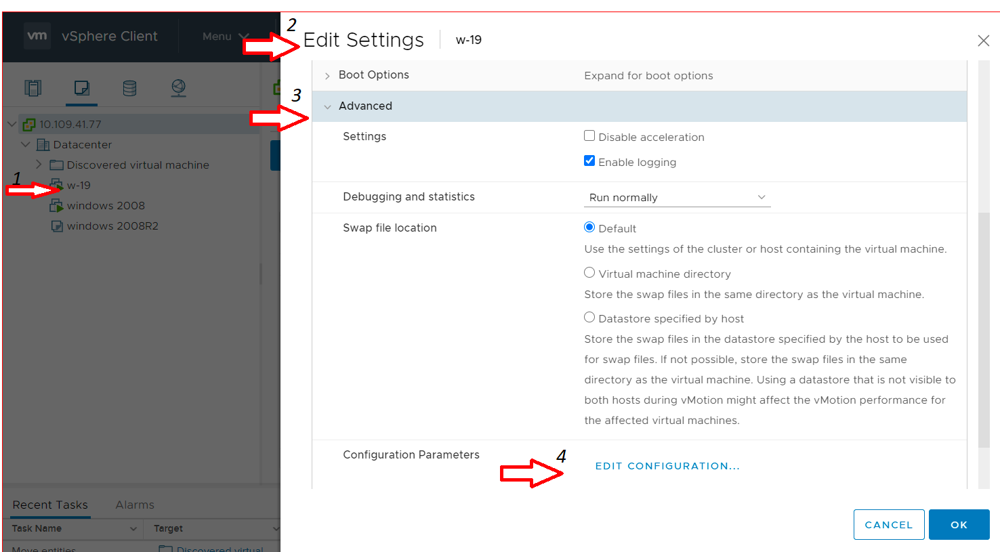

# Unable to copy the file content from Virtual Machine using the VMRC 

This article provides the basic steps to enable the Copy/Paste between the VMRC client and Windows/Linux Virtual Machine.  
The Copy/Paste between VMRC client and MacOS virtual machine is not supported currently.

**NOTE**:

-    This Steps provided in the kb helps you to copy the data only not file/folder. However, you can copy the content of entire file but not the file.
-    This is per VM level configuration

To resolve this issue, first install or upgrade the VMware tools for the Windows/Linux virtual machine(VM). For more information see [Installing and upgrading VMware Tools in vSphere](https://kb.vmware.com/s/article/2004754).

From the vCenter Server HTML5 Web Client

1.  Power off the VM.
2.  Enable the Copy & Paste for the Windows/Linux virtual machine:
    1.  Right-click the virtual machine and click **Edit Settings**.
    2.  Click the **VM Options** tab, expand **Advanced**, and click **Edit Configuration**.
    3.  Click on **Add Configuration Params** three times to give three rows 
    4.  Fill in the **Name** and **Value** fields as mentioned below:

Name:                                 Value:  
isolation.tools.copy.disable          FALSE  
isolation.tools.paste.disable         FALSE  
isolation.tools.setGUIOptions.enable  TRUE  
 

5.  Click OK to save and exit out of the Configuration Parameters wizard. Note: These options override any settings made in the guest operating system’s VMware Tools control panel. 
6.  Click OK to save and exit out of the Edit Settings wizard.

 

3.  Power on the VM
4.  Then use Copy/Paste directly on Windows/Linux/any other platform. 
5.  For paste operation's target platform is Linux, Older X applications do not use a clipboard. Instead, they let you paste the currently selected text (called the "primary selection") without copying it to a clipboard. Pressing the middle mouse button is usually the way to paste the primary selection. For more information see [Copying and pasting from a Windows guest to Linux host](https://kb.vmware.com/s/article/1293).

 

From the vCenter Server Flash Web Client

1.  Power off the VM.
2.  Enable the Copy & Paste for the Windows/Linux virtual machine:
    1.  Right-click the virtual machine and click **Edit Settings**.
    2.  Click the **VM Options** tab, expand **Advanced**, and click **Edit Configuration**.
    3.  Fill in the **Name** and **Value** fields as mentioned below. After entering each one, click the **Add** button. 

Name:                                 Value:  
isolation.tools.copy.disable          FALSE  
isolation.tools.paste.disable         FALSE  
isolation.tools.setGUIOptions.enable  TRUE  
 

5.  Click OK to save and exit out of the Configuration Parameters wizard. Note: These options override any settings made in the guest operating system’s VMware Tools control panel. 
6.  Click OK to save and exit out of the Edit Settings wizard.

 

3. Power on the VM
4. Then use Copy/Paste directly on Windows/Linux/any other platform. 
5. For paste operation's target platform is Linux, Older X applications do not use a clipboard. Instead, they let you paste the currently selected text (called the "primary selection") without copying it to a clipboard. Pressing the middle mouse button is usually the way to paste the primary selection. For more information see [Copying and pasting from a Windows guest to Linux host](https://kb.vmware.com/s/article/1293).

## Reference

* https://kb.vmware.com/s/article/57122
* 