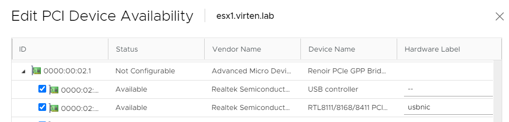
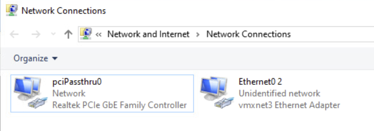
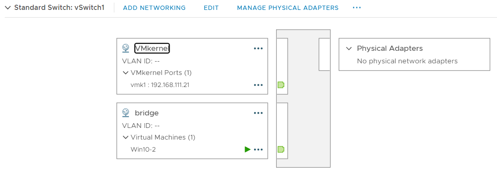
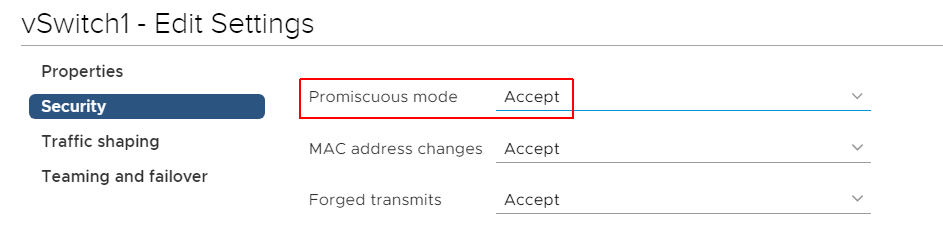
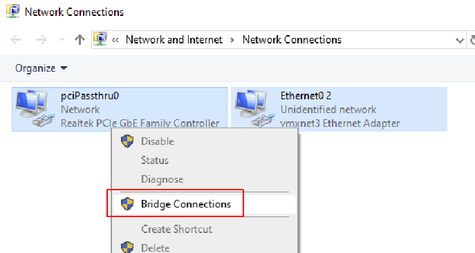
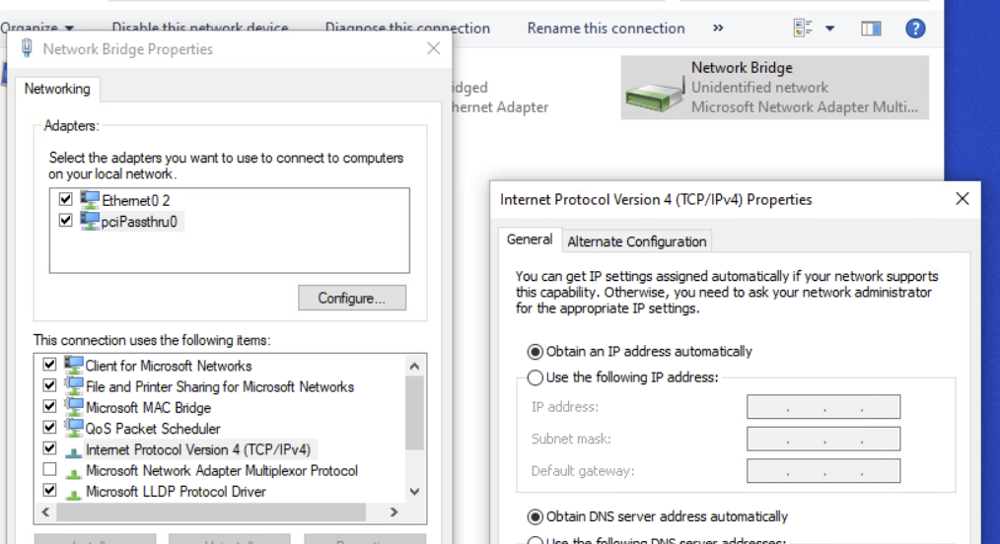

# Realtek NIC and ESXi 7.0 - Use Passthrough to make use of the Adapter

Realtek Adapters are very common in consumer hardware and SFF systems. Using SFF systems to run ESXi is a good option for home labs as they are inexpensive and have a low power consumption. Unfortunately, the Realtek RTL8168, which is used in [Asus PN50](https://www.virten.net/2020/09/esxi-on-amd-ryzen-based-asus-pn50/) or [ZOTAC ZBOX Edge](https://www.virten.net/2020/08/esxi-on-zotac-zbox-edge-m-series-10th-gen-intel-cpu/) for example, is not supported in ESXi. The problem can be solved with a community created driver in ESXi 5.x and 6.x but **not in ESXi 7.0**, due to the VMKlinux driver stack deprecation.

You can work around the problem by using an [USB based NIC](https://www.virten.net/2020/04/how-to-add-the-usb-nic-fling-to-esxi-7-0-base-image/) to manage ESXi. Using USB NICs works fine and stable, but at this point the embedded NIC is useless. If you want to use it, you can use passthrough to add it to a virtual machine.

### Enable Passthrough

1.  Open the vSphere Client, navigate to **ESX > Configure > Hardware > PCI Devices** and click **CONFIGURE PASSTHROUGH**.
2.  Locate Realtek network card and activate it for passthrough.  
    
3.  Power-off the Virtual Machine where you want to add the network card.
4.  Right-Click the Virtual Machine and select **Edit Settings...**
5.  Click **ADD NEW DEVICE** and select **PCI Device**
6.  Add the Network Adapter
7.  Boot the Virtual Machine
8.  Verify that you can see the Network Adapter  
    

You do now have a dedicated network card in your virtual machine. This gives you full performance PCIe network card performance in your virtual machine. Of course, you can only pass it to one machine, unless you take it a step further and...

### Create a Bridge to pass the Network back to ESXi

If you want to use the same network card with other virtual machines, or VMkernel interfaces, you can pass it back to a vSwitch by creating a bridge.

1.  Create a new vSwitch with no physical network adapters.
2.  Add a VMkernel Port
3.  Add a VM Portgroup named **bridge** and connect the Virtual Machine  
    
4.  Edit the vSwitch and set **Promiscuous Mode** to **Accept**.  
    
5.  In this example, I'm using a **Windows** machine to create the Bridge. Scroll down for a Linux bridge configuration example.  
    Open **Network Connections**, mark both Adapters, Right-Click and click **Bridge Connections**.  
    
6.  You have now created a bridge that connects the vSwitch to the Realtek NIC. If you want to configure an IP address for the virtual machine, you have to set it on the new bridge interface.  
    
7.  If you are using the bridge to manage ESXi, make sure to configure auto-boot for the bridging virtual machine. (ESXi > Configure > Virtual Machines > VM Startup/Shutdown). Keep in mind that auto-boot only works for standalone ESXi Hosts or hosts that are in a not HA enabled Cluster.

You should now be able to connect to the Virtual Machine (DHCP) and the VMkernel port (192.168.111.21). To make other Virtual Machines accessible, add them to the bridge Port Group on vSwitch1.

**Create a Bridge on Debian based Linux  
**If you want to use a lightweight VM for bridging, you can use Linux. Adding a bridge in Linux is as simple as in Windows:

Install bridge-utils

```shell
apt install bridge-utils
```

Configuring bridging in **/etc/network/interfaces**

```shell
 auto lo br0
 iface lo inet loopback

 iface eth0 inet manual
 iface eth1 inet manual

 iface br0 inet static
    bridge_ports eth0 eth1
        address 192.168.111.15
        netmask 255.255.255.0
        gateway 192.168.111.1
```

Restart networking or reboot the virtual machine. You can verify the bridge status with **brctl show**.

## Reference

* https://williamlam.com/2020/03/homelab-considerations-for-vsphere-7.html
* https://www.virten.net/2020/09/realtek-nic-and-esxi-7-0-use-passthrough-to-make-use-of-the-adapter/
