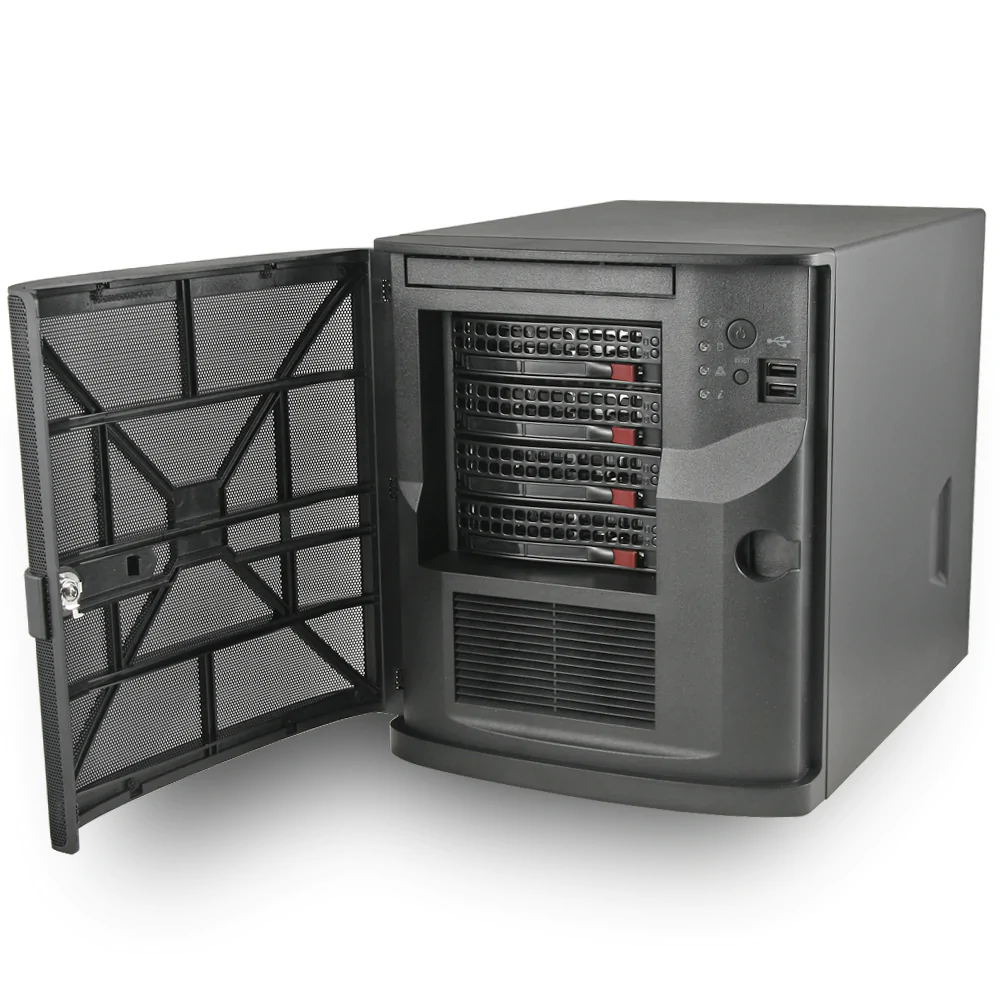
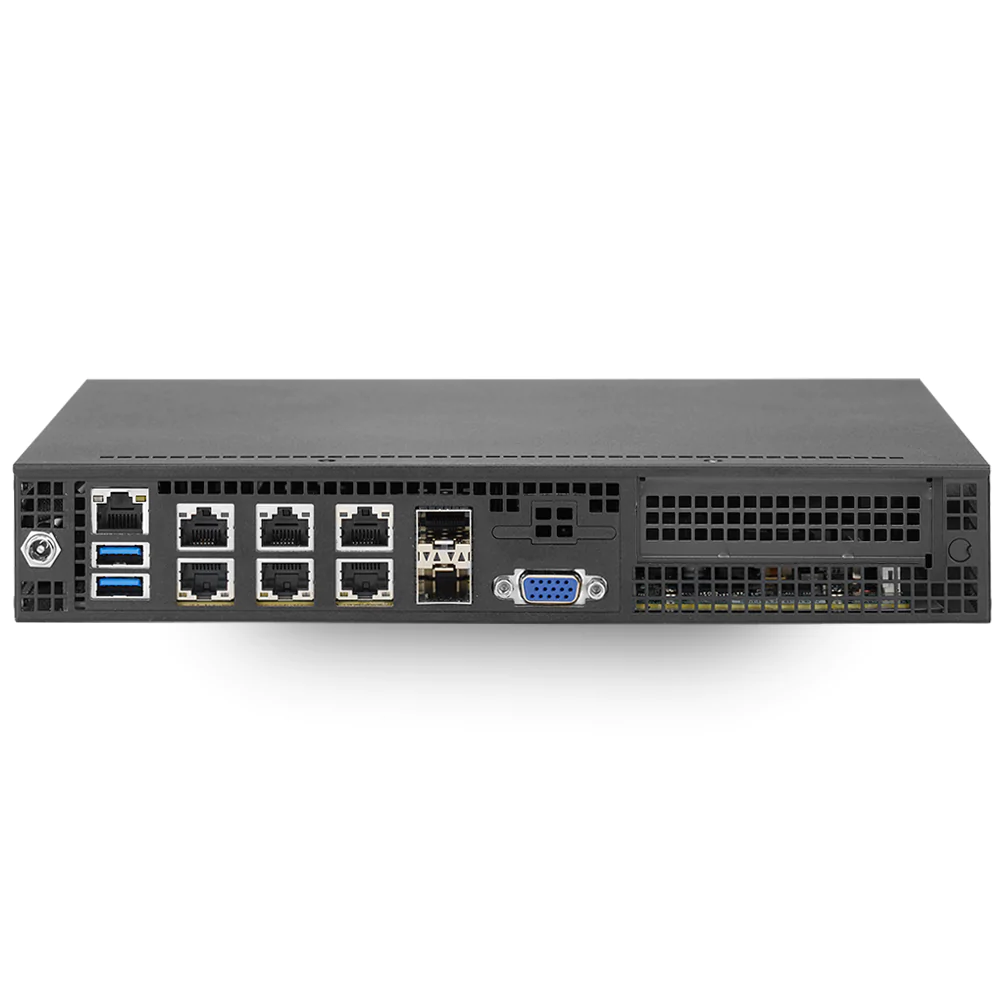

# VIRTUALIZATION SOLUTIONS

## MINI

### VMware Certified - Supermicro SYS-E200-8D Intel Xeon D 6-Core Mini PC

VMware Certified - Supermicro SYS-E200-8D Intel Xeon D 6-Core Mini PC

Details:

    PRODUCT ID: VM-EPM-012I4L
    Intel Xeon D-1528 6-Core/12-Thread Processor
    Supports up to 128GB DDR4 Memory
    Supports 1 x 2.5" Drive
    Supports 1 x M.2 SSD
    Dual 10GbE, Dual 1 GbE Ports
    Dedicated IPMI Port (Redfish)
    Optional 1U Rackmount Kit (one or two-system)

$1,199.95 - [CONFIGURE](https://mitxpc.com/products/vm-epm-012i4l)

### VMware Certified - Supermicro SYS-5028D-TN4T Intel Xeon D 8-Core Mini PC

VMware Certified - Supermicro SYS-5028D-TN4T Intel Xeon D 8-Core Mini PC

Details:

    PRODUCT ID:
    VM-EPT-043E
    Intel Xeon D-1541 8-Core/16-Thread Processor
    Supports up to 128GB DDR4 Memory
    4 x 3.5" Hot-swap Drive Bays and 2 x 2.5" Drive Support
    Supports 1 x M.2 SSD
    Dual 10GbE, Dual 1 GbE Ports
    Dedicated IPMI Port (Redfish)
    250W 80+ Bronze Power Supply

$1,599.95 [CONFIGURE](https://mitxpc.com/products/vm-ept-043e)

### VMware Certified - Supermicro SYS-E300-9D-8CN8TP Intel Xeon D 8-Core Mini PC

VMware Certified - Supermicro SYS-E300-9D-8CN8TP Intel Xeon D 8-Core Mini PC

Details:

    PRODUCT ID:
    VM-EPM-012I6L-8C
    Intel Xeon D-2146NT 8-Core/16-Thread Processor
    Supports up to 512GB DDR4 Memory
    Supports 1 x 2.5" Drive
    1 x M.2 SSD Support
    4 x 1 GbE, 2 x 10GbE Ports
    2 x 10GbE SFP+
    Dedicated IPMI Port (Redfish)
    Optional 1U Rackmount Kit
    Built in Intel QAT up to 40Gbps Crypto/Compression

$1,999.95 [CONFIGURE](https://mitxpc.com/products/vm-epm-012i6l-8c)

## References

* https://williamlam.com/2020/03/homelab-considerations-for-vsphere-7.html
* https://williamlam.com/2018/11/supermicro-e300-9d-sys-e300-9d-8cn8tp-is-a-nice-esxi-vsan-kit.html
* https://mitxpc.com/collections/vmware-compatible/Mini
* https://www.amazon.com/Supermicro-SYS-E200-8D-FCBGA1667-2-5inch-Express/dp/B01K1JVM0Q/
* 