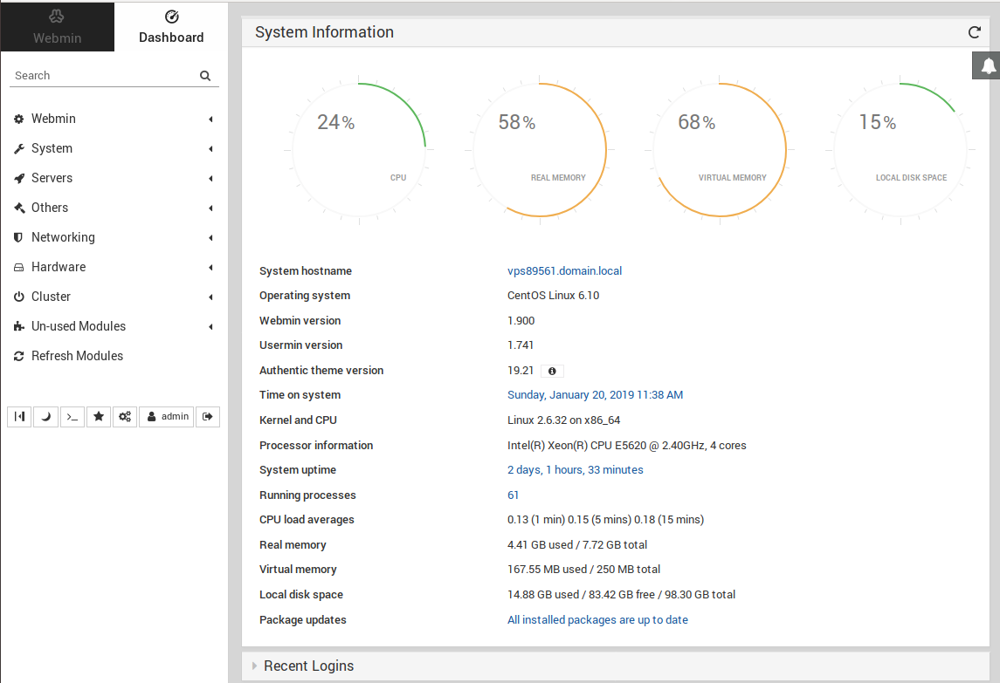

# webmin create new admin user from command line



PAM authentication failed n a webmin server with no errors on CentOS 6 server. To fix this, i created a nom PAM user “admin”.

To add non PAM user, edit

```shell
/etc/webmin/miniserv.users
```

Add

```shell
admin:mypassword
```

Edit file

```shell
$ vi /etc/webmin/webmin.acl
```

Add

```shell
admin: acl adsl-client ajaxterm apache at backup-config bacula-backup bandwidth bind8 burner change-user cluster-copy cluster-cron cluster-passwd cluster-shell cluster-software cluster-useradmin cluster-usermin cluster-webmin cpan cron custom dfsadmin dhcpd dovecot exim exports fail2ban fdisk fetchmail filemin file filter firewall6 firewalld firewall fsdump grub heartbeat htaccess-htpasswd idmapd inetd init inittab ipfilter ipfw ipsec iscsi-client iscsi-server iscsi-target iscsi-tgtd jabber krb5 ldap-client ldap-server ldap-useradmin logrotate lpadmin lvm mailboxes mailcap man mon mount mysql net nis openslp package-updates pam pap passwd phpini postfix postgresql ppp-client pptp-client pptp-server procmail proc proftpd qmailadmin quota raid samba sarg sendmail servers shell shorewall6 shorewall smart-status smf software spam squid sshd status stunnel syslog syslog-ng system-status tcpwrappers telnet time tunnel updown useradmin usermin vgetty webalizer webmincron webminlog webmin wuftpd xinetd virtual-server virtualmin-awstats jailkit virtualmin-htpasswd virtualmin-sqlite virtualmin-dav ruby-gems virtualmin-git php-pear virtualmin-init virtualmin-slavedns virtualmin-registrar
```

Set a password for user admin.

```shell
$ /usr/libexec/webmin/changepass.pl /etc/webmin admin  PASSWORD_HERE
```

Now you will be able to login to webmin at

```output
https://your-server-ip:10000
User = admin
PW = password you used in above step
```

## Reference

* https://serverok.in/webmin-create-new-admin-user-from-command-line
* 