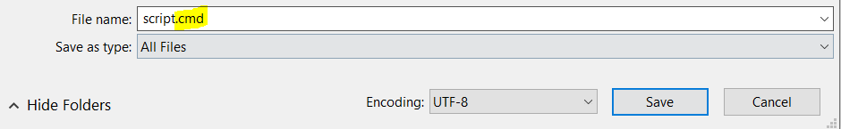
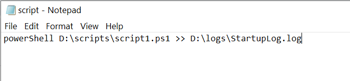
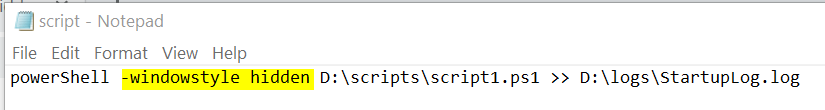
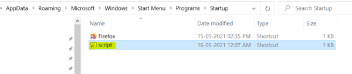

Powershell at startup
===

This is useful when you want to run any automation created using PowerShell on Windows Startup. To run PowerShell script on startup.

Create a **Windows Command Script (.cmd file)** i.e. create a file and save it with **`.cmd`** extension.

**Write the below command in .cmd file.**

**powerShell path\\to\\powershell\_script.ps1 >> “path\\to\\log\_file.log”**

If you want to run the script in background. Add **`-windowstyle hidden`** after **powershell**.

Place the file or its shortcut file at below path.

**C:\\Users\\<user\_name>\\AppData\\Roaming\\Microsoft\\Windows\\Start Menu\\Programs\\Startup**

OR

**%APPDATA%\\Microsoft\\Windows\\Start Menu\\Programs\\Startup**

**Restart the computer** and **you can track its execution in log file.**

___

