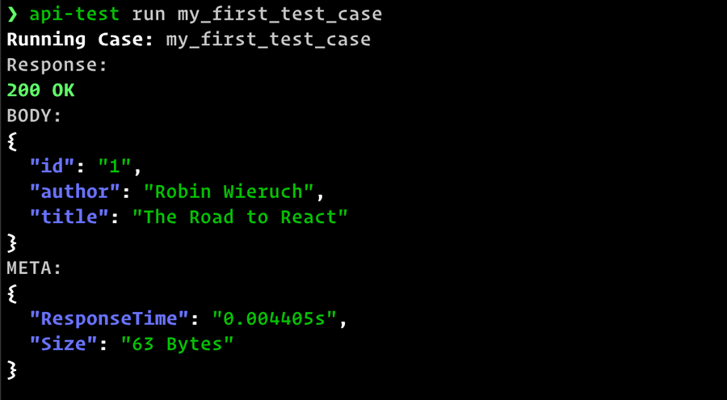
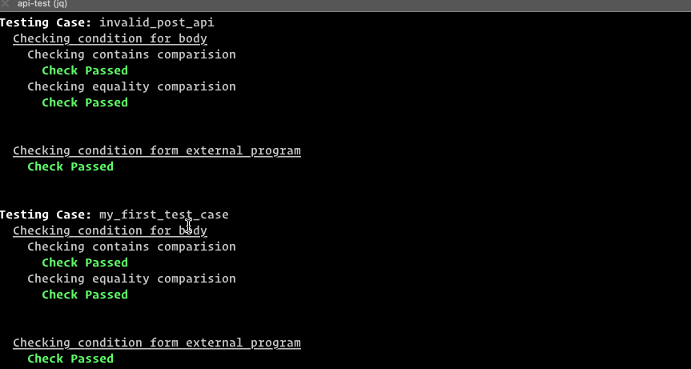
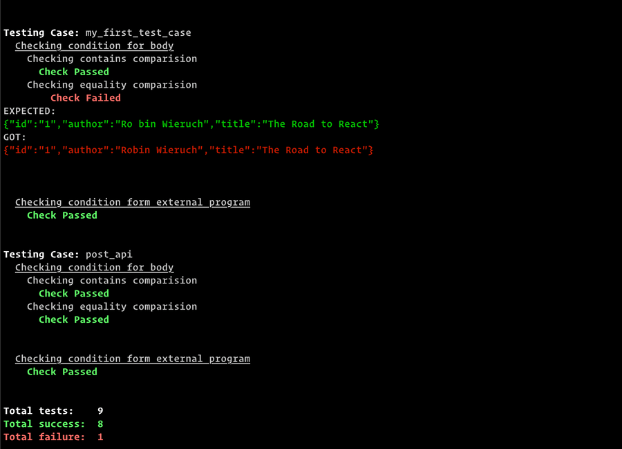
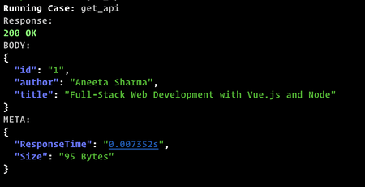
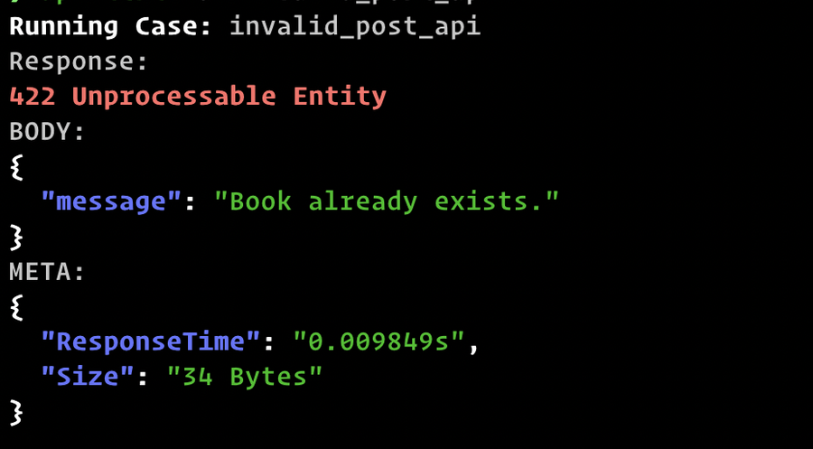
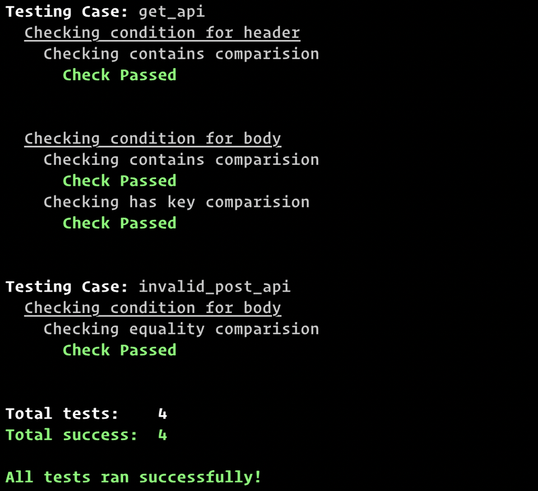
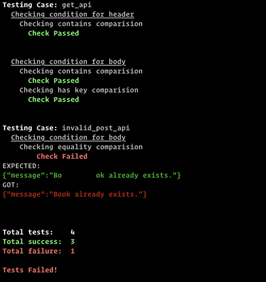
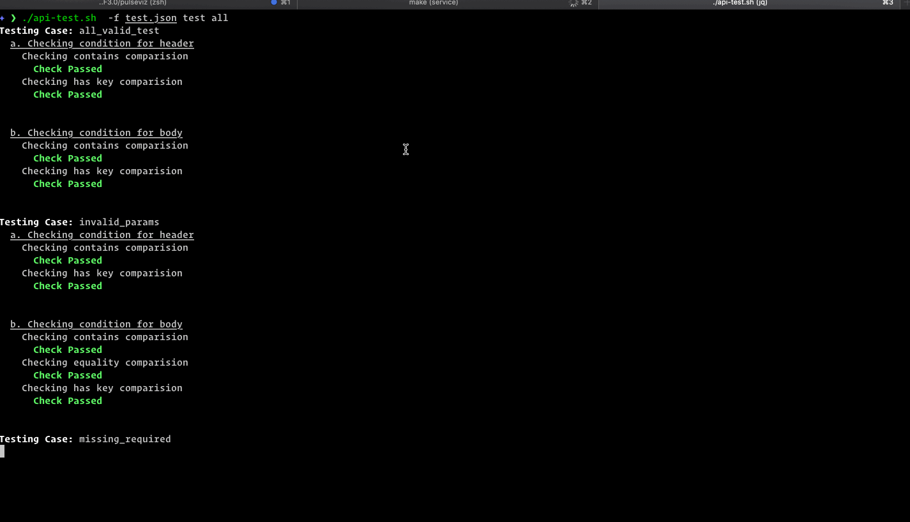

# Api-test

Light weight automated JSON API testing framework. Run API tests from the terminal.

## [](#organize-your-test-cases-in-a-json-file)Organize your test cases in a JSON file

```
{
  "testCases": {
    "my_first_test_case": {
      "path": "/books",
      "query": {
        "id": 1
      },
      "method": "GET"
    }
    ...
  },
  "url": "my-api.com"
}
```

## [](#call-apis)Call APIs

```
api-test run my_first_test_case # Run single test case
api-test run all                # Run all test cases simultaneously
```

[

API Response

## [](#add-automated-integration-tests)Add automated integration tests

Run the same tests in `development`, `staging` and `production` environment automatically.

In JSON file:

```
{
  "testCases": {
    "my_first_test_case": {
      "path": "/books",
      "query": {
        "id": 1
      },
      "method": "GET"
    },
    "expect": {
      "body": {
        "eq": {
          "id": "1",
          "author": "Robin Wieruch",
          "title": "The Road to React"
        },
        "contains": {
          "id": "1"
        },
        "hasKey": ["id", "author", "title"]
      }
    }
  },
  "url": "my-api.com"
}
```

Run automated test:

```
api-test test my_first_test_case
```

Result:



## [](#compatible-with-ci-workflow)Compatible with CI Workflow

Integrate automated tests in CI workflow.

[

Error exit code on failure

## [Installing Api-Test](#installing) 

Api-test is a bash program that automates JSON API testing using curl command to make API requests and jq for JSON processing.

## [Dependency](#dependency)

If you have already installed the following dependency you can proceed to the next section.

-   Install `jq`

```
# CentOS / Amazon linux 2 / Cloud 09
sudo yum install -y jq
# Ubuntu
sudo apt install  jq
# MaxOS
brew install jq
```

-   Install `curl`

```
# CentOS / Amazon linux 2 / Cloud 09
sudo yum install -y curl
# Ubuntu
sudo apt install curl
# MaxOS
brew install curl
```

## [](#install-api-test)Install api-test

```
curl -LJO https://raw.githubusercontent.com/subeshb1/api-test/master/api-test.sh
chmod +x api-test.sh
sudo mv api-test.sh /usr/local/bin/api-test
```

This will pull the bash script, make it executable and move it to `/usr/local/bin` to make it run from anywhere.

Run the following command to see if the program is installed.

```
$ api-test --version

api-test version 0.3.0
```

If you see the above message `api-test` has been successfully installed.

## [Tutorial](#tutorial)Test JSON API From The Terminal

See [Installing api-test](#installation) before moving to next steps.

## [](#creating-a-test-file)Creating a test file

The main principle is to define your API test cases in a JSON file and perform tests on them. A sample test case definition will look something like this:

```
{
  "testCases": {
    "get_api": {
      "path": "/books",
      "query": {
        "id": "1"
      }
    },
    "post_api": {
      "path": "/books",
      "method": "POST",
      "body": {
        "author": "John Doe",
        "title": "My Book 5"
      }
    },
    "invalid_post_api": {
      "path": "/books",
      "method": "POST",
      "body": {
        "author": "Shawn Doe",
        "title": "My Book 8"
      }
    }
  },
  "url": "localhost:3000",
  "header": {
    "Content-Type": "application/javascript"
  }
}
```

There are two main components in the test file:

-   **testCases**: This object will hold all the test case information where each test case is identified by a unique key.
-   **url**: The base URL of the API endpoint.

The root header property stores the common headers like Authorization, Content-Type, etc and are injected across all test cases. You can also specify headers in individual test cases. You can have path,body, header,query and method in a test case. Additional property expect is also available for automated tests which we will be discussing later.

## [Calling the API route](#calling-the-api-route)

Now let’s call our first API route. To run a test case, we have a command named `run`. It takes the test case key as an argument.

> Note: Test file should be provided as well

```
api-test -f test.json run get_api
```

This will generate the following output:

[](./img/api-test-tut-success.png)

Success Response

Now, let’s try out the case where it returns `4xx` response.

```
api-test -f test.json run invalid_post_api
```

[](./img/api-test-tut-failure.png)

Failure Response

You can also call multiple API routes at once,

```
api-test -f test.json run get_api post_api
# or
api-test -f test.json run all # to run all the cases
```

If you also want the header information you can pass in -i as a flag. See more use cases by running `api-test -f test.json run --help`.

## [Automated tests](#automated-tests)

api-test also supports writing automated tests using 5 types of basic comparisons on header and body of the response:

-   eq - The response should be exactly the same as expected.
-   contains - The expected value should be a subset of the response.
-   hasKey - The key should be present in the JSON response.
-   path_eq - The value inside the nested object accessed by the JSON path must be the same.
-   path_contains - The value inside the nested object accessed by the JSON path must be a subset.

Let’s add some tests to be more clear:

```
{
  "testCases": {
    "get_api": {
      "path": "/books",
      "query": {
        "id": "1"
      },
      "expect": {
        "body": {
          "contains": {
            "author": "Aneeta Sharma"
          },
          "hasKey": ["id", "author", "title"]
        },
        "header": {
          "contains": {
            "http_status": "200"
          }
        }
      }
    },
    "invalid_post_api": {
      "path": "/books",
      "method": "POST",
      "body": {
        "id": "1",
        "author": "Robin Wieruch",
        "title": "The Road to React"
      },
      "expect": {
        "body": {
          "eq": { "message": "Book already exists." }
        }
      }
    }
  },
  "url": "localhost:3000",
  "header": {
    "Content-Type": "application/javascript"
  }
}
```

The tests are written in expect property of each test case and checks can be made for both header and body response.

In the response body of get\_api we know the response will contain a property author and with value Aneeta Sharma we add a contains check to match the subset. Similarly, for the values which are dynamic, we can check if the key is present using hasKey check. For the invalid response, we know the response as it is expected to be static. So, we can have an equality check using eq . The eq the check will compare all the object value irrespective of the key order.

The checks `path_eq` and `path_contains` are similar to the ability to make comparisons at any depth of a JSON object. See the [docs](https://subeshbhandari.com/api-test) for more information.

Now, let’s see the tests in action!

To run a test case the command test is used.

```
api-test -f test.json test get_api
# or
api-test -f test.json test all
```

[](./img/api-test-tut-test-pass.png)

Test passing

Now let’s break the test to ensure it is working correctly. I will alter the eq check for invalid_post_api by adding extra spaces in the text.

```
"eq": { "message": "Bo        ok already exists." }
```

[](./img/api-test-tut-test-fail.png)

Test failing

Great! Now we know that our earlier tests were running properly. If the available checks don’t match your need, api-test also provides a way to inject a script or program written in any language to check and compare values.

To do so, provide the executable you want to run in external the property of expect block. Below is the example using node js.

```
{
  ...
  "expect": {
    "body": {...},
    "header": {...},
    "external": "node test.js"
  }
}
```

And write the comparison file as:

```
let testCase = process.argv[2]; // First arg will be test case key
let body = process.argv[3]; // Second arg will be body
let header = process.argv[4]; // Third arg will be header

let success = true;
switch (testCase) {
  case "get_api":
    if (success) {
      process.exit(0); // For success case
    } else {
      process.exit(1); // For failure case
    }
    break;
  case "invalid_post_api":
    ...
    break;

  default:
    break;
}
```

The program should exit with code 0 on success and code > 0 to communicate failure. Now, you can perform any type of comparison you like! When the development is completed, we can change the variables in the test file and start running the automated tests in the staging or production environment. Just be sure you don’t run an update or create a request on critical data. The automated tests can also be integrated into the CI workflow. When all tests pass it exits with code 0 and when some or all tests fail it exits with code 1.


# Test Cases Definition

Every API call scenario in the `api-test` is defined as a test case. Test cases are defined in a `JSON` format and the file containing it can be named freely. By default, the program looks for `test.json`, `api-test.json`, and `template.json` in the respective order. If you name the test file with any of the above names you won’t need to provide the file name to the program. The JSON supports the following root attributes as:

```
{
  "name": "My e-commerce API",
  "url": "api.subeshbhandari.com",
  "header": {
    ...
  },
  "testCases": {
    ...
  }
}
```

## [Property: name](#property-name)

The `name` property is a string field that gives the description of what the test cases are for.

**Required:** `false`

## [Property: url](#property-url)

The `url` property holds the base URL of an API in the `string` format. Example:

```
localhost:300
api.example.com/path
```

> **Note:** The API URL shouldn’t end with a forward slash `/` to prevent any problem while appending the test case route.

**Required:** `true`

The root `header` object holds common header values that can be shared across all the test cases. This is a place to have headers like `Authorization`, `ContentType` etc. **Required:** `false`

## [Property: testCases](#property-testcases)

It is an `object` that holds the test scenarios’ information. Each text scenario is identified by a unique key in the object. The following `JSON` objects show the allowed or used values for an API call:

```
{
  "testCases": {
    "my_test_case_1": {
      "path": "/api/get_products",
      "method": "GET",
      "query": {
        ...
      },
      "body": {
        ...
      },
      "description": "My description",
      "header": {
        ...
      },
      "expect": {
        ...
      }
    }
  }
}
```

**Required:** `true`

### [Test cases attributes](#test-cases-attributes)

| FieldName | Type | Required | Default | Description |
| --- | --- | --- | --- | --- |
| `path` | string | true |  | The route to be tested. Always starts with `/` so that it can be appended after the base URL. |
| `method` | string | false | GET | HTTP method for the request. Defaults to the `GET` method. |
| `header` | object | false |  | Header fields defined as JSON objects. Common headers are merged with test case headers. |
| `body` | object | false |  | JSON body |
| `query` | object | false |  | Query params defined as JSON. Currently doesn’t support array and object data types. |
| `expect` | object | false |  | Define automated testing scenarios. See [Automated Testing](https://subeshbhandari.com/api-test/automated-tests) for more info |
| `description` | string | false |  | Verbose description for the test case |

## [](#copy-or-pull-a-templatejson-file)Copy or pull a template.json file

To copy the latest JSON template run

```
curl -LJO https://raw.githubusercontent.com/subeshb1/api-test/master/template.json
```

# Example Command Usages


api-test is a simple bash script to test JSON API from terminal in a structured and organized way.

## Setting up

### Requirements

-   [curl](https://curl.haxx.se/download.html)
-   [jq](https://stedolan.github.io/jq/download)

In cloud 9 / CentOs / aws linux image

```
sudo yum install jq
```

## Installing

Pull the script

```
curl -LJO https://raw.githubusercontent.com/subeshb1/api-test/master/api-test.sh
```

Make the script executable

```
chmod +x api-test.sh
```

Move it to `/usr/local/bin` to make it executable from anywhere

```
sudo mv api-test.sh /usr/local/bin/api-test
```

Check if the installation is successful

```
api-test --help
```

### Alternate Approach

Since it is a small bash file, you can copy the content in [https://raw.githubusercontent.com/subeshb1/api-test/master/api-test.sh](https://raw.githubusercontent.com/subeshb1/api-test/master/api-test.sh) and paste in a file, make it executable and run it.

## Usage

```
$ api-test.sh -h

A simple program to test JSON APIs.

USAGE: api-test [-hv] -f file_name [CMD] [ARGS]

OPTIONS:
  -h (--help)       print this message
  -v (--verbose)    verbose logging
  -f (--file)       file to test
  --version         print the version of the program

COMMANDS:
  run               Run test cases specified in the test file.
  test              Run automated test in the test file.
  describe          List test cases or describe the contents in a test case.

Run 'api-test COMMAND --help' for more information on a command.
```

### Test file

The test file will contain test cases in json format.

Example: `test.json`

```
{
  "name": "My API test",
  "testCases": {
    "test_case_1": {
      "path": "/path_1",
      "method": "POST",
      "description": "Best POST api",
      "body": {
        "value": 1
      },
      "header": {
        "X-per": "1"
      }
    },
    "test_case_2": {
      "path": "/path_2",
      "method": "GET",
      "description": "Best GET api",
      "query": {
        "value": 1
      }
    },
    "test_case_3": {
      "path": "/path_1",
      "method": "DELETE",
      "description": "Best DELETE api",
      "body": {
        "value": 1
      }
    }
  },
  "url": "localhost:3000",
  "header": {
    "Authorization": "Bearer <ACCESS_TOKEN>"
  }
}
```

The test cases are present in the `testCases` object. The main url for the api is store in `url` string. If the test cases share common headers add them in root `header` key.

To pull the `template.json`

```
curl -LJO https://raw.githubusercontent.com/subeshb1/api-test/master/template.json
```

### Running test case

```
api-test -f test.json run test_case_1 # running single test case
api-test -f test.json run test_case_1 test_case_2 # running multiple test case
api-test -f test.json run all # running all test case. WARNING: Don't name a test case `all`
api-test -v -f test.json run test_case_1 # To run in verbose mode use `-v`
```

## Automated testing

To run an automated test run,

```
api-test -f test.json test test_case_1
api-test -f test.json test all # To run all tests
```



Both the headers and body can be compared to create automated api tests using different types of checking schemes described in further sections. All the checking schemes can be used for a test case. To define test units add them in `expect` object in the testCase.

```
{
  "test_case_1": {
    "path": "/path_1",
    "method": "POST",
    "expect": { // automated tests are kept inside this object
      "header": {
        ...
      },
      "body": {
        ...
      }
    }
  }
}
```

There are 5 ways you can compare the result from the api response.

### 1\. eq

The `eq` check compares every element in an object irrespective of the order of object keys and array elements. Every element in compared object should match as the object defined in `eq` block.

#### Syntax

```
{
  ...
  "expect": {
    "body": {
      "eq": {
        "key": "value"
      }
    }
  }
}

```

Example: The api has following response.

```
{
  "name": "ram",
  "age": 20
}
```

To test using `eq` check:

```
{
  ...
  "expect": {
    "body": {
      "eq": {
        "name": "ram",
        "age": 20
      }
    }
  }
}
```

The check will pass for the above response. If any of the value or key is different it will throw error.

### 2\. contains

The `contains` check compares the expected value with all the possible subset of the compared object irrespective of the order of object keys and array elements. It will pass if the value matches any subset.

#### Syntax

```
{
  ...
  "expect": {
    "body": {
      "contains": {
        "key": "value"
      }
    }
  }
}

```

Example: The api has following response.

```
{
  "name": "ram",
  "age": 20
}
```

To test using `contains` check:

```
{
  ...
  "expect": {
    "body": {
      "contains": {
        "age": 20
      }
    }
  }
}
```

The check will pass for the above response as `"age": 20` is the subset of response.

### 3\. hasKeys

The `hasKeys` will check if the provided keys in array are present in the response or not.

#### Syntax

```
{
  ...
  "expect": {
    "body": {
      "hasKeys": []
    }
  }
}

```

Example: The api has following response.

```
{
  "people": [
    {
      "name": "ram",
      "age": 20
    },
    {
      "name": "Shyam",
      "age": 21
    }
  ]
}
```

To test using `hasKey` check:

```
{
  ...
  "expect": {
    "body": {
      "hasKeys": ["people", "people.0", "people.1", "people.0.name", "people.1.name"]
    }
  }
}
```

All the above keys are valid in the response. We can compare the key at any depth. While accessing arrays, be sure to use the index without brackets. The key accessing pattern contradicts with the next two checking schemes where bracket is used to access array properties.

### 4\. path_eq

The `path_eq` does the same check as `eq` but allows the check to be made inside JSON object path at any depth. The path accessing pattern follows javascript object accessing patterns.

#### Syntax

```
{
  ...
  "expect": {
    "path_eq": {
      "path": {"key": "value:"},
      "path.key1.key": 1
    }
  }
}

```

Example: The api has following response.

```
{
  "people": [
    {
      "name": "ram",
      "age": 20
    },
    {
      "name": "Shyam",
      "age": 21
    }
  ]
}
```

To test using `path_eq` check:

```
{
  ...
  "expect": {
    "body": {
      "path_eq": {
        "people[0]": {
          "name": "ram",
          "age": 20
        },
        "people[1].name": "Shyam"
      }
    }
  }
}
```

The above example shows how to access an object path to compare and check the values at any depths.

### 5\. path_contains

The `path_contains` does the same check as `contains` but allows the check to be made inside JSON object path at any depth. The path accessing pattern follows javascript object accessing patterns.

#### Syntax

```
{
  ...
  "expect": {
     "body": {
      "path_contains": {
        "path": "value",
        "path.key1.key": "value"
      }
     }
  }
}

```

Example: The api has following response.

```
{
  "people": [
    {
      "name": "ram",
      "age": 20
    },
    {
      "name": "Shyam",
      "age": 21
    }
  ]
}
```

To test using `path_contains` check:

```
{
  ...
  "expect": {
    "body": {
      "path_contains": {
        "people[0]": {
          "name": "ram",
        },
        "people[1].name": "Shyam",
        "people": []
      }
    }
  }
}
```

### 6\. External scripts or program

If none of the above checks work for you, there is a way to inject **any language** to compare and test an api response. To do so, provide the command name or script in the `external` key in the `expect` block. If a test case passes return an `exit code 0` and if a test fails `exit code > 0` to communicate with the `api-test` program.

#### Syntax

```
{
  ...
  "expect": {
    "body": {...},
    "header": {...},
    "external": "<your program>"
  }
}
```

Example:

test.json

```
{
  ...
  "expect": {
    "body": {...},
    "header": {...},
    "external": "node test.js"
  }
}

```

test.js

```
let testCase = process.argv[2]; // First arg will be test case key
let body = process.argv[3]; // Second arg will be body
let header = process.argv[4]; // Third arg will be header

let success = true;
switch (testCase) {
  case "get_api":
    if (success) {
      process.exit(0); // For success case
    } else {
      process.exit(1); // For failure case
    }
    break;
  case "invalid_post_api":
    ...
    break;

  default:
    break;
}
```

The `test case key`, `body` and `header` are passed respectively to the supplied program. You can use any language as long as you are sending out the correct exit code for failure and success.

The above example shows how to access an object path to compare and check the values at any depths. All the above comparison are a subset of response and will pass the check.

## Uninstalling

```
rm /usr/local/bin/api-test
```


## References

* Docs: [https://subeshbhandari.com/api-test](https://subeshbhandari.com/api-test)
* https://awesomeopensource.com/project/subeshb1/api-test
* 